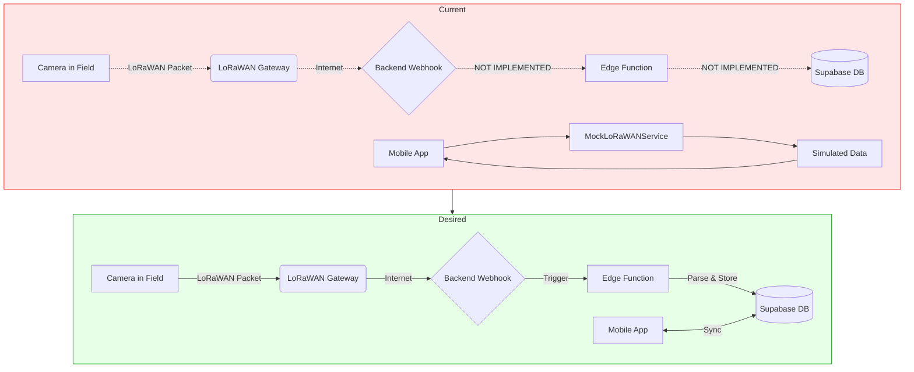

# Wildlife Watcher App: BLE & LoRaWAN Gap Analysis

**Version**: 1.0
**Date**: October 31, 2025
**Status**: Current State Assessment
**Purpose**: Compare current implementation against specification to identify gaps and implementation requirements

---

## Executive Summary

This document analyzes the current BLE and LoRaWAN implementation in the Wildlife Watcher mobile app against the desired state documented in `ble-lorawan-communication-spec.md` and `device-firmware-update-workflow.md`. The analysis identifies implementation gaps, missing features, and provides a roadmap for achieving specification compliance.

### Key Findings

**BLE Communication:**
- ✅ **WWUS Service**: Fully implemented with proper UUIDs and characteristics
- ✅ **Basic Commands**: Battery, status, ID, version commands functional
- ✅ **DFU Service**: Nordic DFU integration present via react-native-nordic-dfu
- ⚠️ **AI Processor Proxy**: NO "AI " prefix pattern implemented (CRITICAL GAP)
- ❌ **Photo Transfer**: Multi-step photo capture/transfer workflow NOT implemented
- ❌ **File Transfer**: Chunked file transfer for AI models NOT implemented
- ⚠️ **Time/GPS Commands**: setutc and setgps commands NOT found in codebase

**LoRaWAN Communication:**
- ✅ **Data Model**: Complete LoRaWAN status tracking (battery, SD card, last_seen)
- ✅ **UI Display**: Project cards show LoRaWAN device status
- ⚠️ **Backend Integration**: Currently using MockLoRaWANService (not production-ready)
- ❌ **Device Provisioning**: LoRaWAN registration flow NOT implemented
- ❌ **Ping Command**: Connectivity testing command NOT found

### Implementation Priority

1. **HIGH**: AI processor proxy pattern (required for camera control)
2. **HIGH**: Photo transfer workflow (core user need)
3. **HIGH**: LoRaWAN backend webhook integration (production requirement)
4. **MEDIUM**: Time/GPS commands (deployment workflow dependency)
5. **MEDIUM**: AI model file transfer (future firmware capability)
6. **LOW**: Device provisioning UI (backend workflow complete)

---

## Section 1: BLE Communication Analysis

### 1.1 WWUS Service (Normal Operations)

**Current State**: ✅ Service fully implemented and operational

| Feature/Function | Current Implementation | Commands Sent | Responses Received | Desired Future State | Commands to Send | Expected Response | MVP2 Task | Implementation Notes |
|------------------|----------------------|---------------|-------------------|---------------------|------------------|-------------------|-----------|---------------------|
| **Service Discovery** | ✅ Implemented | - | WWUS service detected | ✅ No change needed | - | - | Task 20 (BLE Sync) | Service UUID: `6e400001-b5a3-f393-e0a9-e50e24dcca9d` correctly configured |
| **Write Characteristic** | ✅ Implemented | Commands via `6e400002...` | - | ✅ No change needed | - | - | Task 20 (BLE Sync) | Write characteristic properly configured in constants.ts |
| **Read Characteristic** | ✅ Implemented | - | Responses via `6e400003...` | ✅ No change needed | - | - | Task 20 (BLE Sync) | Notifications started correctly in useBle.ts:299-302 |
| **Connection Management** | ✅ Implemented | `BleManager.connect()` | Connection success/fail | ✅ No change needed | - | - | Task 20 (BLE Sync) | Robust connection with timeout handling (useBle.ts:240-346) |
| **Battery Check** | ✅ Implemented | `battery\n` | `Battery = 85%\n` | ✅ No change needed | `battery\n` | `Battery = 85%\n` | Task 20 (BLE Sync) | Command defined in types.ts:77-81, regex: `/\bBattery\s=\s(100|\d{1,3})%/` |
| **Status Check** | ✅ Implemented | `status\n` | `Trap: armed. Sensor: enabled. LoRaWan: connected.` | ✅ No change needed | `status\n` | Status string with trap/sensor/LoRaWAN state | Task 20 (BLE Sync) | Regex parses trap, sensor, LoRaWAN status (types.ts:84-86) |
| **Device ID** | ✅ Implemented | `id\n` | Device ID string | ✅ No change needed | `id\n` | Device ID | Task 20 (BLE Sync) | Command: types.ts:69-72 |
| **Firmware Version** | ✅ Implemented | `ver\n` | Version string | ✅ No change needed | `ver\n` | Firmware version | Task 20 (BLE Sync) | Command: types.ts:73-76 |
| **Heartbeat Config** | ✅ Implemented | `get heartbeat\n` / `heartbeat 15m\n` | `heartbeat is 15m\n` | ✅ No change needed | `get heartbeat\n` / `heartbeat <value>\n` | Heartbeat interval | Task 20 (BLE Sync) | Read/write commands with regex (types.ts:100-105) |
| **LoRaWAN Config** | ✅ Partial | `get deveui\n`, `get appeui\n`, `get appkey\n` | EUI/Key values | ⚠️ Add write commands | `deveui <value>\n`, `appeui <value>\n`, `appkey <value>\n` | Confirmation | Task 20 (BLE Sync) | Write commands defined but not tested (types.ts:106-123) |
| **Reset Device** | ✅ Implemented | `reset\n` | `Device will reset after disconnecting.\n` | ✅ No change needed | `reset\n` | Reset confirmation | Task 20 (BLE Sync) | Action command (types.ts:128-132) |
| **Erase NVM** | ✅ Implemented | `erase\n` | `NVM will be erased after disconnecting.\n` | ✅ No change needed | `erase\n` | Erase confirmation | Task 20 (BLE Sync) | Destructive command (types.ts:133-137) |
| **Ping** | ✅ Implemented | `ping\n` | LoRaWAN RSSI/SNR or timeout | ✅ No change needed | `ping\n` | RSSI/SNR or no response | Task 18 (Device Mgmt) | LoRaWAN connectivity test (types.ts:124-127) |

### 1.2 AI Processor Proxy Pattern (CRITICAL GAP)

**Current State**: ❌ NOT IMPLEMENTED - Commands do not use "AI " prefix for proxying to AI processor

| Feature/Function | Current Implementation | Commands Sent | Responses Received | Desired Future State | Commands to Send | Expected Response | MVP2 Task | Implementation Notes |
|------------------|----------------------|---------------|-------------------|---------------------|------------------|-------------------|-----------|---------------------|
| **AI Command Prefix** | ❌ NOT FOUND | None | - | ❌ MUST IMPLEMENT | `AI <command>\n` | AI processor response | Task 20 (BLE Sync) | **CRITICAL**: BLE processor strips "AI " prefix and forwards to AI processor via I2C. See spec Section 1.1. |
| **Take Photo** | ❌ NOT IMPLEMENTED | - | - | ❌ MUST IMPLEMENT | `AI snap\n` | `File created: temp_pic.jpg\n` | Task 17 (Camera Setup) | Multi-step: (1) send snap, (2) AI creates temp file, (3) request file with `AI read` |
| **Read File** | ❌ NOT IMPLEMENTED | - | - | ❌ MUST IMPLEMENT | `AI read temp_pic.jpg\n` | 244-byte chunks of JPEG data | Task 20 (BLE Sync) | Must reassemble chunks into complete file. File name from snap response. |
| **Delete File** | ❌ NOT IMPLEMENTED | - | - | ❌ MUST IMPLEMENT | `AI rm temp_pic.jpg\n` | Deletion confirmation | Task 20 (BLE Sync) | Cleanup after photo transfer. Conserve SD card space. |
| **Set UTC Time** | ❌ NOT IMPLEMENTED | - | - | ❌ MUST IMPLEMENT | `setutc 2025-10-18T10:00:00Z\n` | Time set confirmation | Task 15 (Deployment Wizard) | BLE processor forwards to AI processor. Should send on every connection. |
| **Set GPS Location** | ❌ NOT IMPLEMENTED | - | - | ❌ MUST IMPLEMENT | `AI setgps "37°48'30.50\"_N_122°25'10.22\"_W_500.75_Above"\n` | GPS set confirmation | Task 16 (GPS/Location) | Format: lat_long_altitude_datum. Send on every connection. |
| **AI Model Transfer** | ❌ NOT IMPLEMENTED | - | - | ❌ FUTURE FEATURE | `AI upload_model <model_data>\n` (chunked) | Upload progress/completion | Future (WWFT service) | Similar to DFU but for AI processor. Requires chunked binary transfer. Consider file size, checksums, resume capability. |

**Implementation Considerations for AI Processor Proxy**:
- **Architecture**: All AI commands require `constructCommandString()` modification to add "AI " prefix
- **Photo Transfer Flow**: (1) Connect → (2) `AI snap` → (3) Wait for response with filename → (4) `AI read <filename>` → (5) Reassemble 244-byte chunks → (6) Display image → (7) `AI rm <filename>`
- **File Chunking**: Need chunk reassembly logic with error handling for incomplete transfers
- **Resume Capability**: Consider implementing resume for large file transfers (AI models)
- **Checksums**: Validate file integrity after transfer (especially for AI models)

### 1.3 DFU Service (Firmware Updates)

**Current State**: ✅ Basic DFU integration present, but workflow validation needed

| Feature/Function | Current Implementation | Commands Sent | Responses Received | Desired Future State | Commands to Send | Expected Response | MVP2 Task | Implementation Notes |
|------------------|----------------------|---------------|-------------------|---------------------|------------------|-------------------|-----------|---------------------|
| **Trigger DFU Mode** | ✅ Implemented | `dfu\n` | `Device will enter DFU mode after disconnecting.\n` | ✅ No change needed | `dfu\n` | DFU mode confirmation | Task 20 (BLE Sync) | Command sends via WWUS, device disconnects and reboots into DFU mode (types.ts:142-146) |
| **DFU Service Discovery** | ✅ Likely works | - | DFU service `00001530-1212-efde-1523-785feabcd123` | ✅ Verify in testing | - | - | Task 20 (BLE Sync) | App must re-scan after reboot to find DFU service |
| **Firmware Transfer** | ✅ Implemented | Binary .zip file via Nordic DFU protocol | Progress updates via `DFUEmitter` | ✅ No change needed | .zip file chunks | Progress % | Task 20 (BLE Sync) | DfuService.ts:3-30 implements transfer with progress callback |
| **Pre-Update Checks** | ⚠️ PARTIAL | - | - | ⚠️ ENHANCE VALIDATION | Battery check: `battery\n` | `Battery = X%\n` (must be >30%) | Task 20 (BLE Sync) | Spec requires: battery >30%, not deployed, stable BLE. Need comprehensive validation. |
| **Firmware Download** | ❌ NOT IMPLEMENTED | - | - | ❌ MUST IMPLEMENT | HTTP GET to Supabase Storage | .zip firmware file | Task 20 (BLE Sync) | Spec requires: check local cache, download if needed, verify checksum before DFU |
| **Update Progress UI** | ⚠️ PARTIAL | - | Progress % from DFUEmitter | ⚠️ ENHANCE UI | - | - | Task 20 (BLE Sync) | DfuScreen.tsx:105 has progress callback. Need: state display, time estimate, cancel button |
| **Post-Update Verification** | ❌ NOT IMPLEMENTED | - | - | ❌ MUST IMPLEMENT | `ver\n` after reconnect | New version string | Task 20 (BLE Sync) | Spec requires: reconnect to WWUS, verify new version, update database, notify user |
| **Error Recovery** | ⚠️ BASIC | - | Error from DFUEmitter | ⚠️ ENHANCE HANDLING | - | - | Task 20 (BLE Sync) | Need: connection loss retry, validation failure handling, user-friendly error messages |

**DFU Workflow Gaps** (Reference: device-firmware-update-workflow.md):
1. **Pre-Checks** (Section 3):
   - ❌ Battery validation not enforced (<30% blocks update)
   - ❌ Deployment status check not implemented (deployed devices should not update)
   - ❌ Firmware checksum verification not implemented
2. **User Confirmation** (Section 2.4):
   - ❌ Final confirmation dialog with version info not implemented
   - ⚠️ "Keep phone near camera" warning present in spec but not in code
3. **Post-Update** (Section 4):
   - ❌ Automatic reconnection to WWUS not implemented
   - ❌ Version verification after update not implemented
   - ❌ Database firmware_version field update not implemented
4. **Error Handling** (Section 5):
   - ⚠️ Basic error handling present, but needs enhancement per spec

### 1.4 File Transfer Protocol Considerations

**Gap**: No general-purpose file transfer mechanism implemented

| Consideration | Current State | Desired Future State | Implementation Notes |
|---------------|---------------|---------------------|---------------------|
| **Chunk Size** | ❌ Not defined | 244 bytes (per spec) | Spec Section 2.1.1 specifies 244-byte chunks for file transfer |
| **Chunk Reassembly** | ❌ Not implemented | Reassemble chunks into complete file | Need buffer to collect chunks in order, detect end-of-file |
| **Progress Tracking** | ❌ Not implemented | Show progress % during transfer | Calculate based on file size (if known) or chunk count |
| **Error Detection** | ❌ Not implemented | Checksum validation | Validate file integrity after transfer completion |
| **Resume Capability** | ❌ Not implemented | Resume interrupted transfers | For large files (AI models), track transfer state and resume from last successful chunk |
| **Transfer Timeout** | ❌ Not implemented | Handle stalled transfers | Detect no-progress timeout, offer retry or cancel |
| **Concurrent Transfers** | ❌ Not implemented | Queue multiple file operations | Prevent conflicts when multiple files pending |

**Recommendation**: Implement a reusable `FileTransferService` that handles:
- Chunked read/write operations
- Progress callbacks
- Checksum validation
- Resume capability for interrupted transfers
- Used by both photo transfer and AI model transfer features

---

## Section 2: LoRaWAN Communication Analysis

### 2.1 Data Flow Architecture

**Current State**: ⚠️ Mock service implemented, backend webhook integration pending

### 2.2 LoRaWAN Status Monitoring

**Current State**: ✅ Complete data model and UI, but using mock data

| Feature/Function | Current Implementation | Data Source | Data Fields | Desired Future State | Data Flow | Expected Data | MVP2 Task | Implementation Notes |
|------------------|----------------------|-------------|-------------|---------------------|-----------|---------------|-----------|---------------------|
| **Battery Level Display** | ✅ Implemented | MockLoRaWANService | `battery_level: number (0-100)` | ⚠️ Switch to real backend | LoRaWAN → Gateway → Backend → DB → App | `devices.battery_level` | Task 18 (Device Mgmt) | UI: ProjectCard.tsx shows battery icon. Data model: offline.ts:51, deploymentsSlice.ts:44-46 |
| **SD Card Usage Display** | ✅ Implemented | MockLoRaWANService | `sd_card_usage: number (0-100)` | ⚠️ Switch to real backend | LoRaWAN → Gateway → Backend → DB → App | `devices.sd_card_usage` | Task 18 (Device Mgmt) | UI: ProjectCard.tsx shows storage. Note: Spec says SD usage not measured in practice. |
| **Last Seen Timestamp** | ✅ Implemented | MockLoRaWANService | `last_seen: Date` | ⚠️ Switch to real backend | Backend captures timestamp on message receipt | `devices.last_seen` | Task 18 (Device Mgmt) | UI: Shows staleness warning if >48 hours. Spec: Section 3, line 181-182 |
| **Device Online Status** | ✅ Implemented | Derived from last_seen | Calculated: `last_seen < 48 hrs` | ✅ No change needed | - | - | Task 18 (Device Mgmt) | Warning icon if offline >48 hrs (ProjectCard.tsx) |
| **LoRaWAN Connection** | ⚠️ Mocked | MockLoRaWANService | `lorawan_status: LoRaWANStatus` | ⚠️ Real connection status | Device stores RSSI/SNR from network | Connection state + signal strength | Task 18 (Device Mgmt) | Spec: Device knows if connected and tracks RSSI/SNR (lines 181-182) |
| **Project Device Count** | ✅ Implemented | MockLoRaWANService | `lorawan_device_count: number` | ⚠️ Query real DB | Count of devices with LoRaWAN enabled per project | Accurate device count | Task 12 (Project Mgmt) | UI: ProjectCard.tsx:137-153. Supabase computed field: `lorawan_device_count` |

### 2.3 LoRaWAN Message Types & Payloads

**Current State**: ❌ Message payload parsing not implemented

| Message Type | Current Implementation | Payload Fields | Desired Future State | Backend Handler | Mobile Response | MVP2 Task | Implementation Notes |
|--------------|----------------------|----------------|---------------------|----------------|----------------|-----------|---------------------|
| **Regular Pings** | ❌ NOT IMPLEMENTED | - | ❌ MUST IMPLEMENT | Edge function parses: battery voltage, software version, ping period, image count | Update `devices` table fields | Task 18 (Device Mgmt) | Spec Section 3 line 183-186: Sent regularly (e.g., every 15 min - 1 hour). Contains operational health data. |
| **Camera Events** | ❌ NOT IMPLEMENTED | - | ❌ MUST IMPLEMENT | Edge function parses: NN processing results (species detected, confidence, timestamp) | Create `events` record, trigger notification | Future Task | Spec Section 3 line 187: Sent when AI detects wildlife. Contains detection metadata. |
| **Ping Command (App→Device)** | ⚠️ Command exists | `ping\n` via BLE | ✅ Already implemented via BLE | BLE → Device → LoRaWAN ping → Response | RSSI/SNR or timeout | Task 18 (Device Mgmt) | Spec Section 3.1 lines 208-215: App can trigger ping to test LoRaWAN connectivity. Returns signal strength. |

### 2.4 Device Provisioning & Registration

**Current State**: ❌ Mobile UI not implemented (backend process exists)

| Feature/Function | Current Implementation | Current Process | Desired Future State | Workflow | Expected Outcome | MVP2 Task | Implementation Notes |
|------------------|----------------------|-----------------|---------------------|----------|------------------|-----------|---------------------|
| **Device Registration** | ❌ NOT IN MOBILE APP | Backend team manually registers devices during initial testing | ⚠️ ADD UI (OPTIONAL) | Mobile app → Backend API → LNS (TTN/Chirpstack) → Security keys → Device provisioning | Device registered on LoRaWAN network | Future Task | Spec Section 3.1 lines 217-255: One-time setup during device preparation. Currently done by backend team. Mobile UI is OPTIONAL enhancement. |
| **Key Provisioning** | ❌ NOT IN MOBILE APP | Backend generates AppKey and provides to device | ⚠️ ADD COMMAND (OPTIONAL) | App sends `AI set_lora_keys <DevEUI> <AppKey>` via BLE | Keys stored in device secure storage | Future Task | Spec Section 3.1 line 236: BLE command to provision LoRaWAN keys. Currently manual process works. |
| **Registration Status** | ❌ NOT DISPLAYED | Device registration status not tracked in mobile app | ⚠️ ADD UI (OPTIONAL) | UI shows "Registered" badge for LoRaWAN-enabled devices | Visual indicator of LoRaWAN readiness | Task 18 (Device Mgmt) | Nice-to-have: Show which devices are LoRaWAN-registered in device list |

**Note**: Spec Section 3.1 (lines 219-223) states device provisioning process is "already implemented and run during initial board testing. There is no need at this stage to involve the app with this." Mobile UI is optional future enhancement.

### 2.5 Backend Webhook Integration

**Current State**: ❌ NOT IMPLEMENTED - Currently using MockLoRaWANService

| Component | Current Implementation | Desired Future State | MVP2 Task | Implementation Notes |
|-----------|----------------------|---------------------|-----------|---------------------|
| **Webhook Endpoint** | ❌ NOT IMPLEMENTED | Edge function at `/functions/lorawan-webhook` receives LoRaWAN gateway payloads | Backend Task (coordinated with Task 18) | Spec Section 3 lines 154-169: Gateway forwards packets to backend webhook → Edge function parses → DB update |
| **Payload Parser** | ❌ NOT IMPLEMENTED | Edge function decodes LoRaWAN binary payload into structured data | Backend Task | Parse battery voltage, software version, RSSI, SNR, event data, timestamps |
| **Database Updates** | ❌ NOT IMPLEMENTED | Update `devices.battery_level`, `devices.last_seen`, `devices.lorawan_status` | Backend Task | Automatic updates on message receipt. App syncs from DB. |
| **Realtime Subscriptions** | ⚠️ FOUNDATION PRESENT | App subscribes to `devices` table changes for realtime updates | Task 18 (Device Mgmt) | Redux Realtime integration already structured (deploymentsSlice.ts:482-483). Need to connect to live data. |
| **Mobile API Integration** | ⚠️ MOCKED | Replace MockLoRaWANService with real API calls | Task 18 (Device Mgmt) | Current: MockLoRaWANService.ts. Replace with: API calls to `/devices/lorawan-status` (enhanced/index.ts:236-245) |

**Migration Path**:
1. Backend team implements webhook + Edge function + DB updates
2. Mobile team switches from `MockLoRaWANService` to real API endpoint (`/devices/lorawan-status`)
3. Enable Supabase Realtime subscriptions for live device status updates
4. Test end-to-end: Camera → Gateway → Webhook → DB → Mobile App

### 2.6 LoRaWAN Connectivity Testing

**Current State**: ⚠️ Command exists, but UI for results not implemented

| Feature | Current Implementation | Desired Future State | MVP2 Task | Implementation Notes |
|---------|----------------------|---------------------|-----------|---------------------|
| **Ping Button** | ❌ NOT IMPLEMENTED | UI button triggers BLE `ping\n` command | Task 18 (Device Mgmt) | Spec Section 3.1 lines 208-215: User presses button, app sends ping, displays RSSI/SNR results |
| **Signal Strength Display** | ❌ NOT IMPLEMENTED | Show RSSI (dB) and SNR (dB) values or "No response" | Task 18 (Device Mgmt) | Parse ping response: RSSI and SNR figures or timeout message |
| **Signal Quality Graph** | ❌ NOT IMPLEMENTED (FUTURE) | Time-series graph of signal strength over multiple pings | Future Enhancement | Spec Section 3.1 lines 212-214: "At the other end of sophistication" - auto-ping and graph results. Nice-to-have. |

---

## Section 3: Implementation Roadmap

### 3.1 Critical Path (Must-Have for MVP2)

#### Phase 1: AI Processor Proxy Pattern (Task 20 - BLE Sync)
**Status**: ❌ NOT STARTED
**Priority**: CRITICAL
**Effort**: Moderate
**Dependencies**: None

**Implementation Steps**:
1. Modify `constructCommandString()` in `src/ble/parser.ts` to add "AI " prefix for AI processor commands
2. Create `AI_COMMANDS` enum to identify which commands need prefix
3. Update command definitions in `src/ble/types.ts`:
   - Add `SNAP`, `READ`, `DELETE`, `SETUTC`, `SETGPS` command types
   - Define command strings and expected response formats
4. Test AI command forwarding with real WW500 device

**Validation**:
- Send `AI snap` command and receive photo filename
- Verify BLE processor strips "AI " prefix and forwards to AI processor

#### Phase 2: Photo Transfer Workflow (Task 17 - Camera Setup + Task 20 - BLE Sync)
**Status**: ❌ NOT STARTED
**Priority**: HIGH
**Effort**: High
**Dependencies**: Phase 1 (AI Processor Proxy)

**Implementation Steps**:
1. Implement `FileTransferService.ts`:
   - Chunked file read (244-byte chunks)
   - Chunk reassembly into complete file
   - Progress tracking and callbacks
   - Error handling and resume capability
2. Create photo capture workflow in `src/services/CameraService.ts`:
   - Send `AI snap` command → Parse filename from response
   - Send `AI read <filename>` → Collect 244-byte chunks → Reassemble JPEG
   - Send `AI rm <filename>` → Cleanup temp file
3. Build photo preview UI in deployment wizard (Step 4: Camera Setup)
4. Test end-to-end: Take photo → Transfer → Display → Delete

**Validation**:
- Successfully capture and display test photo
- Verify complete JPEG file integrity after reassembly
- Confirm temp file deleted from SD card

#### Phase 3: Time & GPS Commands (Task 15 - Deployment Wizard + Task 16 - GPS/Location)
**Status**: ❌ NOT STARTED
**Priority**: HIGH
**Effort**: Low
**Dependencies**: Phase 1 (AI Processor Proxy)

**Implementation Steps**:
1. Add `SETUTC` and `SETGPS` commands to `src/ble/types.ts`
2. Implement command sending on BLE connection:
   - Get current UTC time from device
   - Format as ISO 8601: `2025-10-18T10:00:00Z`
   - Send `setutc <timestamp>\n` immediately after connection
3. Implement GPS location sending:
   - Get current GPS from device location services
   - Format: `"37°48'30.50\"_N_122°25'10.22\"_W_500.75_Above"`
   - Send `AI setgps <location>\n` after connection
4. Send both commands on every BLE connection (deployment wizard + device management)

**Validation**:
- Verify time sync works: Check camera's UTC time after connection
- Verify GPS sync works: Check camera's stored location
- Confirm commands send automatically on all BLE connections

#### Phase 4: LoRaWAN Backend Integration (Task 18 - Device Management)
**Status**: ❌ BACKEND NOT READY
**Priority**: HIGH
**Effort**: Medium
**Dependencies**: Backend webhook implementation

**Backend Requirements** (Coordinate with backend team):
1. Implement Edge Function at `/functions/lorawan-webhook`
2. Parse LoRaWAN gateway payloads (binary decode)
3. Update `devices` table: `battery_level`, `last_seen`, `lorawan_status`
4. Store regular ping data and camera event data

**Mobile Implementation Steps**:
1. Replace `MockLoRaWANService.ts` with real API client
2. Update API endpoint in `src/redux/api/enhanced/index.ts`:
   - Change from mock to real `/devices/lorawan-status` endpoint
3. Enable Supabase Realtime subscriptions for `devices` table
4. Update `deploymentsSlice.ts` to handle real-time LoRaWAN status updates
5. Test end-to-end with real camera sending LoRaWAN messages

**Validation**:
- Camera sends ping → Gateway → Backend → DB → Mobile app displays
- Battery level updates in real-time when camera reports
- Last seen timestamp updates on each message receipt

### 3.2 Enhanced Features (Should-Have)

#### Phase 5: DFU Workflow Enhancements (Task 20 - BLE Sync)
**Status**: ⚠️ PARTIALLY IMPLEMENTED
**Priority**: MEDIUM
**Effort**: Medium
**Dependencies**: None

**Implementation Steps**:
1. **Pre-Update Checks**:
   - Add battery validation (<30% blocks update)
   - Check deployment status (deployed devices blocked)
   - Implement firmware checksum verification
   - Build pre-update validation UI with clear warnings
2. **Firmware Download**:
   - Check local cache for firmware .zip file
   - Download from Supabase Storage if not cached
   - Verify checksum before proceeding to DFU
3. **Enhanced Progress UI**:
   - Show current state: "Uploading...", "Validating...", "Installing..."
   - Display percentage complete
   - Show estimated time remaining
   - Add cancel button (graceful abort)
4. **Post-Update Flow**:
   - Automatic reconnection to WWUS after DFU complete
   - Send `ver` command to verify new firmware version
   - Update `device.firmware_version` field in database
   - Show success/failure notification to user

**Validation**:
- Pre-checks correctly block update when battery <30%
- Deployed devices cannot be updated
- Firmware downloads and verifies checksum
- Post-update reconnection and version verification works
- Database updated with new firmware version

#### Phase 6: LoRaWAN Connectivity Testing UI (Task 18 - Device Management)
**Status**: ❌ NOT STARTED
**Priority**: LOW
**Effort**: Low
**Dependencies**: None (BLE ping command already exists)

**Implementation Steps**:
1. Add "Test LoRaWAN" button to Device Details screen
2. Send `ping\n` command via BLE when button pressed
3. Parse response:
   - Success: Extract RSSI and SNR values
   - Failure: Show "No response" or timeout message
4. Display signal strength results:
   - RSSI: Signal strength in dB (-120 to -30 dB typical)
   - SNR: Signal-to-noise ratio in dB (-20 to +10 dB typical)
   - Connection quality indicator (Good/Fair/Poor based on values)

**Validation**:
- Button triggers ping command
- RSSI/SNR values displayed correctly
- "No response" shown if device offline or LoRaWAN not connected

### 3.3 Future Enhancements (Nice-to-Have)

#### Phase 7: AI Model File Transfer (Future - WWFT Service)
**Status**: ❌ FUTURE FEATURE
**Priority**: LOW
**Effort**: High (requires hardware support)
**Dependencies**: WWFT BLE service implementation in firmware

**Considerations for Future Implementation**:
- **Service**: New WWFT (Wildlife Watcher File Transfer) service alongside WWUS
- **Transfer Protocol**: Similar to DFU but for AI processor firmware/models
- **File Size**: AI models can be large (10-100 MB) - requires robust chunking
- **Integrity**: Checksum validation critical for model correctness
- **Resume**: Must support resume for interrupted transfers
- **Progress**: Long transfer times require detailed progress feedback
- **Testing**: Validate AI model runs correctly after transfer

**Note**: Spec Section 2.3 states WWFT is "proposed, not yet implemented in hardware." Mobile app implementation deferred until firmware support added.

#### Phase 8: Device Provisioning UI (Future Enhancement)
**Status**: ⚠️ OPTIONAL (Backend process works)
**Priority**: LOW
**Effort**: Medium
**Dependencies**: Backend LNS integration APIs

**Current Process**: Backend team manually registers devices during initial testing. This works and is sufficient for MVP2.

**Future UI Enhancement** (if desired):
1. "Register for LoRaWAN" button in Camera Workbench screen
2. App → Backend API → LNS (TTN/Chirpstack) → Generate keys
3. Backend returns AppKey to app
4. App sends `AI set_lora_keys <DevEUI> <AppKey>` via BLE
5. Device confirms keys stored
6. UI shows "Registered" badge on device

**Validation**:
- Device successfully joins LoRaWAN network after registration
- Keys securely stored in device
- Registration status visible in device list

---

## Section 4: Current State Compatibility Notes

### Nordic UART Service (NUS) vs WWUS

**Current Status**: Firmware currently built with NUS instead of WWUS

From spec Section 2.4 (lines 138-146):
> "At the time of writing, the BLE processor firmware is built with the NUS rather than the WWUS. (This is a makefile setting). This is because the app has not been stable enough to act as a console, during development, with the WWUS."

**Mobile App UUIDs**: App correctly configured for WWUS (6e400001...), not NUS

**Recommendation**:
1. **Short-term**: Firmware team switches to WWUS once mobile app BLE implementation stable
2. **Alternative**: App could support both NUS and WWUS scanning during transition period
3. **Developer Console**: Consider implementing developer-only console page using NUS for debugging (optional)

**Impact**: This is a firmware configuration change, not a mobile app implementation gap. Mobile app is correctly using WWUS UUIDs.

---

## Section 5: Testing & Validation Requirements

### 5.1 BLE Communication Testing

**Required Tests**:
1. **WWUS Service**:
   - [ ] Service discovery and connection
   - [ ] All existing commands (battery, status, ID, version, etc.)
   - [ ] AI processor proxy commands with "AI " prefix
   - [ ] Photo transfer: snap → read → reassemble → delete
   - [ ] Time/GPS commands on connection
2. **DFU Service**:
   - [ ] Mode transition: WWUS → DFU → WWUS
   - [ ] Firmware download and checksum validation
   - [ ] Pre-update checks (battery, deployment status)
   - [ ] Firmware transfer with progress tracking
   - [ ] Post-update verification
3. **Error Handling**:
   - [ ] Connection loss during command
   - [ ] Connection loss during file transfer
   - [ ] Invalid command responses
   - [ ] Timeout handling

### 5.2 LoRaWAN Integration Testing

**Required Tests**:
1. **Backend Webhook**:
   - [ ] Camera sends ping → Gateway → Webhook → DB update
   - [ ] Payload parsing (battery, version, RSSI, SNR)
   - [ ] Database fields updated correctly
2. **Mobile App Sync**:
   - [ ] App fetches latest LoRaWAN status from DB
   - [ ] Realtime updates when device status changes
   - [ ] Offline handling: Show cached status when offline
3. **UI Display**:
   - [ ] Battery level indicator updates
   - [ ] Last seen timestamp displays correctly
   - [ ] Stale data warning (>48 hours)
   - [ ] Device count accurate per project

### 5.3 End-to-End User Scenarios

**Critical Workflows**:
1. **Deployment Creation**:
   - [ ] Connect to device → Send time/GPS → Take test photo → Configure settings → Create deployment
2. **Device Management**:
   - [ ] View device list → Select device → Check status → Test LoRaWAN connectivity → Update firmware
3. **Photo Workflow**:
   - [ ] Take photo → Transfer → Display → Save/Delete → Repeat

---

## Appendix A: Command Reference Matrix

### A.1 Current BLE Commands (Implemented)

| Command | Type | Send | Receive | Notes |
|---------|------|------|---------|-------|
| `battery` | Read | `battery\n` | `Battery = 85%\n` | BLE processor direct |
| `status` | Read | `status\n` | `Trap: armed. Sensor: enabled. LoRaWan: connected.` | BLE processor direct |
| `id` | Read | `id\n` | Device ID string | BLE processor direct |
| `ver` | Read | `ver\n` | Version string | BLE processor direct |
| `device` | Read | `device\n` | Device info | BLE processor direct |
| `get heartbeat` | Read | `get heartbeat\n` | `heartbeat is 15m\n` | BLE processor direct |
| `heartbeat <val>` | Write | `heartbeat 15m\n` | Confirmation | BLE processor direct |
| `get deveui` | Read | `get deveui\n` | `DevEui: XX:XX:...` | BLE processor direct |
| `deveui <val>` | Write | `deveui <value>\n` | Confirmation | BLE processor direct |
| `get appeui` | Read | `get appeui\n` | `AppEui: XX:XX:...` | BLE processor direct |
| `appeui <val>` | Write | `appeui <value>\n` | Confirmation | BLE processor direct |
| `get appkey` | Read | `get appkey\n` | `AppKey: XX:XX:...` | BLE processor direct |
| `appkey <val>` | Write | `appkey <value>\n` | Confirmation | BLE processor direct |
| `ping` | Action | `ping\n` | RSSI/SNR or timeout | Triggers LoRaWAN ping |
| `reset` | Action | `reset\n` | `Device will reset after disconnecting.\n` | BLE processor action |
| `erase` | Action | `erase\n` | `NVM will be erased after disconnecting.\n` | BLE processor action |
| `dis` | Action | `dis\n` | - | Disconnect request |
| `dfu` | Action | `dfu\n` | `Device will enter DFU mode after disconnecting.\n` | Triggers DFU mode |

### A.2 Missing AI Processor Commands (Must Implement)

| Command | Type | Send | Receive | Notes |
|---------|------|------|---------|-------|
| `AI snap` | Action | `AI snap\n` | `File created: temp_pic.jpg\n` | AI processor creates temp photo |
| `AI read <file>` | Read | `AI read temp_pic.jpg\n` | 244-byte JPEG chunks | AI processor sends file |
| `AI rm <file>` | Action | `AI rm temp_pic.jpg\n` | Deletion confirmation | AI processor deletes file |
| `setutc <time>` | Write | `setutc 2025-10-18T10:00:00Z\n` | Confirmation | BLE processor forwards to AI |
| `AI setgps <loc>` | Write | `AI setgps "37°48'30.50\"_N_122°25'10.22\"_W_500.75_Above"\n` | Confirmation | AI processor stores GPS |

### A.3 Future AI Processor Commands (WWFT Service)

| Command | Type | Send | Receive | Notes |
|---------|------|------|---------|-------|
| `AI upload_model` | Write | `AI upload_model <binary_chunks>\n` | Progress updates | Requires WWFT service |
| `AI list_models` | Read | `AI list_models\n` | Model names and versions | Future enhancement |
| `AI activate_model` | Write | `AI activate_model <name>\n` | Activation confirmation | Switch active AI model |

---

## Appendix B: MVP2 Task Mapping

### BLE Implementation Tasks

| MVP2 Task | Title | BLE Components | Status |
|-----------|-------|----------------|--------|
| Task 15 | 6-Step Deployment Wizard | Time/GPS commands on device connection | ❌ Commands not implemented |
| Task 16 | Device Configuration & Setup | BLE device discovery, configuration payload | ✅ Partially implemented |
| Task 17 | Field Deployment Validation | Photo capture and transfer workflow | ❌ Photo transfer not implemented |
| Task 18 | Device Management Interface | Device status monitoring, LoRaWAN display | ⚠️ Mock data, not real backend |
| Task 20 | BLE Communication & Device Sync | AI processor proxy, file transfer, DFU enhancements | ❌ Major gaps |

### LoRaWAN Implementation Tasks

| MVP2 Task | Title | LoRaWAN Components | Status |
|-----------|-------|-------------------|--------|
| Task 12 | Project List & Management | Display lorawan_device_count per project | ✅ Implemented (mock data) |
| Task 18 | Device Management Interface | LoRaWAN status display, connectivity testing | ⚠️ UI ready, backend integration pending |
| Backend Coordination | LoRaWAN Webhook & Edge Function | Webhook handler, payload parser, DB updates | ❌ Not started (backend task) |

---

## Document Metadata

**Created**: October 31, 2025
**Last Updated**: October 31, 2025
**Version**: 1.0
**Related Documents**:
- `ble-lorawan-communication-spec.md` (Specification)
- `device-firmware-update-workflow.md` (DFU Specification)
- `MVP2-MASTER-EXECUTION-PLAN.md` (Implementation Roadmap)
- `implementation-spec-v1.4.md` (Overall MVP2 Requirements)

**Review Schedule**: Update after each MVP2 task completion to track gap closure progress
