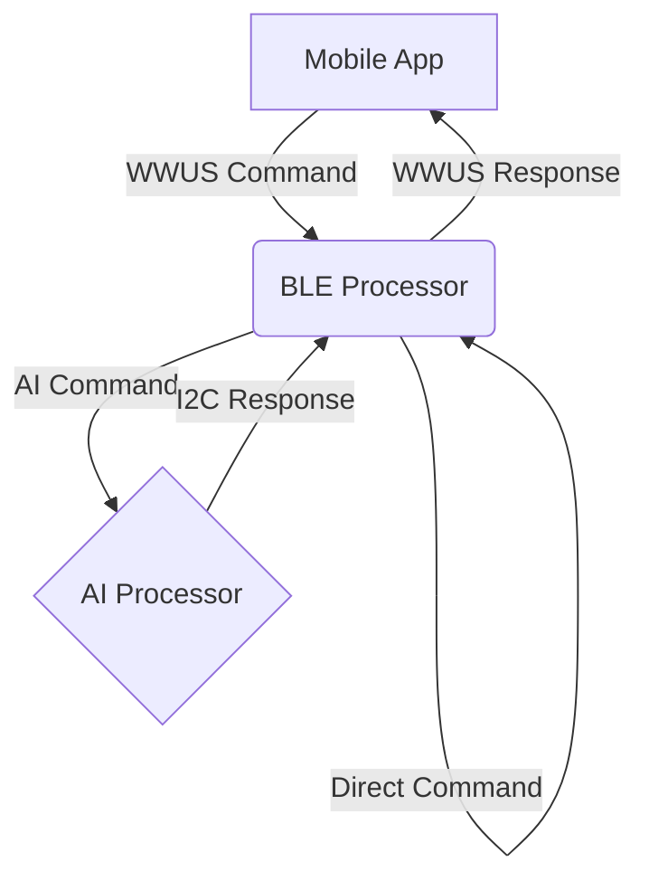
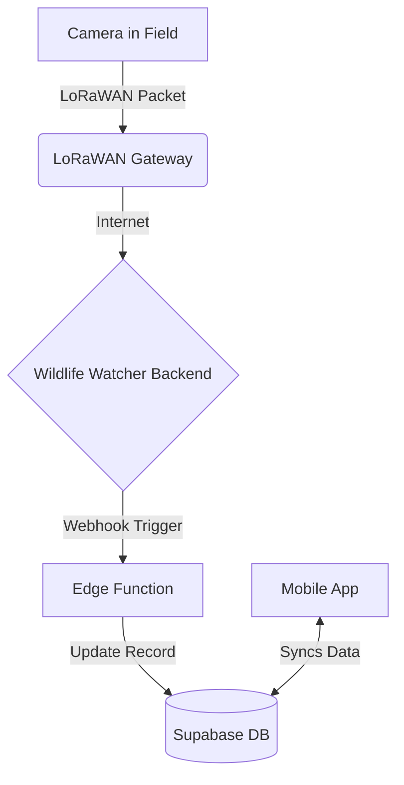
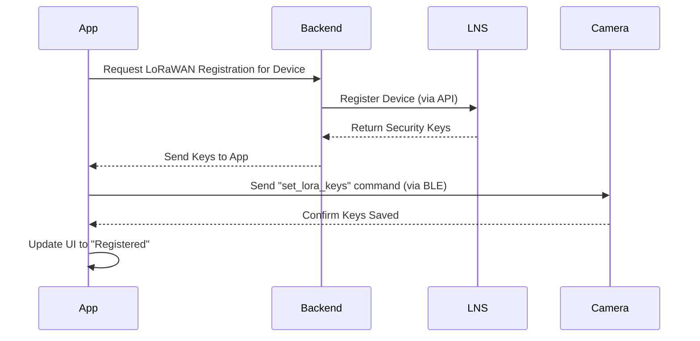

# Wildlife Watcher App: BLE & LoRaWAN Communication Guide

[updated by Charles 27fs/10/25. I have made some direct edits. I have also included some comments to others in square brackets like this. Please check for my comments in the square brackets.

This document covers much the same area as documents that already exist. It is not clear to me that there is a compelling need for this document. There is a danger that putting the same material in similar documents will create a maintenance problem.]

**Version**: 1.0
**Date**: October 18, 2025
**Status**: For Implementation
**Purpose**: To provide a unified technical guide for mobile app developers on all device communication protocols, including Bluetooth Low Energy (BLE) and LoRaWAN. 

---

## 1. Overview

The Wildlife Watcher camera hardware (WW500 series) contains two main processors:

1.  **BLE Processor (nRF52832)**: The "communications computer." It handles all Bluetooth connections with the mobile app. It also has a LoRaWAN radio for wide-area network connectivity. It runs two distinct modes:
    *   **Application Mode**: For normal day-to-day operations.
    *   **Bootloader Mode**: Exclusively for receiving firmware updates for itself.
2.  **AI Processor**: The "brains" of the camera. It controls the camera, runs AI models, and manages the SD card. It does **not** talk directly to the mobile app.

The two processors communicate internally over an I2C bus. The mobile app only ever talks directly to the **BLE Processor**.

### 1.1. Command & Control Flow

The mobile app sends text-based commands to the BLE Processor via the WWUS service. The BLE processor is responsible for interpreting these commands.

1.  **Direct Commands**: Some commands (like checking the BLE processor's version or battery status) are handled directly by the BLE Processor.
2.  **Proxied Commands**: Commands intended for the AI Processor (e.g., taking a photo, checking the SD card) are prefixed with `"AI "`. The BLE Processor strips this prefix and forwards the rest of the command to the AI Processor over the internal I2C bus.

The AI Processor executes the command and sends a response back to the BLE Processor, which then relays it to the mobile app.



There is a document [Architecture of Inter-Processor Communications](https://github.com/wildlifeai/Seeed_Grove_Vision_AI_Module_V2/blob/ledflash2/_Documentation/architecture_of_inter_processor_communications.md#architecture-of-inter-processor-communications) that provides further details of the inter-processor communications.

---


## 2. Bluetooth Low Energy (BLE) Services

The mobile app must handle two completely separate BLE services.

[IMHO, implementing the Device Firmware Update service in the app could wait for a while. DFU (of the BLE processor firmware only) will be rare and there is a functional app that implements this already. Where it becomes important is when we move to implementing firmware updates for the AI processor, which will have to be done from our app (or a DFU app we write), as there is no alternative. I would expect that in practise both processors are likely to require a firmware update at once. Or, just the AI processor would require a firmware update. So until we can do both it may not be worthwhile implementing jsut one par in the app. Of course, in the medium term it is desirable.]

### 2.1. WWUS (Wildlife Watcher UART Service) - Normal Operations

This is the service used for the **Application Mode** - for normal day-to-day operations, such as checking battery, taking photos, and configuring the device.

*   **When it's active**: During the camera's normal application mode.
*   **Purpose**: Sending text-based commands and receiving text-based responses.
*   **Service UUID**: `6e400001-b5a3-f393-e0a9-e50e24dcca9d`
*   **Characteristics**:
    *   **Write (TX)**: `6e400002-b5a3-f393-e0a9-e50e24dcca9d` (Send commands to camera)
    *   **Read (RX)**: `6e400003-b5a3-f393-e0a9-e50e24dcca9d` (Receive responses from camera)

**Command Example**:
To check the battery, the app sends the string `"battery\n"` to the Write characteristic. The camera responds with something like `"Battery = 85%\n"` on the Read characteristic.

The WWUS is identical to the Nordic Uart Service (NUS), except for having different UUIDs.

#### 2.1.1. How to Take and Display a Test Photo

This is a multi-step process involving both processors and demonstrating the proxied command architecture.

[The process is documented in [https://github.com/wildlifeai/Seeed_Grove_Vision_AI_Module_V2/blob/ledflash2/_Documentation/txfile.md](https://github.com/wildlifeai/Seeed_Grove_Vision_AI_Module_V2/blob/ledflash2/_Documentation/txfile.md) and the details in that document differ from those below. I have not attempted to correct the list below, and I have not run the software again myself to check it.]

1.  **App Action**: The user taps the "Take Test Photo" button in the app.
2.  **App Sends Command**: The app sends the command string `"AI snap\n"` to the BLE Processor via the WWUS Write characteristic.
3.  **BLE Processor Proxies**: The BLE Processor sees the `"AI "` prefix, strips it, and sends the command `"snap"` to the AI Processor over the I2C comms link between the two processors.
4.  **AI Processor Acts**: The AI Processor instructs the camera module to take a picture and save it to a temporary file on the SD card (e.g., `temp_pic.jpg`).
5.  **AI Processor Responds**: The AI Processor sends a response back to the BLE Processor, like `"File created: temp_pic.jpg"`. The BLE processor forwards this to the app.
6.  **App Requests File**: The app receives the confirmation and filename. It then sends a new command: `"AI read temp_pic.jpg\n"`.
7.  **File Transfer**: The AI Processor reads the JPEG file from the SD card and sends it to the BLE Processor in chunks of 244 bytes. The BLE Processor forwards each chunk to the app. The app must reassemble these chunks into a complete file.
8.  **App Displays Image**: Once the file transfer is complete, the app displays the reassembled JPEG image to the user.
9.  **Cleanup**: The app should send a final command like `"AI rm temp_pic.jpg\n"` to delete the temporary photo from the SD card to conserve space.

#### 2.1.2. Providing the WW500 with the time

UTC time is required on the WW500, for example for time-stamping JPEG files. Because the BLE processor has an accurate RTC and the AI processor does not, the BLE processor has responsibility to provide the AI processor UTC updates. 

The BLE processor can obtain the UTC from:

*   **BLE App**: The app can get the current UTC time and send it as a command:
    `"setutc 2025-10-18T10:00:00Z\n"` Typically it should do this every time it establishes a BLE connection.
*   **LoRaWAN Network**: The LoRaWAN system can be set up so that LoRaWAN messages request the UTC from the network. The UTC time is provided in subsequent downlink messages. This happens every ping message (e.g. every 15 minutes, 1 hour etc).

For more information see **Setting the UTC Time** [here](https://github.com/wildlifeai/Seeed_Grove_Vision_AI_Module_V2/blob/main/_Documentation/ble_commands.md#setting-utc-time)

#### 2.1.2. Providing the WW500 with its GPS location

The app can get the phone's GPS location and send it to the WW500 as a command:
    `"AI setgps "37°48'30.50\"_N_122°25'10.22\"_W_500.75_Above"` Typically it should do this every time it establishes a BLE connection.

For more information see the **Setting GPS Location** [here](https://github.com/wildlifeai/Seeed_Grove_Vision_AI_Module_V2/blob/main/_Documentation/ble_commands.md#setting-gps-location)

[It looks like I implemented functions to parse and process the GPS strings, in `exif_gps.c` and `exif_gps.h`. But I may have stopped at that point and did not save the GPS location for use after the AI processor enetered DPD. I was probably waiting for the app to implement `"AI setgps "` so I could test it, before completing the task.]

### 2.2. DFU (Device Firmware Update) - BLE Processor Updates

This service is **only** used to update the firmware of the **BLE Processor (nRF52832)** itself. It cannot be used for anything else.

*   **When it's active**: Only after the camera has been put into DFU mode.
*   **Purpose**: Transferring a binary firmware file (`.zip`).
*   **Service UUID**: `00001530-1212-efde-1523-785feabcd123` (Nordic DFU Service)
*   **Storage**: The firmware update is for the **BLE Processor's internal flash memory**, not the SD card. The `.zip` file is transferred directly from the mobile app to the BLE Processor's bootloader.

**Workflow**:
1.  **In WWUS mode**, send the `"dfu"` command.
2.  The WW500's BLE connection disconnects. This is expected.
3.  The WW500 reboots and starts advertising the DFU service.
4.  The app must scan again, find the DFU service, and connect to it.
5.  The app uses the `react-native-nordic-dfu` library to send the firmware file.
6.  The WW500 installs the update and reboots back into normal (WWUS) mode.

### 2.3. WWFT (Wildlife Watcher File Transfer) - Future-Proofing

To update the AI processor firmware, transfer AI models, or upload photos, a new service called **WWFT** is proposed. This service will run alongside WWUS in the normal application mode and is designed for transferring binary files.

*   **Status**: Proposed, not yet implemented in hardware.
*   **Purpose**:
    *   Update AI Processor firmware.
    *   Upload new AI models.
    *   Download photos from the SD card.
*   **Architecture**: The mobile app will send files to the BLE processor via the WWFT service, which will then forward the data to the AI processor over the internal I2C bus.

**Developer Note**: For MVP2, you only need to be concerned with **WWUS** and **DFU**. WWFT is for future planning.

### Nordic Uart Service 

The WWUS is identical to the Nordic Uart Service (NUS), except for having different UUIDs. At the time of writing, the BLE processor firmware is built with the NUS rather than the WWUS. (This is a makefile setting). This is because the app has not been stable enough to act as a console, during development, with the WWUS.

The Nordic Semiconductor "nRF Toobox" app provides a console function that uses NUS.  As an interim stage, it might be useful for the app to implement the NUS rather than the WWUS, until developers are confident that our app can be used to replace the nRF Toobox as a console. Then the app can transition to the WWUS and the nRF Toobox can be retired.

For this to be useful the app would need a developer-only console page, that replaced the NUS functionality of the nRF Toolbox app. Alternatively, this might be thought more trouble that it is worth and the developers would acrry n using the nRF Toolbox app. 

So a further possibility would be for the app to look for deveices advertising eith the WWUS or the NUS service, and connect to either. In due course the NUS scanning could be removed.
 

## 3. LoRaWAN Integration - Long-Range Status Updates

LoRaWAN is a long-range, low-power radio system. It is completely separate from Bluetooth and is used by the camera to "phone home" with status updates when it's deployed in the field. The mobile app **does not** interact with LoRaWAN directly.

### How It Works

1.  A deployed camera periodically sends a small data packet via LoRaWAN (e.g., once per hour).
2.  This packet is picked up by a LoRaWAN gateway in the area.
3.  The gateway forwards the data to the Wildlife Watcher backend server.
4.  A server-side **Edge Function** (webhook) parses the data.
5.  The backend database is updated with the new information.
6.  The mobile app receives these updates from the backend database the next time it syncs.
[It is not clear to me what the app does with this: perhaps we should say...]



### Data Received via LoRaWAN

The backend is responsible for parsing the LoRaWAN payload. The mobile app will simply see updated fields in the `deployments` and `devices` tables.

*   **Battery Level**: `devices.battery_level` (integer percentage)
*   **SD Card Usage**: `devices.sd_card_usage` (integer percentage)
*   **Last Heard From**: `devices.last_seen` (timestamp)

[Currently SD card usage is not measured. The chances of running out of memory is remote.]

[Last seen timestamp is/can be captured by back-end software, implicitly. The device is not recording this. The device does know whether it has a LoRaWAN connection and does store the most recent RSSI and SNR.]

[We should give some thought to the types of messages and the payload. The messages are probably arranged as:

*   **Regular Pings** - sent regularly and containing battery voltage, software version, ping period, maybe accumulated number of images.
*   **Camera Event** - sent when a camera event occurs and containing NN processing results.]

### Mobile App Responsibilities

- **Display Data**: Show the battery level and SD card usage in the UI (e.g., on the Devices and Deployments screens).
- **Display "Last Seen"**: Show the `last_seen` timestamp to indicate when the camera last reported in.
- **Handle Stale Data**: If `last_seen` is old (e.g., > 48 hours), display a warning icon indicating the camera may be offline or having issues.
- **No Direct Communication**: The app never tries to communicate with the camera via LoRaWAN. All data comes from the synchronized backend.

[IMHO the app should not rely on information tranferred by LoRaWAN where the same information can be obtained through the BLE link. Some deployments might not use LoRaWAN at all. This includes information from the list above like battery voltage, LoRaWAN connection, LoRaWAN signal strength.]

[My own suggestions are here: [App Behaviour on Connection](https://github.com/wildlifeai/Seeed_Grove_Vision_AI_Module_V2/blob/ledflash2/_Documentation/ble_commands.md#app-behaviour-on-connection)
I write:
```
I think that the app should send a number of configuration messages as soon as it connects, without user intervention, and do this every time (probably not just while configuring). These should include:

* Requests device ID, model, name, etc.
* Requests status, including battery voltage and LoRaWAN network status.
* Send UTC, provided that the phone has the time.
* Send GPS location, provided that the phone has this.
```

### Measuring LoRaWAN connectivity 

It will be useful to establish the quality of the LoRaWAN connection (if any) when devices are placed in the field.  If there is a poor signal strength then the operator might try a different location to improvde this. Accordingly, some form of 'Ping' command should be provided and the app should provide the result of this in a suitable form. The BLE commands already includes 'ping', and the response from the WW500 (after some seconds) returns either the RSSI and SNR figures, or says there is no response.

At minimum there could be a button pressed by the user, and a display of the results as figures in dB.

At the other end of sophistication would be a graph of time vs signal strength, with the app sending ping messages as soon as a previous response is returned.


### 3.1. Device Provisioning and Registration

[This process is already implemented, and run by me during my initial board testing process. It happens once only for each board. 

There is no need at this stage to involve the app with this.

I would welcome a discussion in due course as to how this process might be made more robust and easier to operate, and be provided with a web front-end, etc. I am happy to explain how it currently works.]


For a camera to use LoRaWAN, it must first be registered with a LoRaWAN Network Server (LNS), such as The Things Network (TTN) or a private Chirpstack instance. This is a one-time setup process that should be performed during the "Prepare and Test Nearby Devices" workflow in the office, not in the field.

The process is orchestrated by the mobile app but brokered by the Wildlife Watcher backend.

1.  **App Initiates Registration**: From the "Camera Workbench" screen, the user taps a "Register for LoRaWAN" button.
2.  **Backend Creates Device on LNS**: The app sends a request to the Wildlife Watcher backend. The backend then makes an API call to the LNS to register the camera's unique hardware ID (DevEUI).
3.  **Backend Receives Keys**: The LNS generates and returns a set of security keys (e.g., AppKey) for the device.
4.  **Backend Stores Keys**: The backend securely stores these keys and associates them with the device record in the database.
5.  **App Receives Keys**: The backend sends the necessary keys back to the mobile app.
6.  **App Provisions Camera**: The mobile app connects to the camera via BLE (using the WWUS service) and sends a special command to program the security keys into the camera's secure storage.
    *   **Example Command**: `"AI set_lora_keys <DevEUI> <AppKey> ...\n"`
7.  **Confirmation**: The camera confirms the keys are saved, and the app updates the UI to show the device is "Registered" for LoRaWAN.

Once registered, the device is capable of joining the LoRaWAN network and sending status updates whenever it is configured to do so during a deployment.



---

## 4. Summary for App Implementation

[See comments above which might affect the following.]

### 4.1. Device Preparation & Firmware Updates

The "Prepare and Test Nearby Devices" workflow involves connecting to a camera to check its status and update its firmware.

*   **Reference**: For a detailed breakdown of this user flow, see the `device-preparation-workflow.md` document.
*   **Communication**: This workflow uses **WWUS** for status checks and may trigger the **DFU** process for BLE processor firmware updates.

### 4.2. Normal Operations

*   **Connect to**: WWUS service (`6e40...`).
*   **Send**: Text commands like `"battery\n"`.
*   **Receive**: Text responses like `"Battery = 85%\n"`.

### 4.3. BLE Firmware Updates

*   **Trigger**: Send `"dfu"` command via WWUS.
*   **Reconnect**: Scan and connect to the DFU service (`00001530...`).
*   **Transfer**: Use the Nordic DFU library to send the `.zip` file.

### 4.4. LoRaWAN Status

*   **Source**: Read `battery_level`, `sd_card_usage`, and `last_seen` fields from the `devices` table in the local synchronized database.
*   **Action**: Display this information in the UI. Do not attempt to get it directly from the device via BLE unless the user explicitly requests a real-time check (which would use a WWUS command).

---

## 5. Key Concepts

BLE functionality are implemented by one or more "Services", each of which implements one or more "Characteristics".  Services and Characteristics can be defined by the Bluetooth Special Interest Group (SIG), or can be proprietary.

*   **Service**: A collection of features (Characteristics) offered by a BLE device.
*   **Characteristic**: A specific data point or command channel within a Service.
*   **UUID**: A unique 128-bit identifier for a Bluetooth service or characteristic. Your app uses these to find and connect to the right service (WWUS vs. DFU).
*   **I2C Bus**: The internal 2-wire connection between the BLE and AI processors. In addition, there is an interrupt signal that allows each procsoor to interrupt the other. The speed of this bus can be a bottleneck for large file transfers, which is why the WWFT protocol is being carefully designed. [I don't think so. The bottle-neck is in the BLE data transfer.]
*   **Bootloader**: A small, protected program on the BLE processor that runs on startup. Its only job is to decide whether to run the main application or enter DFU update mode.
