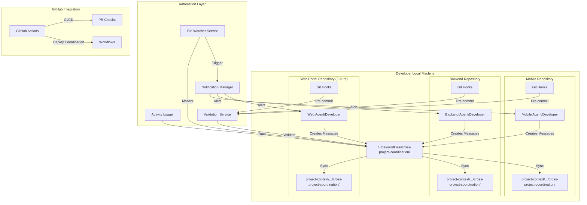
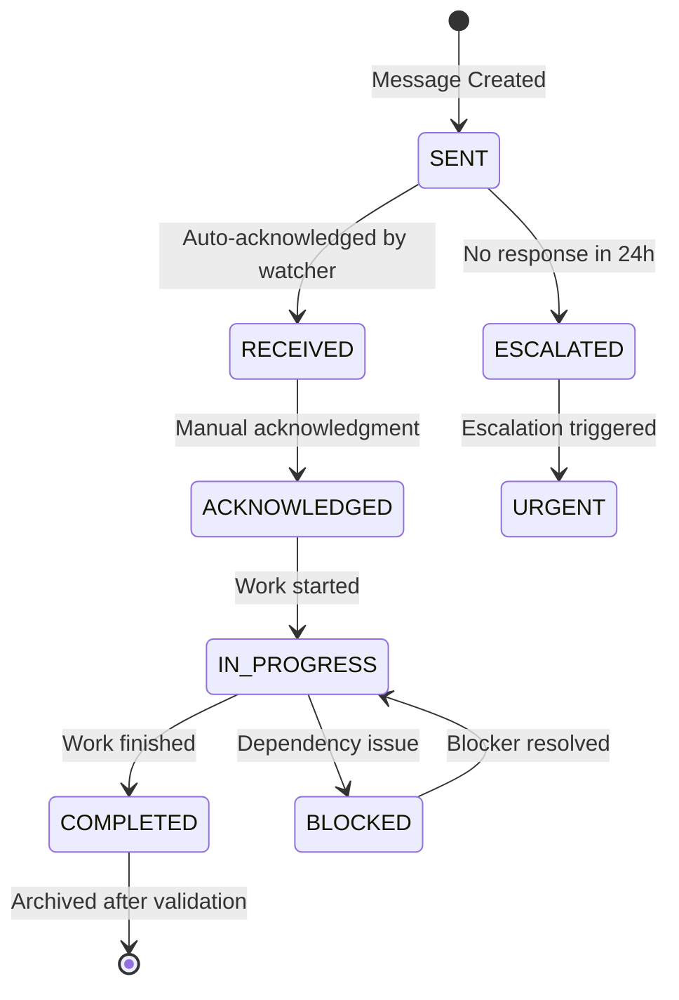
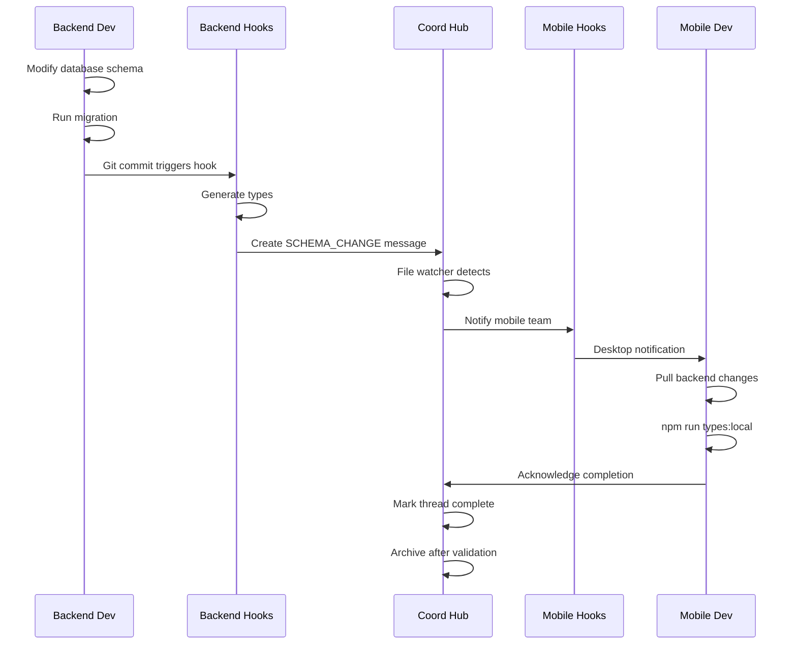
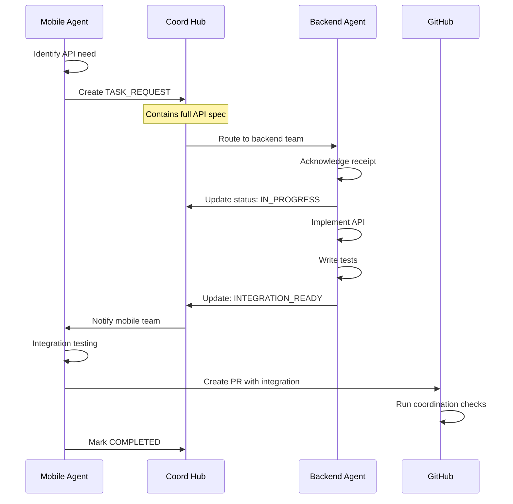

# 🔄 Cross-Repository Coordination System Design v2.0

**Created**: 2025-01-28
**Purpose**: Comprehensive design for coordinating work across Wildlife Watcher mobile app, backend, and future web portal repositories
**Status**: Design Document - Ready for Implementation

---

## 📊 System Architecture Overview



---

## 📁 Shared Coordination Hub Architecture

### Root Structure: `~/dev/wildlifeai/cross-project-coordination/`

```
cross-project-coordination/
├── 📬 inbox/                    # Incoming unread messages
│   ├── mobile-to-backend/       # Messages from mobile team
│   ├── backend-to-mobile/       # Messages from backend team
│   ├── web-to-mobile/           # Messages from web team (future)
│   ├── web-to-backend/          # Messages from web team (future)
│   └── urgent/                  # High-priority messages requiring immediate attention
│
├── 🔄 active/                   # Active conversations and threads
│   ├── threads/                 # Ongoing conversation threads
│   │   ├── {thread-id}/         # Individual thread folders
│   │   │   ├── messages/        # Thread messages
│   │   │   ├── status.yaml      # Thread status and metadata
│   │   │   └── attachments/     # Related files and artifacts
│   │   └── index.md             # Thread index and summary
│   │
│   ├── tasks/                   # Active task coordination
│   │   ├── in-progress/         # Currently being worked on
│   │   ├── blocked/             # Blocked on dependencies
│   │   └── review/              # Ready for review/validation
│   │
│   └── decisions/               # Decision requests pending
│       ├── pending/             # Awaiting decision
│       └── resolved/            # Decisions made (last 7 days)
│
├── 📊 status/                   # Project status synchronization
│   ├── daily/                   # Daily status reports
│   │   └── YYYY-MM-DD/          # Date-organized status
│   ├── mobile-status.md         # Current mobile app status
│   ├── backend-status.md        # Current backend status
│   ├── web-status.md            # Current web portal status
│   └── integration-status.md    # Cross-project integration status
│
├── 🎯 action-items/             # Tracked action items
│   ├── mobile/                  # Mobile team action items
│   ├── backend/                 # Backend team action items
│   ├── web/                     # Web team action items
│   └── shared/                  # Cross-team action items
│
├── 📝 templates/                # Message and workflow templates
│   ├── messages/                # Message templates
│   ├── workflows/               # Workflow documentation
│   └── checklists/              # Integration checklists
│
├── 📚 knowledge-base/           # Shared documentation and decisions
│   ├── api-contracts/           # Agreed API specifications
│   ├── type-definitions/        # Shared TypeScript types
│   ├── architecture-decisions/  # ADRs and technical decisions
│   └── integration-guides/      # How-to guides for integration
│
├── 📈 metrics/                  # Coordination metrics and analytics
│   ├── response-times/          # Message response tracking
│   ├── resolution-rates/        # Issue resolution metrics
│   └── coordination-health/     # System health metrics
│
├── 🗄️ archive/                  # Completed items (auto-archived after 30 days)
│   ├── YYYY/                    # Year-organized archives
│   │   └── MM/                  # Month-organized archives
│   │       ├── threads/         # Completed threads
│   │       ├── tasks/           # Completed tasks
│   │       └── decisions/       # Historical decisions
│   └── index.json               # Archive index for searching
│
├── 🔧 .coordination/            # System configuration and automation
│   ├── config.yaml              # System configuration
│   ├── hooks/                   # Git hooks and scripts
│   ├── watchers/                # File watcher configurations
│   └── logs/                    # System logs
│
└── README.md                    # Hub documentation and quick reference
```

### Folder Descriptions

#### 📬 `inbox/` - Message Reception Point
- **Purpose**: Central arrival point for all new cross-project messages
- **Auto-Processing**: File watcher moves messages to appropriate folders
- **Retention**: Messages remain until acknowledged (max 7 days before escalation)

#### 🔄 `active/` - Work in Progress
- **threads/**: Maintains conversation context with full message history
- **tasks/**: Tracks implementation tasks requiring coordination
- **decisions/**: Centralizes decisions requiring multi-team input

#### 📊 `status/` - Real-Time Status Tracking
- **Auto-Generated**: Scripts aggregate status from all repositories
- **Update Frequency**: Daily for routine, real-time for critical changes
- **Integration Points**: Links to CI/CD status, deployment states

#### 🎯 `action-items/` - Accountability Tracking
- **Assignment**: Clear ownership (team and individual)
- **Due Dates**: Automated reminders and escalations
- **Dependencies**: Links between related action items

#### 📝 `templates/` - Standardization
- **Message Templates**: Ensure consistent communication format
- **Workflow Templates**: Reusable coordination patterns
- **Checklists**: Prevent missing critical steps

#### 📚 `knowledge-base/` - Shared Truth
- **API Contracts**: Single source of truth for interfaces
- **Type Definitions**: Shared TypeScript definitions
- **Decisions**: Architectural Decision Records (ADRs)

#### 📈 `metrics/` - Performance Monitoring
- **Response Times**: Track communication efficiency
- **Resolution Rates**: Measure coordination effectiveness
- **Health Metrics**: Early warning for coordination issues

#### 🗄️ `archive/` - Historical Record
- **Auto-Archive**: Completed items after 30 days
- **Searchable**: JSON index for quick retrieval
- **Compliance**: Audit trail for decisions and changes

---

## 📋 Communication Protocol Specification

### Message File Naming Convention

```
YYYYMMDD-HHMM-{sender}-{recipient}-{type}-{topic}.md
```

**Examples**:
- `20250128-1430-mobile-backend-TASK_REQUEST-user-roles-api.md`
- `20250128-0900-backend-mobile-STATUS_UPDATE-task-13-complete.md`
- `20250128-1615-mobile-all-URGENT-database-migration-breaking.md`

### Message Structure Template

```markdown
---
# Message Metadata (YAML Frontmatter)
message_id: "MSG-2025-01-28-001"
thread_id: "THR-USER-ROLES-001"  # Links related messages
sender:
  team: "mobile"
  agent: "cross-project-coordinator"
  repository: "wildlife-watcher-mobile-app"
recipient:
  team: "backend"  # or "all" for broadcast
  agent: "backend-architect"  # optional, for specific routing
priority: "HIGH"  # URGENT | HIGH | NORMAL | LOW
type: "TASK_REQUEST"  # See message types below
status: "SENT"  # SENT | RECEIVED | ACKNOWLEDGED | IN_PROGRESS | COMPLETED | BLOCKED
created: "2025-01-28T14:30:00Z"
due_date: "2025-01-30T17:00:00Z"  # optional
dependencies:
  - "MSG-2025-01-27-003"  # Previous related messages
  - "TASK-11.8"  # Related task IDs
tags:
  - "api"
  - "user-roles"
  - "task-13"
requires_response: true
response_deadline: "2025-01-29T12:00:00Z"
---

# {Clear, Descriptive Title}

## Executive Summary
{2-3 sentence overview of the request/update}

## Context
{Background information and why this coordination is needed}

## Details
{Main content of the message - be specific and actionable}

## Required Actions
- [ ] {Specific action 1 with owner}
- [ ] {Specific action 2 with deadline}
- [ ] {Specific action 3 with success criteria}

## Success Criteria
- {Measurable outcome 1}
- {Measurable outcome 2}

## Dependencies
- {Upstream dependency and status}
- {Parallel work that must align}

## Attachments
- [{filename}](attachments/{filename}) - {description}

## Response Template
When responding, please include:
1. Acknowledgment of receipt
2. Estimated completion time
3. Any blockers or concerns
4. Questions requiring clarification

---
*Auto-generated tracking: This message will escalate to URGENT if not acknowledged within 24 hours*
```

### Message Types

#### Primary Types
- **TASK_REQUEST**: New work requiring implementation
- **STATUS_UPDATE**: Progress report on ongoing work
- **DECISION_NEEDED**: Requires input for architectural/technical decision
- **INTEGRATION_READY**: Component ready for integration testing
- **BREAKING_CHANGE**: Alert about changes affecting other teams
- **BLOCKED**: Work stopped due to dependency
- **FYI**: Information only, no action required

#### Special Types
- **URGENT**: Requires immediate attention (production issues, critical blockers)
- **SCHEMA_CHANGE**: Database schema modifications requiring type regeneration
- **API_CHANGE**: Endpoint modifications affecting consumers
- **DEPLOYMENT_COORDINATION**: Synchronized deployment required

### Status Lifecycle



### Priority Levels

| Priority | Response Time | Escalation | Use Cases |
|----------|--------------|------------|-----------|
| **URGENT** | < 2 hours | Immediate notification | Production issues, critical blockers |
| **HIGH** | < 8 hours | After 12 hours | Blocking other team's progress |
| **NORMAL** | < 24 hours | After 48 hours | Regular coordination |
| **LOW** | < 72 hours | After 1 week | Future planning, nice-to-have |

---

## 🤖 Automation System Design

### File Watcher Implementation

```bash
#!/bin/bash
# coordination-watcher.sh - Monitors inbox for new messages

WATCH_DIR="~/dev/wildlifeai/cross-project-coordination/inbox"
LOG_DIR="~/dev/wildlifeai/cross-project-coordination/.coordination/logs"

# Using inotify-tools for Linux/WSL
inotifywait -m -r -e create,moved_to "$WATCH_DIR" |
while read path action file; do
    # Parse message metadata
    message_type=$(extract_metadata "$file" "type")
    priority=$(extract_metadata "$file" "priority")
    recipient=$(extract_metadata "$file" "recipient.team")

    # Route message to appropriate handler
    case $priority in
        "URGENT")
            notify_urgent "$file"
            move_to_active "$file"
            ;;
        "HIGH")
            notify_team "$recipient" "$file"
            move_to_active "$file"
            ;;
        *)
            queue_for_processing "$file"
            ;;
    esac

    # Log activity
    log_message "RECEIVED" "$file" "$priority" "$recipient"
done
```

### Git Hook Integration

```bash
#!/bin/bash
# pre-commit hook - Check for pending coordination items

COORD_DIR="~/dev/wildlifeai/cross-project-coordination"

# Check for unacknowledged messages
unread_count=$(find "$COORD_DIR/inbox" -name "*.md" -mtime -1 | wc -l)
if [ $unread_count -gt 0 ]; then
    echo "⚠️  WARNING: You have $unread_count unread coordination messages"
    echo "Please acknowledge messages before committing"
    # Don't block, just warn
fi

# Check for overdue action items
overdue=$(check_overdue_items)
if [ ! -z "$overdue" ]; then
    echo "⚠️  WARNING: You have overdue coordination items:"
    echo "$overdue"
fi

# Sync status to coordination hub
update_project_status

exit 0
```

### Notification System

```typescript
// notification-manager.ts
interface NotificationConfig {
  channels: {
    terminal: boolean;
    desktop: boolean;
    slack?: string;
    email?: string;
  };
  rules: NotificationRule[];
}

interface NotificationRule {
  condition: {
    priority?: Priority;
    type?: MessageType;
    sender?: string;
    keywords?: string[];
  };
  action: {
    channel: string;
    template: string;
    escalation?: {
      after: number; // minutes
      to: string; // escalation channel
    };
  };
}

class NotificationManager {
  async notify(message: Message): Promise<void> {
    const rules = this.findMatchingRules(message);

    for (const rule of rules) {
      await this.sendNotification(rule, message);

      if (rule.action.escalation) {
        this.scheduleEscalation(rule, message);
      }
    }

    this.logNotification(message);
  }

  private async sendDesktopNotification(title: string, body: string) {
    // Cross-platform desktop notification
    if (process.platform === 'linux') {
      exec(`notify-send "${title}" "${body}"`);
    } else if (process.platform === 'darwin') {
      exec(`osascript -e 'display notification "${body}" with title "${title}"'`);
    } else if (process.platform === 'win32') {
      // Windows PowerShell notification
      exec(`powershell -Command "New-BurntToastNotification -Text '${title}', '${body}'"`);
    }
  }
}
```

### Activity Logger

```typescript
// activity-logger.ts
interface ActivityLog {
  timestamp: Date;
  action: 'SENT' | 'RECEIVED' | 'ACKNOWLEDGED' | 'COMPLETED' | 'ESCALATED';
  message_id: string;
  thread_id?: string;
  actor: {
    team: string;
    agent?: string;
    user?: string;
  };
  metadata: Record<string, any>;
}

class ActivityLogger {
  private readonly logPath = '.coordination/logs/activity.jsonl';

  async log(activity: ActivityLog): Promise<void> {
    const line = JSON.stringify({
      ...activity,
      timestamp: activity.timestamp.toISOString()
    });

    await fs.appendFile(this.logPath, line + '\n');

    // Real-time metrics update
    await this.updateMetrics(activity);

    // Trigger webhooks for external systems
    await this.triggerWebhooks(activity);
  }

  async generateDailyReport(): Promise<DailyReport> {
    const logs = await this.getLogsForDate(new Date());

    return {
      messageCount: logs.length,
      averageResponseTime: this.calculateAverageResponseTime(logs),
      completionRate: this.calculateCompletionRate(logs),
      blockedItems: this.findBlockedItems(logs),
      urgentItems: this.findUrgentItems(logs)
    };
  }
}
```

---

## 🔄 Workflow Definitions

### Workflow 1: Backend Schema Change



### Workflow 2: Mobile API Requirement



### Workflow 3: Deployment Coordination

```yaml
# deployment-coordination.yaml
name: Coordinated Deployment
trigger: DEPLOYMENT_COORDINATION message

steps:
  - name: Pre-deployment Checks
    parallel:
      - backend:
          - run: npm test
          - run: npm run migrate:dry-run
          - check: All tests passing
      - mobile:
          - run: npm test
          - run: eas build --profile staging
          - check: Build successful

  - name: Backend Deployment
    sequential:
      - run: npm run migrate:prod
      - run: npm run deploy:edge-functions
      - run: npm run deploy:api
      - wait: Health check passing
      - notify: mobile-team

  - name: Mobile Deployment
    sequential:
      - wait: backend-deployment-complete
      - run: eas submit --profile production
      - wait: App store processing
      - notify: all-teams

  - name: Post-deployment Validation
    parallel:
      - monitoring: Enable enhanced monitoring
      - testing: Run smoke tests
      - rollback: Prepare rollback plan

  - name: Completion
    - update: coordination-hub
    - notify: stakeholders
    - archive: deployment-thread
```

### Workflow 4: Urgent Bug Fix

```typescript
// urgent-fix-workflow.ts
interface UrgentFixWorkflow {
  trigger: 'URGENT message with bug report';

  steps: [
    {
      name: 'Triage';
      timeout: '30 minutes';
      actions: [
        'identify-affected-systems',
        'assess-severity',
        'assign-owners'
      ];
    },
    {
      name: 'Fix Development';
      parallel: true;
      teams: ['backend', 'mobile'];
      actions: [
        'create-hotfix-branch',
        'implement-fix',
        'write-regression-test'
      ];
    },
    {
      name: 'Validation';
      sequential: true;
      actions: [
        'run-tests',
        'peer-review',
        'integration-test'
      ];
    },
    {
      name: 'Emergency Deploy';
      requiresApproval: true;
      actions: [
        'deploy-backend-hotfix',
        'deploy-mobile-hotfix',
        'monitor-metrics'
      ];
    }
  ];
}
```

---

## 📄 Message Templates

### Task Request Template

```markdown
---
message_id: "MSG-{date}-{sequence}"
thread_id: "THR-{topic}-{sequence}"
sender:
  team: "mobile"
  agent: "{agent-name}"
type: "TASK_REQUEST"
priority: "HIGH"
status: "SENT"
created: "{timestamp}"
due_date: "{deadline}"
requires_response: true
---

# Task Request: {Clear Task Title}

## Summary
{2-3 sentences describing what needs to be done and why}

## Requirements

### Functional Requirements
- {Requirement 1 with acceptance criteria}
- {Requirement 2 with acceptance criteria}

### Technical Specifications
```typescript
// Include relevant type definitions or API specs
interface RequestedAPI {
  endpoint: string;
  method: 'GET' | 'POST' | 'PUT' | 'DELETE';
  request?: TypeDefinition;
  response: TypeDefinition;
}
```

### Database Changes Required
- [ ] New tables: {list if any}
- [ ] Schema modifications: {list changes}
- [ ] RLS policies: {security requirements}
- [ ] Functions/Triggers: {business logic needs}

## Success Criteria
- [ ] All tests passing
- [ ] API documented
- [ ] Types generated and shared
- [ ] Integration test provided
- [ ] Performance benchmarks met

## Timeline
- Start: {expected start date}
- Implementation: {estimated hours}
- Testing: {estimated hours}
- Integration: {estimated hours}
- Total: {total estimated hours}

## Dependencies
- Depends on: {upstream dependencies}
- Blocks: {what this blocks}

## Questions/Clarifications Needed
1. {Question 1}
2. {Question 2}

---
*Please acknowledge receipt within 8 hours and provide an estimated completion date*
```

### Status Update Template

```markdown
---
message_id: "MSG-{date}-{sequence}"
thread_id: "{original-thread-id}"
sender:
  team: "backend"
type: "STATUS_UPDATE"
priority: "NORMAL"
status: "SENT"
---

# Status Update: {Task/Feature Name}

## Progress Summary
**Status**: {Percentage}% Complete
**Health**: 🟢 On Track | 🟡 At Risk | 🔴 Blocked

## Completed Since Last Update
✅ {Completed item 1}
✅ {Completed item 2}
✅ {Completed item 3}

## Currently Working On
🔄 {In progress item 1} (ETA: {time})
🔄 {In progress item 2} (ETA: {time})

## Upcoming Work
📋 {Next item 1}
📋 {Next item 2}

## Blockers/Issues
{None | Description of blockers}

## Updated Timeline
- Original estimate: {original}
- Current estimate: {updated}
- Variance: {explain if significant}

## Integration Points Ready
- [x] API endpoint: `{endpoint}`
- [x] Types available: `{path-to-types}`
- [ ] Documentation: {status}

## Action Items for Other Teams
- {Team}: {Required action}

---
*Next update scheduled for: {date/time}*
```

### Decision Request Template

```markdown
---
message_id: "MSG-{date}-{sequence}"
type: "DECISION_NEEDED"
priority: "HIGH"
requires_response: true
response_deadline: "{deadline}"
---

# Decision Required: {Clear Decision Title}

## Context
{Background information necessary for decision}

## The Decision
**Question**: {Specific question requiring decision}

## Options

### Option 1: {Name}
**Pros**:
- {Pro 1}
- {Pro 2}

**Cons**:
- {Con 1}
- {Con 2}

**Impact**:
- Mobile: {impact description}
- Backend: {impact description}
- Timeline: {impact description}

### Option 2: {Name}
{Same structure as Option 1}

## Recommendation
{Your recommendation and rationale}

## Decision Criteria
- {Criterion 1}: {How each option scores}
- {Criterion 2}: {How each option scores}

## Required By
**Deadline**: {date/time}
**Blocks**: {What work is blocked waiting for this decision}

## Decision Record
**Decision**: {To be filled when made}
**Made By**: {Who made the decision}
**Date**: {When decided}
**Rationale**: {Why this decision}

---
*Please provide decision by {deadline} to avoid blocking {blocked-work}*
```

---

## 🔗 Integration Points

### GitHub Actions Integration

```yaml
# .github/workflows/coordination-check.yml
name: Cross-Project Coordination Check

on:
  pull_request:
    types: [opened, synchronize]
  push:
    branches: [main, develop]

jobs:
  coordination-check:
    runs-on: ubuntu-latest
    steps:
      - uses: actions/checkout@v3

      - name: Check Coordination Status
        run: |
          # Check for pending coordination items
          ./scripts/check-coordination-status.sh

      - name: Validate API Contracts
        run: |
          # Ensure API changes are coordinated
          ./scripts/validate-api-contracts.sh

      - name: Type Synchronization Check
        run: |
          # Verify types are in sync across repos
          ./scripts/check-type-sync.sh

      - name: Update Coordination Hub
        if: github.event_name == 'push'
        run: |
          # Update status in coordination hub
          ./scripts/update-coordination-status.sh

      - name: Post Coordination Summary
        if: github.event_name == 'pull_request'
        uses: actions/github-script@v6
        with:
          script: |
            const summary = require('./coordination-summary.json');
            github.rest.issues.createComment({
              issue_number: context.issue.number,
              owner: context.repo.owner,
              repo: context.repo.repo,
              body: summary.markdown
            });
```

### MCP Agent Mail Integration

```typescript
// mcp-integration.ts
interface MCPMailConfig {
  enabled: boolean;
  inbox: 'coordination-inbox';
  routes: {
    'URGENT': 'urgent-handler';
    'TASK_REQUEST': 'task-router';
    'STATUS_UPDATE': 'status-aggregator';
  };
  notifications: {
    desktop: boolean;
    sound: boolean;
  };
}

class MCPCoordinationBridge {
  async routeMessage(message: Message): Promise<void> {
    if (this.config.enabled) {
      await this.mcpMail.send({
        to: message.recipient.team,
        subject: `[${message.priority}] ${message.type}: ${message.title}`,
        body: message.content,
        metadata: {
          thread_id: message.thread_id,
          requires_response: message.requires_response,
          deadline: message.response_deadline
        }
      });
    }
  }
}
```

---

## 📈 Implementation Roadmap

### Phase 1: Foundation (Day 1-2)
- [x] Design system architecture
- [ ] Create directory structure in all repos
- [ ] Set up file watcher script
- [ ] Implement basic notification system
- [ ] Create initial message templates

### Phase 2: Automation (Day 3-4)
- [ ] Implement git hooks for all repos
- [ ] Set up automated status synchronization
- [ ] Create message routing system
- [ ] Build activity logger
- [ ] Implement escalation rules

### Phase 3: Integration (Day 5-6)
- [ ] GitHub Actions workflow setup
- [ ] MCP Agent Mail bridge (if applicable)
- [ ] Cross-repo type validation
- [ ] API contract validation
- [ ] Deployment coordination scripts

### Phase 4: Optimization (Day 7-8)
- [ ] Performance metrics dashboard
- [ ] Response time analytics
- [ ] Automated report generation
- [ ] Archive system with search
- [ ] Health monitoring alerts

### Phase 5: Documentation & Training (Day 9-10)
- [ ] Complete user documentation
- [ ] Create video walkthrough
- [ ] Team training sessions
- [ ] Runbook for common scenarios
- [ ] Troubleshooting guide

---

## 🔧 Backend Team Requirements

### Minimum Setup Required

1. **Mirror Directory Structure**
   ```bash
   mkdir -p ~/dev/wildlifeai/wildlife-watcher-backend/project-context/cross-project-coordination
   ln -s ~/dev/wildlifeai/cross-project-coordination ~/dev/wildlifeai/wildlife-watcher-backend/project-context/cross-project-coordination/hub
   ```

2. **Install Git Hooks**
   ```bash
   cp ~/.coordination/hooks/* .git/hooks/
   chmod +x .git/hooks/*
   ```

3. **Configure Notifications**
   ```yaml
   # .coordination/config.yaml
   team: backend
   notifications:
     terminal: true
     desktop: true
   auto_acknowledge: true
   status_update_frequency: daily
   ```

4. **Set Up File Watcher**
   ```bash
   # Add to .bashrc or .zshrc
   alias coord-watch='~/dev/wildlifeai/cross-project-coordination/.coordination/watch.sh'

   # Run on startup
   coord-watch &
   ```

5. **Template Access**
   - Use provided templates for all coordination messages
   - Follow naming conventions exactly
   - Include all required metadata fields

### Expected Behaviors

1. **Check inbox on session start**
2. **Acknowledge messages within SLA**
3. **Update status at defined intervals**
4. **Use thread IDs to maintain context**
5. **Archive completed items promptly**

---

## 🎯 Success Metrics

### Quantitative Metrics
- **Response Time**: < 8 hours for HIGH priority
- **Resolution Time**: < 48 hours for standard tasks
- **Message Clarity**: < 5% require clarification
- **Automation Coverage**: > 80% of routine tasks
- **Type Sync Success**: 100% consistency
- **Deployment Success**: > 95% first-time success

### Qualitative Metrics
- **Team Satisfaction**: Regular surveys
- **Communication Quality**: Peer reviews
- **Process Efficiency**: Time saved vs. ad-hoc
- **Knowledge Retention**: Searchable archive usage
- **Error Reduction**: Fewer coordination failures

---

## 📚 Appendix

### A. Script Examples
- File watcher implementation
- Git hook scripts
- Status synchronization
- Notification system
- Archive management

### B. Configuration Files
- Team-specific configs
- Notification rules
- Escalation policies
- Archive retention

### C. Troubleshooting Guide
- Common issues and solutions
- Debug commands
- Log locations
- Recovery procedures

### D. Integration APIs
- Coordination hub REST API
- WebSocket for real-time updates
- GraphQL for complex queries
- Webhook endpoints

---

*This design ensures fast, efficient, and scalable coordination across all Wildlife Watcher repositories while maintaining full audit trails and supporting rapid development iteration.*