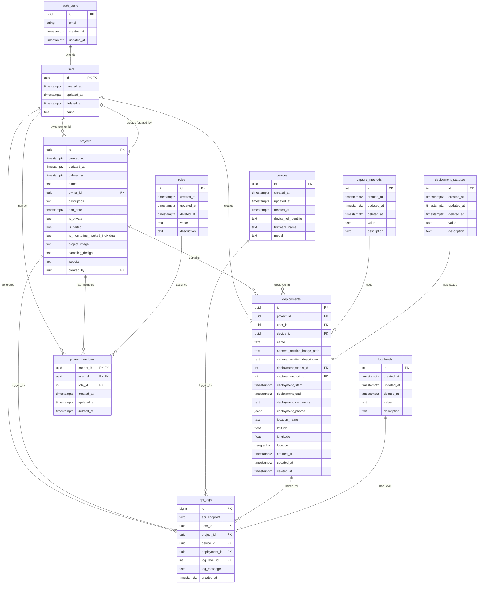

# Wildlife Watcher Database Schema Analysis

## Overview

This document provides a comprehensive technical analysis of the Wildlife Watcher backend database (Supabase/Postgres) schema, including all database components, Supabase components, seed data values, and Entity Relationship Diagram.

The Wildlife Watcher database is designed for managing wildlife monitoring projects using camera traps and other recording devices. It implements a multi-tenant system with user authentication, project management, device deployments, and comprehensive logging capabilities.

## Entity Relationship Diagram (Mermaid)



## Database Tables Analysis

### Core Entity Tables

#### 1. **users** - User Profile Extension
- **Purpose**: Extends Supabase's built-in auth.users table with additional profile information
- **Key Features**: 
  - Links directly to Supabase auth system via foreign key cascade
  - Implements soft delete pattern
  - Automatic timestamp management
- **Schema**:
  ```sql
  CREATE TABLE users (
    id uuid PRIMARY KEY REFERENCES auth.users(id) ON DELETE CASCADE,
    created_at timestamptz DEFAULT (now()),
    updated_at timestamptz DEFAULT (now()),
    deleted_at timestamptz,
    name text NOT NULL
  );
  ```

#### 2. **projects** - Wildlife Monitoring Projects
- **Purpose**: Central entity for wildlife monitoring projects with ownership and privacy controls
- **Key Features**:
  - UUID-based primary keys
  - Privacy controls (`is_private`)
  - Scientific monitoring flags (`is_baited`, `is_monitoring_marked_individual`)
  - Dual ownership tracking (owner vs creator)
  - Rich metadata support
- **Schema**:
  ```sql
  CREATE TABLE projects (
    id uuid PRIMARY KEY NOT NULL DEFAULT (gen_random_uuid()),
    created_at timestamptz DEFAULT (now()),
    updated_at timestamptz DEFAULT (now()),
    deleted_at timestamptz,
    name text NOT NULL,
    owner_id uuid NOT NULL,
    description text,
    end_date timestamptz,
    is_private bool,
    is_baited bool,
    is_monitoring_marked_individual bool,
    project_image text,
    sampling_design text,
    website text,
    created_by uuid
  );
  ```

#### 3. **deployments** - Camera Deployments
- **Purpose**: Core table storing camera deployments with location data, status, and metadata
- **Key Features**:
  - PostGIS geographic data support via `geography(point,4326)`
  - JSON storage for photo metadata
  - Comprehensive temporal tracking
  - Unique constraint preventing multiple active deployments per (project, user, device)
- **Schema**:
  ```sql
  CREATE TABLE deployments (
    id uuid PRIMARY KEY NOT NULL DEFAULT (gen_random_uuid()),
    project_id uuid NOT NULL,
    user_id uuid NOT NULL,
    device_id uuid NOT NULL,
    name text,
    camera_location_image_path text,
    camera_location_description text,
    deployment_status_id int,
    capture_method_id int,
    deployment_start timestamptz,
    deployment_end timestamptz,
    deployment_comments text,
    deployment_photos jsonb,
    location_name text NOT NULL,
    latitude float,
    longitude float,
    location geography(point,4326),
    created_at timestamptz DEFAULT (now()),
    updated_at timestamptz DEFAULT (now()),
    deleted_at timestamptz
  );
  ```

#### 4. **devices** - Recording Equipment
- **Purpose**: Represents physical recording devices used in deployments
- **Key Features**:
  - UUID-based identifiers
  - Device metadata tracking (firmware, model)
  - Soft delete capability
- **Schema**:
  ```sql
  CREATE TABLE devices (
    id uuid PRIMARY KEY NOT NULL DEFAULT (gen_random_uuid()),
    created_at timestamptz DEFAULT (now()),
    updated_at timestamptz DEFAULT (now()),
    deleted_at timestamptz,
    device_ref_identifier text,
    firmware_name text,
    model text
  );
  ```

#### 5. **project_members** - Project Access Control
- **Purpose**: Junction table managing user access to projects with role-based permissions
- **Key Features**:
  - Many-to-many relationship pattern
  - Role-based access control
  - Composite primary key (project_id, user_id)
- **Schema**:
  ```sql
  CREATE TABLE project_members (
    project_id uuid NOT NULL,
    user_id uuid NOT NULL,
    role_id int,
    created_at timestamptz DEFAULT (now()),
    updated_at timestamptz DEFAULT (now()),
    deleted_at timestamptz,
    PRIMARY KEY (project_id, user_id)
  );
  ```

#### 6. **api_logs** - API Activity Logging
- **Purpose**: Comprehensive logging of API interactions with contextual information
- **Key Features**:
  - High-volume logging support (BIGINT primary key)
  - Contextual foreign keys (all optional)
  - Comprehensive audit trail
- **Schema**:
  ```sql
  CREATE TABLE api_logs (
    id BIGINT GENERATED BY DEFAULT AS IDENTITY PRIMARY KEY NOT NULL,
    api_endpoint text,
    user_id uuid,
    project_id uuid,
    device_id uuid,
    deployment_id uuid,
    log_level_id int,
    log_message text,
    created_at timestamptz DEFAULT now()
  );
  ```

### Lookup Tables

#### 1. **roles** - User Role Definitions
- **Purpose**: Defines user roles within project contexts
- **Seed Values**:
  ```sql
  INSERT INTO roles (value, description) VALUES
  ('admin', 'Project administrator'),
  ('user', 'Standard project user');
  ```

#### 2. **capture_methods** - Data Capture Methods
- **Purpose**: Defines methods for capturing wildlife data
- **Seed Values**:
  ```sql
  INSERT INTO capture_methods (value, description) VALUES
  ('activityDetection', 'Triggered when activity is detected'),
  ('timeLapse', 'Captures images at regular intervals');
  ```

#### 3. **deployment_statuses** - Deployment Lifecycle States
- **Purpose**: Defines possible deployment states
- **Seed Values**:
  ```sql
  INSERT INTO deployment_statuses (value, description) VALUES
  ('planned', 'Deployment is planned but not yet started'),
  ('started', 'Deployment is currently active'),
  ('ended', 'Deployment has been completed/ended');
  ```

#### 4. **log_levels** - Log Severity Levels
- **Purpose**: Standard logging severity levels for system monitoring
- **Seed Values**:
  ```sql
  INSERT INTO log_levels (value, description) VALUES
  ('debug', 'Detailed debug information'),
  ('info', 'General information messages'),
  ('notice', 'Normal but significant condition'),
  ('warning', 'Something unexpected, but the application continues'),
  ('error', 'An error occurred, something failed'),
  ('critical', 'Critical condition that needs immediate attention'),
  ('alert', 'Action must be taken immediately'),
  ('emergency', 'System is unusable');
  ```

## Database Functions and Triggers

### Core Functions

1. **set_updated_at()** - Automatic timestamp updates for audit trails
2. **has_project_role(project_id, role)** - Role-based authorization helper
3. **sync_geolocation()** - Automatic coordinate-to-geography conversion
4. **soft_delete_deployment(id)** - Safe deployment deletion with ownership checks
5. **soft_delete_project(id)** - Safe project deletion with admin authorization
6. **soft_remove_project_member(project_id, user_id)** - Member removal with admin checks
7. **soft_delete_device(id)** - Device deletion with project-context authorization

### Triggers

All core tables have automated `updated_at` timestamp triggers:
- `trg_deployments_updated_at`
- `trg_projects_updated_at`
- `trg_project_members_updated_at`
- `trg_devices_updated_at`
- Plus triggers for all lookup tables

Special trigger:
- `sync_geolocation_trigger` on deployments table for automatic PostGIS data synchronization

## Security Model (Row Level Security)

### RLS-Enabled Tables
- `projects`, `project_members`, `deployments`, `devices`, `api_logs`, `users`

### Security Policies Summary

| Table | Policy Type | Access Control |
|-------|-------------|----------------|
| **projects** | Multi-level | Members view, admins manage, creators insert |
| **project_members** | Self + Admin | Users see own membership, admins manage all |
| **deployments** | Creator + Admin | Creators manage own, admins manage all in project |
| **devices** | Project-based | Access through deployment association |
| **api_logs** | Admin-only | Project admins can view logs for their projects |

### Role Hierarchy
1. **Anonymous**: No access to protected data
2. **Authenticated User**: Can create projects
3. **Project Member**: Can view and create deployments
4. **Deployment Creator**: Can manage own deployments
5. **Project Admin**: Can manage all project resources

## Seed Data Analysis

### Environment-Specific Data

| Environment | Status | Content | Purpose |
|-------------|---------|---------|---------|
| **Main (seed.sql)** | ✅ Complete | Core lookup data (15 records) | Production base data |
| **Local** | ⚠️ Test marker | Single test record | Development verification |
| **Dev** | ❌ Corrupted | Invalid content ("s") | Needs fixing |
| **Staging** | ⚠️ Empty | No data | No staging-specific config |
| **Test** | ⚠️ Empty | No data | No test-specific config |

### Core Seed Data Values

The system comes with essential lookup data:
- **2 user roles**: admin, user
- **2 capture methods**: activityDetection, timeLapse  
- **3 deployment statuses**: planned, started, ended
- **8 log levels**: debug through emergency (syslog standard)

## Supabase Components

### Extensions
- **PostGIS**: Geographic data support for location tracking
- **UUID**: UUID generation functions

### Authentication Integration
- Native Supabase Auth integration via `auth.users` foreign key
- `auth.uid()` function used throughout RLS policies
- Authenticated role-based access control

### Real-time Features
- Real-time subscriptions enabled via Supabase config
- API endpoints exposed for authenticated users

### Storage Integration
- File storage configured for deployment photos and project images
- 50MiB file size limit configured

## Architecture Highlights

1. **Multi-tenancy**: Project-based data isolation with role-based access
2. **Soft Deletes**: Comprehensive soft delete pattern preserving data integrity
3. **Audit Trail**: Automatic timestamps and comprehensive API logging
4. **Geographic Support**: PostGIS integration for spatial data and queries
5. **Flexible Schema**: JSON fields for extensible metadata storage
6. **Security-First**: Row Level Security with defense-in-depth approach
7. **Scalable Logging**: High-volume API logging with contextual relationships

This database schema provides a robust foundation for a professional wildlife monitoring platform with enterprise-grade security, auditability, and scalability features.