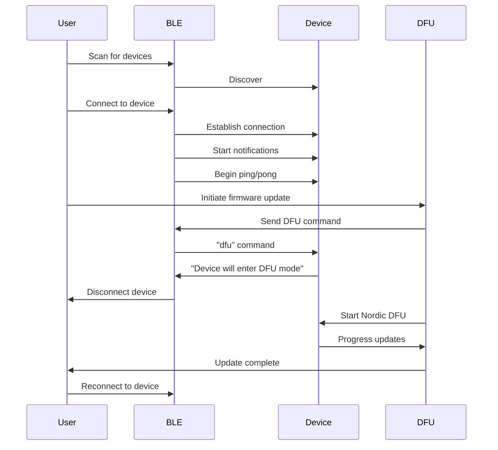

# BLE and DFU Dependencies and Relationships Analysis

## Overview

This document provides a detailed analysis of the dependencies and relationships between the BLE (Bluetooth Low Energy) and DFU (Device Firmware Update) components in the Wildlife Watcher mobile application. Understanding these relationships is crucial for planning future enhancements and ensuring system stability during the evolution to support AI model updates.

## Component Dependency Map

```
┌─────────────────────────────────────────────────────────────────┐
│                        Application Layer                         │
├─────────────────────────────────────────────────────────────────┤
│  DfuScreen │ TerminalScreen │ DeviceScreen │ DeploymentsScreen  │
└────┬───────┴───────┬────────┴──────┬───────┴──────┬────────────┘
     │               │               │              │
     ▼               ▼               ▼              ▼
┌─────────────────────────────────────────────────────────────────┐
│                      Service Layer                               │
├─────────────────────────────────────────────────────────────────┤
│    DfuService    │    BleEngineProvider    │   Redux Store      │
└────────┬─────────┴──────────┬──────────────┴────────┬──────────┘
         │                    │                       │
         ▼                    ▼                       ▼
┌─────────────────────────────────────────────────────────────────┐
│                     Core Hooks Layer                             │
├─────────────────────────────────────────────────────────────────┤
│      useBle      │   useBleListeners   │    useCommand         │
└────────┬─────────┴──────────┬──────────┴────────┬──────────────┘
         │                    │                   │
         ▼                    ▼                   ▼
┌─────────────────────────────────────────────────────────────────┐
│                   Native Module Layer                            │
├─────────────────────────────────────────────────────────────────┤
│  react-native-ble-manager  │  react-native-nordic-dfu           │
└────────────────────────────┴────────────────────────────────────┘
```

## Direct Dependencies

### 1. BLE Component Dependencies

**NPM Package Dependencies:**
```json
{
  "react-native-ble-manager": "^11.3.2",
  "react-native-bluetooth-state-manager": "^1.3.5",
  "buffer": "^6.0.3",
  "eventemitter3": "^5.0.1"
}
```

**Internal Dependencies:**
- Redux store (devicesSlice, bleLibrarySlice, configurationSlice, logsSlice, scanningSlice)
- BLE types and parser (`src/ble/types.ts`, `src/ble/parser.ts`)
- Logger utilities
- Helper functions for device management

### 2. DFU Component Dependencies

**NPM Package Dependencies:**
```json
{
  "react-native-nordic-dfu": "github:Salt-PepperEngineering/react-native-nordic-dfu",
  "react-native-document-picker": "^9.3.1",
  "expo-file-system": "~16.0.0"
}
```

**Internal Dependencies:**
- BLE connection (device must be connected)
- Redux store (devicesSlice for device removal)
- Navigation system
- Platform-specific permissions

## Relationship Analysis

### 1. Lifecycle Dependencies



**Key Observations:**
- DFU requires active BLE connection to initiate
- DFU process breaks BLE connection
- No shared state during DFU process
- Manual reconnection required post-DFU

### 2. State Management Relationships

**Shared Redux State:**
```typescript
// devicesSlice - Shared by both BLE and DFU
{
  [deviceId]: {
    id: string,
    name: string,
    connected: boolean,
    loading: boolean,
    services: ServiceInfo,
    intervals: { ping: NodeJS.Timeout },
    device: Peripheral
  }
}

// Configuration shared between BLE commands and DFU trigger
{
  [deviceId]: {
    [CommandNames.DFU]: {
      value: string,
      loading: boolean,
      loaded: boolean,
      error?: string
    }
  }
}
```

**State Transitions:**
1. BLE manages device connection state
2. DFU command updates configuration state
3. DFU completion triggers device removal
4. No state preservation across DFU boundary

### 3. Event Flow Dependencies

**BLE Event System:**
```typescript
// BLE Events
BleManagerEmitter.addListener("BleManagerDiscoverPeripheral", handler)
BleManagerEmitter.addListener("BleManagerStopScan", handler)
BleManagerEmitter.addListener("BleManagerDisconnectPeripheral", handler)
BleManagerEmitter.addListener("BleManagerDidUpdateValueForCharacteristic", handler)

// Custom Events
readlineParserEmitter.on("BleManagerDidUpdateValueForCharacteristicReadlineParser", handler)
```

**DFU Event System:**
```typescript
// DFU Events
DFUEmitter.addListener("DFUProgress", handler)
// No other events - limited feedback mechanism
```

**Event Isolation:**
- BLE and DFU events are completely separate
- No event bridge between systems
- Cannot monitor DFU status via BLE

### 4. Data Flow Dependencies

```
BLE Data Flow:
User Input → Command Construction → Write Queue → BLE Write → Device
Device Response → BLE Read → Parser → Redux Update → UI Update

DFU Data Flow:
File Selection → Temp Storage → DFU Service → Nordic DFU → Device
Progress Events → UI Update → Completion → Device Removal
```

**Critical Observations:**
- No shared data pipeline
- Different data formats (text vs binary)
- No unified progress tracking
- Separate error handling paths

## Coupling Analysis

### 1. Tight Coupling Points

1. **Device Connection Dependency**
   - DFU requires BLE connection to initiate
   - Cannot start DFU without connected device
   - Device ID passed from BLE to DFU

2. **State Management**
   - Both systems write to same Redux store
   - Device removal affects both systems
   - No transaction boundaries

3. **UI Navigation**
   - DFU screen accessed from device screens
   - Navigation state couples components

### 2. Loose Coupling Points

1. **Native Modules**
   - Separate native implementations
   - No shared native code
   - Independent version management

2. **Event Systems**
   - Separate event emitters
   - No cross-communication
   - Independent lifecycle

3. **Error Handling**
   - Separate error paths
   - No shared error recovery
   - Independent error states

## Shared Infrastructure

### 1. Common Utilities

```typescript
// Shared device type definitions
type ExtendedPeripheral = {
  id: string
  name: string
  connected: boolean
  device: Peripheral
  // ... other fields
}

// Shared constants
const BLE_SERVICE_UUID = "6e400001-b5a3-f393-e0a9-e50e24dcca9d"
```

### 2. Shared UI Components

- WWScreenView
- WWText
- WWProgressBar
- Navigation infrastructure

### 3. Shared Platform Code

- Permission handling (Android)
- File system operations
- Platform-specific branching

## Risk Areas

### 1. Race Conditions

**Scenario**: User initiates DFU while BLE operations pending
```typescript
// Risk: Write queue has pending operations
// DFU disconnects device
// Pending writes fail with unclear errors
```

**Mitigation**: Need operation coordination

### 2. State Inconsistency

**Scenario**: DFU fails but device removed from state
```typescript
// Risk: Device in limbo state
// Not in app device list
// Still advertising via BLE
// User confusion about device status
```

**Mitigation**: Need atomic state updates

### 3. Resource Leaks

**Scenario**: Intervals and listeners during DFU
```typescript
// Risk: Ping interval continues during DFU
// Event listeners accumulate
// Memory leaks over time
```

**Mitigation**: Need lifecycle management

### 4. Error Cascade

**Scenario**: BLE error during DFU initiation
```typescript
// Risk: Unclear error source
// User doesn't know if BLE or DFU failed
// Recovery path unclear
```

**Mitigation**: Need unified error handling

## Dependency Injection Opportunities

### 1. Service Abstraction

```typescript
interface IDeviceUpdateService {
  updateFirmware(device: Device, file: File): Promise<void>
  updateAIModel(device: Device, file: File): Promise<void>
  getProgress(): Observable<number>
  cancel(): void
}

// Implementations
class NordicDFUService implements IDeviceUpdateService { }
class CustomProtocolService implements IDeviceUpdateService { }
```

### 2. Communication Abstraction

```typescript
interface IDeviceCommunication {
  connect(deviceId: string): Promise<void>
  disconnect(deviceId: string): Promise<void>
  sendCommand(command: Command): Promise<Response>
  onData(handler: DataHandler): void
}

// Implementations
class BLECommunication implements IDeviceCommunication { }
class WiFiCommunication implements IDeviceCommunication { }
```

### 3. State Management Abstraction

```typescript
interface IDeviceStateManager {
  getDevice(id: string): Device
  updateDevice(id: string, updates: Partial<Device>): void
  removeDevice(id: string): void
  onStateChange(handler: StateChangeHandler): void
}
```

## Recommendations for Decoupling

### 1. Immediate Actions

1. **Create Update Coordinator**
   - Manages transition between BLE and DFU
   - Ensures clean handoff
   - Handles state preservation

2. **Implement Transaction Boundaries**
   - Atomic operations for state changes
   - Rollback capability
   - Consistent error handling

3. **Add Event Bridge**
   - Unified event system
   - Cross-component communication
   - Central event logging

### 2. Medium-term Improvements

1. **Service Layer Refactoring**
   - Abstract device operations
   - Plugin architecture for updates
   - Dependency injection

2. **State Management Evolution**
   - Separate concerns in Redux
   - Add middleware for coordination
   - Implement sagas for complex flows

3. **Protocol Abstraction**
   - Unified communication interface
   - Support multiple protocols
   - Version negotiation

### 3. Long-term Architecture

1. **Microservice Pattern**
   - Separate BLE service
   - Separate update service
   - Message-based communication

2. **Plugin System**
   - Dynamically load update mechanisms
   - Support custom protocols
   - Extensible architecture

3. **Event-Driven Architecture**
   - Event sourcing for state
   - CQRS for operations
   - Eventual consistency

## Impact on AI Model Support

### Current Blockers

1. **Single Update Mechanism**: DFU only supports firmware
2. **No Chunking Support**: Cannot handle large files
3. **Tight Nordic Coupling**: Locked to Nordic protocol
4. **No Progress Granularity**: Only percentage updates

### Required Changes

1. **Abstract Update Interface**
   - Support multiple file types
   - Protocol negotiation
   - Pluggable implementations

2. **Enhanced State Management**
   - Track multiple update types
   - Queue management
   - Progress per operation

3. **Improved Error Handling**
   - Specific error codes
   - Recovery mechanisms
   - Partial update support

4. **Background Operation Support**
   - Long-running transfers
   - Resume capability
   - Offline queuing

## Testing Considerations

### 1. Unit Testing Challenges

- Mock native modules required
- Event emitter testing complex
- State management testing needed

### 2. Integration Testing

- BLE simulator needed
- DFU mock service required
- End-to-end flow validation

### 3. Edge Cases

- Connection loss during DFU
- Partial file transfers
- State corruption scenarios
- Resource exhaustion

## Conclusion

The current BLE and DFU implementation exhibits significant coupling through shared state management and sequential lifecycle dependencies. While the native modules remain properly isolated, the application layer creates unnecessary dependencies that complicate the addition of AI model support.

Key recommendations:
1. **Immediate**: Add coordination layer between BLE and DFU
2. **Short-term**: Abstract update mechanisms for multiple file types
3. **Long-term**: Evolve to plugin-based architecture

These changes will enable:
- AI model file support
- Improved reliability
- Better user experience
- Easier testing and maintenance
- Future protocol support

The path forward requires careful refactoring to maintain backward compatibility while enabling the new capabilities required for AI model deployment.