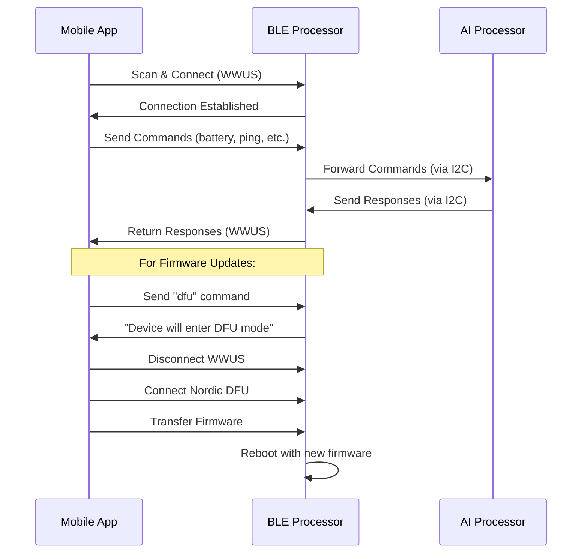

# Wildlife Watcher Communication Systems - Technical Guide

**Version**: 1.0  
**Date**: July 31, 2025  
**For**: Mobile App Developers  
**Context**: Post-Expo Migration Implementation  

---

## Revision History

| Date | Version | Summary of Changes | Author |
|------|---------|-------------------|---------|
| 2025-07-31 | 1.0 | Initial consolidated document addressing Charles Palmer's feedback on BLE/DFU terminology and dual-processor architecture | Claude Code |

---

## Executive Summary

This document provides mobile app developers with a clear understanding of the Wildlife Watcher device communication systems. Based on feedback from hardware engineer Charles Palmer, this guide clarifies the distinction between different communication protocols and the dual-processor architecture that enables the Wildlife Watcher's advanced functionality.

**Key Points for Developers:**
- **WWUS (Wildlife Watcher UART Service)**: Normal device communication (what was previously called "BLE" in docs)
- **DFU**: Nordic firmware update protocol for the BLE processor
- **DFUx**: Proposed enhanced protocol for AI models and file transfers
- **Dual Architecture**: Two processors work together via I2C communication

## Table of Contents

1. [Wildlife Watcher Hardware Architecture](#1-wildlife-watcher-hardware-architecture)
2. [Communication Protocol Overview](#2-communication-protocol-overview)
3. [WWUS Protocol (Normal Communication)](#3-wwus-protocol-normal-communication)
4. [DFU Protocol (Firmware Updates)](#4-dfu-protocol-firmware-updates)
5. [DFUx Enhancement Proposal](#5-dfux-enhancement-proposal)
6. [Current Mobile App Implementation](#6-current-mobile-app-implementation)
7. [Development Implications](#7-development-implications)
8. [Implementation Roadmap](#8-implementation-roadmap)

---

## 1. Wildlife Watcher Hardware Architecture

### 1.1 Dual-Processor System

The Wildlife Watcher (WW500) contains **two distinct processors** that work together:

```
┌─────────────────────────────────────────────────────┐
│                Wildlife Watcher WW500               │
├─────────────────────┬───────────────────────────────┤
│   BLE Processor     │        AI Processor           │
│   (nRF52832)        │                               │
│                     │                               │
│ • BLE Communication│ • Neural Networks             │
│ • WWUS Protocol     │ • Image Processing            │
│ • DFU Updates       │ • SD Card Interface           │
│ • Bootloader        │ • Extended Functionality      │
└─────────────────────┴───────────────────────────────┘
           │                         │
           └─────────I2C Bus─────────┘
```

### 1.2 BLE Processor (MKL62BA Module)
- **Chip**: Nordic nRF52832
- **Responsibilities**:
  - BLE communication with mobile app
  - WWUS protocol implementation
  - DFU (firmware update) handling
  - Bootloader management
- **Communication**: Direct BLE connection to mobile app
- **Update Method**: Nordic DFU protocol

### 1.3 AI Processor
- **Responsibilities**:
  - Neural network model execution
  - Camera image processing
  - SD card file management
  - Extended device functionality
- **Communication**: I2C bus to BLE processor (text messages)
- **Update Method**: Files transferred via BLE processor

### 1.4 Inter-Processor Communication
- **Protocol**: I2C bus
- **Current Data**: Text messages (similar to NUS payload)
- **Potential**: Enhanced for binary data transfer
- **Usage**: Commands and data flow between processors

---

## 2. Communication Protocol Overview

### 2.1 Protocol Hierarchy

```
Mobile App Communication Stack:

┌─────────────────────────────────────┐
│        Mobile Application           │
├─────────────────────────────────────┤
│   BLE (Bluetooth Low Energy)       │  ← Overall Protocol Layer
├─────────────────┬───────────────────┤
│      WWUS       │        DFU        │  ← Specific Services
│   (Normal Ops)  │  (Firmware Upd)   │
└─────────────────┴───────────────────┘
```

### 2.2 Service Distinctions

| Service | Purpose | UUID | Target Processor |
|---------|---------|------|------------------|
| **WWUS** | Normal device communication | `6e400001-b5a3-f393-e0a9-e50e24dcca9d` | BLE Processor |
| **DFU** | Firmware updates | Nordic standard UUIDs | BLE Processor |
| **DFUx** *(Proposed)* | Enhanced file transfers | Custom UUIDs | Both (via BLE) |

**Important**: The current mobile app documentation incorrectly used "BLE" to refer to normal communication. This should be "WWUS" to distinguish from the overall BLE protocol layer.

---

## 3. WWUS Protocol (Normal Communication)

### 3.1 Current Implementation

The Wildlife Watcher UART Service (WWUS) handles all normal device communication:

**Service Configuration:**
```typescript
BLE_SERVICE_UUID = "6e400001-b5a3-f393-e0a9-e50e24dcca9d"
BLE_CHARACTERISTIC_WRITE_UUID = "6e400002-b5a3-f393-e0a9-e50e24dcca9d" 
BLE_CHARACTERISTIC_READ_UUID = "6e400003-b5a3-f393-e0a9-e50e24dcca9d"
```

### 3.2 Command Protocol

WWUS uses a text-based command system:

```typescript
// Available Commands (from codebase)
enum CommandNames {
    ID = "ID",
    VERSION = "VERSION", 
    BATTERY = "BATTERY",
    HEARTBEAT = "HEARTBEAT",
    DEVEUI = "DEVEUI",
    PING = "PING",
    RESET = "RESET",
    DFU = "DFU",        // Triggers DFU mode
    SENSOR = "SENSOR",
    TRAP = "TRAP",
    LORAWAN = "LORAWAN"
}
```

### 3.3 Command Flow Example

```
Mobile App → BLE Write → BLE Processor → Command Processing → Response
    ↓
"battery" → WWUS → nRF52832 → Battery Check → "Battery = 85%"
    ↓
Mobile App ← BLE Read ← BLE Processor ← Response
```

### 3.4 Inter-Processor Commands

Some commands require AI processor interaction:

```
Mobile App → WWUS → BLE Processor → I2C → AI Processor → Response
                                      ↓
                        Text Message Exchange (Current)
```

---

## 4. DFU Protocol (Firmware Updates)

### 4.1 Nordic DFU Implementation

**Purpose**: Update firmware on the nRF52832 BLE processor only.

**Current Process:**
1. Mobile app sends `"dfu"` command via WWUS
2. BLE processor responds: `"Device will enter DFU mode after disconnecting"`
3. Device disconnects from WWUS
4. Device enters Nordic DFU bootloader mode
5. Mobile app connects via Nordic DFU protocol
6. Firmware (.zip) transferred to BLE processor
7. Device reboots with new firmware

### 4.2 DFU Service Details

**Mobile App Implementation** (`src/services/DfuService.ts`):
```typescript
export class DfuService {
    static async startDFU(
        deviceAddress: string,
        firmwareFilePath: string,
        onProgress?: (progress: number) => void,
    ) {
        // Nordic DFU protocol implementation
        const result = await NordicDFU.startDFU({
            deviceAddress,
            filePath: firmwareFilePath,
            alternativeAdvertisingNameEnabled: false,
        })
    }
}
```

### 4.3 Current Limitations

1. **BLE Processor Only**: Cannot update AI processor firmware
2. **Single File Type**: Only supports Nordic firmware packages
3. **No AI Models**: Cannot transfer neural network models
4. **Manual Process**: Requires device disconnection/reconnection

---

## 5. DFUx Enhancement Proposal

### 5.1 Enhanced DFU Protocol (Charles' Proposal)

**DFUx** extends the Nordic DFU protocol to support multiple file types and AI processor updates.

### 5.2 Proposed Capabilities

| File Type | Target | Purpose | Implementation |
|-----------|--------|---------|---------------|
| **0x01** | BLE Processor | Firmware (.zip) | Current Nordic DFU |
| **0x02** | AI Processor | Neural Network Models | New via I2C |
| **0x03** | AI Processor | Configuration Files | New via I2C |
| **0x04** | AI Processor | Firmware Updates | New via I2C |

### 5.3 DFUx Architecture

```
Mobile App → Enhanced DFU → BLE Processor Bootloader
                                    ↓
                         ┌─────────────────────┐
                         │  File Type Router   │
                         └─────────────────────┘
                                    ↓
                    ┌───────────────┴───────────────┐
                    ↓                               ↓
            Nordic DFU                      I2C Transfer
         (BLE Processor)                  (AI Processor)
```

### 5.4 Implementation Requirements

**Mobile App Changes:**
- Extend DFU library to handle multiple file types
- Add file type detection and routing
- Implement progress tracking for large files

**BLE Processor Changes (Charles' Domain):**
- Recognize different payload types in DFU
- Route non-firmware payloads to AI processor via I2C
- Maintain backward compatibility with Nordic DFU

**AI Processor Protocol:**
- Receive files via I2C from BLE processor
- Handle neural network model loading
- Manage firmware update process

---

## 6. Current Mobile App Implementation

### 6.1 Key Components

**BLE Management** (`src/hooks/useBle.ts`):
- Device scanning and connection
- WWUS command sending
- Response parsing and state management

**DFU Service** (`src/services/DfuService.ts`):
- Nordic DFU wrapper
- Progress tracking
- File management

**State Management** (Redux):
- `devicesSlice`: Connected device states
- `configurationSlice`: Device responses
- `logsSlice`: Communication logs

### 6.2 Current Workflow



### 6.3 Dependencies

```json
{
  "react-native-ble-manager": "^11.3.2",
  "react-native-nordic-dfu": "github:Salt-PepperEngineering/react-native-nordic-dfu",
  "react-native-bluetooth-state-manager": "^1.3.5"
}
```

---

## 7. Development Implications

### 7.1 Current State Assessment

**What Works Well:**
- ✅ WWUS communication is stable
- ✅ Nordic DFU for BLE processor firmware
- ✅ Text-based command protocol
- ✅ Expo SDK 51 migration complete

**Current Limitations:**
- ❌ No AI processor firmware updates
- ❌ No neural network model deployment
- ❌ No large file transfer capability
- ❌ Manual DFU process requires reconnection

### 7.2 Terminology Updates Needed

**In Codebase Documentation:**
- Replace "BLE communication" → "WWUS communication" 
- Replace "BLE protocol" → "WWUS protocol"
- Keep "BLE" for overall Bluetooth Low Energy layer
- Use "DFU" specifically for Nordic firmware updates
- Use "DFUx" for proposed enhanced protocol

**In Comments and Variables:**
- Update service comments to mention WWUS
- Clarify that UUIDs are for WWUS service
- Document the dual-processor architecture

### 7.3 Architecture Considerations

**Current Tight Coupling:**
- DFU requires WWUS connection to initiate
- Device state management spans both protocols
- No abstraction between communication methods

**Recommended Decoupling:**
- Create communication service abstraction
- Separate WWUS and DFU state management
- Add protocol negotiation capability

---

## 8. Implementation Roadmap

### 8.1 Phase 1: Documentation and Architecture Clarity (1 week)

**Tasks:**
- ✅ Update all documentation with correct terminology
- ✅ Document dual-processor architecture clearly  
- ✅ Separate WWUS and DFU protocol documentation
- Update code comments and variable names
- Create developer onboarding guide

### 8.2 Phase 2: DFUx Protocol Design (2-3 weeks)

**Mobile App Tasks:**
- Design file type detection system
- Create DFU protocol abstraction layer
- Extend Nordic DFU library wrapper
- Add support for progress tracking of large files

**Hardware Collaboration Tasks:**
- Work with Charles on DFU bootloader extensions
- Define I2C protocol for AI processor communication
- Test file routing mechanisms
- Validate backward compatibility

### 8.3 Phase 3: AI Model Support Implementation (4-6 weeks)

**Core Features:**
- Neural network model file detection
- Chunked transfer for large files
- Resume capability for interrupted transfers
- AI processor firmware update support

**Integration:**
- Model validation and compatibility checking
- Progress UI for long transfers
- Error handling and recovery
- Testing with real hardware

### 8.4 Phase 4: Advanced Features (6-8 weeks)

**Enhanced Capabilities:**
- Multiple file queue management
- Background transfer support
- Configuration file management
- Compression and optimization

**Production Readiness:**
- Security implementation
- Performance optimization
- Comprehensive testing
- Documentation completion

---

## Technical Specifications

### WWUS Service UUIDs
```
Service:           6e400001-b5a3-f393-e0a9-e50e24dcca9d
Write Characteristic: 6e400002-b5a3-f393-e0a9-e50e24dcca9d
Read Characteristic:  6e400003-b5a3-f393-e0a9-e50e24dcca9d
```

### Nordic DFU UUIDs
```
Standard Nordic DFU service UUIDs (handled by library)
```

### Proposed DFUx Extensions
```
File Types:
- 0x01: BLE Processor Firmware (existing)
- 0x02: AI Processor Neural Network Models (new)
- 0x03: AI Processor Configuration Files (new) 
- 0x04: AI Processor Firmware Updates (new)
```

---

## Conclusion

The Wildlife Watcher communication system is built on a sophisticated dual-processor architecture that enables both real-time communication and advanced AI capabilities. Understanding the distinction between WWUS (normal communication) and DFU (firmware updates) protocols is crucial for developers working on the mobile app.

Charles Palmer's proposed DFUx enhancements will enable the deployment of AI models and enhanced functionality while maintaining compatibility with the existing Nordic DFU system. This evolution from a firmware-only update system to a comprehensive device management platform positions Wildlife Watcher as a leader in intelligent conservation technology.

**Next Steps:**
1. Review this document with the development team
2. Update existing codebase documentation with correct terminology
3. Begin Phase 1 implementation planning
4. Collaborate with hardware team on DFUx protocol design

---

**Document Prepared By**: Claude Code  
**Technical Review**: Based on Charles Palmer's hardware expertise  
**Target Audience**: Mobile App Developers  
**Status**: Ready for Team Review