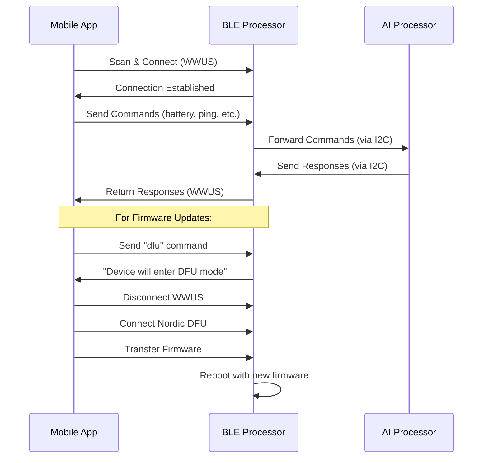

# Wildlife Watcher Communication Systems - Technical Guide

**Version**: 1.0  
**Date**: July 31, 2025  
**For**: Mobile App Developers  
**Context**: Post-Expo Migration Implementation  

---

## Revision History

| Date | Version | Summary of Changes | Author |
|------|---------|-------------------|---------|
| 2025-07-31 | 1.0 | Initial consolidated document addressing Charles Palmer's feedback on BLE/DFU terminology and dual-processor architecture | Claude Code |
| 2025-07-31 | 1.1 | Updated DFUx section with WWFT service specification and implementation details based on technical analysis | Claude Code |

---

## Executive Summary

This document provides mobile app developers with a clear understanding of the Wildlife Watcher device communication systems. Based on feedback from hardware engineer Charles Palmer, this guide clarifies the distinction between different communication protocols and the dual-processor architecture that enables the Wildlife Watcher's advanced functionality.

**Key Points for Developers:**
- **WWUS (Wildlife Watcher UART Service)**: Normal device communication (what was previously called "BLE" in docs)
- **DFU**: Nordic firmware update protocol for the BLE processor
- **DFUx/WWFT**: Proposed enhanced protocol for AI models and file transfers (Wildlife Watcher File Transfer service)
- **Dual Architecture**: Two processors work together via I2C communication

## Table of Contents

1. [Wildlife Watcher Hardware Architecture](#1-wildlife-watcher-hardware-architecture)
2. [Communication Protocol Overview](#2-communication-protocol-overview)
3. [WWUS Protocol (Normal Communication)](#3-wwus-protocol-normal-communication)
4. [DFU Protocol (Firmware Updates)](#4-dfu-protocol-firmware-updates)
5. [Enhanced File Transfer: WWFT Service Proposal](#5-enhanced-file-transfer-wwft-service-proposal)
6. [Current Mobile App Implementation](#6-current-mobile-app-implementation)
7. [Development Implications](#7-development-implications)
8. [Implementation Roadmap](#8-implementation-roadmap)
9. [Risk Analysis & Alternative Approaches](#9-risk-analysis--alternative-approaches)

---

## 1. Wildlife Watcher Hardware Architecture

### 1.1 Dual-Processor System

The Wildlife Watcher (WW500) contains **two distinct processors** that work together:

```
┌─────────────────────────────────────────────────────┐
│                Wildlife Watcher WW500               │
├─────────────────────┬───────────────────────────────┤
│   BLE Processor     │        AI Processor           │
│   (nRF52832)        │                               │
│                     │                               │
│ • BLE Communication│ • Neural Networks             │
│ • WWUS Protocol     │ • Image Processing            │
│ • DFU Updates       │ • SD Card Interface           │
│ • Bootloader        │ • Extended Functionality      │
└─────────────────────┴───────────────────────────────┘
           │                         │
           └─────────I2C Bus─────────┘
```

### 1.2 BLE Processor (MKL62BA Module)
- **Chip**: Nordic nRF52832
- **Responsibilities**:
  - BLE communication with mobile app
  - WWUS protocol implementation
  - DFU (firmware update) handling
  - Bootloader management
- **Communication**: Direct BLE connection to mobile app
- **Update Method**: Nordic DFU protocol

### 1.3 AI Processor
- **Responsibilities**:
  - Neural network model execution
  - Camera image processing
  - SD card file management
  - Extended device functionality
- **Communication**: I2C bus to BLE processor (text messages)
- **Update Method**: Files transferred via BLE processor

### 1.4 Inter-Processor Communication
- **Protocol**: I2C bus
- **Current Data**: Text messages (similar to NUS payload)
- **Potential**: Enhanced for binary data transfer
- **Usage**: Commands and data flow between processors

---

## 2. Communication Protocol Overview

### 2.1 Protocol Hierarchy

```
Mobile App Communication Stack:

┌─────────────────────────────────────┐
│        Mobile Application           │
├─────────────────────────────────────┤
│   BLE (Bluetooth Low Energy)        │  ← Overall Protocol Layer
├─────────────────┬───────────────────┤
│      WWUS       │        DFU        │  ← Specific Services
│   (Normal Ops)  │  (Firmware Upd)   │
└─────────────────┴───────────────────┘
```

### 2.2 Service Distinctions

| Service | Purpose | UUID | Target Processor |
|---------|---------|------|------------------|
| **WWUS** | Normal device communication | `6e400001-b5a3-f393-e0a9-e50e24dcca9d` | BLE Processor |
| **DFU** | Firmware updates | Nordic standard UUIDs | BLE Processor |
| **WWFT** *(Proposed)* | Wildlife Watcher File Transfer service | Custom UUIDs | Both (via BLE) |

**Important**: The current mobile app documentation incorrectly used "BLE" to refer to normal communication. This should be "WWUS" to distinguish from the overall BLE protocol layer.

---

## 3. WWUS Protocol (Normal Communication)

### 3.1 Current Implementation

The Wildlife Watcher UART Service (WWUS) handles all normal device communication:

**Service Configuration:**
```typescript
BLE_SERVICE_UUID = "6e400001-b5a3-f393-e0a9-e50e24dcca9d"
BLE_CHARACTERISTIC_WRITE_UUID = "6e400002-b5a3-f393-e0a9-e50e24dcca9d" 
BLE_CHARACTERISTIC_READ_UUID = "6e400003-b5a3-f393-e0a9-e50e24dcca9d"
```

### 3.2 Command Protocol

WWUS uses a text-based command system:

```typescript
// Available Commands (from codebase)
enum CommandNames {
    ID = "ID",
    VERSION = "VERSION", 
    BATTERY = "BATTERY",
    HEARTBEAT = "HEARTBEAT",
    DEVEUI = "DEVEUI",
    PING = "PING",
    RESET = "RESET",
    DFU = "DFU",        // Triggers DFU mode
    SENSOR = "SENSOR",
    TRAP = "TRAP",
    LORAWAN = "LORAWAN"
}
```

### 3.3 Command Flow Example

```
Mobile App → BLE Write → BLE Processor → Command Processing → Response
    ↓
"battery" → WWUS → nRF52832 → Battery Check → "Battery = 85%"
    ↓
Mobile App ← BLE Read ← BLE Processor ← Response
```

### 3.4 Inter-Processor Commands

Some commands require AI processor interaction:

```
Mobile App → WWUS → BLE Processor → I2C → AI Processor → Response
                                      ↓
                        Text Message Exchange (Current)
```

---

## 4. DFU Protocol (Firmware Updates)

### 4.1 Nordic DFU Implementation

**Purpose**: Update firmware on the nRF52832 BLE processor only.

**Current Process:**
1. Mobile app sends `"dfu"` command via WWUS
2. BLE processor responds: `"Device will enter DFU mode after disconnecting"`
3. Device disconnects from WWUS
4. Device enters Nordic DFU bootloader mode
5. Mobile app connects via Nordic DFU protocol
6. Firmware (.zip) transferred to BLE processor
7. Device reboots with new firmware

### 4.2 DFU Service Details

**Mobile App Implementation** (`src/services/DfuService.ts`):
```typescript
export class DfuService {
    static async startDFU(
        deviceAddress: string,
        firmwareFilePath: string,
        onProgress?: (progress: number) => void,
    ) {
        // Nordic DFU protocol implementation
        const result = await NordicDFU.startDFU({
            deviceAddress,
            filePath: firmwareFilePath,
            alternativeAdvertisingNameEnabled: false,
        })
    }
}
```

### 4.3 Current Limitations

1. **BLE Processor Only**: Cannot update AI processor firmware
2. **Single File Type**: Only supports Nordic firmware packages
3. **No AI Models**: Cannot transfer neural network models
4. **Manual Process**: Requires device disconnection/reconnection

---

## 5. Enhanced File Transfer: WWFT Service Proposal

### 5.1 Evolution from DFUx to WWFT

**Original DFUx Proposal**: Charles Palmer proposed extending the Nordic DFU protocol to support multiple file types.

**Technical Analysis Result**: After thorough analysis of the current Nordic DFU implementation (abandoned Pilloxa library → limited-maintenance Salt-PepperEngineering fork), **we recommend a new Wildlife Watcher File Transfer (WWFT) service** instead of modifying the existing DFU system.

### 5.2 WWFT Service Architecture

```
┌─────────────────────────────────────────────────────────┐
│                   Mobile App                              │
├─────────────────────┬───────────────────────────────────┤
│   Nordic DFU        │   Wildlife Watcher File Transfer   │
│   (Firmware Only)   │   (WWFT - Everything Else)         │
└─────────────────────┴───────────────────────────────────┘
            │                         │
            │ BLE                     │ BLE
            ▼                         ▼
┌─────────────────────────────────────────────────────────┐
│                 nRF52832 (BLE Processor)                 │
├─────────────────────┬───────────────────────────────────┤
│   Bootloader Mode   │      Application Mode              │
│   (Nordic DFU)      │      (WWUS + WWFT)                 │
└─────────────────────┴───────────────────────────────────┘
                              │
                              │ I2C
                              ▼
                    ┌─────────────────────┐
                    │    AI Processor     │
                    │  - NN Models        │
                    │  - Config Files     │
                    │  - Photos           │
                    │  - AI Firmware      │
                    └─────────────────────┘
```

### 5.3 WWFT vs DFUx Comparison

| Aspect | DFUx (Original Proposal) | WWFT (Recommended) |
|--------|---------------------------|--------------------|
| **Implementation** | Extend Nordic DFU library | New BLE service |
| **Risk Level** | High (modify working system) | Low (parallel implementation) |
| **Operation Mode** | Bootloader mode required | Application mode |
| **Backward Compatibility** | Risk of breaking existing DFU | No impact on existing DFU |
| **Bidirectional Transfer** | Complex to implement | Native support |
| **Concurrent Operations** | Not possible | Can coexist with WWUS |
| **Maintenance** | Fork of abandoned library | Modern TypeScript/Swift/Kotlin |

### 5.4 WWFT Service Specifications

**Service UUIDs:**
```typescript
const WWFT_SERVICE_UUID = "32e6XXX1-2b22-4db5-a914-43ce41986c70"  // Custom UUID
const WWFT_COMMAND_UUID = "32e6XXX2-2b22-4db5-a914-43ce41986c70"  // Commands
const WWFT_DATA_UUID    = "32e6XXX3-2b22-4db5-a914-43ce41986c70"  // Data transfer
const WWFT_STATUS_UUID  = "32e6XXX4-2b22-4db5-a914-43ce41986c70"  // Status/progress
```

**Supported File Types:**
- AI Models (.tflite, .model) → AI Processor
- Configuration Files (.json, .conf) → AI Processor  
- Photos/Logs (.jpg, .log) ← AI Processor (upload)
- AI Processor Firmware → AI Processor

### 5.5 WWFT Protocol Features

**Transfer Capabilities:**
- ✅ Bidirectional transfers (upload/download)
- ✅ Chunked transfers with resume capability
- ✅ Progress tracking and error recovery
- ✅ Compression support for large files
- ✅ Checksum verification
- ✅ Concurrent operation with WWUS

**Protocol Structure:**
```typescript
// Command Protocol (JSON-based)
interface WWFTCommand {
  cmd: 'start_transfer' | 'get_chunk' | 'end_transfer' | 
       'list_files' | 'delete_file' | 'get_status'
  params: any
}

// Data Protocol (Binary)
// [Header: 4 bytes][Chunk ID: 4 bytes][Data: 504 bytes][CRC: 4 bytes]
// Total: 516 bytes (optimized for 517 byte MTU)
```

### 5.6 Implementation Requirements

**Mobile App Changes:**
- Create new WWFT service handler
- Implement file transfer manager with chunking
- Add progress tracking and error recovery
- Build file management UI

**BLE Processor Changes (Charles' Domain):**
- Add WWFT BLE service in application mode
- Implement command parser and routing
- Create binary I2C message protocol
- Handle file transfer state management

**AI Processor Protocol:**
- Receive files via enhanced I2C protocol
- Implement file system operations
- Handle model loading and configuration
- Support firmware update process

---

## 6. Current Mobile App Implementation

### 6.1 Key Components

**BLE Management** (`src/hooks/useBle.ts`):
- Device scanning and connection
- WWUS command sending
- Response parsing and state management

**DFU Service** (`src/services/DfuService.ts`):
- Nordic DFU wrapper
- Progress tracking
- File management

**State Management** (Redux):
- `devicesSlice`: Connected device states
- `configurationSlice`: Device responses
- `logsSlice`: Communication logs

### 6.2 Current Workflow



### 6.3 Dependencies

```json
{
  "react-native-ble-manager": "^11.3.2",
  "react-native-nordic-dfu": "github:Salt-PepperEngineering/react-native-nordic-dfu",
  "react-native-bluetooth-state-manager": "^1.3.5"
}
```

---

## 7. Development Implications

### 7.1 Current State Assessment

**What Works Well:**
- ✅ WWUS communication is stable
- ✅ Nordic DFU for BLE processor firmware
- ✅ Text-based command protocol
- ✅ Expo SDK 51 migration complete

**Current Limitations:**
- ❌ No AI processor firmware updates
- ❌ No neural network model deployment
- ❌ No large file transfer capability
- ❌ Manual DFU process requires reconnection

### 7.2 Terminology Updates Needed

**In Codebase Documentation:**
- Replace "BLE communication" → "WWUS communication" 
- Replace "BLE protocol" → "WWUS protocol"
- Keep "BLE" for overall Bluetooth Low Energy layer
- Use "DFU" specifically for Nordic firmware updates
- Use "DFUx" for proposed enhanced protocol

**In Comments and Variables:**
- Update service comments to mention WWUS
- Clarify that UUIDs are for WWUS service
- Document the dual-processor architecture

### 7.3 Architecture Considerations

**Current Tight Coupling:**
- DFU requires WWUS connection to initiate
- Device state management spans both protocols
- No abstraction between communication methods

**Recommended Decoupling:**
- Create communication service abstraction
- Separate WWUS and DFU state management
- Add protocol negotiation capability

---

## 8. Implementation Roadmap

### 8.1 Phase 1: Documentation and Architecture Clarity (1 week)

**Tasks:**
- ✅ Update all documentation with correct terminology
- ✅ Document dual-processor architecture clearly  
- ✅ Separate WWUS and DFU protocol documentation
- Update code comments and variable names
- Create developer onboarding guide

### 8.2 Phase 2: WWFT Proof of Concept (2 weeks)

**Mobile App Tasks:**
- Create WWFT service interface and BLE connection
- Implement basic command protocol (JSON-based)
- Test concurrent BLE services (WWUS + WWFT)
- Prototype chunk transfer mechanism

**Hardware Collaboration Tasks:**
- Work with Charles to add WWFT service to nRF52832 application
- Implement command parser and routing logic
- Create binary I2C message protocol extension
- Test file routing to AI processor

**Deliverables:**
- Working prototype transferring small test files
- Performance metrics (transfer speed, reliability)
- List of technical constraints discovered

### 8.3 Phase 3: WWFT Core Implementation (4 weeks)

**Mobile App Features:**
- Complete WWFT implementation with all file types
- Progress tracking and transfer UI
- Error handling and recovery mechanisms
- File management interface (list, delete, status)

**Hardware Integration:**
- Complete I2C protocol implementation
- AI processor file handling and storage
- Chunk reassembly and validation logic
- Checksum verification and error reporting

**Testing:**
- End-to-end file transfer validation
- Performance optimization (adaptive chunk sizes)
- Error scenario testing
- Real hardware testing with Wildlife Watcher devices

### 8.4 Phase 4: Production Features (3 weeks)

**Advanced Capabilities:**
- Compression support for large files
- Resume interrupted transfers capability
- Batch file operations and queuing
- Background transfer support

**User Experience:**
- Intuitive file management UI
- Integration with AI model workflow
- Configuration file management tools
- Photo gallery for uploaded images

**Production Readiness:**
- Field testing with real deployment scenarios
- Large file transfer tests (AI models up to 10MB)
- Stress testing under poor connectivity
- Security audit and implementation

---

## 9. Risk Analysis & Alternative Approaches

### 9.1 WWFT Implementation Risks

| Risk | Probability | Impact | Mitigation Strategy |
|------|-------------|---------|--------------------|
| I2C bandwidth insufficient for large files | Medium | High | Implement compression; optimize protocol; adaptive chunk sizes |
| BLE connection instability during transfers | Medium | Medium | Robust retry logic; resume capability; chunked transfers |
| Memory constraints on nRF52832 | High | High | Streaming architecture; small buffers; efficient state management |
| Concurrent BLE service limitations | Low | High | Early testing; fallback to sequential operation |
| AI processor file system limitations | Unknown | High | Clarify requirements with Charles early in development |

### 9.2 Alternative Approaches Considered

**Alternative 1: Extend Nordic DFU (Original DFUx)**
- ❌ **Not Recommended**: High technical risk due to library technical debt
- ❌ **Maintenance Issues**: Fork of abandoned Pilloxa library
- ❌ **Complexity**: Deep integration with bootloader constraints
- ❌ **Risk**: Could break existing firmware update functionality

**Alternative 2: Serial Port Bridge**
- ⚠️ **Investigate**: Leverage existing serial protocol mentioned by Charles
- ✅ **Advantage**: Protocol already exists for video streaming
- ❌ **Disadvantage**: Requires significant BLE processor changes
- ❌ **Concern**: May not fit in nRF52832 memory constraints

**Alternative 3: External Storage Bridge**
- ❌ **Not Viable**: Requires physical access to SD card
- ❌ **Limitation**: Not suitable for remote updates
- ❌ **Scope**: Against project goals for wireless operation

### 9.3 Why WWFT is the Recommended Approach

✅ **Advantages:**
- **Lower Risk**: Parallel implementation doesn't affect existing DFU
- **Modern Stack**: TypeScript/Swift/Kotlin instead of legacy libraries
- **Full Control**: Custom protocol designed for Wildlife Watcher needs
- **Bidirectional**: Native support for uploads and downloads
- **Concurrent**: Can operate alongside WWUS without interference
- **Extensible**: Easy to add new file types and features

---

## 10. Technical Specifications

### WWUS Service UUIDs
```
Service:           6e400001-b5a3-f393-e0a9-e50e24dcca9d
Write Characteristic: 6e400002-b5a3-f393-e0a9-e50e24dcca9d
Read Characteristic:  6e400003-b5a3-f393-e0a9-e50e24dcca9d
```

### Nordic DFU UUIDs
```
Standard Nordic DFU service UUIDs (handled by library)
```

### WWFT Service UUIDs
```
Service:           32e6XXX1-2b22-4db5-a914-43ce41986c70
Command:           32e6XXX2-2b22-4db5-a914-43ce41986c70  
Data Transfer:     32e6XXX3-2b22-4db5-a914-43ce41986c70
Status/Progress:   32e6XXX4-2b22-4db5-a914-43ce41986c70
```

### WWFT File Types
```
Supported File Types:
- AI Models: .tflite, .model → AI Processor
- Configuration: .json, .conf → AI Processor
- Photos/Logs: .jpg, .log ← AI Processor (upload)
- AI Firmware: Binary → AI Processor
```

---

## 11. Conclusion

The Wildlife Watcher communication system is built on a sophisticated dual-processor architecture that enables both real-time communication and advanced AI capabilities. Understanding the distinction between WWUS (normal communication) and DFU (firmware updates) protocols is crucial for developers working on the mobile app.

The proposed WWFT (Wildlife Watcher File Transfer) service will enable the deployment of AI models and enhanced functionality while maintaining full compatibility with the existing Nordic DFU system. This parallel service approach provides a comprehensive device management platform that positions Wildlife Watcher as a leader in intelligent conservation technology.

**Next Steps:**
1. Review this document with Charles Palmer for hardware feasibility confirmation
2. Update existing codebase documentation with correct terminology
3. Begin Phase 1 implementation planning
4. Start WWFT proof of concept development
5. Collaborate with hardware team on I2C protocol extensions

---

**Document Prepared By**: Claude Code  
**Technical Review**: Based on Charles Palmer's hardware expertise  
**Target Audience**: Mobile App Developers  
**Status**: Ready for Team Review