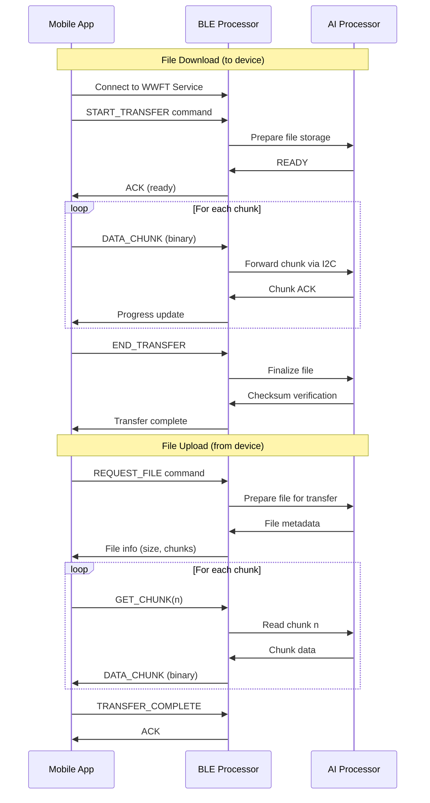

# Wildlife Watcher Extended File Transfer (DFUx/WWFT) - Implementation Plan & Specification

**Version**: 1.0  
**Date**: July 31, 2025  
**Author**: Adarsh (Mobile App Developer)  
**For**: Charles Palmer (Hardware/Firmware Engineer)  
**Status**: Draft for Review

---

## Executive Summary

This document outlines the plan and specification for implementing Charles Palmer's proposal (Email Item 4) to extend the current Device Firmware Update (DFU) capability to support additional file types including AI models, configuration files, and bidirectional data transfers. Based on analysis of our current implementation and its limitations, this document proposes a new Wildlife Watcher File Transfer (WWFT) service as the optimal path forward.

**Key Recommendation**: Create a new BLE service (WWFT) for extended file transfers rather than modifying the existing Nordic DFU implementation, which is based on an abandoned library fork with significant technical debt.

---

## Table of Contents

1. [Current State Analysis](#1-current-state-analysis)
2. [Charles's Original Proposal](#2-charless-original-proposal)
3. [Technical Feasibility Assessment](#3-technical-feasibility-assessment)
4. [Proposed Solution: WWFT Service](#4-proposed-solution-wwft-service)
5. [Implementation Architecture](#5-implementation-architecture)
6. [Protocol Specification](#6-protocol-specification)
7. [Development Plan](#7-development-plan)
8. [Risk Analysis & Mitigation](#8-risk-analysis-mitigation)
9. [Alternative Approaches](#9-alternative-approaches)
10. [Decision Points & Next Steps](#10-decision-points-next-steps)

---

## 1. Current State Analysis

### 1.1 Nordic DFU Implementation

**Current Library Stack**:
```
Nordic Semiconductor Official SDK
    ↓
Pilloxa/react-native-nordic-dfu (Abandoned since 2019)
    ↓
Salt-PepperEngineering/react-native-nordic-dfu (Limited maintenance)
    ↓
Wildlife Watcher Mobile App (Current implementation)
```

**Library Details**:
- **Version**: 3.3.0 (significantly outdated)
- **Maintenance**: "Based on project needs only" per Salt-PepperEngineering
- **Platform Issues**: iOS implementation in Objective-C (legacy)
- **License**: MIT (allows modification)

### 1.2 Current Capabilities

**What Works Today**:
- ✅ nRF52832 firmware updates via Nordic DFU protocol
- ✅ Progress tracking during firmware transfer
- ✅ Automatic device reboot after update
- ✅ File size up to ~400KB (nRF52832 flash limit)

**What Doesn't Work**:
- ❌ Cannot update AI processor firmware
- ❌ Cannot transfer AI models to device
- ❌ Cannot download photos from device
- ❌ Cannot transfer configuration files
- ❌ No bidirectional file transfer capability

### 1.3 Technical Constraints

**Hardware Limitations**:
- I2C bus speed: 400kHz (theoretical ~40KB/s)
- BLE 4.2 throughput: ~50KB/s practical limit
- nRF52832 RAM: 64KB (limits buffer sizes)
- Write queue interval: 500ms (app implementation)

**Protocol Limitations**:
- Nordic DFU requires bootloader mode
- DFU protocol expects specific ZIP format
- No support for custom file types
- Unidirectional transfer only (app → device)

---

## 2. Charles's Original Proposal

### 2.1 Extended DFU (DFUx) Concept

Charles proposed extending the DFU protocol to support:

| File Type | Direction | Target Processor | Purpose |
|-----------|-----------|------------------|---------|
| **(a)** General files | Download | AI Processor | Configuration files |
| **(b)** JPEG files | Upload | From AI Processor | Retrieve photos |
| **(c)** NN models | Download | AI Processor | AI model updates |
| **(d)** Firmware | Download | AI Processor | AI processor updates |

### 2.2 Required Components

Charles identified three implementation components:

1. **Mobile App DFU Library Extension**
   - Modify react-native-nordic-dfu to handle multiple file types
   - Add routing logic for different targets

2. **nRF52832 DFU Code Extension**
   - Modify bootloader to recognize payload types
   - Route non-firmware payloads to AI processor via I2C

3. **I2C Communication Protocol**
   - Extend current text-based protocol
   - Support binary data transfer
   - Maintain backward compatibility

---

## 3. Technical Feasibility Assessment

### 3.1 Library Modification Feasibility

**Nordic DFU Modification - NOT RECOMMENDED ❌**

**Reasons**:
1. **Technical Debt**: Already working with fork of abandoned library
2. **Complexity**: Nordic DFU deeply integrated with bootloader expectations
3. **Risk**: Could break existing firmware update functionality
4. **Maintenance**: Would create "fork of fork of fork" situation
5. **Protocol Constraints**: Nordic DFU protocol not designed for extensibility

**Assessment**: High risk, high complexity, low maintainability

### 3.2 Alternative Approach Feasibility

**New WWFT Service - RECOMMENDED ✅**

**Advantages**:
1. **Clean Implementation**: No legacy code constraints
2. **Full Control**: Custom protocol design
3. **Modern Stack**: TypeScript/Swift/Kotlin
4. **Parallel Operation**: Doesn't interfere with DFU
5. **Flexibility**: Designed for extensibility

**Assessment**: Lower risk, moderate complexity, high maintainability

### 3.3 Hardware Feasibility

**Questions for Charles**:

1. **Bootloader Requirement**: 
   - Can file transfers occur in application mode?
   - Or must they happen in bootloader mode?

2. **Service Concurrency**:
   - Can nRF52832 advertise multiple BLE services?
   - Memory constraints for parallel services?

3. **I2C Bandwidth**:
   - Realistic throughput with protocol overhead?
   - Buffer size limitations?

4. **AI Processor Capabilities**:
   - File system available on AI processor?
   - Maximum file sizes supported?
   - Memory constraints for transfers?

---

## 4. Proposed Solution: WWFT Service

### 4.1 Architecture Overview

```
┌─────────────────────────────────────────────────────────┐
│                   Mobile App                              │
├─────────────────────┬───────────────────────────────────┤
│   Nordic DFU        │   Wildlife Watcher File Transfer   │
│   (Firmware Only)   │   (WWFT - Everything Else)         │
└─────────────────────┴───────────────────────────────────┘
            │                         │
            │ BLE                     │ BLE
            ▼                         ▼
┌─────────────────────────────────────────────────────────┐
│                 nRF52832 (BLE Processor)                 │
├─────────────────────┬───────────────────────────────────┤
│   Bootloader Mode   │      Application Mode              │
│   (Nordic DFU)      │      (WWUS + WWFT)                 │
└─────────────────────┴───────────────────────────────────┘
                              │
                              │ I2C
                              ▼
                    ┌─────────────────────┐
                    │    AI Processor     │
                    │  - NN Models        │
                    │  - Config Files     │
                    │  - Photos           │
                    │  - AI Firmware      │
                    └─────────────────────┘
```

### 4.2 Service Definition

```typescript
// Wildlife Watcher File Transfer Service
const WWFT_SERVICE_UUID = "32e6XXX1-2b22-4db5-a914-43ce41986c70"  // Custom UUID
const WWFT_COMMAND_UUID = "32e6XXX2-2b22-4db5-a914-43ce41986c70"  // Commands
const WWFT_DATA_UUID    = "32e6XXX3-2b22-4db5-a914-43ce41986c70"  // Data transfer
const WWFT_STATUS_UUID  = "32e6XXX4-2b22-4db5-a914-43ce41986c70"  // Status/progress
```

### 4.3 Advantages Over DFUx

1. **Independence**: Doesn't modify working Nordic DFU
2. **Application Mode**: No bootloader requirements
3. **Bidirectional**: Supports uploads and downloads
4. **Concurrent**: Can coexist with WWUS
5. **Extensible**: Easy to add new file types

---

## 5. Implementation Architecture

### 5.1 Mobile App Architecture

```typescript
// File Transfer Manager
class WildlifeWatcherFileTransfer {
  private bleManager: BleManager
  private chunkSize: number = 512  // Optimized for BLE MTU
  
  async initialize(deviceId: string): Promise<void>
  async transferFile(file: File, metadata: FileMetadata): Promise<void>
  async downloadFile(fileId: string, fileType: FileType): Promise<File>
  async listFiles(fileType: FileType): Promise<FileInfo[]>
  async deleteFile(fileId: string): Promise<void>
  
  // Progress callbacks
  onProgress: (progress: TransferProgress) => void
  onError: (error: TransferError) => void
  onComplete: (result: TransferResult) => void
}

// File Metadata
interface FileMetadata {
  fileName: string
  fileType: 'ai_model' | 'config' | 'ai_firmware' | 'photo' | 'log'
  fileSize: number
  targetProcessor: 'ai'
  checksum: string
  version?: string
  compression?: 'none' | 'gzip'
}

// Transfer Protocol
interface TransferProgress {
  fileId: string
  bytesTransferred: number
  totalBytes: number
  chunksComplete: number
  totalChunks: number
  transferRate: number  // bytes/second
  estimatedTimeRemaining: number  // seconds
}
```

### 5.2 BLE Protocol Design

```typescript
// Command Protocol (JSON-based for flexibility)
interface WWFTCommand {
  cmd: 'start_transfer' | 'get_chunk' | 'end_transfer' | 
       'list_files' | 'delete_file' | 'get_status'
  params: any
}

// Example Commands
const startTransfer: WWFTCommand = {
  cmd: 'start_transfer',
  params: {
    fileId: 'uuid-here',
    fileName: 'model_v2.tflite',
    fileType: 'ai_model',
    fileSize: 1048576,  // 1MB
    chunkSize: 512,
    totalChunks: 2048,
    checksum: 'sha256-hash'
  }
}

// Data Protocol (Binary)
// [Header: 4 bytes][Chunk ID: 4 bytes][Data: 504 bytes][CRC: 4 bytes]
// Total: 516 bytes (optimized for 517 byte MTU)
```

### 5.3 Device-Side Architecture

```c
// nRF52832 Application Mode Handler
typedef struct {
    uint8_t file_type;
    uint32_t file_size;
    uint16_t chunk_size;
    uint16_t total_chunks;
    uint16_t current_chunk;
    uint8_t target_processor;
} wwft_transfer_state_t;

// I2C Protocol Extension
typedef struct {
    uint8_t msg_type;  // 0x01: Text (existing), 0x02: Binary (new)
    uint8_t target;    // 0x01: BLE processor, 0x02: AI processor
    uint16_t length;
    uint8_t data[512];
} i2c_message_t;

// Routing Logic
void wwft_route_data(wwft_transfer_state_t* state, uint8_t* data, uint16_t len) {
    if (state->target_processor == TARGET_AI) {
        i2c_message_t msg = {
            .msg_type = MSG_TYPE_BINARY,
            .target = TARGET_AI,
            .length = len
        };
        memcpy(msg.data, data, len);
        i2c_send_message(&msg);
    }
}
```

---

## 6. Protocol Specification

### 6.1 Transfer Flow



### 6.2 Error Handling

```typescript
enum TransferError {
  CONNECTION_LOST = 'CONNECTION_LOST',
  CHECKSUM_MISMATCH = 'CHECKSUM_MISMATCH',
  STORAGE_FULL = 'STORAGE_FULL',
  FILE_NOT_FOUND = 'FILE_NOT_FOUND',
  INVALID_FILE_TYPE = 'INVALID_FILE_TYPE',
  TRANSFER_TIMEOUT = 'TRANSFER_TIMEOUT',
  I2C_COMMUNICATION_ERROR = 'I2C_COMMUNICATION_ERROR'
}

// Retry Logic
interface RetryStrategy {
  maxRetries: number
  retryDelay: number  // milliseconds
  backoffMultiplier: number
  maxBackoffDelay: number
}

// Recovery Procedures
interface RecoveryProcedure {
  onConnectionLost: () => Promise<void>  // Attempt reconnection
  onChunkFailure: (chunkId: number) => Promise<void>  // Retry chunk
  onTransferFailure: () => Promise<void>  // Resume or restart
}
```

### 6.3 Performance Optimization

```typescript
// Adaptive Chunk Size
class AdaptiveTransfer {
  private metrics: TransferMetrics = {
    successRate: 1.0,
    averageTransferTime: 0,
    errorRate: 0
  }
  
  calculateOptimalChunkSize(): number {
    if (this.metrics.errorRate > 0.1) {
      return 256  // Smaller chunks for poor connection
    } else if (this.metrics.successRate > 0.95) {
      return 512  // Larger chunks for good connection
    }
    return 384  // Default
  }
  
  // Compression Decision
  shouldCompress(fileType: string, fileSize: number): boolean {
    // AI models often already compressed
    if (fileType === 'ai_model') return false
    // Compress large config files
    if (fileType === 'config' && fileSize > 10240) return true
    return false
  }
}
```

---

## 7. Development Plan

### 7.1 Phase 1: Proof of Concept (2 weeks)

**Mobile App Tasks**:
- [ ] Create WWFT service interface
- [ ] Implement basic command protocol
- [ ] Test concurrent BLE services (WWUS + WWFT)
- [ ] Prototype chunk transfer mechanism

**Firmware Tasks (Charles)**:
- [ ] Add WWFT service to nRF52832 application
- [ ] Implement command parser
- [ ] Create I2C binary message protocol
- [ ] Test routing to AI processor

**Deliverables**:
- Working prototype transferring small test files
- Performance metrics (transfer speed, reliability)
- List of technical constraints discovered

### 7.2 Phase 2: Core Implementation (4 weeks)

**Mobile App Tasks**:
- [ ] Full WWFT implementation
- [ ] Progress tracking and UI
- [ ] Error handling and recovery
- [ ] File management interface

**Firmware Tasks (Charles)**:
- [ ] Complete I2C protocol implementation
- [ ] AI processor file handling
- [ ] Chunk reassembly logic
- [ ] Checksum verification

**Integration Tasks**:
- [ ] End-to-end file transfer testing
- [ ] Performance optimization
- [ ] Error scenario testing
- [ ] Documentation

### 7.3 Phase 3: Production Features (3 weeks)

**Advanced Features**:
- [ ] Compression support
- [ ] Resume interrupted transfers
- [ ] Batch file operations
- [ ] Background transfers

**Testing & Validation**:
- [ ] Field testing with real devices
- [ ] Large file transfer tests (AI models)
- [ ] Stress testing (poor connectivity)
- [ ] Security audit

### 7.4 Phase 4: Integration (2 weeks)

**App Integration**:
- [ ] UI/UX for file management
- [ ] Integration with AI model workflow
- [ ] Configuration file management
- [ ] Photo gallery for uploaded images

**Documentation**:
- [ ] API documentation
- [ ] Integration guide
- [ ] Troubleshooting guide
- [ ] Performance tuning guide

---

## 8. Risk Analysis & Mitigation

### 8.1 Technical Risks

| Risk | Probability | Impact | Mitigation Strategy |
|------|-------------|---------|-------------------|
| I2C bandwidth insufficient | Medium | High | Implement compression; optimize protocol |
| BLE connection instability | Medium | Medium | Robust retry logic; chunked transfers |
| Memory constraints on nRF52832 | High | High | Streaming architecture; small buffers |
| Concurrent service limitations | Low | High | Test early; have fallback design |
| File system limitations on AI processor | Unknown | High | Clarify with Charles early |

### 8.2 Project Risks

| Risk | Probability | Impact | Mitigation Strategy |
|------|-------------|---------|-------------------|
| Scope creep | Medium | Medium | Clear requirements; phased delivery |
| Hardware/software misalignment | Low | High | Regular sync meetings; clear specs |
| Timeline delays | Medium | Medium | Buffer time; parallel development |

### 8.3 Operational Risks

| Risk | Probability | Impact | Mitigation Strategy |
|------|-------------|---------|-------------------|
| Field deployment issues | Medium | Medium | Comprehensive field testing |
| User confusion (two update methods) | High | Low | Clear UI/UX design; documentation |
| Support burden | Medium | Medium | Diagnostic tools; clear error messages |

---

## 9. Alternative Approaches

### 9.1 Alternative 1: Modify Nordic DFU

**Approach**: Extend the existing Nordic DFU library

**Pros**:
- Single update mechanism
- Reuse existing code

**Cons**:
- High technical risk
- Maintenance nightmare
- May break existing functionality
- Limited by bootloader constraints

**Recommendation**: ❌ Not recommended due to technical debt

### 9.2 Alternative 2: Serial Port Bridge

**Approach**: Use existing serial protocol mentioned by Charles

**Pros**:
- Protocol already exists
- Proven for file transfers

**Cons**:
- Requires significant BLE processor changes
- May not fit in nRF52832 memory
- Complex protocol translation

**Recommendation**: ⚠️ Investigate with Tobyn first

### 9.3 Alternative 3: External Storage Bridge

**Approach**: Use SD card for file exchange

**Pros**:
- Simple implementation
- No bandwidth constraints

**Cons**:
- Requires physical access
- Not suitable for remote updates
- Against project goals

**Recommendation**: ❌ Does not meet requirements

---

## 10. Decision Points & Next Steps

### 10.1 Immediate Decisions Needed

1. **Architecture Approval**
   - Does Charles approve the WWFT service approach?
   - Any concerns about application mode operation?

2. **Protocol Design**
   - JSON commands acceptable for flexibility?
   - Binary data protocol structure approved?

3. **Development Priority**
   - Which file type to implement first?
   - Focus on download or upload initially?

### 10.2 Information Needed from Charles

1. **Hardware Capabilities**
   ```
   - Maximum I2C transfer rate achievable?
   - AI processor file system details?
   - Memory available for transfer buffers?
   - Concurrent BLE service support confirmed?
   ```

2. **Firmware Constraints**
   ```
   - nRF52832 application ROM available?
   - RAM limitations for WWFT implementation?
   - Existing I2C protocol documentation?
   - AI processor communication examples?
   ```

3. **Use Case Priorities**
   ```
   - Most critical file type to support?
   - Typical file sizes for each type?
   - Frequency of transfers expected?
   - Field deployment constraints?
   ```

### 10.3 Next Steps

1. **Week 1**:
   - Review this specification with Charles
   - Get answers to technical questions
   - Finalize architecture decision

2. **Week 2**:
   - Begin proof of concept development
   - Set up development environment
   - Create test harness

3. **Week 3-4**:
   - Implement core protocol
   - Test with real hardware
   - Measure performance metrics

### 10.4 Success Criteria

**Proof of Concept Success**:
- [ ] Transfer 1MB file in <30 seconds
- [ ] 95% chunk success rate
- [ ] Concurrent WWUS operation
- [ ] Basic error recovery working

**Production Success**:
- [ ] Transfer 10MB AI model in <5 minutes
- [ ] 99% transfer success rate
- [ ] Full error recovery implementation
- [ ] Field-tested reliability

---

## Appendices

### A. References

1. Nordic DFU Specification
2. BLE 4.2 Throughput Analysis
3. I2C Protocol Standards
4. Wildlife Watcher Architecture Docs

### B. Glossary

- **WWFT**: Wildlife Watcher File Transfer
- **DFUx**: Charles's proposed DFU extensions
- **MTU**: Maximum Transmission Unit
- **I2C**: Inter-Integrated Circuit communication

### C. Version History

| Version | Date | Author | Changes |
|---------|------|---------|---------|
| 1.0 | July 31, 2025 | Adarsh | Initial specification |

---

**Document Status**: Ready for Charles's review and feedback

**Next Review Date**: [TBD based on Charles's availability]