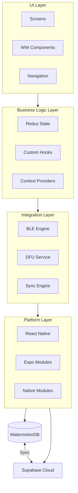
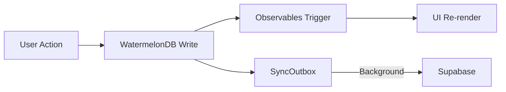

# Getting Started with Wildlife Watcher Mobile App

## Welcome! 👋

You're joining the development team for the **Wildlife Watcher Mobile App** — a React Native application that helps conservation researchers deploy and manage wildlife monitoring cameras in remote locations worldwide.

This guide is your single entry point to understanding the project, setting up your environment, and learning our core architecture.

### What This App Does

- **Device Management** — Scan, connect to, and configure wildlife camera devices via BLE
- **Firmware Updates** — Over-the-air firmware updates using Nordic DFU
- **Project Management** — Create and manage wildlife monitoring projects
- **Deployment Tracking** — Track where devices are deployed with GPS coordinates
- **User Collaboration** — Invite team members with role-based permissions (Admin/Member)
- **Sync & Offline** — Full offline support with WatermelonDB and Supabase sync
- **Maps Integration** — Visualise device deployments on interactive maps

---

## 📚 Documentation Roadmap

This folder contains six onboarding guides:

| # | Guide | What It Covers |
|---|-------|----------------|
| 1 | [01-TECHNOLOGY-STACK.md](./01-TECHNOLOGY-STACK.md) | Framework versions, dependencies, architecture, and patterns |
| 2 | [02-CODEBASE-GUIDE.md](./02-CODEBASE-GUIDE.md) | Folder structure, state management, naming conventions |
| 3 | [03-DATA-AND-SYNC.md](./03-DATA-AND-SYNC.md) | WatermelonDB, Supabase sync, security model, offline patterns |
| 4 | [04-DEVICE-FLOWS.md](./04-DEVICE-FLOWS.md) | Device deployment, management, and retrieval |
| 5 | [05-GIT-WORKFLOW.md](./05-GIT-WORKFLOW.md) | Git branching, Conventional Commits, and CI pipeline rules |

**Deep-dive guides** in [`documentation/resources/`](../resources/):

| Guide | What It Covers |
|-------|----------------|
| [BLE_Architecture.md](../resources/BLE_Architecture.md) | BLE command system, timing, and firmware constraints |
| [Dependency-Validation-System.md](../resources/Dependency-Validation-System.md) | npm dependency validation, version locking, and SDK compatibility |
| [Authentication-Implementation-Guide.md](../resources/Authentication-Implementation-Guide.md) | Supabase auth, Redux integration, deep linking, roles and permissions |
| [dev-database-reset-guide.md](../resources/dev-database-reset-guide.md) | WatermelonDB reset utility for dev/test workflows |
| [Docker-Development-Guide.md](../resources/Docker-Development-Guide.md) | Docker setup for team development |
| [GOOGLE-MAPS-SETUP.md](../resources/GOOGLE-MAPS-SETUP.md) | Google Maps API key configuration for Android and iOS |
| [Testing-Guide.md](../resources/Testing-Guide.md) | Jest unit/integration tests, mocking patterns |
| [Maestro-E2E-Testing-Guide.md](../resources/Maestro-E2E-Testing-Guide.md) | E2E testing with Maestro (device-based) |
| [publishing_guide.md](../resources/publishing_guide.md) | EAS builds, store submission (Android + iOS) |
| [Android-Guide.md](../resources/Android-Guide.md) | JDK/SDK setup, local builds, device config, 16KB compliance |
| [Expo-EAS-Guide.md](../resources/Expo-EAS-Guide.md) | EAS build profiles, dev client workflow, keystores |
| [WSL2-Setup-Guide.md](../resources/WSL2-Setup-Guide.md) | WSL2 networking, port forwarding, .wslconfig tuning |

---

## 🚀 Step 1: Choose Your Setup

| Scenario | Recommended Approach | Why |
|----------|---------------------|-----|
| **Team Development** | 🐳 Docker | Identical environments, 5-min setup |
| **Windows (Native)** | 🐳 Docker | Avoids complex WSL2/Environment issues |
| **Solo / Performance** | 💻 Native | Maximum build speed, direct system access |
| **iOS Development** | 💻 Native on macOS | Xcode requires macOS |

### 🐳 Option A: Docker Setup (Recommended)
1. **Prerequisites**: Docker Desktop, Android device (USB Debugging), Expo account.
2. **Setup**:
   ```bash
   git clone [REPO_URL] && cd wildlife-watcher-mobile-app
   docker-compose -f docker-compose.dev.yml up -d
   docker-compose -f docker-compose.dev.yml exec wildlife-watcher-dev bash
   # Inside container:
   npm install --ignore-scripts
   npx expo start
   ```

### 💻 Option B: Native Setup
1. **Install Node.js 20** (LTS or higher):
   - Use `nvm install 20 && nvm use 20`.
   - Verify: `node -v` should show `v20.x.x`.
2. **Install CLI Tools**:
   - `npm install -g eas-cli@latest`.
3. **Setup Android Debug Bridge (ADB)**:
   - Required for physical device testing. Available in Windows (WSL2), macOS, and Linux.
4. **Clone the Backend Repository** (recommended):
    ```bash
    # Clone alongside mobile repo for automatic schema sync
    git clone https://github.com/wildlifeai/wildlife-watcher-backend.git ../ww-backend
    ```
5. **Clone and Install**:
   ```bash
   git clone [REPO_URL] && cd wildlife-watcher-mobile-app
   npm install --ignore-scripts
   npm run db:sync-schema
   npx expo start
   ```

---

## ✅ Step 2: Verification Checkpoints

To ensure your environment is configured correctly, verify these checkpoints:

1. **Tool Versions**:
   - `node -v` → should show `v20.x.x` (LTS).
   - `eas --version` → should show a recent version.
2. **Android Connection**:
   - `adb devices` → your device should appear (not "unauthorized").
3. **App Launch**:
   - The app should open on your phone via the Development Build.
   - Hot reload should work when you save changes in `src/App.tsx`.

---

## 📱 Step 3: Get the App on Your Device

1. **Fastest**: Download the latest Development APK from [Expo Builds](https://expo.dev/accounts/apps_wildlife/projects/wildlife-watcher-expo/builds).
2. **Manual**: Run `eas build --platform android --profile development`.
3. **Note on Expo Go**: BLE and other native modules **will not work** in Expo Go. You must use the Development Build for full functionality.

---

## 🏗️ High-Level Architecture

The Wildlife Watcher app is an **offline-first field tool**. It is built on the principle that **connectivity is the exception, not the rule.**

### The Tech Stack
- **React Native 0.81.5** + **Expo SDK 54**
- **WatermelonDB**: High-performance local reactive database (the source of truth)
- **Supabase**: Cloud backend (PostgreSQL, Auth, Sync)
- **Redux Toolkit**: UI state and session management

### Layered Architecture



### Data Flow Pattern

Instead of fetching data in `useEffect`, components **observe** the local database. When data changes (via user action, background sync, or pull-to-refresh), the UI updates automatically.



---

## 📁 Project Organization

```
src/
├── components/ui/       # WW-prefixed UI components (The Design System)
├── screens/             # Organized by domain: Projects, Deployments, Devices
├── navigation/          # React Navigation stacks and types
├── redux/               # RTK Slices and API definitions
├── database/            # WatermelonDB schema and models
├── services/            # Business logic (Sync, Auth, Deployment)
├── hooks/               # Custom hooks (useBle, useDeviceSettings)
└── ble/                 # BLE protocol engine (protocol/, session/, command registry)
```

---

## 🛠️ Daily Development Commands

```bash
npm run android       # Full pipeline: types → schema sync → build → launch
npm run ios           # Full pipeline: types → schema sync → build → launch (Mac)
npx expo start        # Start dev server (skip schema sync)
npm run lint          # Run linter
npm run type-check    # Run TypeScript check
npm test              # Run Jest tests
```

> **Note:** `npm run android` automatically syncs the latest database schema from the backend repo before building. Use `npx expo start` if you just want to start the dev server without re-syncing.

### Troubleshooting Quick Fixes
- **Clear Cache**: `npx expo start --clear`
- **ADB Issues**: `adb kill-server && adb start-server`
- **Native Reinstall**: `rm -rf node_modules && npm install`

---

## 💡 Key Tips for Success

1. **Think Offline**: Always consider what happens if the user has no signal.
2. **BLE Architecture**: Commands are serialized through `commandQueue` and matched via typed `commandRegistry` parsers. Use `bleSession.execute()` for deployment workflows and `writeRaw()` only for the Engineer Console.
3. **Type Safety**: TypeScript is mandatory. Use existing types from `src/types/`.
4. **Custom Components**: Always check `src/components/ui/` before building a custom element (Buttons, Text, Icons).

**Ready to dive deeper?** Move on to **[01-TECHNOLOGY-STACK.md](./01-TECHNOLOGY-STACK.md)**. 🚀

---
*Last Updated: April 19, 2026*
