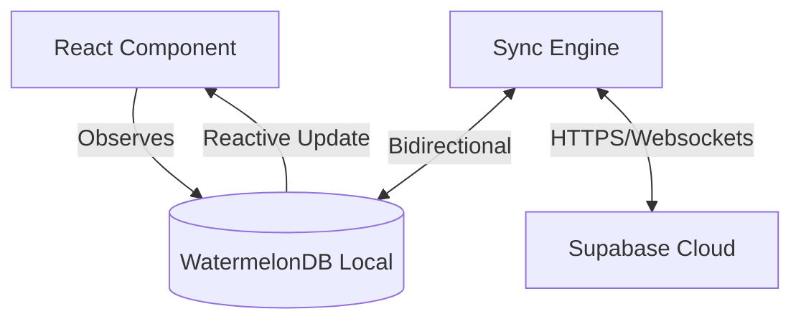

# Getting Started with Wildlife Watcher Mobile App

## Welcome! 👋

You're joining the development team for the **Wildlife Watcher Mobile App** - a React Native application that helps conservation researchers deploy and manage wildlife monitoring cameras in remote locations worldwide.

This guide is your single entry point to understanding the project, setting up your environment, and learning our core architecture.

---

## 📚 Documentation Roadmap

This folder contains specialized guides for each area of the app:

1. **[01-TECHNOLOGY-STACK.md](./01-TECHNOLOGY-STACK.md)**: Deep dive into React Native, Expo, and our core libraries.
2. **[02-PROJECT-STRUCTURE.md](./02-PROJECT-STRUCTURE.md)**: Folder organization and naming conventions.
3. **[03-OFFLINE-FIRST-ARCHITECTURE.md](./03-OFFLINE-FIRST-ARCHITECTURE.md)**: The heart of the app - WatermelonDB and Sync.
4. **[04-REDUX-STATE-MANAGEMENT.md](./04-REDUX-STATE-MANAGEMENT.md)**: How we use RTK for UI and session state.
5. **[05-REACT-NATIVE-PATTERNS.md](./05-REACT-NATIVE-PATTERNS.md)**: UI patterns, navigation, and styling.
6. **[06-DEVELOPMENT-WORKFLOW.md](./06-DEVELOPMENT-WORKFLOW.md)**: Detailed environment, testing, and git flows.
7. **[03-DEPLOYMENT-FLOW.md](./03-DEPLOYMENT-FLOW.md)**: Technical guide to the field deployment process.

---

## 🚀 Step 1: Choose Your Setup

| Scenario | Recommended Approach | Why |
|----------|---------------------|-----|
| **Team Development** | 🐳 Docker | Identical environments, 5-min setup |
| **Windows (Native)** | 🐳 Docker | Avoids complex WSL2/Environment issues |
| **Solo / Performance** | 💻 Native | Maximum build speed, direct system access |
| **iOS Development** | 💻 Native on macOS | Xcode requires macOS |

### 🐳 Option A: Docker Setup (Recommended)
1. **Prerequisites**: Docker Desktop, Android device (USB Debugging), Expo account.
2. **Setup**:
   ```bash
   git clone [REPO_URL] && cd wildlife-watcher-mobile-app
   docker-compose -f docker-compose.dev.yml up -d
   docker-compose -f docker-compose.dev.yml exec wildlife-watcher-dev bash
   # Inside container:
   npm install --ignore-scripts
   npx expo start
   ```

### 💻 Option B: Native Setup
1. **Install Node.js 20.19.4** (exact version required):
   - Use `nvm install 20.19.4 && nvm use 20.19.4`.
2. **Install CLI Tools**:
   - `npm install -g eas-cli@latest`.
3. **Setup Android Debug Bridge (ADB)**:
   - Required for physical device testing. Available in Windows (WSL2), macOS, and Linux.
4. **Clone and Install**:
   ```bash
   git clone [REPO_URL] && cd wildlife-watcher-mobile-app
   npm install --ignore-scripts
   npm run db:sync-schema
   npx expo start
   ```

---

## ✅ Step 2: Verification Checkpoints

To ensure your environment is configured correctly, verify these checkpoints:

1. **Tool Versions**:
   - `node -v` → should show `v20.19.4`.
   - `npx @expo/cli --version` → should show `0.18.31`.
   - `eas --version` → should show `16.17.3`.
2. **Android Connection**:
   - `adb devices` → your device should appear (not "unauthorized").
3. **App Launch**:
   - The app should open on your phone via the Development Build.
   - Hot reload should work when you save changes in `src/App.tsx`.

---

## 📱 Step 3: Get the App on Your Device

1. **Fastest**: Download the [Latest Development APK](https://expo.dev/accounts/apps_wildlife/projects/wildlife-watcher-expo/builds/12fa61c8-cf82-47c5-a8b1-f92fea0a04ca).
2. **Manual**: Run `eas build --platform android --profile development`.
3. **Note on Expo Go**: BLE and other native modules **will not work** in Expo Go. You must use the Development Build for full functionality.

---

## 🏗️ High-Level Architecture

The Wildlife Watcher app is an **offline-first field tool**. It is built on the principle that **connectivity is the exception, not the rule.**

### The Tech Stack
- **React Native 0.81.5** + **Expo SDK 54**
- **WatermelonDB**: High-performance local reactive database (The source of truth).
- **Supabase**: Cloud backend (PostgreSQL, Auth, Sync).
- **Redux Toolkit**: UI state and session management (Auth).

### Component Observation Pattern
Instead of fetching data in `useEffect`, our components **observe** the local database. When data changes (even via background sync), the UI updates automatically.



---

## 📁 Project Organization

```
src/
├── components/ui/       # WW-prefixed UI components (The Design System)
├── screens/             # Organized by domain: Projects, Deployments, Devices
├── navigation/          # React Navigation stacks and types
├── redux/               # RTK Slices and API definitions
├── database/            # WatermelonDB schema and models
├── services/            # Business logic (Sync, Auth, Deployment)
├── hooks/               # Custom hooks (useBle, useDeviceSettings)
└── ble/                 # BLE command definitions and classifiers
```

---

## 🛠️ Daily Development Commands

```bash
npx expo start        # Start dev server
npm run android       # Run on Android device
npm run lint          # Run linter
npm run type-check    # Run TypeScript check
npm test              # Run Jest tests
```

### Troubleshooting Quick Fixes
- **Clear Cache**: `npx expo start --clear`
- **ADB Issues**: `adb kill-server && adb start-server`
- **Native Reinstall**: `rm -rf node_modules && npm install`

---

## 💡 Key Tips for Success

1. **Think Offline**: Always consider what happens if the user has no signal.
2. **BLE Safety**: Our BLE queue uses 500ms intervals to prevent device overflow.
3. **Type Safety**: TypeScript is mandatory. Use existing types from `src/types/`.
4. **Custom Components**: Always check `src/components/ui/` before building a custom element (Buttons, Text, Icons).

**Ready to dive deeper?** Move on to **[01-TECHNOLOGY-STACK.md](./01-TECHNOLOGY-STACK.md)**. 🚀

---
*Last Updated: January 30, 2026*
