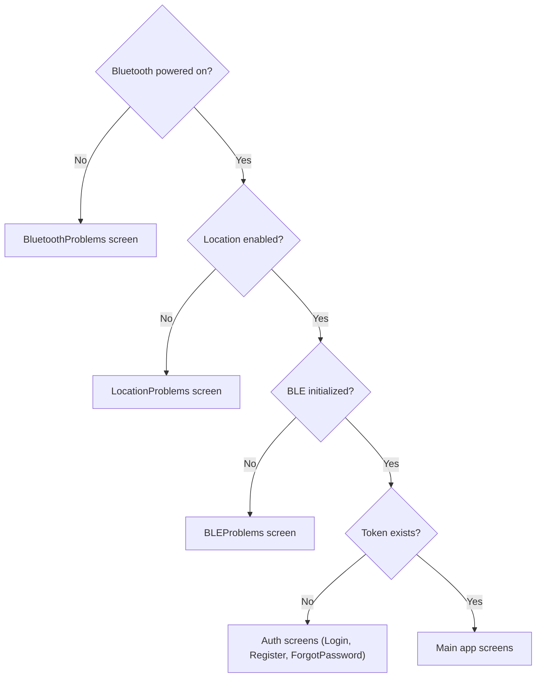

# Technology Stack Guide

## Overview

Wildlife Watcher is a React Native mobile app that communicates with wildlife cameras over BLE, stores data locally with WatermelonDB, and syncs to a Supabase backend. This guide covers the real dependencies, patterns, and architecture as they exist in the codebase today.

---

## Core Framework

| Technology | Version | Source |
|-----------|---------|--------|
| React Native | 0.81.5 | [package.json](../../package.json) |
| React | 19.1.0 | |
| TypeScript | 5.3.3 | |
| Expo SDK | ~54.0.32 | Managed workflow with dev client |
| Node.js | ≥20 | |

**Key concepts for web developers:**
- Components render to native views (not DOM) — no CSS files, use `StyleSheet` API
- Flexbox is the default layout model
- Platform-specific code via `Platform` API
- Hermes JavaScript engine for startup performance

### TypeScript Configuration

```json
{
  "extends": "@react-native/typescript-config/tsconfig.json"
}
```

---

## Application Entry Point

**File:** [App.tsx](file:///c:/dev/ww/src/App.tsx)

The app wraps `<MainNavigation />` in a tree of context providers. The nesting order matters — inner providers can access outer ones.

> For the full provider hierarchy diagram, see [02-CODEBASE-GUIDE.md](./02-CODEBASE-GUIDE.md#srcapptsx--provider-hierarchy).

> [!NOTE]
> `SupabaseSyncService.setStore(store)` is called **before** the provider tree renders. This injects the Redux store into the sync service to avoid a circular dependency.

---

## State Management

### Redux Toolkit

**Version:** ^2.5.0

**Store:** [redux/index.ts](file:///c:/dev/ww/src/redux/index.ts)

| Reducer | Slice | Purpose |
|---------|-------|---------|
| `api` | RTK Query | Base API |
| `enhancedApi` | RTK Query | Auto-generated endpoints |
| `projectsApi` | RTK Query | Project-specific queries |
| `aiModelsApi` | RTK Query | AI model queries |
| `devices` | `devicesSlice` | BLE device state (discovered peripherals) |
| `logs` | `logsSlice` | In-app logging |
| `scanning` | `scanningSlice` | BLE scan state |
| `bleLibrary` | `bleLibrarySlice` | BLE manager init state |
| `blStatus` | `bluetoothStatusSlice` | Bluetooth adapter status |
| `locationStatus` | `locationStatusSlice` | GPS availability |
| `androidPermissions` | `androidPermissionsSlice` | Runtime permissions |
| `authentication` | `authSlice` | User, token, permissions |
| `deployments` | `deploymentsSlice` | Deployment state |
| `wwAdmin` | `wwAdminSlice` | Admin features |
| `sync` | `syncSlice` | Entity sync status tracking |
| `network` | `networkSlice` | Network connectivity state |

**Middleware:** Default RTK middleware + all four API middlewares. Serializable check ignores `persist/PERSIST`. Immutable check warns after 1000ms.

**Typed hooks:**
```typescript
export const useAppDispatch = () => useDispatch<AppDispatch>()
export const useAppSelector: TypedUseSelectorHook<RootState> = useSelector
```

### RTK Query

**API Definition:** [redux/api/index.ts](file:///c:/dev/ww/src/redux/api/index.ts)

```typescript
export const api = createApi({
  reducerPath: "api",
  baseQuery: extendedBaseQuery,
  tagTypes: ["User", "Device", "Media", "Observation", "Project", "SensorRecord", "Deployment", "ApiLog"],
  endpoints: () => ({}),
})
```

Endpoints are injected via `enhancedApi` (auto-generated) and `projectsApi` / `aiModelsApi` (manual).

### Auth Pattern

**File:** [authSlice.ts](file:///c:/dev/ww/src/redux/slices/authSlice.ts)

Authentication uses `createSlice` with synchronous reducers — **not** async thunks. The `AuthProvider` handles Supabase session management and dispatches `setCredentials` / `setInitialState` / `logout` actions.

| Action | Purpose |
|--------|---------|
| `setCredentials` | Store JWT + user + calculate permissions from role |
| `logout` | Clear all state, reset permissions to empty |
| `setInitialState` | Restore persisted session on app start |
| `setCurrentOrganisation` | Switch active org, recalculate permissions |

Permissions are computed from `UserRole` (`ww_admin`, `project_admin`, `project_member`) — not fetched from the server.

---

## Database

### WatermelonDB

**Package:** `@nozbe/watermelondb` ^0.28.0

High-performance, reactive, offline-first local database built on SQLite. This is the **primary local data store** — all entity data (projects, deployments, devices, etc.) lives here.

**Schema:** [database/schema.ts](file:///c:/dev/ww/src/database/schema.ts)

> [!IMPORTANT]
> The schema is **auto-generated** by `npm run schema:generate`. Do not edit it manually. The generator reads `src/types/database.types.ts` (Supabase types). Current version: **185**.

**Models:** [database/models/](file:///c:/dev/ww/src/database/models)

| Model | Table | Key Fields |
|-------|-------|------------|
| `Project` | `projects` | `name`, `organisationId`, `captureMethodId`, `isActive` |
| `Deployment` | `deployments` | `name`, `projectId`, `deviceId`, `latitude`, `longitude` |
| `Device` | `devices` | `name`, `serialNumber`, `type` |
| `Organisation` | `organisations` | `name` |
| `SyncOutbox` | `sync_outbox` | `operationId`, `tableName`, `recordId`, `status` |
| `User` | `users` | `email`, `firstName`, `lastName` |
| `UserRole` | `user_roles` | `userId`, `projectId`, `role` |
| `Firmware` | `firmware` | `version`, `fileUrl`, `releaseDate` |
| `AiModel` | `ai_models` | `name`, `description` |
| `CaptureMethod` | `capture_methods` | `value`, `description` |
| `ActivitySensitivity` | `activity_sensitivity` | `value`, `description` |
| `SamplingDesign` | `sampling_designs` | `value`, `description` |
| `ProjectInvitation` | `project_invitations` | `projectId`, `email`, `role` |
| `SyncState` | `sync_state` | Sync tracking metadata |

**Model pattern:**
```typescript
import { Model } from '@nozbe/watermelondb'
import { field, text, date, readonly } from '@nozbe/watermelondb/decorators'

export default class Project extends Model {
    static table = 'projects'
    @text('name') name!: string
    @field('organisation_id') organisationId!: string
    @field('capture_method_id') captureMethodId?: number | null
    @field('is_active') isActive!: boolean
    @readonly @date('created_at') createdAt!: number  // Note: number, not Date
    // ...
}
```

> [!NOTE]
> WatermelonDB dates are stored as **numbers** (Unix timestamps), not JavaScript `Date` objects.

### Data Access Pattern

Components subscribe to WatermelonDB via `withObservables`. This replaces traditional `useEffect` + fetch patterns — the UI re-renders automatically when data changes.

> For detailed data access patterns, code examples, and the offline-first architecture, see [03-DATA-AND-SYNC.md](./03-DATA-AND-SYNC.md).

### Supabase

**Package:** `@supabase/supabase-js` ^2.53.0

**Client:** [services/supabase.ts](file:///c:/dev/ww/src/services/supabase.ts)

Uses a **factory pattern** with dynamic environment switching:

```typescript
import { getSupabaseClient } from '../services/supabase'

const client = getSupabaseClient()  // Throws if not initialized
```

| Function | Purpose |
|----------|---------|
| `initializeSupabaseClient()` | Create client from current environment config |
| `getSupabaseClient()` | Get current client (throws if uninitialised) |
| `reconnectSupabase()` | Recreate client after environment switch |
| `onSupabaseClientChange()` | Subscribe to client change events |
| `getCurrentEnvironment()` | Get active environment config |

> [!WARNING]
> A legacy `export default supabase` uses a `Proxy` for backward compatibility. **New code should always use `getSupabaseClient()`**.

### Sync Architecture

**Service:** [SupabaseSyncService.ts](file:///c:/dev/ww/src/services/SupabaseSyncService.ts) (1325 lines)

Bidirectional sync between WatermelonDB and Supabase. Sync is debounced (2s) and tracks per-entity status via `syncSlice` in Redux.

> For the full sync flow diagrams, push/pull logic, retry behaviour, and conflict resolution, see [03-DATA-AND-SYNC.md](./03-DATA-AND-SYNC.md#supabasesynservice).

---

## Navigation

### React Navigation 6

**Packages:** `@react-navigation/native` ^6.1.12, `@react-navigation/native-stack` ^6.9.20

**File:** [navigation/index.tsx](file:///c:/dev/ww/src/navigation/index.tsx)

#### Route Table

| Route | Component | Params |
|-------|-----------|--------|
| `Home` | `BottomTabs` | `{ initialTab?: string }` |
| `Login` | `Login` | `{ confirmed?: boolean }` |
| `Register` | `Register` | — |
| `ForgotPassword` | `ForgotPassword` | `{ token?, refreshToken?, mode? }` |
| `Notifications` | `Notifications` | — |
| `Profile` | `Profile` | — |
| `Settings` | `Settings` | — |
| `DeviceDiscovery` | `DeviceDiscoveryScreen` | `{ mode: 'prepare' \| 'engineer' \| 'deployment' \| 'auto' }` |
| `DeviceDetails` | `DeviceDetailsScreen` | `{ deviceId }` |
| `EngineerConsoleScreen` | `EngineerConsoleScreen` | `{ deviceId }` |
| `DfuScreen` | `DfuScreen` | `{ deviceId }` |
| `NewProjectScreen` | `NewProjectScreen` | — |
| `ProjectDetailsScreen` | `ProjectDetailsScreen` | `{ projectId }` |
| `ProjectMembersScreen` | `ProjectMembersScreen` | `{ projectId, projectName }` |
| `AddDeployment` | `AddDeployment` | `{ selectedProject? }` |
| `StartDeploymentWizard` | `DeviceDiscoveryScreen` | `{ mode: 'deployment' }` |
| `StartMonitoringDetailsStep` | `StartMonitoringDetailsStep` | `{ deviceId, bleDeviceId }` |
| `DeploymentDetails` | `DeploymentDetailsScreen` | `{ deploymentId }` |
| `StopMonitoringWizard` | `DeviceDiscoveryScreen` | `{ mode: 'end_deployment', deploymentId? }` |
| `EndStartMonitoringDetailsStep` | `EndStartMonitoringDetailsStep` | `{ deploymentId, deviceId, bleDeviceId }` |

Dev-only routes (`__DEV__`): `DevBuildInfo`, `AuthTestScreen`, `DeveloperSettings`.

#### Navigation Guard Logic

The navigator conditionally renders screens based on system state:



#### Typed Navigation

```typescript
import type { NativeStackNavigationProp } from '@react-navigation/native-stack'

type NavigationProp = NativeStackNavigationProp<RootStackParamList>
const navigation = useNavigation<NavigationProp>()

navigation.navigate('ProjectDetailsScreen', { projectId })
```

---

## UI Library

### React Native Paper 5.12.3

Material Design 3 component library. Theme configured in [theme.ts](file:///c:/dev/ww/src/theme.ts).

**Theme construction:** Uses `adaptNavigationTheme()` + `deepmerge` to combine React Navigation and Paper themes with custom color palettes. The app ships in **dark mode by default** — `CombinedDefaultTheme` uses `MD3DarkTheme` with custom green/amber colors.

| Theme Export | Base | Usage |
|-------------|------|-------|
| `CombinedDefaultTheme` | `MD3DarkTheme` | Default (dark mode) |
| `CombinedLightTheme` | `MD3LightTheme` | Light mode alternative |
| `useExtendedTheme()` | — | Hook for accessing theme in components |

Custom theme extensions: `appPadding: 20`, `roundness: 10`, `spacing: 10`.

### WW-Prefixed Components

The app has a custom component library in `src/components/ui/`. **Always check here before building new UI elements.**

| Component | Purpose |
|-----------|---------|
| `WWButton` | Standardised button |
| `WWText` | Typography with theme integration |
| `WWTextInput` | Form input with validation |
| `WWSelect` | Dropdown/picker |
| `WWScreenView` | Screen container with safe areas |
| `WWScrollView` | Scrollable container |
| `WWLoader` | Loading indicators |
| `WWProgressBar` | Progress visualisation |

---

## Maps

### React Native Maps 1.20.1

**Provider:** Google Maps (both iOS and Android)

**Location:** [features/maps/](file:///c:/dev/ww/src/features/maps)

| File | Purpose |
|------|---------|
| `BasicMapView.tsx` | Reusable map component with markers |
| `DeploymentCard.tsx` | Map overlay for deployment details |
| `DeploymentMarker.tsx` | Custom marker for deployments |
| `MapControls.tsx` | Zoom/location controls |
| `MapScreen.tsx` | Full-screen map view |
| `useLocation.ts` | GPS access hook |
| `useMapRegion.ts` | Map viewport management |

---

## Hardware Integration

### Bluetooth Low Energy

**Package:** `react-native-ble-manager` ^11.3.2

Communication with Wildlife Watcher cameras. Uses an event-driven architecture with typed command registry and session-based execution.

**Command definitions:** [ble/protocol/commandRegistry.ts](file:///c:/dev/ww/src/ble/protocol/commandRegistry.ts) — single source of truth for all BLE commands and response parsers

| Layer | File | Purpose |
|-------|------|---------|
| Protocol | `src/ble/protocol/eventBus.ts` | Central event dispatcher (6 frozen event types) |
| Protocol | `src/ble/protocol/rxRouter.ts` | Binary/text classification from raw bytes |
| Protocol | `src/ble/protocol/commandRegistry.ts` | Typed command factories with success/failure matchers |
| Protocol | `src/ble/protocol/commandQueue.ts` | Serialized command execution queue |
| Session | `src/ble/session/createBleSession.ts` | Deterministic workflow execution API |
| Hook | `src/hooks/useBle.ts` | Connect, writeRaw, disconnect |
| Hook | `src/hooks/useBleSession.ts` | React hook wrapping session factory |
| Hook | `src/hooks/useBleListeners.tsx` | Native event routing to rxRouter |
| Hook | `src/hooks/useDeploymentConfiguration.ts` | Atomic deployment configuration |
| Hook | `src/hooks/useCapturePreview.ts` | Image capture flow |
| Hook | `src/hooks/useBleInitialization.ts` | Shared self-test + UTC sync |
| Hook | `src/hooks/useDeviceSettings.ts` | Quiesce device, configure intervals |
| UI-only | `src/ble/messageClassifier.ts` | Log categorization for monitoring display |

> [!IMPORTANT]
> **Critical timing constraint:** The device enters Deep Power Down (DPD) after 1000ms of inactivity. The `commandQueue` handles serialization automatically. The device has a single-slot command buffer — the queue ensures only one command is in-flight.

**See:** [BLE Architecture Guide](../resources/BLE_Architecture.md) for complete patterns and firmware constraints.

### Firmware Updates (DFU)

**Package:** `@getquip/expo-nordic-dfu` ^2.0.3

Over-the-air firmware updates using Nordic Semiconductor's DFU protocol. Handles DFU mode transitions, bootloader detection, and firmware image upload.

**Current limitations:**
- **ZIP format required** — Must use Nordic DFU-compatible ZIP packages for BLE (nRF) firmware
- **Himax AI processor** — Supported via `AI firmware` + `reset` commands (binary upload over BLE characteristic)
- **No SD card config** — Cannot write to `CONFIG.TXT` on the SD card (planned)

---

## Network & Connectivity

### NetInfo

**Package:** `@react-native-community/netinfo` ^11.3.1

Monitors network state to trigger sync when transitioning from offline → online.

### Offline Types

**Files:** `src/types/offline.ts` (Exported centrally via `src/types/index.ts`)

Defines the offline operation queue types:

```typescript
export type OfflineOperationType =
  | 'CREATE_PROJECT' | 'UPDATE_PROJECT' | 'DELETE_PROJECT'
  | 'CREATE_DEPLOYMENT' | 'UPDATE_DEPLOYMENT' | 'DELETE_DEPLOYMENT'
  | 'UPDATE_DEVICE_LORAWAN_STATUS'
  | 'CREATE_ORGANISATION' | 'UPDATE_ORGANISATION'
  | 'CREATE_USER' | 'UPDATE_USER' | 'DELETE_USER'
```

---

## Expo Modules Used

| Package | Purpose |
|---------|---------|
| `expo-location` | GPS access |
| `expo-file-system` | File read/write |
| `expo-constants` | App configuration values |
| `expo-linking` | Deep linking |
| `expo-crypto` | UUID generation |
| `expo-secure-store` | Secure credential storage |
| `expo-clipboard` | Copy to clipboard |
| `expo-localization` | Locale detection |
| `expo-splash-screen` | Splash screen management |
| `expo-status-bar` | Status bar styling |
| `expo-updates` | OTA app updates |
| `expo-dev-client` | Development builds |

---

## Development Tools

### Testing

| Tool | Purpose | Command |
|------|---------|---------|
| Jest | Unit & integration tests | `npm test` |
| `@testing-library/react-native` | Component testing | — |
| Maestro | E2E UI testing | `npm run test:maestro` |
| Detox | E2E native testing | `npm run test:e2e` |

### Code Quality

| Tool | Purpose |
|------|---------|
| ESLint 8 | Linting |
| Prettier 2.8.8 | Code formatting |
| TypeScript 5.3.3 | Static type checking |
| `tsc --noEmit` | Type-check without emitting (`npm run type-check`) |

### Build, Deploy & Version Control

| Tool | Purpose |
|------|---------|
| Git & GitHub | [See 05-GIT-WORKFLOW.md](./05-GIT-WORKFLOW.md) for branching, Conventional Commits, and CI rules |
| EAS (Expo Application Services) | Cloud builds for iOS and Android |
| Metro | JavaScript bundler |
| Babel | Transpiler |
| `patch-package` | Patching node_modules |

### Key Scripts

| Script | Purpose |
|--------|---------|
| `npm run android` | Build and run on Android |
| `npm run ios` | Build and run on iOS |
| `npm run schema:generate` | Regenerate WatermelonDB schema from Supabase types |
| `npm run schema:validate` | Validate schema consistency |
| `npm run types:cloud-dev` | Regenerate Supabase TypeScript types |
| `npm run type-check` | Run `tsc --noEmit` |

---

## Performance Considerations

- **FlatList** for long lists (not ScrollView)
- **useMemo / useCallback** for expensive computations
- **React.memo** for component memoisation
- **Hermes** engine for faster startup and lower memory usage
- WatermelonDB lazy-loads records — queries are fast even with large datasets

---

## Error Handling

| Area | Strategy |
|------|----------|
| BLE connection failures | Auto-retry with backoff; clear error screens |
| BLE command timeouts | Logged + user notification; configurable per-command timeout |
| Device disconnection | Detected via listeners; cleanup and navigation guard |
| Bluetooth/Location off | Navigation guard shows dedicated problem screens |
| Sync failures | Debounced retry; per-entity error tracking in `syncSlice` |
| Offline mode | Full local functionality via WatermelonDB |
| Sync conflicts | Last-write-wins in `SupabaseSyncService` |
| Missing permissions | Guided flow via `AndroidPermissionsProvider` |

---

## Next Steps

1. [04-DEVICE-FLOWS.md](./04-DEVICE-FLOWS.md) — Device deployment, management, and retrieval
2. [02-CODEBASE-GUIDE.md](./02-CODEBASE-GUIDE.md) — Project structure, type architecture, and state management
3. [BLE_Architecture.md](../resources/BLE_Architecture.md) — BLE patterns and firmware constraints
4. [03-DATA-AND-SYNC.md](./03-DATA-AND-SYNC.md) — Offline-first architecture and sync

