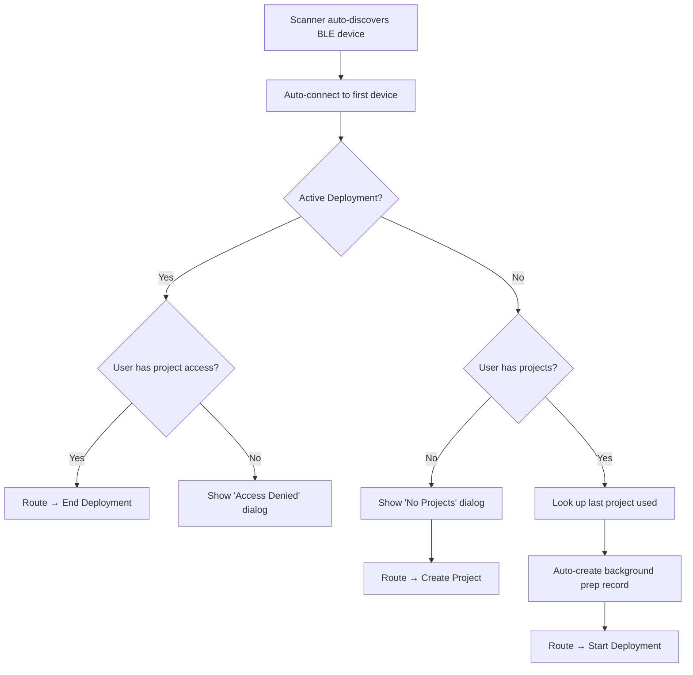
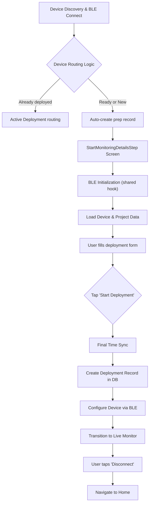
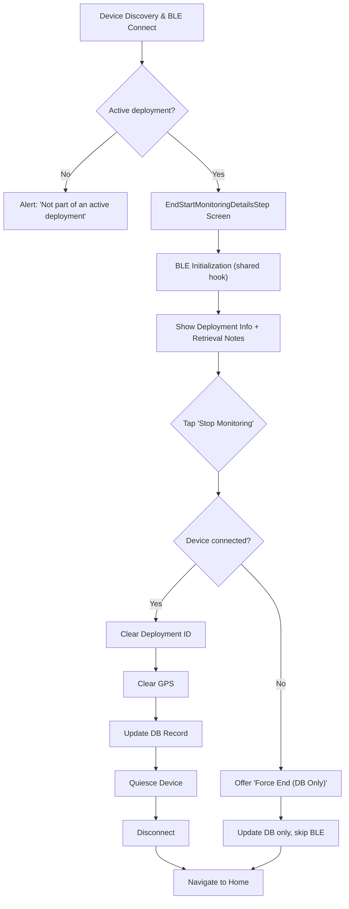

# Device Flows — Scanner Routing, Deployment, and Retrieval

All device workflows share the same BLE initialization (`useBleInitialization`) and follow the same pattern: connect → initialise → act → quiesce → disconnect. This guide covers them in the order a device goes through its lifecycle.

**Deep dive:** [BLE Architecture Guide](../resources/BLE_Architecture.md) — command system, timing constraints, message classification

---

## Part 1: Scanner Routing (Automated Device Association)

**Components:** `DeviceDiscoveryScreen.tsx`, `ScannerRoutingDialog.tsx`, `useDeviceDiscovery.ts`
**Entry:** Scanner tab (default landing page — auto-scans only when the scanner tab is active via `isActiveTab` to prevent background BLE connections)

> [!IMPORTANT]
> The old `PrepareAndTestScreen` has been **removed**. Device configuration and metrics snapshots are captured directly when a user starts a deployment via the `ScannerRoutingDialog`.

### Flow



### ScannerRoutingDialog States

| State | Trigger | User Action |
|-------|---------|-------------|
| `no_access_active_deployment` | Device has `status = deployed` but user lacks access to project | "OK" → Dismiss & Disconnect |
| `no_projects` | User has 0 projects in current org | "Create Project" → New Project screen |

### Direct Deployment Routing

When a new device is found, if the user has at least one project, the system looks up their most recently used project (from past deployments) and seamlessly bridges directly to the `StartMonitoringScreen` without blocking the user.

### Engineer Console (Side Drawer)

The **Engineer Console** is accessible via the hamburger menu in the side drawer, independent of the scanner flow.

**Hook:** `useEngineerConnect.ts`
**Dialog:** `EngineerConnectDialog.tsx`
**Flow:** Hamburger → "Engineer Console" → scan → auto-connect (or select) → navigate to `EngineerConsoleScreen`

---

## Part 2: Starting a Deployment

**Screen:** `StartMonitoringScreen.tsx` (`StartMonitoringDetailsStep`)
**Entry:** Scanner tab → auto-connect → ScannerRoutingDialog → "Start Deployment"

### Flow



### BLE Initialization

Uses `useBleInitialization` — runs standard self-test and UTC time sync. A **20s heartbeat** keeps the device awake during form entry.

### User Form

| Field | Required | Notes |
|-------|----------|-------|
| Deployment Name | ✅ | Descriptive name |
| Location | ✅ | Auto-captured from phone GPS |
| Location Description | — | Optional site notes |
| Camera Height (cm) | — | Height from ground |
| Start Comments | — | Deployment conditions |
| Camera View Image | — | Collapsible preview via `CameraViewSection` |
| Motion Detection Test | — | Collapsible test grid via `DeploymentMotionDetectionSection` (Activity Detection projects only) |
| LoRaWAN Status | — | Collapsible connectivity check |

Project settings (capture method, sensitivity, timelapse interval, GPS image tagging, bait usage, marked individuals monitoring) are inherited from the configured project. However, the user can instantly swap the attached **Project** using the `<WWSelect>` interactive dropdown right on this screen. Any change dynamically recalculates the capture parameters before deployment.

### Start Deployment Sequence

| Step | Action | Detail |
|------|--------|--------|
| 1 | Final Time Sync | `setutc` (firmware confirms via response) |
| 2 | Create DB Record | `DeploymentService.createDeployment()` → `OutboxService` → `SupabaseSyncService` |
| 3 | Configure Device | `useDeploymentConfiguration.configure()` (see below) |
| 4 | Live Monitor | Transitions to `DeploymentMonitorView` (remains connected) |
| 5 | Disconnect | User initiates manual disconnect (`dis`) |

### Device Configuration (`useDeploymentConfiguration`)

`configure()` performs a single `AI getop -1` bulk fetch at the start, then passes the cached result to both sub-steps below. Only parameters that differ from the target value are actually written.

**A. Set Deployment ID** (with GPS fallback):
```
AI setop 20 <val> ... AI setop 27 <val>   (UUID → 8 × 16-bit integers, skips unchanged)
```
If OP writing fails (AI NACK), falls back to `setgps <lat> <lng> <alt>`.

**B. Configure Capture Method:**

| Method | Commands | Notes |
|--------|----------|-------|
| Activity Detection | `setop 11 1000`, `setop 7 0`, `setop 8 1000`, `setop 10 1` | Motion on, timelapse off |
| Timelapse | `setop 11 0`, `setop 7 <secs>`, `setop 8 1000`, `setop 10 1` | Motion off, timelapse on |

Camera enable (`setop 10 1`) is always sent **last** to avoid premature triggers. All writes are conditional — unchanged values are skipped.

### OP Parameter Index Reference

| Index | Constant | Purpose |
|-------|----------|---------|
| 7 | `TIMELAPSE_INTERVAL` | Timelapse interval in seconds (0 = off) |
| 8 | `INTERVAL_BEFORE_DPD` | Deep power-down delay in ms |
| 10 | `CAMERA_ENABLED` | 1 = on, 0 = off |
| 11 | `MD_INTERVAL` | Motion detection interval in ms (0 = off) |
| 20–27 | — | Deployment UUID (8 × 16-bit) |

---

## Part 3: Ending a Deployment

**Screen:** `StopMonitoringScreen.tsx` (`EndStartMonitoringDetailsStep`)
**Entry:** Maps → tap deployed device → "Stop Monitoring", or Devices list, or Deployment details

### Flow



### End Deployment Sequence

A single `AI getop -1` bulk fetch is performed before Step 1, and the cached result is shared with both Step 1 and Step 4 to avoid redundant BLE round-trips.

| Step | Progress | Action | BLE Command |
|------|----------|--------|-------------|
| 0 | — | **Bulk Fetch OP Parameters** | `AI getop -1` → cached for steps below |
| 1 | 0.2 | Clear Deployment ID | Conditional `AI setop 20-27` (retry 3×, 1s delay, skips unchanged) |
| 2 | — | Clear GPS | `setgps 0 0 0` (non-blocking) |
| 3 | 0.3 | Update Database | `DeploymentService.endDeployment()` |
| 4 | 0.6 | Quiesce Device | Conditional `AI setop` (optimised — uses cached ops) |
| 5 | 0.8 | Disconnect | `dis` |

> [!IMPORTANT]
> **Optimised quiesce** (`optimized=true`) only disables the camera. Skips re-enabling, interval clearing, and stabilisation delays.

### Force End (Disconnected Device)

If the device is not connected, the user can "Force End (Database Only)":
- Updates the monitoring record without BLE commands
- Device must be manually reset later (e.g. via Engineer Console)

**Deployment Status IDs:** `1 = Deployed (Active)`, `2 = Recovery (Ended)`, `3 = Failed`

---

## OP Parameter Optimization (`AI getop -1`)

All three flows use the **bulk parameter fetch** command `AI getop -1` to minimize BLE round-trips. This single command returns all operational parameters (OpParams 0–20) from the AI processor in one response.

**Pattern:**
1. Fetch all params once: `AI getop -1` → `OpParams 1324 6 0 18 ...`
2. Cache the result in memory
3. Before each `AI setop`, compare target value against cached value
4. Skip the write if the parameter is already correct

**Backward compatibility:** If `AI getop -1` fails (e.g. older firmware), all functions gracefully fall back to "blind write" mode — they send every `setop` unconditionally.

**Key files:**
- [types.ts](../../src/ble/types.ts) — `getop_all` command definition (requires both `readCommand` and `writeCommand`)
- [useBleCommands.ts](../../src/hooks/useBleCommands.ts) — `getAllOperationalParams()` function
- [useDeviceSettings.ts](../../src/hooks/useDeviceSettings.ts) — `quiesceDevice(cachedOps?)` accepts cached ops
- [useDeploymentConfiguration.ts](../../src/hooks/useDeploymentConfiguration.ts) — `configure()` fetches once for both deployment ID and capture method

---

## Connection Safety (All Screens)

| Feature | Start Deployment | End Deployment |
|---------|-----------------|----------------|
| Connection Lost Alert | ✅ (suppressed during init/submit) | Back handler only |
| Heartbeat | 20s interval | 20s interval |
| Navigation Guard | `isNavigatingAway` ref | `isNavigatingAway` ref |
| In-Progress Guard | `isStartDeploymentInProgress` ref | `isEnding` state |
| Unmount Cleanup | Auto-disconnect (unless navigating) | Auto-disconnect |

All screens use `bleDeviceRef` (a `useRef`) for device state inside `setInterval` callbacks, preventing stale closure bugs.

---

## Troubleshooting

### Scanner Routing

| Issue | Cause | Fix |
|-------|-------|-----|
| Dialog not appearing | Device timeout | Clear app data or re-connect |
| "No Projects Found" | User has no projects in current org | Create a project first |
| Infinite connect loop | Navigation guard not reset | Fixed via `hasNavigatedRef` in `useEngineerConnect` |

### Start Deployment

| Issue | Cause | Fix |
|-------|-------|-----|
| "GPS Accuracy Too Low" | Weak signal (dense canopy) | Move to clearing for fix, then return |
| "Deployment Initialisation Failed" | Device handshake timeout | Re-connect and keep phone close |
| "Failed to Set Deployment ID" | BLE write error or AI NACK | Keep phone within 1m; app falls back to GPS-only |
| "No SD Card Detected" | Missing card or newly inserted card hasn't mounted | The app automatically sends a Wake signal prior to checking `aiinfo` to rapidly recover SD cards inserted mid-session |

### End Deployment

| Issue | Cause | Fix |
|-------|-------|-----|
| "No Active Deployment" | Device not deployed or already ended | Verify correct device; check deployment list |
| "Failed to Clear Deployment ID" | BLE write failure after 3 retries | Use "Force End"; manually reset via Engineer Console |
| "Connection Lost" before end | Device out of range or battery dead | Use "Force End (Database Only)" |

---

## Part 4: Hardware & Sensor Testing Tools

To support ongoing hardware validation, the app integrates dedicated testing screens mapped directly to the hardware capabilities. These tools bypass standard deployment flows and interface directly with the device API. 

They are accessed directly via the **Engineer Console** (`EngineerConsoleScreen.tsx`) → **Help / Command Reference**.

### 1. Motion Detection Screen
**Screen:** `StandaloneMotionDetectionScreen.tsx`
**Purpose:** Provides a real-time visualization of the HM0360 sensor's internal motion detection algorithm.
**Flow:**
- Uses the `useMotionDetectionStream` hook to subscribe to the device log messages.
- Parses the 256-bit binary payload representing a 16x16 grid of motion blocks.
- Renders the grid natively. A visual feedback loop helps understand when the environmental thresholds are crossed.

### 2. Camera Settings Test Screen
**Screen:** `CameraSettingsTestScreen.tsx`
**Purpose:** Captures a single test image with configurable flash parameters to validate LED hardware and exposure settings without needing a full firmware recompilation.

**Features:**
- **Flash Configuration:** Live adjustment of `Flash Duration`, `Flash LED Type` (visible/IR/none), and `LED Brightness` (0–100%).
- **Direct Capture:** Triggers capture via `AI capture 1 1000` (direct command). The previous timelapse-interval workaround has been reverted.
- **DPD Synchronisation and Quiesce:** Before capture, the hook writes `MD_INTERVAL=0` and `TIMELAPSE_INTERVAL=0` alongside flash OPs (9, 12, 13) and waits for the device to enter Deep Power Down (`Sleep` message). This ensures CONFIG.TXT is committed with both the new flash parameters **and** zeroed background triggers — preventing a prior deployment's motion/timelapse settings from causing the flash LED to fire repeatedly after the test capture.
- **Post-Capture Camera Disable:** After capture completes, `CAMERA_ENABLED=0` (`setop 10 0`) is sent and the hook waits for the resulting sleep cycle. This returns the device to a clean idle state and prevents it from re-entering monitoring mode.
- **Real-time Auto Exposure (AE) Data:** Captures console logs (`Integration time`, `Analog gain`, etc.) to dynamically render live AE metrics and a visual AE Mean progress bar (0–255).
- **Metadata Tracking Gallery:** Every image captured in the test session is stored as a `CapturedImageInfo` object. This creates a persistent **snapshot of settings** exactly as they were during the capture trigger.
- **Image Validation:** Tapping any thumbnail in the gallery opens a light-box modal that displays the specific `cameraParams` and `aeData` associated with that *exact* frame, enabling fast hardware/firmware debugging.
- **Robustness:** Includes a `maxRetries: 1` logic for `setop` batch writes to handle transient device Sleep events during the parameter application phase.

> [!WARNING]
> **Firmware Bug — Flash strobe not configured in manual capture path.** The Himax firmware only configures the HM0360 strobe mode (`Strobe mode 0x03`) when entering DPD via the normal MD sleep preparation path. The manual `AI capture` command bypasses this, so the flash LED never fires. The timelapse workaround forces the capture through the normal DPD path where strobe IS configured. **TODO:** Revert to direct `AI capture` once the Himax firmware is updated.

> [!NOTE]
> The flash LED hardware is driven by the Himax AI processor (HX6538), not the nRF52 (WW500). The nRF only stores and forwards the OP values — the Himax reads them from CONFIG.TXT during the capture wake cycle.

*Last Updated: April 13, 2026*

