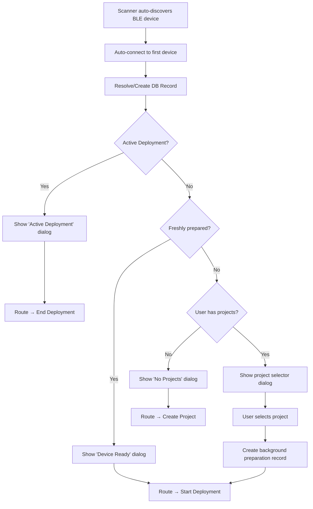
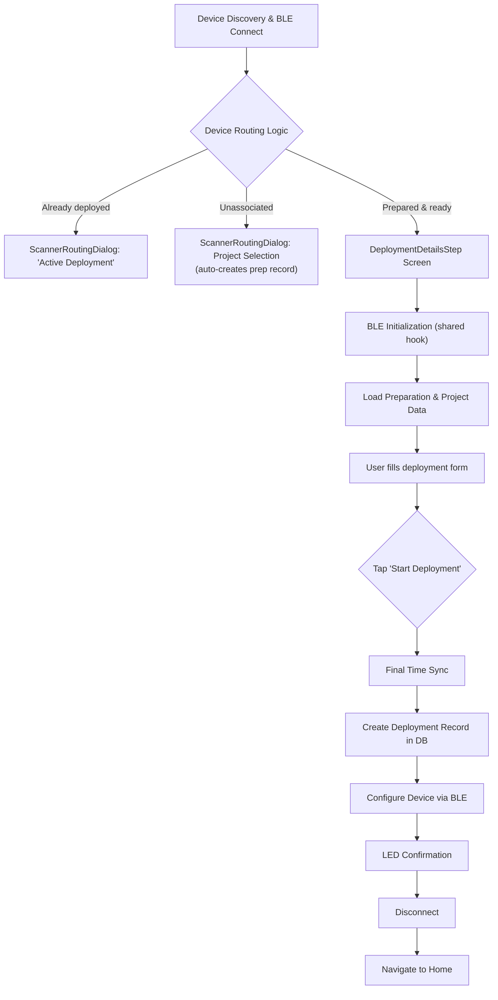
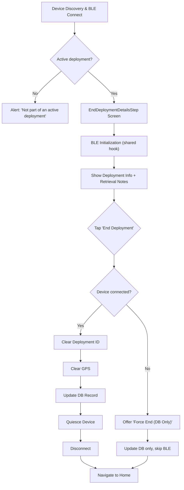

# Device Flows — Scanner Routing, Deployment, and Retrieval

All device workflows share the same BLE initialization (`useBleInitialization`) and follow the same pattern: connect → initialise → act → quiesce → disconnect. This guide covers them in the order a device goes through its lifecycle.

**Deep dive:** [BLE Architecture Guide](../resources/BLE_Architecture.md) — command system, timing constraints, message classification

---

## Part 1: Scanner Routing (Automated Device Association)

**Components:** `DeviceDiscoveryScreen.tsx`, `ScannerRoutingDialog.tsx`, `useDeviceDiscovery.ts`
**Entry:** Scanner tab (default landing page — auto-scans immediately)

> [!IMPORTANT]
> The old `PrepareAndTestScreen` has been **removed**. Device preparation records are now created automatically in the background when a user associates a device with a project via the `ScannerRoutingDialog`.

### Flow



### ScannerRoutingDialog States

| State | Trigger | User Action |
|-------|---------|-------------|
| `active_deployment` | Device has `status = deployed` | "Stop Deployment" → End Deployment flow |
| `start_deployment` | Device has a fresh completed preparation | "Start Deployment" → Deployment details |
| `no_projects` | User has 0 projects in current org | "Create Project" → New Project screen |
| `unassociated` | Device is new/not recently prepared | Select project → auto-create prep record → Deployment details |

### Background Preparation Record

When a user selects a project in the `unassociated` state, `DevicePreparationService.createDummyPreparationRecord()` creates a completed preparation record with all checks marked as passed. This satisfies the downstream `StartDeploymentScreen` which requires a `devicePreparationId`.

### Engineer Console (Side Drawer)

The **Engineer Console** is accessible via the hamburger menu in the side drawer, independent of the scanner flow.

**Hook:** `useEngineerConnect.ts`
**Dialog:** `EngineerConnectDialog.tsx`
**Flow:** Hamburger → "Engineer Console" → scan → auto-connect (or select) → navigate to `EngineerConsoleScreen`

---

## Part 2: Starting a Deployment

**Screen:** `StartDeploymentScreen.tsx` (`DeploymentDetailsStep`)
**Entry:** Scanner tab → auto-connect → ScannerRoutingDialog → "Start Deployment"

### Flow



### BLE Initialization

Uses `useBleInitialization` — same self-test + time sync as preparation steps 1–2. A **20s heartbeat** keeps the device awake during form entry.

### User Form

| Field | Required | Notes |
|-------|----------|-------|
| Deployment Name | ✅ | Descriptive name |
| Location | ✅ | Auto-captured from phone GPS |
| Location Description | — | Optional site notes |
| Camera Height (cm) | — | Height from ground |
| Start Comments | — | Deployment conditions |
| Camera View Image | — | Preview via `CameraViewSection` |
| Motion Detection Test | — | Test grid via `DeploymentMotionDetectionSection` (Activity Detection projects only) |
| LoRaWAN Status | — | Connectivity check |

Project settings (capture method, sensitivity, timelapse interval, GPS image tagging, bait usage, marked individuals monitoring) are read-only, inherited from the preparation's project and prominently displayed to the user for confirmation prior to starting the deployment.

### Start Deployment Sequence

| Step | Action | Detail |
|------|--------|--------|
| 1 | Final Time Sync | `setutc` (firmware confirms via response) |
| 2 | Create DB Record | `DeploymentService.createDeployment()` → `OutboxService` → `SupabaseSyncService` |
| 3 | Configure Device | `useDeploymentConfiguration.configure()` (see below) |
| 4 | LED Confirmation | `flashg 3 300` (3 green flashes) |
| 5 | Disconnect | `dis` |

### Device Configuration (`useDeploymentConfiguration`)

`configure()` performs a single `AI getop -1` bulk fetch at the start, then passes the cached result to both sub-steps below. Only parameters that differ from the target value are actually written.

**A. Set Deployment ID** (with GPS fallback):
```
AI setop 20 <val> ... AI setop 27 <val>   (UUID → 8 × 16-bit integers, skips unchanged)
```
If OP writing fails (AI NACK), falls back to `setgps <lat> <lng> <alt>`.

**B. Configure Capture Method:**

| Method | Commands | Notes |
|--------|----------|-------|
| Activity Detection | `setop 11 1000`, `setop 7 0`, `setop 8 1000`, `setop 10 1` | Motion on, timelapse off |
| Timelapse | `setop 11 0`, `setop 7 <secs>`, `setop 8 1000`, `setop 10 1` | Motion off, timelapse on |

Camera enable (`setop 10 1`) is always sent **last** to avoid premature triggers. All writes are conditional — unchanged values are skipped.

### OP Parameter Index Reference

| Index | Constant | Purpose |
|-------|----------|---------|
| 7 | `TIMELAPSE_INTERVAL` | Timelapse interval in seconds (0 = off) |
| 8 | `INTERVAL_BEFORE_DPD` | Deep power-down delay in ms |
| 10 | `CAMERA_ENABLED` | 1 = on, 0 = off |
| 11 | `MD_INTERVAL` | Motion detection interval in ms (0 = off) |
| 20–27 | — | Deployment UUID (8 × 16-bit) |

---

## Part 3: Ending a Deployment

**Screen:** `EndDeploymentScreen.tsx` (`EndDeploymentDetailsStep`)
**Entry:** Maps → tap deployed device → "End Deployment", or Devices list, or Deployment details

### Flow



### End Deployment Sequence

A single `AI getop -1` bulk fetch is performed before Step 1, and the cached result is shared with both Step 1 and Step 4 to avoid redundant BLE round-trips.

| Step | Progress | Action | BLE Command |
|------|----------|--------|-------------|
| 0 | — | **Bulk Fetch OP Parameters** | `AI getop -1` → cached for steps below |
| 1 | 0.2 | Clear Deployment ID | Conditional `AI setop 20-27` (retry 3×, 1s delay, skips unchanged) |
| 2 | — | Clear GPS | `setgps 0 0 0` (non-blocking) |
| 3 | 0.3 | Update Database | `DeploymentService.endDeployment()` |
| 4 | 0.6 | Quiesce Device | Conditional `AI setop` (optimised — uses cached ops) |
| 5 | 0.8 | Disconnect | `dis` |

> [!IMPORTANT]
> **Optimised quiesce** (`optimized=true`) only disables the camera. Skips re-enabling, interval clearing, and stabilisation delays.

### Force End (Disconnected Device)

If the device is not connected, the user can "Force End (Database Only)":
- Updates the deployment record without BLE commands
- Device must be manually reset later (e.g. via Engineer Console)

**Deployment Status IDs:** `1 = Deployed (Active)`, `2 = Recovery (Ended)`, `3 = Failed`

---

## OP Parameter Optimization (`AI getop -1`)

All three flows use the **bulk parameter fetch** command `AI getop -1` to minimize BLE round-trips. This single command returns all operational parameters (OpParams 0–27) from the AI processor in one response.

**Pattern:**
1. Fetch all params once: `AI getop -1` → `OpParams 1324 6 0 18 ...`
2. Cache the result in memory
3. Before each `AI setop`, compare target value against cached value
4. Skip the write if the parameter is already correct

**Backward compatibility:** If `AI getop -1` fails (e.g. older firmware), all functions gracefully fall back to "blind write" mode — they send every `setop` unconditionally.

**Key files:**
- [types.ts](../../src/ble/types.ts) — `getop_all` command definition (requires both `readCommand` and `writeCommand`)
- [useBleCommands.ts](../../src/hooks/useBleCommands.ts) — `getAllOperationalParams()` function
- [useDeviceSettings.ts](../../src/hooks/useDeviceSettings.ts) — `quiesceDevice(cachedOps?)` accepts cached ops
- [useDeploymentConfiguration.ts](../../src/hooks/useDeploymentConfiguration.ts) — `configure()` fetches once for both deployment ID and capture method

---

## Connection Safety (All Screens)

| Feature | Start Deployment | End Deployment |
|---------|-----------------|----------------|
| Connection Lost Alert | ✅ (suppressed during init/submit) | Back handler only |
| Heartbeat | 20s interval | 20s interval |
| Navigation Guard | `isNavigatingAway` ref | `isNavigatingAway` ref |
| In-Progress Guard | `isStartDeploymentInProgress` ref | `isEnding` state |
| Unmount Cleanup | Auto-disconnect (unless navigating) | Auto-disconnect |

All screens use `bleDeviceRef` (a `useRef`) for device state inside `setInterval` callbacks, preventing stale closure bugs.

---

## Troubleshooting

### Scanner Routing

| Issue | Cause | Fix |
|-------|-------|-----|
| Dialog not appearing | Device has stale preparation record | Clear app data or re-connect |
| "No Projects Found" | User has no projects in current org | Create a project first |
| Infinite connect loop | Navigation guard not reset | Fixed via `hasNavigatedRef` in `useEngineerConnect` |

### Start Deployment

| Issue | Cause | Fix |
|-------|-------|-----|
| "GPS Accuracy Too Low" | Weak signal (dense canopy) | Move to clearing for fix, then return |
| "Device Not Prepared" | No completed preparation record | Complete preparation flow first |
| "Failed to Set Deployment ID" | BLE write error or AI NACK | Keep phone within 1m; app falls back to GPS-only |

### End Deployment

| Issue | Cause | Fix |
|-------|-------|-----|
| "No Active Deployment" | Device not deployed or already ended | Verify correct device; check deployment list |
| "Failed to Clear Deployment ID" | BLE write failure after 3 retries | Use "Force End"; manually reset via Engineer Console |
| "Connection Lost" before end | Device out of range or battery dead | Use "Force End (Database Only)" |

---

*Last Updated: March 27, 2026*
