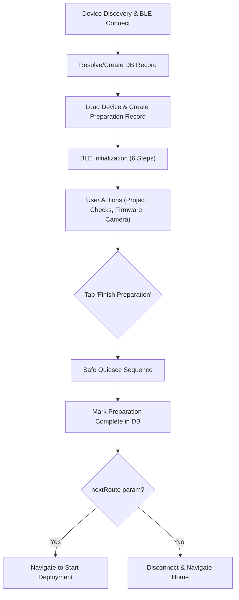
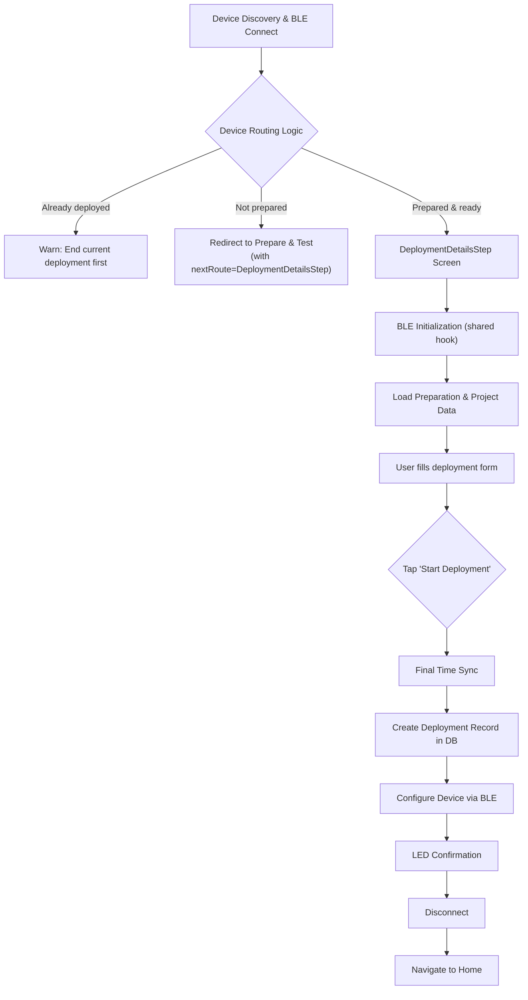
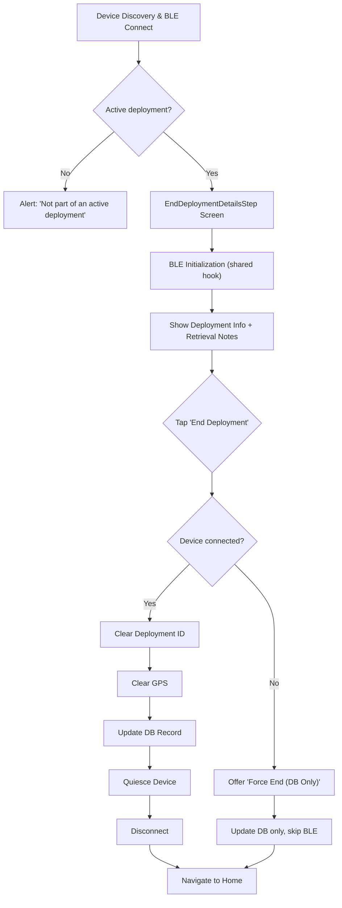

# Device Flows — Preparation, Deployment, and Retrieval

All three device workflows share the same BLE initialization (`useBleInitialization`) and follow the same pattern: connect → initialise → act → quiesce → disconnect. This guide covers them in the order a device goes through its lifecycle.

**Deep dive:** [BLE Architecture Guide](../resources/BLE_Architecture.md) — command system, timing constraints, message classification

---

## Part 1: Device Preparation

**Screen:** `PrepareAndTestScreen.tsx`
**Entry:** Devices tab → "Prepare & Test" → select a device

### Flow



### BLE Initialization Sequence

Steps 1–2 are shared with deployment flows via `useBleInitialization`; steps 3–6 are preparation-specific.

| Step | Action | BLE Command | Source |
|------|--------|-------------|--------|
| 1 | Hardware Self-Test | `selftest` → parse `Error bits = 0xXXXX` | `useBleInitialization` |
| 2 | Set UTC Time | `setutc <ISO>` (firmware confirms via response) | `useBleInitialization` |
| 3 | **Bulk Fetch OP Parameters** | `AI getop -1` → returns all params | `useBleCommands.getAllOperationalParams()` |
| 4 | Quiesce Device (disable camera) | Conditional `AI setop` (skips unchanged) | `useDeviceSettings.quiesceDevice(cachedOps)` |
| 5 | Reset GPS | `setgps 0 0 0` | `useBleCommands.clearGpsLocation()` |
| 6 | Clear Deployment IDs | Conditional `AI setop 20-27` (skips if already 0) | `useBleCommands.setDeploymentIdAsOps(null, cachedOps)` |
| 7 | Automated Diagnostics | `battery`, `AI info`, `ver` | Screen handlers |

> [!TIP]
> **Optimization:** Steps 4 and 6 use the cached result from Step 3's `AI getop -1` bulk fetch. This means only **one** round-trip to the AI processor is needed instead of two. Parameters that already match the target value are skipped entirely.

> [!NOTE]
> Step 1 includes a **1.5s stabilization delay** after connection to allow the device (especially LoRaWAN) to settle before the self-test.

### Self-Test Error Bits

| Bit | Mask | Meaning |
|-----|------|---------|
| 0 | `0x0001` | Low Battery |
| 1 | `0x0002` | AI Processor No Response |
| 2 | `0x0004` | LoRaWAN Error |
| 3 | `0x0008` | Watchdog Reset |
| 4 | `0x0010` | Brownout Reset |
| 8 | `0x0100` | Main Camera Error |
| 9 | `0x0200` | Motion Detector Error |
| 10 | `0x0400` | LED Flash Failure |
| 11 | `0x0800` | No SD Card |
| 12 | `0x1000` | PDM Microphone Failure |
| 13 | `0x2000` | Neural Network Error |

If the high byte is `0xFF` (e.g. `0xFF00`), the system is still initialising — bits are not yet valid.

### User Actions

After initialisation, the user can perform these in any order:

**Project Selection (Required)** — determines capture method (Activity Detection or Timelapse). Last-used project pre-selected. Can create a new project inline.

**Battery Check** — `battery` → parses `Battery = XXXXmV YY%`. Pass threshold: >30%.

**SD Card Check (Two-Phase):**
1. Primary: `AI info` → parses total/available KB
2. Fallback: `selftest` → checks bit 11 (`0x0800`) for "No SD Card"
3. Ambiguous: If AI info fails but bit 11 is clear → shows format warning

**Firmware Check & Update:**
- Version query: `ver` → parses `WW500-A00 V XX.YY.ZZ`
- Update: `dfu` → 500ms → `dis` → wait 5s → scan for `WW500_DFU`/`DfuTarg` → DFU → wait 6s → reconnect → verify

**Camera View Test** — `useCapturePreview` → `AI capture 1 0` → image from BLE chunks

### Finish Preparation (Safe Quiesce)

**Preconditions:** Project selected, SD card check passed, device connected.

| Step | Action | BLE Command |
|------|--------|-------------|
| 1 | Store Preparation ID on device | `AI setop 20 <val>` … `AI setop 27 <val>` |
| 2 | LED Confirmation | `flashg 2 500` (2 green flashes) |
| 3 | Disconnect (if no `nextRoute`) | `dis` |

Marks `DevicePreparation` as complete via `DevicePreparationService.completePreparation()`. If a `nextRoute` is set (e.g. `DeploymentDetailsStep`), skips disconnect and navigates directly.

### Database Records (Preparation)

| Service | Method | When |
|---------|--------|------|
| `DeviceService.getDeviceByBluetoothId` | Resolve or create device record | On mount |
| `DevicePreparationService.startPreparation` | Create new preparation record | After device resolved |
| `DevicePreparationService.updatePreparation` | Record check results | After each check |
| `DevicePreparationService.completePreparation` | Mark preparation as ready | On finish |

---

## Part 2: Starting a Deployment

**Screen:** `StartDeploymentScreen.tsx` (`DeploymentDetailsStep`)
**Entry:** Maps tab → "New Deployment" FAB → Device Discovery → select device

### Flow



### BLE Initialization

Uses `useBleInitialization` — same self-test + time sync as preparation steps 1–2. A **20s heartbeat** keeps the device awake during form entry.

### User Form

| Field | Required | Notes |
|-------|----------|-------|
| Deployment Name | ✅ | Descriptive name |
| Location | ✅ | Auto-captured from phone GPS |
| Location Description | — | Optional site notes |
| Camera Height (cm) | — | Height from ground |
| Start Comments | — | Deployment conditions |
| Camera View Image | — | Preview via `CameraViewSection` |
| Motion Detection Test | — | Test grid via `DeploymentMotionDetectionSection` (Activity Detection projects only) |
| LoRaWAN Status | — | Connectivity check |

Project settings (capture method, sensitivity, timelapse interval, GPS image tagging, bait usage, marked individuals monitoring) are read-only, inherited from the preparation's project and prominently displayed to the user for confirmation prior to starting the deployment.

### Start Deployment Sequence

| Step | Action | Detail |
|------|--------|--------|
| 1 | Final Time Sync | `setutc` (firmware confirms via response) |
| 2 | Create DB Record | `DeploymentService.createDeployment()` → `OutboxService` → `SupabaseSyncService` |
| 3 | Configure Device | `useDeploymentConfiguration.configure()` (see below) |
| 4 | LED Confirmation | `flashg 3 300` (3 green flashes) |
| 5 | Disconnect | `dis` |

### Device Configuration (`useDeploymentConfiguration`)

`configure()` performs a single `AI getop -1` bulk fetch at the start, then passes the cached result to both sub-steps below. Only parameters that differ from the target value are actually written.

**A. Set Deployment ID** (with GPS fallback):
```
AI setop 20 <val> ... AI setop 27 <val>   (UUID → 8 × 16-bit integers, skips unchanged)
```
If OP writing fails (AI NACK), falls back to `setgps <lat> <lng> <alt>`.

**B. Configure Capture Method:**

| Method | Commands | Notes |
|--------|----------|-------|
| Activity Detection | `setop 11 1000`, `setop 7 0`, `setop 8 1000`, `setop 10 1` | Motion on, timelapse off |
| Timelapse | `setop 11 0`, `setop 7 <secs>`, `setop 8 1000`, `setop 10 1` | Motion off, timelapse on |

Camera enable (`setop 10 1`) is always sent **last** to avoid premature triggers. All writes are conditional — unchanged values are skipped.

### OP Parameter Index Reference

| Index | Constant | Purpose |
|-------|----------|---------|
| 7 | `TIMELAPSE_INTERVAL` | Timelapse interval in seconds (0 = off) |
| 8 | `INTERVAL_BEFORE_DPD` | Deep power-down delay in ms |
| 10 | `CAMERA_ENABLED` | 1 = on, 0 = off |
| 11 | `MD_INTERVAL` | Motion detection interval in ms (0 = off) |
| 20–27 | — | Deployment UUID (8 × 16-bit) |

---

## Part 3: Ending a Deployment

**Screen:** `EndDeploymentScreen.tsx` (`EndDeploymentDetailsStep`)
**Entry:** Maps → tap deployed device → "End Deployment", or Devices list, or Deployment details

### Flow



### End Deployment Sequence

A single `AI getop -1` bulk fetch is performed before Step 1, and the cached result is shared with both Step 1 and Step 4 to avoid redundant BLE round-trips.

| Step | Progress | Action | BLE Command |
|------|----------|--------|-------------|
| 0 | — | **Bulk Fetch OP Parameters** | `AI getop -1` → cached for steps below |
| 1 | 0.2 | Clear Deployment ID | Conditional `AI setop 20-27` (retry 3×, 1s delay, skips unchanged) |
| 2 | — | Clear GPS | `setgps 0 0 0` (non-blocking) |
| 3 | 0.3 | Update Database | `DeploymentService.endDeployment()` |
| 4 | 0.6 | Quiesce Device | Conditional `AI setop` (optimised — uses cached ops) |
| 5 | 0.8 | Disconnect | `dis` |

> [!IMPORTANT]
> **Optimised quiesce** (`optimized=true`) only disables the camera. Skips re-enabling, interval clearing, and stabilisation delays.

### Force End (Disconnected Device)

If the device is not connected, the user can "Force End (Database Only)":
- Updates the deployment record without BLE commands
- Device must be manually reset later (e.g. via Engineer Console)

**Deployment Status IDs:** `1 = Deployed (Active)`, `2 = Recovery (Ended)`, `3 = Failed`

---

## OP Parameter Optimization (`AI getop -1`)

All three flows use the **bulk parameter fetch** command `AI getop -1` to minimize BLE round-trips. This single command returns all operational parameters (OpParams 0–27) from the AI processor in one response.

**Pattern:**
1. Fetch all params once: `AI getop -1` → `OpParams 1324 6 0 18 ...`
2. Cache the result in memory
3. Before each `AI setop`, compare target value against cached value
4. Skip the write if the parameter is already correct

**Backward compatibility:** If `AI getop -1` fails (e.g. older firmware), all functions gracefully fall back to "blind write" mode — they send every `setop` unconditionally.

**Key files:**
- [types.ts](../../src/ble/types.ts) — `getop_all` command definition (requires both `readCommand` and `writeCommand`)
- [useBleCommands.ts](../../src/hooks/useBleCommands.ts) — `getAllOperationalParams()` function
- [useDeviceSettings.ts](../../src/hooks/useDeviceSettings.ts) — `quiesceDevice(cachedOps?)` accepts cached ops
- [useDeploymentConfiguration.ts](../../src/hooks/useDeploymentConfiguration.ts) — `configure()` fetches once for both deployment ID and capture method

---

## Connection Safety (All Screens)

| Feature | Preparation | Start Deployment | End Deployment |
|---------|-------------|-----------------|----------------|
| Connection Lost Alert | ✅ (suppressed during DFU/reconnect) | ✅ (suppressed during init/submit) | Back handler only |
| Heartbeat | Disabled | 20s interval | 20s interval |
| Navigation Guard | `isNavigatingAway` ref | `isNavigatingAway` ref | `isNavigatingAway` ref |
| In-Progress Guard | — | `isStartDeploymentInProgress` ref | `isEnding` state |
| Unmount Cleanup | Auto-disconnect (unless navigating) | Auto-disconnect | Auto-disconnect |

All screens use `bleDeviceRef` (a `useRef`) for device state inside `setInterval` callbacks, preventing stale closure bugs.

---

## Troubleshooting

### Preparation

| Issue | Cause | Fix |
|-------|-------|-----|
| "SD Card Check Failed" | Card not inserted, wrong format, or damaged | Re-insert, format to FAT32, or try different card |
| "Project Required" | Finish tapped without selecting project | Select a project from dropdown |
| "Connection Lost" during DFU | Expected — device reboots into bootloader | Wait for auto-reconnect |
| "Reconnect Failed" after DFU | Device didn't advertise in time | Go back and re-select device |

### Start Deployment

| Issue | Cause | Fix |
|-------|-------|-----|
| "GPS Accuracy Too Low" | Weak signal (dense canopy) | Move to clearing for fix, then return |
| "Device Not Prepared" | No completed preparation record | Complete preparation flow first |
| "Failed to Set Deployment ID" | BLE write error or AI NACK | Keep phone within 1m; app falls back to GPS-only |

### End Deployment

| Issue | Cause | Fix |
|-------|-------|-----|
| "No Active Deployment" | Device not deployed or already ended | Verify correct device; check deployment list |
| "Failed to Clear Deployment ID" | BLE write failure after 3 retries | Use "Force End"; manually reset via Engineer Console |
| "Connection Lost" before end | Device out of range or battery dead | Use "Force End (Database Only)" |

---

*Last Updated: March 22, 2026*
