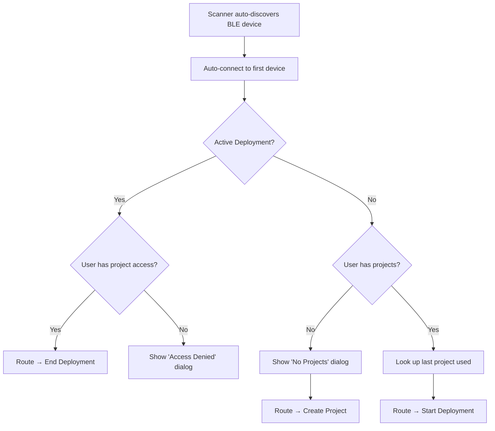
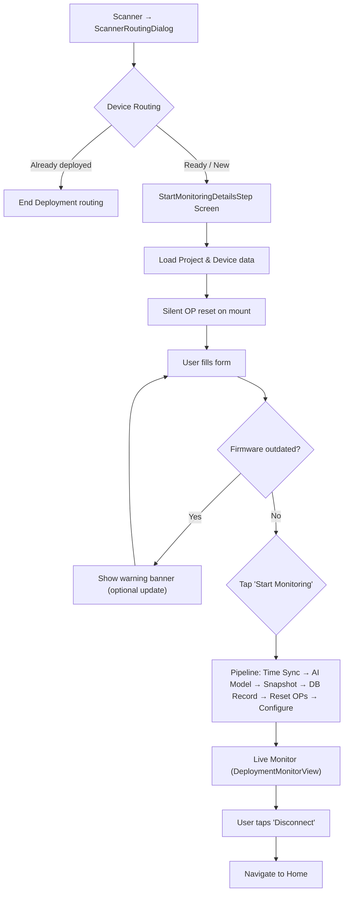
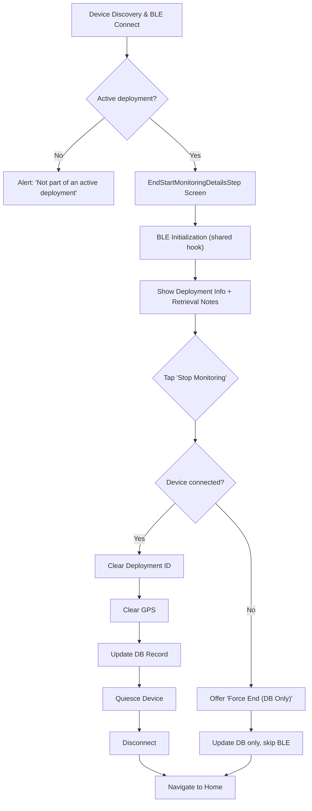

# Device Flows — Scanner Routing, Deployment, and Retrieval

User-facing device workflows covering the full deployment lifecycle: connect → configure → monitor → retrieve. For BLE commands, OP parameters, and hardware testing tools, see [04-ENGINEER-CONSOLE.md](./04-ENGINEER-CONSOLE.md).

---

## Part 1: Scanner Routing (Automated Device Association)

**Components:** `DeviceDiscoveryScreen.tsx`, `ScannerRoutingDialog.tsx`, `useDeviceDiscovery.ts`
**Entry:** Scanner tab (default landing page — auto-scans only when the scanner tab is active via `isActiveTab`)

> [!IMPORTANT]
> The old `PrepareAndTestScreen` has been **removed**. Device configuration and metrics snapshots are captured directly when a user starts a deployment via the `ScannerRoutingDialog`.

### Flow



### ScannerRoutingDialog States

| State | Trigger | User Action |
|-------|---------|-------------|
| `no_access_active_deployment` | Device has `status = deployed` but user lacks access to project | "OK" → Dismiss & Disconnect |
| `no_projects` | User has 0 projects in current org | "Create Project" → New Project screen |

### Direct Deployment Routing

When a new device is found, if the user has at least one project, the system looks up their most recently used project (from past deployments) and seamlessly bridges directly to the `StartMonitoringScreen` without blocking the user.

---

## Part 2: Starting a Deployment

**Screen:** `StartMonitoringScreen.tsx` (`StartMonitoringDetailsStep`)
**Entry:** Scanner tab → auto-connect → ScannerRoutingDialog → "Start Deployment"

### Flow



### BLE Initialization

BLE initialization (selftest, UTC time sync, battery/SD card checks) happens **upstream** in the Scanner connection flow (`useBleInitialization` in `ScannerRoutingDialog`). The results are passed to this screen via the `initPayload` navigation parameter.

On this screen:
- `isInitializing` is hardcoded to `false` (initialization is already complete)
- `initErrors` displays any warnings from the upstream selftest (e.g., LoRaWAN connectivity)
- A silent `resetOps` runs on mount to clear leftover state from previous sessions
- `useBleSession` + `useBleActions` maintain the BLE heartbeat during form entry
- **BLE query optimization:** On screen mount, the firmware versions are resolved silently from `initPayload` rather than actively querying the connected device over BLE. This prevents BLE command queue collisions during screen initialization.
- **Focus state recheck:** When the screen regains focus (e.g., after the operator navigates back from a successful firmware update), the active BLE query `checkStatus()` is run to refresh the firmware status and clear the outdated firmware warning banner automatically.

### User Form

The screen is organized into cards:

**1. Associated Project** (always visible)

| Element | Notes |
|---------|-------|
| Project Selector (`WWSelect`) | Dropdown to pick or switch the attached project. Dynamically recalculates capture method, sensitivity, and feature icons. |
| Feature Icons Row | Visual indicators: 🔄 Activity Detection, ⏱ Timelapse, 📡 LoRaWAN, 🛰 GPS in images, 🧠 AI Model |

**2. LoRaWAN Section** (only if `project.lorawan_required`)

| Element | Notes |
|---------|-------|
| LoRaWAN connectivity check | Auto-pings network on project selection. Shows pass/fail status. |

**3. Notes** (always visible)

| Element | Notes |
|---------|-------|
| Notes (`TextInput`, multiline) | Free-text field for deployment conditions, observations, bait usage, etc. |

**4. Advanced Settings** (collapsible accordion)

| Element | Notes |
|---------|-------|
| Site Name | Dropdown of nearby past deployment locations (auto-selected closest), or free-text input for new sites. Used as both `name` and `locationName` for the deployment record. |
| Camera Height (cm) | Numeric input for height from ground |
| Camera View Image | Collapsible live preview via `CameraViewSection` |
| Motion Detection Test | Collapsible 16×16 grid via `DeploymentMotionDetectionSection` (Activity Detection projects only) |
| Battery Level | Manual check button → reads `battery` via BLE |
| SD Card Status | Manual check button → reads `aiinfo` via BLE |
| Firmware Status | Shows BLE + Himax firmware versions with update buttons → `FirmwareUpdateScreen` |

**5. Firmware Warning Banner** (conditional — shown when any firmware is outdated)

| Element | Notes |
|---------|-------|
| Warning banner | Orange banner with "Update Firmware" button navigating to `FirmwareStatusScreen` with `restrictToLatest: true` (which hides developer version selection dropdowns to keep the operator flow clean and simple). Non-blocking — user can proceed without updating. |

Project settings (capture method, sensitivity, timelapse interval, GPS image tagging) are inherited from the selected project and displayed as feature icons. The user can switch projects at any time via the dropdown.

### Start Deployment Sequence

When the user taps "Start Monitoring", `handleStartDeployment` in `useStartDeployment.ts` executes a multi-step pipeline. Steps 1–2 and 5–6 are shared with the [Dev Deployment](../resources/Dev-Deployment-Guide.md) flow via `deploymentPipeline.ts`.

| Step | Action | Detail |
|------|--------|--------|
| 1 | AI Model Sync | Checks SD card (`dir`) for existing model files before downloading. Only transfers missing files via BLE. Always issues `erasemodel` → `loadmodel` if OPs mismatch. Retries reference data sync if model not found locally. Runs **before** time sync to stay within the firmware's 1000ms IMAGE task inactivity window. |
| 2 | Time Sync | `setutc` — see [BLE Command Reference](./04-ENGINEER-CONSOLE.md#key-commands). Handled by BLE module (not AI processor). |
| 3 | Snapshot Data | Reads `battery`, `network` (if LoRaWAN required), `ver` for deployment record metadata |
| 4 | Create DB Record | `DeploymentService.createDeployment()` → `OutboxService` → `SupabaseSyncService` |
| 5 | Reset to Defaults | `pipeline.resetOps()` calls `executeResetToDefaults()` — shared workflow that intelligently resets parameters, skips tracking counters, and clears AI models. |
| 6 | Configure Device | `pipeline.configureDevice()` — applies [capture method OPs](./04-ENGINEER-CONSOLE.md#capture-method-op-mapping), deployment ID, and GPS |
| 7 | Live Monitor | Transitions to `DeploymentMonitorView` (remains connected) |
| 8 | Disconnect | User initiates manual disconnect (`dis`) |

> [!NOTE]
> **On initial screen mount**, `resetOps` also runs silently once to clear any leftover MD test state (`TEST_MODE_BITS`, extended DPD, etc.) before the user even fills the form.

### OP Factory Reset (`pipeline.resetOps` / `executeResetToDefaults`)

Before applying deployment-specific configuration, the pipeline resets the device using the shared `RESET_TO_DEFAULTS` workflow (`executeResetToDefaults`). This is the exact same logic used by the Engineer Console's manual reset:

1. `AI getop -1` — [bulk fetch](./04-ENGINEER-CONSOLE.md#op-bulk-fetch-optimization-ai-getop--1) current OPs (also wakes device from DPD)
2. **Skips Tracking Counters** — ignores OPs like `NUM_PICTURES`, `NUM_NN_ANALYSES`, etc., so device lifetime history is preserved
3. **Erases AI Model** — automatically sends `erasemodel` if a model is currently loaded
4. Diff against `FACTORY_DEFAULTS` — only writes values that differ to save BLE round trips
5. Clears Deployment ID and zeroizes GPS natively

### Device Configuration (`useDeploymentConfiguration`)

`configure()` performs a single `AI getop -1` bulk fetch at the start, then passes the cached result to both sub-steps below. Only parameters that differ from the target value are actually written.

**A. Set Deployment ID:**
```
AI setdid <deployment-uuid>
AI setop 20 0    (reset IMAGES_FILE_INDEX counter)
AI setop 19 0    (reset IMAGES_COUNT counter)
setgps <lat>,<lng>,<alt>    (if recordGpsInImages is enabled)
setgps 0,0,0               (if recordGpsInImages is disabled / privacy mode)
```

> [!IMPORTANT]
> The legacy OP-based deployment ID approach (`setop 20..27` with UUID chunks) has been removed — firmware no longer supports those parameters. OP 19 and OP 20 are now image directory counters.

**B. Configure Capture Method:** See [Capture Method OP Mapping](./04-ENGINEER-CONSOLE.md#capture-method-op-mapping).

---

## Part 3: Ending a Deployment

**Screen:** `StopMonitoringScreen.tsx` (`EndStartMonitoringDetailsStep`)
**Entry:** Maps → tap deployed device → "Stop Monitoring", or Devices list, or Deployment details

### Flow



### End Deployment Sequence

A single [bulk fetch](./04-ENGINEER-CONSOLE.md#op-bulk-fetch-optimization-ai-getop--1) is performed before Step 1, and the cached result is shared with both Step 1 and Step 4.

| Step | Progress | Action | BLE Command |
|------|----------|--------|-------------|
| 0 | — | **Bulk Fetch OP Parameters** | `AI getop -1` → cached for steps below |
| 1 | 0.2 | Clear Deployment ID | Conditional `AI setop 20-27` (retry 3×, 1s delay, skips unchanged) |
| 2 | — | Clear GPS | `setgps 0 0 0` (non-blocking) |
| 3 | 0.3 | Update Database | `DeploymentService.endDeployment()` |
| 4 | 0.6 | Quiesce Device | Conditional `AI setop` (optimised — uses cached ops) |
| 5 | 0.8 | Disconnect | `dis` |

> [!IMPORTANT]
> **Optimised quiesce** (`optimized=true`) only disables the camera. Skips re-enabling, interval clearing, and stabilisation delays.

### Force End (Disconnected Device)

If the device is not connected, the user can "Force End (Database Only)":
- Updates the monitoring record without BLE commands
- Device must be manually reset later (e.g. via [Engineer Console](./04-ENGINEER-CONSOLE.md))

**Deployment Status IDs:** `1 = Deployed (Active)`, `2 = Recovery (Ended)`, `3 = Failed`

---

## Troubleshooting

### Scanner Routing

| Issue | Cause | Fix |
|-------|-------|-----|
| Dialog not appearing | Device timeout | Clear app data or re-connect |
| "No Projects Found" | User has no projects in current org | Create a project first |
| Infinite connect loop | Navigation guard not reset | Fixed via `hasNavigatedRef` in `useEngineerConnect` |

### Start Deployment

| Issue | Cause | Fix |
|-------|-------|-----|
| "GPS Accuracy Too Low" | Weak signal (dense canopy) | Move to clearing for fix, then return |
| "Deployment Initialisation Failed" | Device handshake timeout | Re-connect and keep phone close |
| "Failed to Set Deployment ID" | BLE write error or AI NACK | Keep phone within 1m; app falls back to GPS-only |
| "No SD Card Detected" | Stale selftest bits (false positive) | App now masks stale AI bits (8-15) before AI processor is woken. If warning persists after reconnection, the SD card is genuinely missing. |
| "AI model update failed" | Reference data not synced or cloud download failed | Pipeline now retries sync automatically. If still failing, check internet connectivity; model file may need manual upload to Supabase storage. |

### End Deployment

| Issue | Cause | Fix |
|-------|-------|-----|
| "No Active Deployment" | Device not deployed or already ended | Verify correct device; check deployment list |
| "Failed to Clear Deployment ID" | BLE write failure after 3 retries | Use "Force End"; manually reset via [Engineer Console](./04-ENGINEER-CONSOLE.md) |
| "Connection Lost" before end | Device out of range or battery dead | Use "Force End (Database Only)" |

---

*Last Updated: May 27, 2026*
