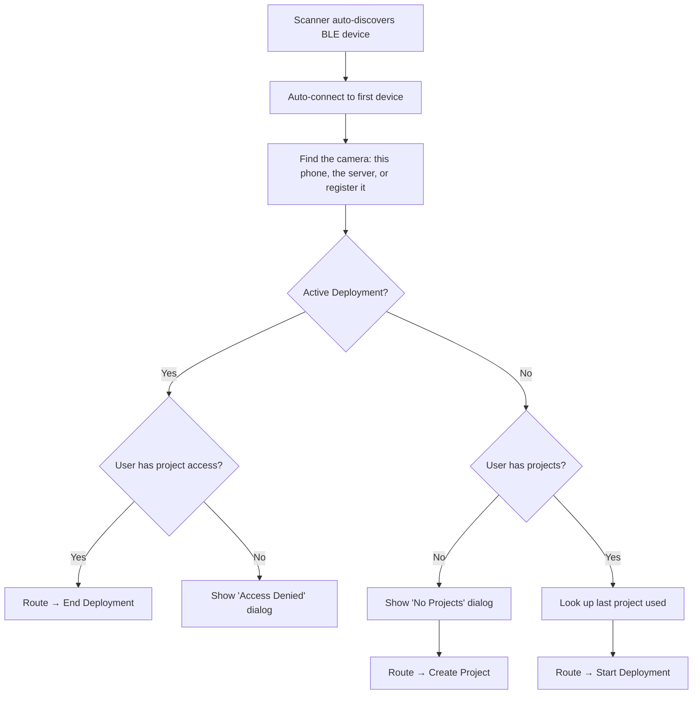
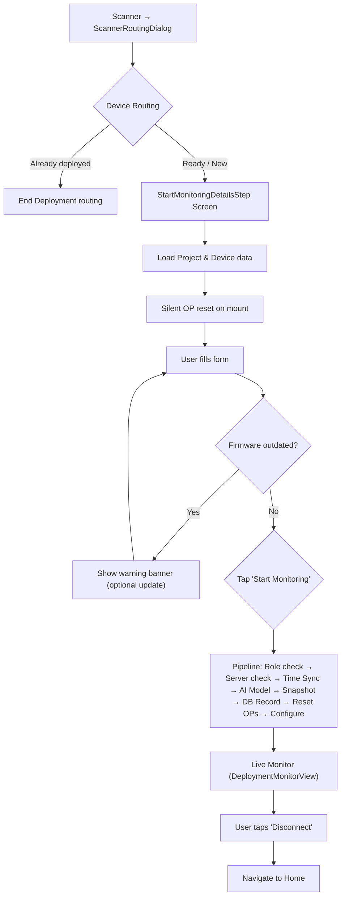
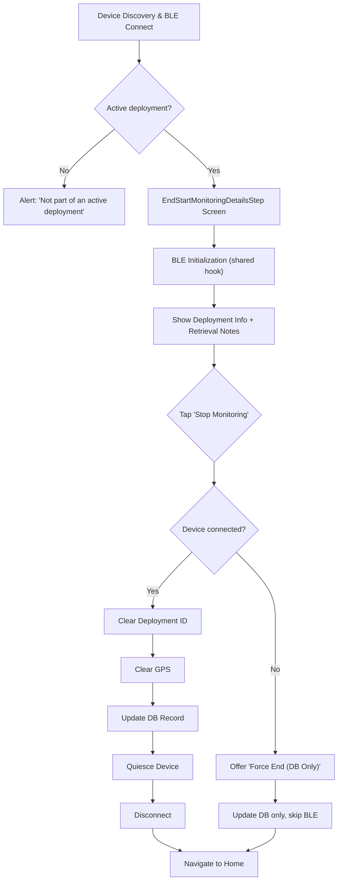

# Device Flows: Scanner Routing, Deployment, and Retrieval

> BLE connection mechanics (scanners, auto-connect trust rules, failure signatures) live in [06-BLE-CONNECTIONS.md](./06-BLE-CONNECTIONS.md).

User-facing device workflows covering the full deployment lifecycle: connect → configure → monitor → retrieve. For BLE commands, OP parameters, and hardware testing tools, see [04-ENGINEER-CONSOLE.md](./04-ENGINEER-CONSOLE.md).

---

## Part 1: Scanner Routing (Automated Device Association)

**Components:** `DeviceDiscoveryScreen.tsx`, `ScannerRoutingDialog.tsx`, `useDeviceDiscovery.ts`
**Entry:** Scanner tab (default landing page, auto-scans only when the scanner tab is active via `isActiveTab`)

> [!IMPORTANT]
> The old `PrepareAndTestScreen` has been **removed**. Device configuration and metrics snapshots are captured directly when a user starts a deployment via the `ScannerRoutingDialog`.

### Flow


```mermaid
flowchart TD
    A["Scanner auto-discovers BLE device"] --> B["Auto-connect to first device"]
    B --> R["Find the camera: this phone, the server, or register it"]
    R --> C{"Active Deployment?"}
    C -- Yes --> D{"User has project access?"}
    D -- Yes --> E["Route → End Deployment"]
    D -- No --> F["Show 'Access Denied' dialog"]
    C -- No --> G{"User has projects?"}
    G -- No --> H["Show 'No Projects' dialog"]
    H --> I["Route → Create Project"]
    G -- Yes --> J["Look up last project used"]
    J --> L["Route → Start Deployment"]
```

### A camera this phone has not met

The scanner looks the camera up by its Bluetooth id, on the phone first
(`DeviceService.getDeviceByBluetoothId`). When the phone has no device for it:

1. **No one signed in:** "Not signed in", and the scanner disconnects.
2. **It asks the server** (`DeviceService.adoptFromServer`, #451), unless NetInfo says the
   phone is offline, and waits up to 5 s. A row this account may read is written to the phone
   under the server's id, with nothing queued, and the flow carries on with it. Nothing found
   means nothing this account may read, not an unregistered camera.
3. **Otherwise it registers the camera** in the current organisation (`DeviceService.createDevice`),
   which queues its `CREATE`.
4. **With no current organisation it cannot**, since only a member of an organisation may
   register a camera, and a project invitation makes no one a member. The scanner says so,
   "Cannot register this camera", and disconnects.

Who may read or register a camera is in [the
contract](../../.agents/skills/references/cross-repo-contracts.md). A camera registered here that
the server already has under another id is settled by the push
([03-DATA-AND-SYNC.md](./03-DATA-AND-SYNC.md#a-camera-the-server-already-has)).

### ScannerRoutingDialog States

| State | Trigger | User Action |
|-------|---------|-------------|
| `no_access_active_deployment` | Device has `status = deployed` but user lacks access to project | "OK" → Dismiss & Disconnect |
| `no_projects` | User has 0 projects in current org | "Create Project" → New Project screen |

### Direct Deployment Routing

When a new device is found, if the user has at least one project, the system looks up their most recently used project (from past deployments) and seamlessly bridges directly to the `StartMonitoringScreen` without blocking the user.

---

## Part 2: Starting a Deployment

**Screen:** `StartMonitoringScreen.tsx` (`StartMonitoringDetailsStep`)
**Entry:** Scanner tab → auto-connect → ScannerRoutingDialog → "Start Deployment"

### Flow


```mermaid
flowchart TD
    A["Scanner → ScannerRoutingDialog"] --> B{"Device Routing"}
    B -- "Already deployed" --> C["End Deployment routing"]
    B -- "Ready / New" --> D["StartMonitoringDetailsStep Screen"]
    
    D --> E["Load Project & Device data"]
    E --> F["Silent OP reset on mount"]
    F --> G["User fills form"]
    G --> H{"Firmware outdated?"}
    H -- Yes --> I["Show warning banner (optional update)"]
    I --> G
    H -- No --> J{"Tap 'Start Monitoring'"}
    J --> K["Pipeline: Role check → Server check → Time Sync → AI Model → Snapshot → DB Record → Reset OPs → Configure"]
    K --> L["Live Monitor (DeploymentMonitorView)"]
    L --> M["User taps 'Disconnect'"]
    M --> N["Navigate to Home"]
```

### BLE Initialization

BLE initialization happens **upstream** in the Scanner connection flow, and the results reach this screen via the `initPayload` navigation parameter. Connecting is **read-only**: it sends six commands and writes nothing (since #268, Sep 2026; it used to send thirteen, including a factory reset):

| Step | Commands | Notes |
|---|---|---|
| `useBleInitialization` | `selftest`, `setutc`, `battery` | There is **no SD card command**: SD status is bit 11 of the self-test bitmask, and battery level is bit 0 plus the `battery` command |
| AI wake | `AI info` | Up to 3 attempts; the Himax is asleep until something addresses it. The only Himax wake on connect |
| Post-wake health | none sent | The Himax broadcasts `Error bits = 0x....` on every wake (on the bench, 60 ms after `Wake`). The shared `selfTestCache` (`src/ble/protocol/selfTestCache.ts`) hears every such line; `useDevicePreDeploymentChecks` waits up to 1.5 s for the one that follows its `AI info` wake and only sends `selftest` if none came. The Capture Picture and camera-readiness checks read the same cache, so a console flow entered after a wake sends no `selftest` either |
| Version checks | `ver`, `AI ver` | Once each. The screen trusts this snapshot; it re-queries only on focus return after a firmware update or on pull-to-refresh |

> [!WARNING]
> **The pre-wake `selftest` and the post-wake broadcast answer different questions.** The
> first runs before the Himax is awake, and at that point the BLE processor still has every
> AI-processor bit (8-15) preset to 1; `useBleInitialization` masks the whole range as
> stale. Only the bits after `AI info` wakes the Himax can show real camera or SD card
> faults. Anything reading self-test bits must know which of the two it is looking at.

> [!NOTE]
> **A deployed device never reaches any of this.** `useDeviceDiscovery` checks
> `getActiveDeploymentForDeviceId` first and routes an active deployment straight to Stop
> Monitoring. That is the phone's own record; an open deployment the phone does not hold is
> asked of the server when the user taps Start Monitoring (#448, below).

**The factory reset happens once, in the Start Monitoring pipeline** (`pipeline.resetOps`, step 5 below), after the user has decided to deploy. It is the guarantee that nothing leaks from a previous deployment or an Engineer Console session (test-mode bits, extended inactivity timeout, flash overrides, intervals). A refused write there aborts the deployment; it is not a warning. The reset writes `FACTORY_DEFAULTS`, which since #304 holds `SLOT_SWITCH` (OP 26) = 0 and `AE_CHECK_INTERVAL` (OP 24) = 0, so **a deployment stays on the camera it started on** and schedules no periodic light wake. It was the other way round until then, and every camera the app had touched switched images on the light verdict. Choosing the camera for a site is manual until that becomes a project setting. See [Light-Sensor.md](../resources/Light-Sensor.md).

On this screen:
- `isInitializing` is hardcoded to `false` (initialization is already complete)
- `initErrors` displays any warnings from the upstream checks (e.g., LoRaWAN connectivity)
- `useBleSession` + `useBleActions` maintain the BLE heartbeat during form entry
- **BLE query optimization:** On screen mount, the firmware versions are resolved silently from `initPayload` rather than actively querying the connected device over BLE. Before #268 the hook re-queried the device whenever the snapshot looked outdated, which on a bench build was every time.
- **Focus state recheck:** When the screen regains focus (e.g., after the operator navigates back from a successful firmware update), the active BLE query `checkStatus()` is run to refresh the firmware status and clear the outdated firmware warning banner automatically.

### User Form

The screen is organized into cards. Each card explains itself through its help button, not
through a subtitle under the title: the standing descriptions were removed on 22 September
2026 so the cards stay short on a phone screen. Put new explanation in the help text.

**1. Associated Project** (always visible)

| Element | Notes |
|---------|-------|
| Project Selector (`WWSelect`) | Dropdown to pick or switch the attached project. Dynamically recalculates capture method, sensitivity, and feature icons. It offers only the projects this account [may deploy into](./03-DATA-AND-SYNC.md#key-tables) (#450). When the scanner opened the screen on a project it may not deploy into, that project stays selected with the reason under the field, and Start says it again. |
| Feature Icons Row | Visual indicators: 🔄 Activity Detection, ⏱ Timelapse, 📡 LoRaWAN, 🛰 GPS in images, 🧠 AI Model |
| Model readiness line | Only when the project has a model: "Model ready on this phone", or "Model not downloaded: connect to download". Offline, a start with a model the phone lacks stops unless the camera already carries it (#333). Refreshes when the pre-download lands the files. |

**2. LoRaWAN Section** (only if `project.lorawan_required`)

| Element | Notes |
|---------|-------|
| LoRaWAN Signal Test | Test Connectivity sends `ping`, and the card says Sent, Not joined yet, Busy, LoRaWAN is off or No answer. Off is the app's reading of `Not joined yet.` on a camera whose OP 32 is 0. The screen also pings once the project is chosen and the camera is connected, and warns unless the answer is Sent or Busy. Both read `src/ble/workflows/lorawanPing.ts` (#348); the nRF's replies are in the [console guide](04-ENGINEER-CONSOLE.md). A ping answered `OK` sends a real uplink. |

**3. Notes** (always visible)

| Element | Notes |
|---------|-------|
| Notes (`TextInput`, multiline) | Free-text field for deployment conditions, observations, bait usage, etc. |

**4. Take a photo of the Watcher** (always visible)

| Element | Notes |
|---------|-------|
| Photo picker (`DeploymentPhotosSection`) | Camera or gallery. The shots are stored on the deployment record so anyone in the project can find the camera again. The help button carries the guidance on which photos to take. |

**5. Advanced Settings** (collapsible accordion)

The cards sit in the order below. Camera View comes first because the operator aims the
camera before naming the site.

| Element | Notes |
|---------|-------|
| Camera View Image | One test photo via `CameraViewSection`, to aim the camera |
| Site Name | Dropdown of nearby past deployment locations (auto-selected closest), or free-text input for new sites. Used as both `name` and `locationName` for the deployment record. |
| Camera Height (cm) | Numeric input for height from ground |
| Motion Detection Test | Collapsible 16×16 grid via `DeploymentMotionDetectionSection` (Activity Detection projects only) |
| Battery Level | Manual check button → reads `battery` via BLE |
| SD Card Status | Manual check button → reads `aiinfo` via BLE |
| Firmware Status | Shows BLE + Himax firmware versions with update buttons → `FirmwareUpdateScreen` |

**6. Firmware Warning Banner** (conditional, shown when any firmware is outdated)

| Element | Notes |
|---------|-------|
| Warning banner | Orange banner with "Update Firmware" button navigating to `FirmwareStatusScreen`: one line per chip, and Update opens the operator's view of the update, from which build to which, one button, one bar and one status line while it runs with the update's last steps under them, one result line (#344). The build picker and the SD-card source are the Engineer Console's view. Non-blocking, user can proceed without updating. |

Project settings (capture method, sensitivity, timelapse interval, GPS image tagging, capture flash, pictures per trigger) are inherited from the selected project and displayed as feature icons. The user can switch projects at any time via the dropdown.

### Start Deployment Sequence

When the user taps "Start Monitoring", `handleStartDeployment` in `useStartDeployment.ts` executes a multi-step pipeline. Steps 1–2 and 5–6 are shared with the [Dev Deployment](../resources/Dev-Deployment-Guide.md) flow via `deploymentPipeline.ts`.

**First it asks the phone's roles** whether this account may deploy into the project (`startRefusal` in `deploymentAccess.ts`, #450, [the rule](./03-DATA-AND-SYNC.md#key-tables)). A viewer, an organisation manager with no role in the project, or a phone with no roles synced yet **stops the start** with "Cannot Start Monitoring" and the reason, before the server is asked or anything is written to the camera. It needs no connection.

**Then, before step 1, it asks the server about the camera** (`DeploymentService.checkServerForOpenDeployment`, #448). The server allows one open deployment per camera ([the contract](../../.agents/skills/references/cross-repo-contracts.md)), and the scanner only knows the phone's own. An open deployment on the server that this phone does not hold, or holds and has not ended, **stops the start** with "Already Deployed", naming its project, who started it when the server will say, and when; nothing has been written to the camera. The check sees only what this account may read (deployments in its projects, in an organisation it manages, or everywhere for a `ww_admin`): **an open deployment in any other project is invisible to it**, and only the refused push shows it. Offline, on a failed read or after 10 s without an answer, it says so in the progress log and carries on.

| Step | Action | Detail |
|------|--------|--------|
| 1 | AI Model Sync | Checks SD card (`dir`) for existing model files before downloading. Only transfers missing files via BLE. Issues `loadmodel` if OPs mismatch, never `erasemodel` first. Retries reference data sync if model not found locally, and **stops the deployment** if the project's model is still missing or has no firmware IDs (#290), or if it is on neither the camera (op14/op15) nor the card and its files cannot be had from the phone's cache or a download (#333), or if the transfer is refused because the camera's BLE firmware is below the [transfer floor](../resources/File-Transfer-Protocol.md#the-ble-firmware-floor) (#289), or if the phone's copy of the model is not a TFLite model, bytes 4 to 7 not `TFL3` (#428). Those four stops come before the deployment is created or anything is written to the device. It also stops when the camera never answers `loadmodel`, after the transfer, because a file the Himax cannot parse halts it (Seeed #241, #428). A failed transfer, or a `loadmodel` the camera refuses, stays a warning. The files are normally already on the phone: the [offline pre-download](./03-DATA-AND-SYNC.md#files-for-the-field) fetches them after each sync. Runs **before** time sync to stay within the firmware's 1000ms IMAGE task inactivity window. |
| 2 | Time Sync | `setutc`, see [BLE Command Reference](./04-ENGINEER-CONSOLE.md#ble-command-reference). Handled by BLE module (not AI processor). |
| 3 | Snapshot Data | Reads `battery`, `network` (if LoRaWAN required), `ver` for deployment record metadata |
| 4 | Create DB Record | `DeploymentService.createDeployment()` → `OutboxService` → `SupabaseSyncService` |
| 5 | Reset to Defaults | `pipeline.resetOps()` calls `executeResetToDefaults()`, shared workflow that intelligently resets parameters, skips tracking counters, and clears AI models. |
| 6 | Configure Device | `pipeline.configureDevice()`, applies [capture method OPs](./04-ENGINEER-CONSOLE.md#capture-method-op-mapping), deployment ID, GPS, the project's capture flash, its pictures per trigger and its detection threshold (C, D and E under [Device Configuration](#device-configuration-usedeploymentconfiguration)). It configures against the op table **`resetOps` returned**, not the pre-reset snapshot |
| 6b | Raw BMP (retired) | The raw BMP option that sat here (OP 18 bit 1) was retired on 21 September 2026 and its code is commented out; OP 18 is not preserved, so the reset leaves it 0. Restoring it means passing `recordRawBmp` to step 6, which doubles OP 5 |
| 6c | Light Verdict and camera | Reads the op table and `AI slots`, and **only measures when something will consume the verdict** (OP 26 or OP 34 = 1). When it does, `pipeline.measureLight()` sends `AI light`, about a second and no photo. Reports DARK/BRIGHT, **names the camera this deployment keeps**, and warns when the project's flash does not suit it (#321). Non-fatal |
| 6d | Model Verification | Reads OP 14/15 and says loudly whether the NN is armed, guarding silent modelless starts. Reuses the table 6c already read back rather than asking again: everything between the two is a read, so the second `getop -1` returned identical bytes and cost about 300 ms of every deployment, measured on the bench on 21 September 2026. Falls back to its own read when 6c got nothing. Non-fatal |
| 7 | Live Monitor | Transitions to `DeploymentMonitorView` (remains connected) |
| 8 | Disconnect | User initiates manual disconnect (`dis`) |

> [!NOTE]
> Step 6c used to take a capture unconditionally, purely to refresh OP 25. With the light sensor off that refreshed nothing, and it cost 21 s on the bench on 20 September 2026 when the sensor refused to stream and the firmware swallowed the failure ([#269](https://github.com/wildlifeai/ww-mobile-app/issues/269), [Seeed#231](https://github.com/wildlifeai/Seeed_Grove_Vision_AI_Module_V2/issues/231)). Firmware built without `AI light` still falls back to a capture, because there only a capture runs a check.
>
> Since #321 the step also reads `AI slots` and compares the project's flash LED against the
> camera in the active slot. An IR flash in front of the RP3 colour camera is invisible to it,
> because of the IR-cut filter, so the LED drains the battery and the night frames are black.
> It **warns and never switches the slot**: #304 deliberately stopped the app moving the camera
> on its own, and a switch costs a reboot at the next sleep. The operator decides.
>
> Every line the progress dialog shows also goes to the logger, prefixed `[DeploymentLog]`. The dialog auto-transitions to the live monitor when the deployment finishes, so this is the only copy that survives a field report or a bench capture.

> [!NOTE]
> Live monitoring after step 7 polls `AI getop 19` once a minute for the stored-image count; the poll is owned by `DeploymentMonitorView`'s single `useDeploymentMonitor` instance, which also feeds the activity log. Each poll wakes the Himax. It makes one attempt, and it stops while the deployment is ending, because it shares the queue with the end sequence (#293).

### OP Factory Reset (`pipeline.resetOps` / `executeResetToDefaults`)

Before applying deployment-specific configuration, the pipeline resets the device via `executeResetToDefaults`, the same shared workflow the Engineer Console's `RESET_TO_DEFAULTS` flow uses, but **not** with the same options.

`pipeline.resetOps()` passes `{ skipIdentityReset: true }`, so it leaves the deployment ID and GPS alone (the very next step, `configureDevice`, sets them). The Engineer Console's manual reset omits that flag and therefore also clears identity, it is the more aggressive of the two.

The shared steps: 

1. `AI getop -1`, [bulk fetch](./04-ENGINEER-CONSOLE.md#op-bulk-fetch-optimization-ai-getop--1) current OPs (also wakes device from DPD)
2. **Skips Tracking Counters**, ignores OPs like `NUM_PICTURES`, `NUM_NN_ANALYSES`, etc., so device lifetime history is preserved
3. **Keeps the AI model**, the pipeline passes `preserveModel: true`, so no `erasemodel` is sent and op14/op15 are left alone; model state belongs to the AI Model Sync step. The Engineer Console's reset omits the flag and does erase a loaded model
4. Diff against `FACTORY_DEFAULTS`, only writes values that differ to save BLE round trips
5. Clears Deployment ID and zeroizes GPS natively
6. **Returns the resulting op table**, the snapshot with every write applied, so the configure step that follows diffs against what the device now holds rather than what it held before the reset

### Device Configuration (`useDeploymentConfiguration`)

`configure()` performs a single `AI getop -1` bulk fetch at the start, then passes the cached result to each sub-step below. Only parameters that differ from the target value are actually written.

**A. Set Deployment ID:**
```
AI setdid <deployment-uuid>
AI setop 20 0    (reset IMAGES_FILE_INDEX counter)
AI setop 19 0    (reset IMAGES_COUNT counter)
AI setgps 45°30'0.00"_S_167°45'0.00"_E_320.50_Above   (if recordGpsInImages is enabled)
AI setgps 0°0'0.00"_N_0°0'0.00"_E_0.00_Above           (if recordGpsInImages is disabled / privacy mode)
```

`formatGPSString` owns this format everywhere, the reset's zeroing included. The firmware turns
underscores into spaces and needs six fields; the decimal `lat,lng,alt` sent here before #315 was
one token it discarded, while still answering `Device GPS set`.

> [!IMPORTANT]
> The legacy OP-based deployment ID approach (`setop 20..27` with UUID chunks) has been removed, firmware no longer supports those parameters. OP 19 and OP 20 are now image directory counters.

**B. Configure Capture Method:** See [Capture Method OP Mapping](./04-ENGINEER-CONSOLE.md#capture-method-op-mapping).

**C. Configure Capture Flash:** the project's four flash columns, written as ops:

```
AI setop 13 <0 none | 1 white | 2 IR>       (FLASH_LED, from projects.flash_led)
AI setop 34 <0 off | 1 light sensor | 2 always on | 3 time of day>   (FLASH_MODE, from projects.flash_mode)
AI setop 35 <minutes after midnight UTC>    (time-of-day window start; 0 in every other mode)
AI setop 36 <minutes>                       (time-of-day window length; 0 in every other mode)
```

The mapping between column values and op values lives in one place,
[`src/utils/projectFlash.ts`](../../src/utils/projectFlash.ts). Mode `off` writes
op13 = 0 as well, because the firmware's `ledFlashIsActive()` gate also arms the
STROBE-driven IR that lights motion frames at night: a project that wants no
flash wants that closed too. Firmware that reports fewer than 37 parameters has
no flash mode, so only op13 is written there.

Until #282 no step wrote either parameter, so every deployment ran with the
flash off and no night IR. The reset before this step writes op13 = 0 and
op34 = 0, which is why step 6 must diff against the post-reset table: against
the older snapshot, a device that already held the project's flash before the
reset would have had both writes skipped and stayed dark.

Before writing, `configure()` calls `flashHold.forget` and `flashLedHold.forget`.
The Engineer Console's motion test holds op34, op13 and op9 when it tests with a
flash, and a test that dropped its link leaves their originals owed for the next
test to pay. The project's LED can be the one that test held, so without the
`forget` a later motion test would take the project's flash off a deployed camera.

**D. Configure Pictures per Trigger:** the project's two burst columns, for motion
and timelapse alike, and the OP 8 they need (#317):

```
AI setop 5 <1 to 10>       (NUM_PICTURES, from projects.photos_per_trigger; twice that with the raw BMP)
AI setop 6 <200 to 2000>   (PICTURE_INTERVAL in ms, from projects.photo_interval_milliseconds)
AI setop 8 <OP 6 + 1000>   (INTERVAL_BEFORE_DPD in ms, when OP 5 is above 1; otherwise it stays 1000)
```

The mapping lives in [`src/utils/projectBurst.ts`](../../src/utils/projectBurst.ts),
and the deployment log says `Pictures per trigger: 3, 1000 ms apart (awake 2000 ms)`,
or `Pictures per trigger: 1 (awake 1000 ms)`, where the awake figure is the OP 8
written. The project counts the JPEGs the user sees. With the raw BMP recorded the
firmware alternates JPEG and BMP through the same count, so OP 5 is doubled; Start
Monitoring records JPEG only since 21 September 2026. OP 5 is in
`RESET_PRESERVED_OPS`, so the reset leaves the card's old count, and OP 6 is reset
to 500, which is why both are written here.

OP 8 is raised because the firmware sleeps while it waits for the next picture once
OP 8 has run out, and the rest of the burst is lost
([Seeed#208](https://github.com/wildlifeai/Seeed_Grove_Vision_AI_Module_V2/issues/208),
`handleEventForWaitForTimer` in `image_task.c`; its `config_file.md` says OP 6 must
be less than OP 8). The capture method (B) writes 1000 first, and this step comes
after it so its value is the one that stays; each write is recorded in the table the
later steps compare against. Nothing after it in the deployment writes OP 8. The
cost is battery: the camera stays up a second past the interval after every
trigger. Before writing, `configure()` calls `keepAwake.forget`, so a hold still
open on the screen (the motion test) or a restore owed by a dropped link cannot
put 1000 back later. The Dev Deployment Test screen writes its own OP 5 and leaves
OP 6 at the reset's 500 and OP 8 at 1000.

**E. Configure Detection Threshold:** the project's `detection_threshold_pct`, as the
model's threshold (#342):

```
AI setop 16 <0 to 126>   (MODEL_THRESHOLD, ceil(projects.detection_threshold_pct * 2.56) - 128)
```

The mapping lives in
[`src/utils/projectDetectionThreshold.ts`](../../src/utils/projectDetectionThreshold.ts),
and the deployment log says `Detection threshold: 57% (op16 18)`. The Himax compares
the target class's int8 softmax output, scale 1/256 and zero point -128, with OP 16,
so OP 16 = q means probability (q + 128) / 256, and the formula gives the smallest q
that reaches the percent: 50% is 0, the lowest the camera can be set, and 99% is 126.
The column's 50 to 99 CHECK is mirrored, and a value outside it deploys as 57.

The default, 57%, is OP 16 = 18, the factory value the reset (step 5) has just
written, so a project on it writes nothing here and deploys exactly as before #342.
Until then nothing else wrote OP 16, so a threshold set on the bench was lost at the
next deployment. It is written whatever the model; with none on the device the
firmware never reads it. The Dev Deployment Test screen writes the selected project's
threshold the same way.

**F. Configure LoRaWAN:** the project's `lorawan_required`, as the LoRaWAN ping period
(OP 32, `LORAWAN_PING_MINUTES`, agreed with Charles Palmer on 6 October 2026):

```
AI setop 32 720   (LoRaWAN required: ping every 12 hours, the factory default)
AI setop 32 0     (not required: never try to join, so no join failures without a gateway)
```

The reset (step 5) has just written 720, so a project that requires LoRaWAN writes
nothing here. The Dev Deployment Test screen writes its own LoRaWAN switch the same way.
Firmware without the flash mode (OP 34) is left alone: before ae_review OP 32 was
`CAM_RESOLUTION`, the hi-res switch, and the reset skips it there too.

---

## Part 3: Ending a Deployment

**Screen:** `StopMonitoringScreen.tsx` (`EndStartMonitoringDetailsStep`)
**Entry:** Maps → tap deployed device → "Stop Monitoring", or Devices list, or Deployment details

### Flow


```mermaid
flowchart TD
    A["Device Discovery & BLE Connect"] --> B{"Active deployment?"}
    B -- No --> C["Alert: 'Not part of an active deployment'"]
    B -- Yes --> D["EndStartMonitoringDetailsStep Screen"]
    
    D --> E["BLE Initialization (shared hook)"]
    E --> F["Show Deployment Info + Retrieval Notes"]
    F --> G{"Tap 'Stop Monitoring'"}
    G --> H{"Device connected?"}
    H -- No --> I["Offer 'Force End (DB Only)'"]
    H -- Yes --> J["Clear Deployment ID"]
    J --> K["Clear GPS"]
    K --> L["Update DB Record"]
    L --> M["Quiesce Device"]
    M --> N["Disconnect"]
    N --> O["Navigate to Home"]
    
    I --> P["Update DB only, skip BLE"]
    P --> O
```

### Who may end it

Before the sequence, and before Force End is offered, the phone's roles are asked whether this
account may end the deployment (`endRefusal` in `deploymentAccess.ts`, #450,
[the rule](./03-DATA-AND-SYNC.md#key-tables)). A viewer, or a member ending someone else's,
gets "Cannot End This Deployment" naming who can, and the camera is not touched. The monitor view says it when Stop Monitoring is pressed,
before the notes, and the disconnected view shows it in place of the Force End text. The
scanner still routes such a user here (it checks only that the project is on the phone), and
"Disconnect & Continue Monitoring" still works. Stop Monitoring on the live monitor after a
start, and the Dev Deployment Test's End deployment, ask the same.

### End Deployment Sequence

A single [bulk fetch](./04-ENGINEER-CONSOLE.md#op-bulk-fetch-optimization-ai-getop--1) is performed before Step 1, and the cached result is shared with both Step 1 and Step 4.

| Step | Progress | Action | BLE Command |
|------|----------|--------|-------------|
| 0 | - | **Bulk Fetch OP Parameters** | `AI getop -1` → cached for steps below |
| 1 | 0.2 | Clear Deployment ID | Conditional `AI setop 20-27` (retry 3×, 1s delay, skips unchanged) |
| 2 | - | Clear GPS | `setgps 0 0 0` (non-blocking) |
| 3 | 0.3 | Update Database | `DeploymentService.endDeployment()` |
| 4 | 0.6 | Quiesce Device | Conditional `AI setop` (optimised, uses cached ops) |
| 5 | 0.8 | Disconnect | `dis` |

> [!IMPORTANT]
> **Optimised quiesce** (`optimized=true`) only disables the camera. Skips re-enabling, interval clearing, and stabilisation delays.

> [!NOTE]
> **The camera's steps are best effort and capped** (#293), through `createEndDeploymentSession` in `src/ble/session/endDeploymentSession.ts`. The bulk fetch is a probe: one attempt, no retry. The first step the Himax does not answer gives up on the camera, and every later `AI` step is skipped without being sent. All of them together get 20 s. `dis` is exempt, because the nRF answers it itself. When the camera is given up on, the dialog says "Camera not answering" at once and ends on "Ended. The camera did not answer, so it keeps taking pictures", held for 6 s instead of 1.5 s: the record is ended, but the camera keeps this deployment's settings and goes on capturing. Before this, a camera asleep in its motion loop cost each step its full timeout and retries, about 40 s under a "Disconnecting" spinner (bench, 5 September 2026).

### Force End (Disconnected Device)

If the device is not connected, the user can "Force End (Database Only)":
- Updates the monitoring record without BLE commands
- Device must be manually reset later (e.g. via [Engineer Console](./04-ENGINEER-CONSOLE.md))

**Deployment Status IDs:** `1 = Deployed (Active)`, `2 = Recovery (Ended)`, `3 = Failed`

---

## Troubleshooting

### Scanner Routing

| Issue | Cause | Fix |
|-------|-------|-----|
| Dialog not appearing | Device timeout | Clear app data or re-connect |
| "No Projects Found" | User has no projects in current org | Create a project first |
| "Cannot register this camera" | The camera is neither on this phone nor one this account may read on the server, and the account has no organisation ([above](#a-camera-this-phone-has-not-met)) | An organisation manager adds the user to the organisation, or registers the camera. If the phone was offline, try again with a connection |
| Infinite connect loop | Navigation guard not reset | Fixed via `hasNavigatedRef` in `useEngineerConnect` |

### Start Deployment

| Issue | Cause | Fix |
|-------|-------|-----|
| "GPS Accuracy Too Low" | Weak signal (dense canopy) | Move to clearing for fix, then return |
| "Deployment Initialisation Failed" | Device handshake timeout | Re-connect and keep phone close |
| "Failed to Set Deployment ID" | BLE write error or AI NACK | Keep phone within 1m; app falls back to GPS-only |
| "No SD Card Detected" | Stale selftest bits (false positive) | App now masks stale AI bits (8-15) before AI processor is woken. If warning persists after reconnection, the SD card is genuinely missing, or was put in while the camera was on (next row). |
| "No SD Card" stays after the card is put back | A card inserted into a powered camera is never mounted: the warm boot fails FatFS `disk_initialize` with `FR_NOT_READY`, and bit 11 stays set on every wake | Power cycle the camera (unplug it or remove the battery), then reconnect. Checking again cannot clear it. Every message that reports bit 11 says so since #325. |
| "AI model update FAILED" | The files were on the phone but the transfer to the card failed, or the camera refused the `loadmodel`. The deployment carries on and records without classifying | Reconnect with the phone close to the camera and run the deployment again. |
| "This project's AI model "..." is not a TFLite model" | The model's file in storage is something else, such as a ZIP archive (the dev backend's model `d0000000-...-0000000000a1` on 8 October 2026). Loading it would halt the camera (Seeed #241) | Replace the model's file with the TFLite model itself. Nothing was written to the camera, and downloading again brings the same file. |
| "The camera did not confirm it loaded this project's AI model" | `loadmodel` went unanswered. The usual cause is a model file the Himax could not parse, which halts it: it answers commands but never captures or sleeps (Seeed #241) | Power cycle the camera (unplug it or remove the battery), reconnect and start again. No deployment was created. |
| "This project's AI model ... is not on this phone" | The model did not come down with the reference data: phone offline, or the model is not `validated` or `deployed` | Get the phone online and start again, which syncs first. If it persists, check the model's status on the website. |
| "This camera's BLE firmware is ..., and sending files to it needs ... or later" | The model has to be sent to the card and the camera's BLE firmware predates the relay FIFO the transfer needs ([the floor](../resources/File-Transfer-Protocol.md#the-ble-firmware-floor)) | Update the BLE firmware, then start again. Nothing was written to the camera. |
| "This project's AI model "..." could not be downloaded" | The model is not on the camera or its card, and the phone could not download its files. Offline, it was assigned after the phone's last sync or the pre-download had not finished; online, the download itself failed | Check the connection, wait for the sync (the Start Monitoring screen then says "Model ready on this phone"), and start again. Nothing was written to the camera. |
| "Cannot Start Monitoring": "You are a viewer in ..." or "You are not a member of ..." | This account may not deploy into the project: a viewer, or an organisation manager with no role in it (#450). The server would refuse the deployment | A project admin makes you a member, or pick a project you are a member of. Nothing was written to the camera. |
| "Cannot Start Monitoring": "Your roles have not reached this phone yet ..." | No role of this account is on the phone, so it cannot tell | Connect so the app syncs, then start again. |
| "Already Deployed": "This camera is still deployed in ..." | The server has an open deployment on this camera that this phone does not hold: another user's, or one started on another phone and not pulled yet (#448) | Whoever runs that deployment ends it. If it is yours, sync, then reconnect: the scanner sends the camera to End Deployment. Nothing was written to the camera. |

### End Deployment

| Issue | Cause | Fix |
|-------|-------|-----|
| "No Active Deployment" | Device not deployed or already ended | Verify correct device; check deployment list |
| "Failed to Clear Deployment ID" | BLE write failure after 3 retries | Use "Force End"; manually reset via [Engineer Console](./04-ENGINEER-CONSOLE.md) |
| "Connection Lost" before end | Device out of range or battery dead | Use "Force End (Database Only)" |
| "Cannot End This Deployment" | This account [may not end it](./03-DATA-AND-SYNC.md#key-tables) (#450): a viewer, a member ending someone else's, or its creator made a viewer since. The server would refuse the end | The person named, or a project admin, ends it. The camera was not touched. |
| "Camera not answering" | The Himax did not answer the probe, usually asleep in its motion loop; the record is ended but the camera keeps capturing | Wake the camera with its button, reconnect, and clear it from the [Engineer Console](./04-ENGINEER-CONSOLE.md) |

---

*Last Updated: May 27, 2026*
