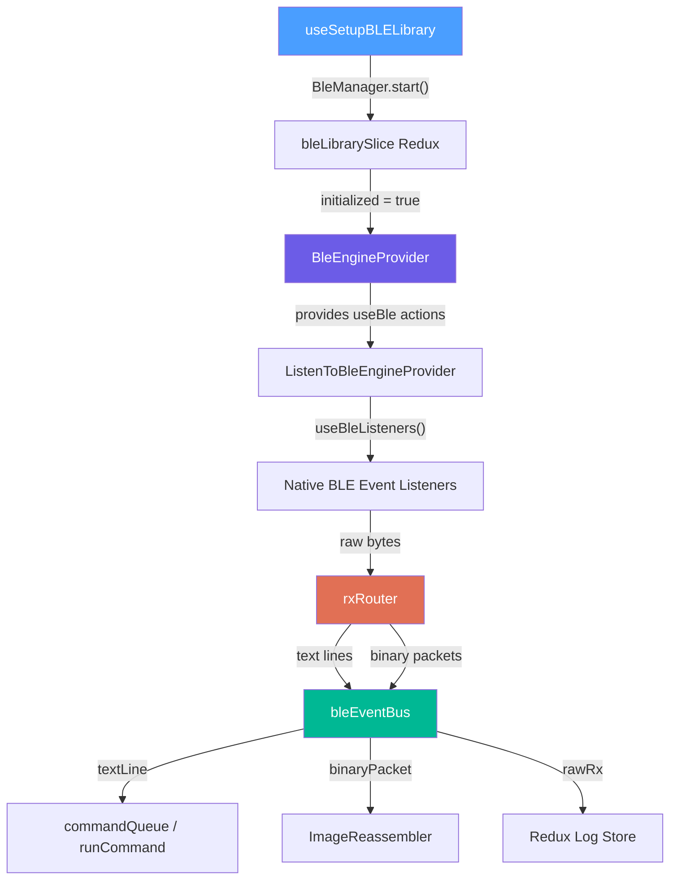
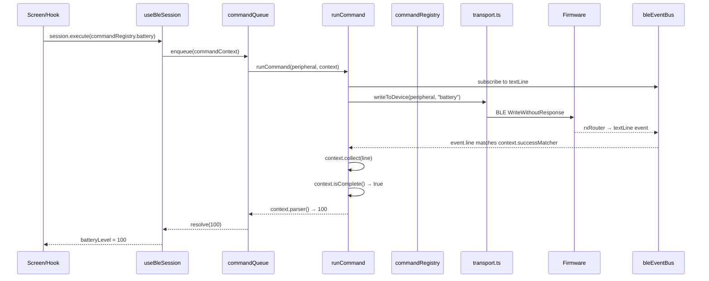
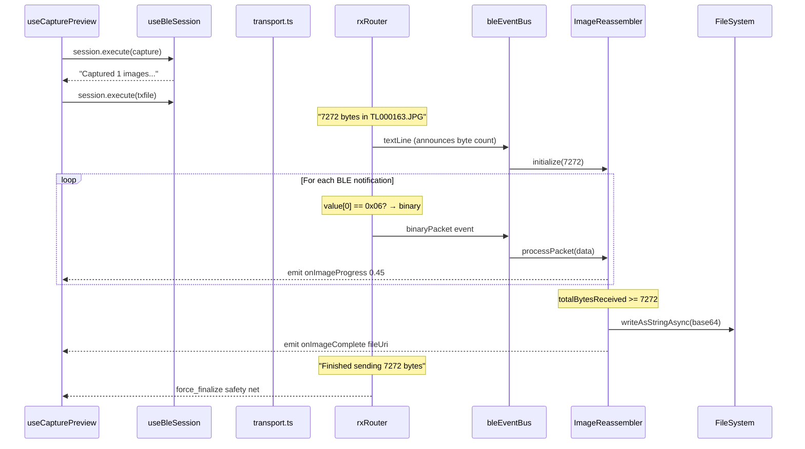
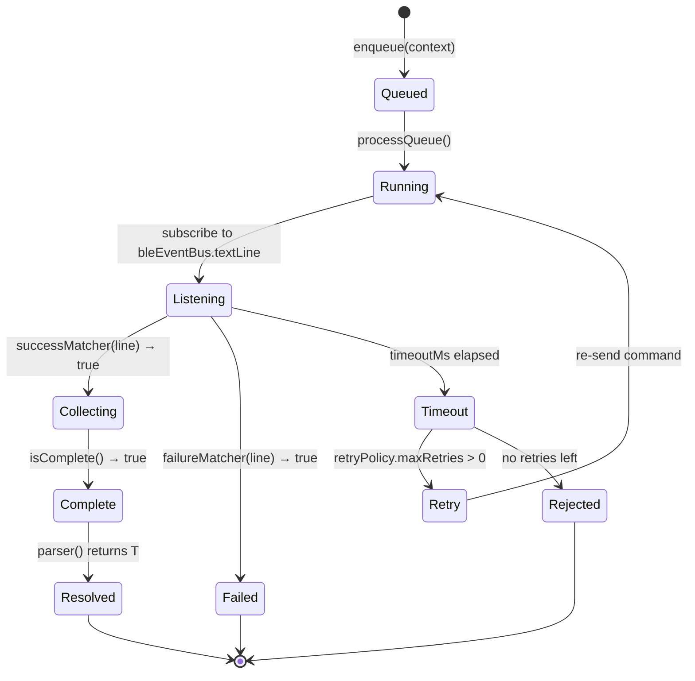
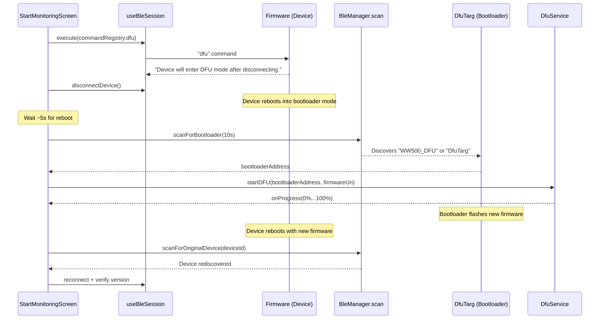

# BLE Architecture & Development Guide

## Overview

The Wildlife Watcher mobile app communicates with hardware devices over **Bluetooth Low Energy (BLE)** using the Nordic UART Service (NUS). All communication is routed through an **event-driven architecture** built around `bleEventBus`, `commandRegistry`, and `commandQueue`. Commands are serialized, matched against typed response parsers, and resolved through a deterministic pipeline.

The app supports two data channels on the same BLE characteristic:
- **Text commands** — ASCII strings for configuration and control (e.g. `AI capture 1 1`)
- **Binary image data** — Raw JPEG bytes prefixed with a `0x06` marker

> [!CAUTION]
> The legacy `BleCommandManager` (`commandManager.ts`) is **dead code**. It exists only as a quarantine trap file that throws an error if imported. All command execution now flows through `bleEventBus` → `commandQueue` → `commandRegistry`. Do NOT reference or import it.

---

## Command Routing Decision Matrix

Developers **must** use the correct write path for each use case. Misuse causes unpredictable firmware behavior.

| Use Case | Correct Path | Why |
|---|---|---|
| Raw terminal / Engineer Console | `writeRaw()` | Passive observation; no state dependencies or expected callbacks. |
| Deployment workflow / Safe UI actions | `bleSession.execute()` | Enqueues deterministic commands, blocks UI, handles timeout and parse matching. |
| Internal serialization | `commandQueue` | Underlying queue engine managing the `bleSession` promises. |
| Binary streaming (Images) | passive `bleEventBus` only | Byte-level routing via `rxRouter`, entirely out-of-band. |
| Motion detection events | passive `textLine` subscription | Async text lines parsed via the stream/event bus. |

> [!WARNING]
> **Never** call `writeRaw()` from a deployment workflow. Never call `bleSession.execute()` from the Engineer Console. These boundaries exist to prevent determinism violations.

---

## Architecture Diagram



> [!IMPORTANT]
> `ListenToBleEngineProvider` **must** exist in the `App.tsx` tree. Without it, no BLE event listeners are registered and the app silently fails to receive any data.

---

## Event Taxonomy (Frozen)

The `bleEventBus` emits **7 event types**. This contract is frozen. All events include `ts` (timestamp) and `deviceId` to prevent crosstalk during multi-device scanning.

| Event | Channel Name | Payload | Purpose |
|---|---|---|---|
| `TEXT_LINE` | `textLine` | `{ line: string, ts: number, deviceId: string }` | Parsed ASCII response from device |
| `RAW_TX` | `rawTx` | `{ command: string, ts: number, deviceId: string }` | Outbound command echo (for logging) |
| `RAW_RX` | `rawRx` | `{ line: string, ts: number, deviceId: string }` | Raw inbound text (for logging) |
| `BINARY_PACKET` | `binaryPacket` | `{ data: Uint8Array, ts: number, deviceId: string, packetNum: number, length: number }` | Image binary data |
| `QUEUE_STATE_CHANGED` | `queueStateChanged` | `{ isBusy: boolean, ts: number, deviceId?: string }` | Command queue busy/idle transitions |
| `DEVICE_SIGNAL` | `deviceSignal` | `{ signal: DeviceSignalType, ts: number, deviceId: string }` | Sleep/Wake/Busy lifecycle signals |
| `HEARTBEAT_PAUSE` | `heartbeatPause` | `{ isPaused: boolean, ts: number, deviceId?: string }` | Pauses/resumes heartbeat during long-running operations |

`DeviceSignalType` is one of: `'SLEEP'`, `'WAKE'`, `'BUSY'`.

**File:** [eventBus.ts](../../src/ble/protocol/eventBus.ts), [deviceSignals.ts](../../src/ble/protocol/deviceSignals.ts)

---

## Data Flow

### Text Command Pipeline (Session-Based)



### Binary Image Pipeline



> [!NOTE]
> Image packets are **intercepted in `rxRouter` before any string conversion** to avoid JS thread congestion. They are routed directly to the `ImageReassembler` via `bleEventBus.binaryPacket` and never logged.

---

## Command Registry Schema (Frozen)

Every command in `commandRegistry.ts` is a factory function that returns a `CommandContext<T>`. The schema is frozen:

```typescript
interface CommandContext<T> {
  id: string;
  name: string;
  build: (params?: any) => string;          // UART payload generator

  // --- Matchers ---
  successMatcher: (line: string) => boolean; // Identifies success lines
  failureMatcher: (line: string) => boolean; // Identifies failure lines
  match: (line: string) => boolean;          // Combined (success OR failure)

  // --- Collection ---
  collect: (line: string) => void;           // Accumulate matched lines
  isComplete: () => boolean;                 // Authority on lifecycle

  // --- Extraction ---
  parser: () => T;                           // Semantic result extraction
  getResult: () => T;                        // Alias (backwards compat)

  // --- Safety & Lifecycle ---
  timeoutMs?: number;                        // Per-command timeout
  retryPolicy?: {
    maxRetries: number;
    delayMs?: number;
  };
  responseMode?: 'single_line' | 'multi_line' | 'fire_and_forget' | 'stream';
  idempotent?: boolean;                      // Safe to retry without side effects
  safeDuringStreaming?: boolean;              // Can be sent during active binary stream

  // --- Hooks ---
  onUnexpected?: (line: string) => void;     // Logging for unmatched lines
  onTimeout?: () => void;                    // Custom timeout recovery
}
```

**Two factory helpers** simplify creation:
- `createSingleLineCommand<T>()` — for commands expecting one response line
- `createMultiLineCommand<T>()` — for commands expecting multiple lines terminated by an end marker

**File:** [commandRegistry.ts](../../src/ble/protocol/commandRegistry.ts)

---

## Multi-Step Workflow Failure Semantics

Deployment workflows (e.g. `useStartDeployment`) execute multiple BLE commands as an ordered pipeline. The failure contract is:

### Atomic Segments
Configuration bursts (e.g. `setdid` → `setgps` → `setop` × N → `setutc`) are executed sequentially via `commandQueue`.

### Fail-Fast Boundary
If **any** step times out or fails (e.g., Step 3 `setop` fails), the entire sequence aborts immediately. The queue does not attempt subsequent commands.

### No Automatic Rollback
The BLE queue does **not** revert previously sent commands. Previously-written OpParams remain on the device. This is intentional — it preserves the device state for debugging.

### Partial Success Handling
The UI tracks partial failures explicitly (e.g. `initErrors = { setUtc: "Timeout" }`), transitioning to a "Failed Initialization" state that requires **operator intervention** to retry the workflow from scratch.

### Operator Recovery Path
1. Operator sees the specific error in the UI (e.g. "GPS set failed: Timeout")
2. Operator can retry the entire deployment flow (which re-runs all steps)
3. Read-before-write checks (`getAllOperationalParams()`) skip parameters already at the target value

> [!IMPORTANT]
> There is no partial-retry mechanism. The entire configuration burst is re-executed from scratch. The read-before-write pattern ensures this is safe (already-set values are skipped).

---

## Core Components

### 1. Library Setup (`useSetupBLELibrary`)

Calls `BleManager.start()` on app launch and updates the `bleLibrarySlice` Redux state. All BLE operations check `initialized` before proceeding.

**File:** [useSetupBLELibrary.ts](../../src/hooks/useSetupBLELibrary.ts)

---

### 2. Engine Provider (`BleEngineProvider`)

React Context that wraps the core `useBle` hook. Provides `startScan`, `stopScan`, `connectDevice`, `disconnectDevice`, `writeRaw` and scan/connection control to the entire app tree.

**File:** [BleEngineProvider.tsx](../../src/providers/BleEngineProvider.tsx)

---

### 3. Listener Provider (`ListenToBleEngineProvider`)

Thin wrapper that calls `useBleListeners()` to register native event handlers. This is the entry point for **all incoming BLE data**.

**File:** [ListenToBleEngineProvider.tsx](../../src/providers/ListenToBleEngineProvider.tsx)

---

### 4. Connection & Write (`useBle`)

The foundational hook providing:

| Function | Purpose |
|---|---|
| `startScan(length?)` | Scan for nearby Wildlife Watcher devices |
| `stopScan()` | Stop an active discovery scan |
| `connectDevice(peripheral)` | Connect, discover services, enable notifications, negotiate MTU |
| `disconnectDevice(peripheral)` | Clean disconnect |
| `writeRaw(peripheral, command)` | Send raw ASCII string to device (no queue, no parsing) |

**Connection sequence on Android:**
1. `BleManager.connect()`
2. `BleManager.retrieveServices()` → find Nordic UART (NUS) service
3. `BleManager.startNotification()` — enable CCCD **before** MTU negotiation
4. `requestConnectionPriority(HIGH)` — reduce connection interval (~11-15ms)
5. `requestMTU(512)` — maximize packet size for image transfers
6. `BleManager.readRSSI()` — read signal strength

**Connection sequence on iOS:**
1. `BleManager.connect()`
2. `BleManager.retrieveServices()` → find Nordic UART (NUS) service
3. `BleManager.startNotification()` — enable CCCD

> [!NOTE]
> iOS handles MTU negotiation automatically at the Core Bluetooth level (typically 185–512 bytes depending on the iOS version and peripheral). `requestConnectionPriority` and `requestMTU` are **Android-only** APIs and are skipped on iOS.

**File:** [useBle.ts](../../src/hooks/useBle.ts)

---

### 5. Rx Router (`rxRouter`)

The first function to touch raw incoming bytes from BLE notifications. Performs binary detection and event routing:

```
if value[0] == 0x06 or (value[0] == 0x80 && value[1] == 0x06):
    → bleEventBus.emitEvent({ type: 'BINARY_PACKET', ... })
    → return early (skip ALL string processing)
else:
    → classify text → bleEventBus.emitEvent({ type: 'TEXT_LINE', ... })
    → bleEventBus.emitEvent({ type: 'RAW_RX', ... })
```

**File:** [rxRouter.ts](../../src/ble/protocol/rxRouter.ts)

---

### 6. BLE Listeners (`useBleListeners`)

Registers four native event handlers via `BleManagerEmitter`:

| Event | Handler |
|---|---|
| `BleManagerDiscoverPeripheral` | Add device to Redux store |
| `BleManagerStopScan` | Mark scan complete, reconcile lost devices |
| `BleManagerDisconnectPeripheral` | Update Redux |
| `BleManagerDidUpdateValueForCharacteristic` | Route to `rxRouter` |

**File:** [useBleListeners.tsx](../../src/hooks/useBleListeners.tsx)

---

### 7. Command Queue (`commandQueue`)

Serialized execution queue ensuring only one command is in-flight at a time. Managed by `runCommand` and `runCommandPipeline`.

**Lifecycle of a command:**



**Key features:**
- **No echo dependency:** Unlike the legacy manager, there is no echo-waiting phase. The command matches against `successMatcher` / `failureMatcher` directly.
- **Retry with policy:** Each command defines its own `retryPolicy` (max retries and optional delay).
- **Queue state broadcasting:** Emits `QUEUE_STATE_CHANGED` events so UI can show busy/idle state.
- **Transport lock enforcement:** When a `transportLock` is held (e.g. during file transfer), the queue rejects new commands unless the caller is the lock holder. The lock holder can pass `{ lockHolder: name }` to `enqueue()` to bypass the guard.

**Files:** [commandQueue.ts](../../src/ble/protocol/commandQueue.ts), [runCommand.ts](../../src/ble/protocol/runCommand.ts), [runCommandPipeline.ts](../../src/ble/protocol/runCommandPipeline.ts), [transportLock.ts](../../src/ble/protocol/transportLock.ts)

---

### 8. Message Classifier (`messageClassifier.ts`)

> [!IMPORTANT]
> **Scope restriction:** `messageClassifier.ts` is retained exclusively for **UI presentation**. It categorizes raw log lines for display in the deployment monitoring UI (color-coding errors, filtering noise like `Sleep`/`Wake`). It has **no authority** over protocol logic. All command matching is handled by `commandRegistry`.

| UI Role | Example | Action |
|---|---|---|
| Error highlighting | `AI NACK`, `I2C error` | Red text in monitoring log |
| Response display | `Battery = 3305mV 100%` | Standard log entry |
| Noise suppression | `Sleep`, `Wake` | Silently discarded from UI |
| Metric translation | `OpParam 19 = 5` | Displayed as "5 stored images" |

**File:** [messageClassifier.ts](../../src/ble/messageClassifier.ts)

---

### 9. BLE Session (`createBleSession` / `useBleSession`)

Provides a deterministic execution API for deployment workflows:

```typescript
const session = useBleSession(bleDevice)

// Execute a single command with typed result
const battery = await session.execute(commandRegistry.battery)

// Execute a command with parameters
const gpsSet = await session.execute(() => commandRegistry.setgps(gpsString))
```

**File:** [createBleSession.ts](../../src/ble/session/createBleSession.ts)

---

### DFU (Device Firmware Update)

The app supports over-the-air firmware updates using the **Nordic DFU** protocol via `@getquip/expo-nordic-dfu`. Both **BLE (nRF)** and **Himax AI processor** firmware can be updated.



> [!IMPORTANT]
> During DFU, the device disconnects and re-advertises under a different name (`WW500_DFU` / `DfuTarg`). The app must suppress "Connection Lost" alerts during this expected disconnection using an `isDfuInProgress` ref flag.

**Files:** [DfuService.ts](../../src/services/DfuService.ts), [DfuScreen.tsx](../../src/screens/Devices/DfuScreen.tsx)

---

### 10. Transport Layer (`transport.ts`)

Handles all BLE write operations. Two functions:

| Function | Purpose | BLE Mode |
|---|---|---|
| `writeToDevice()` | String commands (ASCII) | `writeWithoutResponse()` |
| `writeBinaryToDevice()` | Raw binary packets (file transfer) | `write()` or `writeWithoutResponse()` |

**`writeToDevice()`:**
1. Sanitizes trailing newlines/CRs
2. Converts string to byte array
3. Calls `BleManager.writeWithoutResponse()` with a 5-second timeout
4. Service/characteristic discovery with fallback logic

**`writeBinaryToDevice()`:**
1. Accepts `Uint8Array` directly — no string encoding
2. Supports dual mode via `withResponse` flag:
   - `true` → `BleManager.write()` (reliable, for FILE_START/END)
   - `false` → `BleManager.writeWithoutResponse()` (fast, for FILE_DATA)
3. Used exclusively by the file transfer pipeline

**File:** [transport.ts](../../src/ble/transport.ts)

---

### 11. Image Reassembler (`ImageReassembler`)

Reconstructs JPEG images from multiple BLE packets.

**Packet protocol (3-byte header):**

```
byte[0] = 0x06              // AI_PROCESSOR_MSG_RX_BINARY marker
byte[1] = packetNum          // 1-based, incrementing, wraps 255→1
byte[2] = payloadLength      // declared payload length (always < 255)
byte[3..] = payload          // actual JPEG image data
```

**Features:**
- **Header validation:** Verifies marker byte (0x06), extracts and validates payload length against actual packet size
- **Sequence tracking:** Monitors packet numbers and detects gaps (lost packets) and duplicates
- **Completion:** Finalizes when `totalBytesReceived >= totalExpectedBytes`
- **Watchdog:** 3-second inter-packet timeout triggers `finalizePartial()`
- **Force finalize:** Firmware sends `"Finished sending X bytes."` — `useCapturePreview` catches this and emits `force_finalize`
- **Integrity checks on finalize:** Validates JPEG magic bytes (`0xFF 0xD8`), rejects images below 90% completeness
- **Storage:** Converts binary buffer to base64, writes via `FileSystem.writeAsStringAsync()`

> [!CAUTION]
> Must import from `'expo-file-system/legacy'` (not `'expo-file-system'`). The new v19 API does not export `cacheDirectory`/`documentDirectory` as top-level properties.

**File:** [ImageReassembler.ts](../../src/utils/ImageReassembler.ts)

---

### 12. Capture Preview (`useCapturePreview`)

Orchestrates the full capture-preview flow with robust camera initialization:

1. **Check Camera Status:** `AI getop 10`
   - If disabled (`0`): `AI setop 10 1` -> **Wait for Sleep** -> Wait 1s buffer -> **Send Capture** (wakes device immediately).
2. **Single Image Capture:** Send `AI capture 1 0`
3. **Start Download:** Send `AI txfile .` → Firmware announces byte count
4. **Receive:** `ImageReassembler` processes binary packets via `bleEventBus.binaryPacket`
5. **Completion:** Normal or `force_finalize` fallback
6. **Timeout:** 20-second safety timeout triggers `force_finalize`

**File:** [useCapturePreview.ts](../../src/hooks/useCapturePreview.ts)

---

### 13. Device Initialization (`useBleInitialization`)

Standard post-connection procedure:

1. Wait 1.5s for device stabilization
2. `selftest` → parse error bits → report hardware warnings
3. `setutc` → synchronize device clock to phone UTC

> [!NOTE]
> `setutc` already returns the confirmed time in its response. A separate `getutc` verification is **not** needed.

**File:** [useBleInitialization.ts](../../src/hooks/useBleInitialization.ts)

---

### 14. BLE Heartbeat (`useBleHeartbeat`)

Prevents device disconnection due to the firmware's 60-second BLE inactivity timeout. Implemented as a **pure inactivity timer** — any incoming BLE event resets a 58-second countdown.

**Mounted in:** `ListenToBleEngineProvider` — active whenever any device is connected.

**File:** [useBleHeartbeat.ts](../../src/hooks/useBleHeartbeat.ts)

---

## Debugging

### Engineer Console

The **Engineer Console** (`EngineerConsoleScreen.tsx`) is a **pure terminal** — a passive teletype that sends raw bytes via `writeRaw()` and displays responses via `bleEventBus` subscriptions.

**What the Engineer Console does:**
- Type any text command and see raw hex TX/RX and text responses
- View the Command Reference Modal (filtered to `type === 'command'` only)
- Verify regex patterns match expected firmware output

**What the Engineer Console does NOT do:**
- ❌ Execute workflow actions (DFU, capture, GPS, motion detection)
- ❌ Import or use `useCapturePreview`, `useGPSLocation`, or `firmwareUpdateHelper`
- ❌ Parse or interpret command responses beyond display

> [!WARNING]
> Workflow actions (DFU, capture, GPS set, motion detection test) belong in the **Deployment flow** (`useStartDeployment`, `useBleSession`), not in the console. This separation ensures the console cannot accidentally corrupt deployment state.

### Common Issues

| Problem | Likely Cause | Fix |
|---|---|---|
| Command timeout | `successMatcher` regex doesn't match response | Check regex in `commandRegistry.ts`. Adjust `timeoutMs`. |
| `AI NACK` | AI processor was sleeping | Device auto-wakes. Check logs for retry attempts. |
| Image glitched (shifted/gray) | Firmware buffer overflow | Check for `BLE out: Failed to send` in firmware logs. Ensure `ConnectionPriority.High` succeeded. |
| Image not saved | `expo-file-system` wrong import | Must use `'expo-file-system/legacy'` import path. |
| Silent BLE failures | `ListenToBleEngineProvider` missing | Verify it exists in the `App.tsx` provider tree. |
| No events received | `rxRouter` not classifying | Check `rxRouter.ts` for hex-to-text conversion errors. |

---

## File Structure

```
src/
├── ble/
│   ├── types.ts                    # UI command definitions (CommandNames, COMMANDS)
│   ├── commandManager.ts           # ⛔ DEAD — trap file, throws on import
│   ├── transport.ts                # Raw BLE write + binary write + service discovery
│   ├── messageClassifier.ts        # UI-only log categorization (NOT protocol logic)
│   ├── emitters.ts                 # Legacy EventEmitter3 instances (retained for ImageReassembler)
│   ├── protocol/                   # ✅ NEW — Event-driven command engine
│   │   ├── eventBus.ts             # BleEventBus — central event dispatcher
│   │   ├── rxRouter.ts             # Binary/text classification from raw bytes
│   │   ├── commandRegistry.ts      # Typed command factories with frozen schema
│   │   ├── commandQueue.ts         # Serialized command execution queue
│   │   ├── runCommand.ts           # Single command executor (subscribe → send → resolve)
│   │   ├── runCommandPipeline.ts   # Multi-command sequential executor
│   │   ├── protocolConstants.ts    # Timing constants (timeouts, intervals)
│   │   ├── deviceSignals.ts        # Sleep/Wake/Busy signal types
│   │   ├── streamRegistry.ts       # Active binary stream tracking
│   │   ├── textStreamScope.ts      # Scoped text line listener (auto-cleanup)
│   │   ├── transportLock.ts        # Exclusive transport lock (holder-verified)
│   │   ├── fileTransfer/           # BLE file transfer to SD card
│   │   │   ├── runFileTransferPipeline.ts  # Core ACK state machine
│   │   │   ├── fileTransferPackets.ts      # Binary packet builders
│   │   │   ├── fileTransferTypes.ts        # Types, error codes, retry policies
│   │   │   ├── ackMatcher.ts               # Strict ACK validation
│   │   │   ├── crc16ccitt.ts               # CRC-16/CCITT-FALSE
│   │   │   ├── filenameValidator.ts        # 8.3 format validation
│   │   │   └── __tests__/                  # 62 unit tests
│   │   └── __tests__/              # Protocol unit tests
│   ├── session/                    # ✅ NEW — Deterministic workflow API
│   │   ├── createBleSession.ts     # Session factory for deployment workflows
│   │   └── __tests__/              # Session unit tests
│   ├── workflows/                  # ✅ NEW — Reusable BLE workflow functions
│   └── __tests__/                  # Legacy tests (skipped)
├── hooks/
│   ├── useBle.ts                   # Core: scan, connect, writeRaw
│   ├── useBleListeners.tsx         # Native event handlers → rxRouter
│   ├── useBleSession.ts            # React hook wrapping createBleSession
│   ├── useBleInitialization.ts     # Post-connect: selftest + time sync
│   ├── useBleHeartbeat.ts          # 58s inactivity keep-alive
│   ├── useCapturePreview.ts        # Image capture flow
│   ├── useDeviceSettings.ts        # CONFIG.TXT parameter management
│   ├── useDeploymentConfiguration.ts # Deployment config (bulk getop + conditional writes)
│   └── useSetupBLELibrary.ts       # BleManager.start() lifecycle
├── providers/
│   ├── BleEngineProvider.tsx        # React Context for useBle
│   └── ListenToBleEngineProvider.tsx  # Listener registration
├── redux/slices/
│   └── bleLibrarySlice.ts          # Library init state
└── utils/
    └── ImageReassembler.ts         # Binary → JPEG reconstruction
```

---

## Development Workflow

### Adding a New Command

1. **Define in `commandRegistry.ts`:**
   ```typescript
   myCmd: createSingleLineCommand<number>(
     'myCmd',
     (value?: string) => `my-command ${value || ''}`,
     /MyValue is (\d+)/,
     (match) => parseInt(match[1], 10),
     { timeoutMs: 5000, idempotent: true }
   ),
   ```

2. **Use via session in a deployment hook:**
   ```typescript
   const session = useBleSession(bleDevice)
   const value = await session.execute(commandRegistry.myCmd)
   ```

3. **Or test via Engineer Console:**
   Type `my-command 42` directly — `writeRaw()` sends it, response appears in console log.

### Creating a Multi-Step Workflow

Use `runCommandPipeline` for atomic sequences:

```typescript
import { runCommandPipeline } from '../ble/protocol/runCommandPipeline'

const results = await runCommandPipeline(peripheral, [
  commandRegistry.setdid(deploymentId),
  commandRegistry.setgps(gpsString),
  commandRegistry.setop({ index: 5, value: numPictures }),
  commandRegistry.setutc(),
])
// If any step fails, the pipeline throws immediately
```

---

## Maintenance Rules

- **Adding commands**: Always start in `commandRegistry.ts` — define the factory, then use it via session.
- **UI command definitions**: `types.ts` (`COMMANDS` object) is used only for the Engineer Console's Command Reference Modal.
- **Protocol logic**: Check `protocol/` directory first. Never modify `commandManager.ts`.
- **Message classifier**: Only for monitoring UI display. Never use it for command matching.
- **Performance**: Never log binary image data. Process binary packets before any string operations.
- **Testing**: Use `protocol/__tests__/` for command tests. Use Engineer Console for manual verification.

---

*Last Updated: April 21, 2026*
