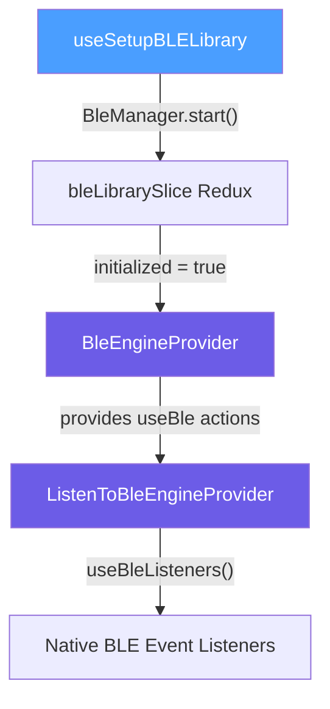
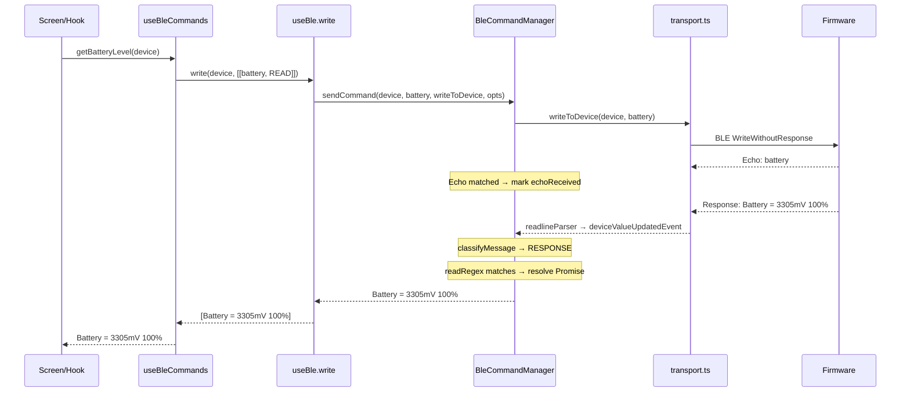
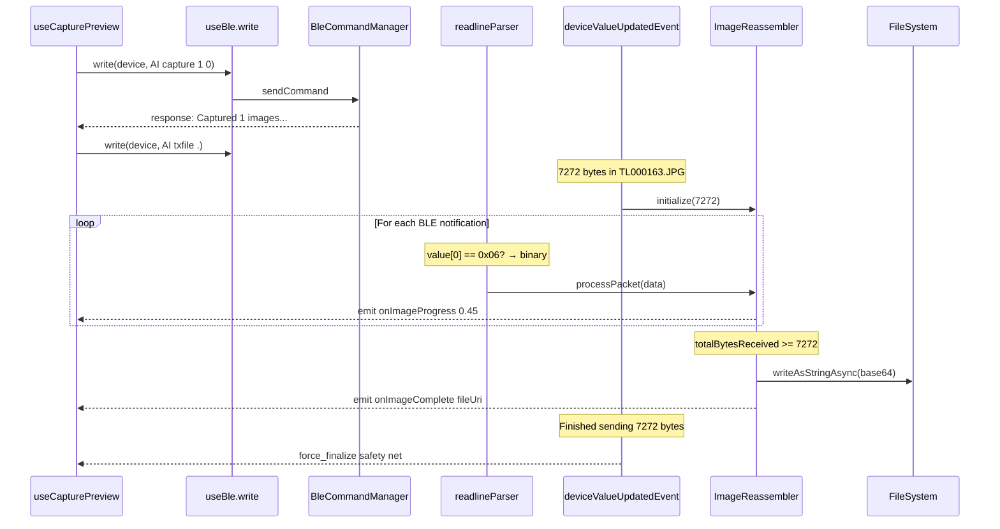
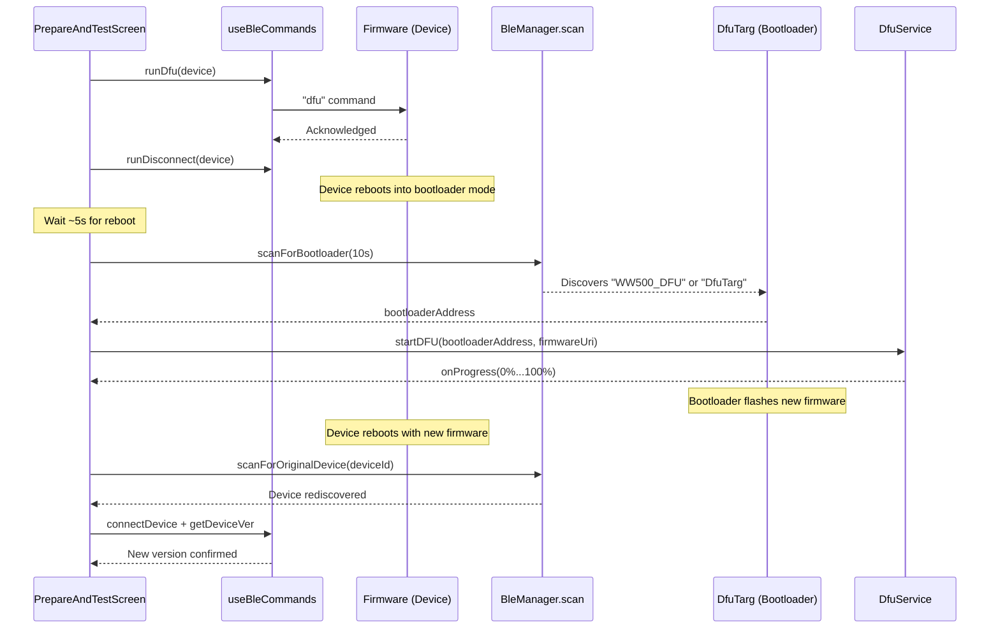
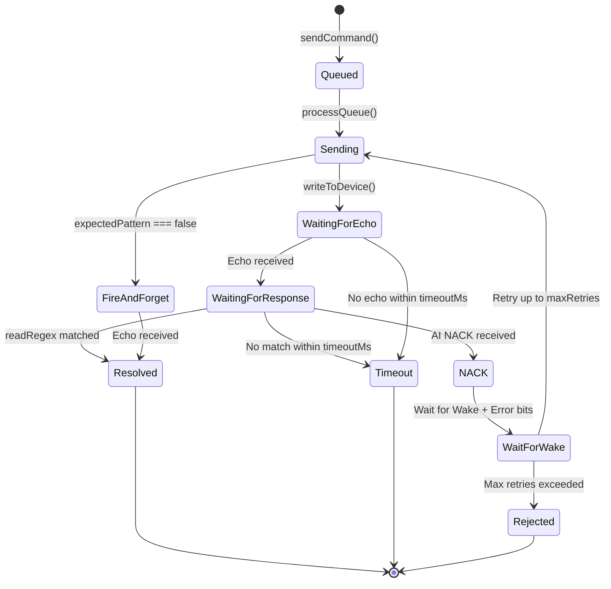
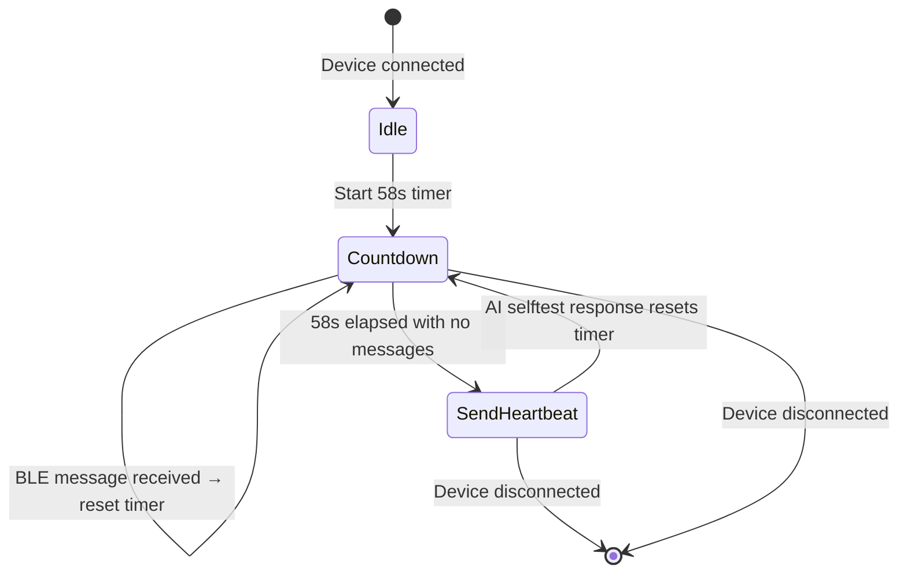

# BLE Architecture & Development Guide

## Overview

The Wildlife Watcher mobile app communicates with hardware devices over **Bluetooth Low Energy (BLE)** using the Nordic UART Service (NUS). All communication is routed through a centralized `BleCommandManager` that serializes commands, matches responses, and handles error recovery.

The app supports two data channels on the same BLE characteristic:
- **Text commands** — ASCII strings for configuration and control (e.g. `AI capture 1 1`)
- **Binary image data** — Raw JPEG bytes prefixed with a `0x06` marker

---

## Architecture Diagram



> [!IMPORTANT]
> `ListenToBleEngineProvider` **must** exist in the `App.tsx` tree. Without it, no BLE event listeners are registered and the app silently fails to receive any data.

---

## Data Flow

### Text Command Pipeline



### Binary Image Pipeline



> [!NOTE]
> Image packets are **intercepted in `readlineParser` before any string conversion** to avoid JS thread congestion. They are routed directly to the `ImageReassembler` and never logged.

---

## Core Components

### 1. Library Setup (`useSetupBLELibrary`)

Calls `BleManager.start()` on app launch and updates the `bleLibrarySlice` Redux state. All BLE operations check `initialized` before proceeding.

**File:** [useSetupBLELibrary.ts](file:///c:/dev/ww/src/hooks/useSetupBLELibrary.ts)

---

### 2. Engine Provider (`BleEngineProvider`)

React Context that wraps the core `useBle` hook. Provides `startScan`, `connectDevice`, `disconnectDevice`, `write` and scan/connection control to the entire app tree.

**File:** [BleEngineProvider.tsx](file:///c:/dev/ww/src/providers/BleEngineProvider.tsx)

---

### 3. Listener Provider (`ListenToBleEngineProvider`)

Thin wrapper that calls `useBleListeners()` to register native event handlers. This is the entry point for **all incoming BLE data**.

**File:** [ListenToBleEngineProvider.tsx](file:///c:/dev/ww/src/providers/ListenToBleEngineProvider.tsx)

---

### 4. Connection & Write (`useBle`)

The foundational hook providing:

| Function | Purpose |
|---|---|
| `startScan(length?)` | Scan for nearby Wildlife Watcher devices |
| `connectDevice(peripheral)` | Connect, discover services, enable notifications, negotiate MTU |
| `disconnectDevice(peripheral)` | Clean disconnect + clear command manager |
| `write(peripheral, data[], options?)` | Route commands through `BleCommandManager` with auto regex lookup |

**Connection sequence on Android:**
1. `BleManager.connect()`
2. `BleManager.retrieveServices()` → find Nordic UART (NUS) service
3. `BleManager.startNotification()` — enable CCCD **before** MTU negotiation
4. `requestConnectionPriority(HIGH)` — reduce connection interval (~11-15ms)
5. `requestMTU(512)` — maximize packet size for image transfers
6. `BleManager.readRSSI()` — read signal strength

**Connection sequence on iOS:**
1. `BleManager.connect()`
2. `BleManager.retrieveServices()` → find Nordic UART (NUS) service
3. `BleManager.startNotification()` — enable CCCD

> [!NOTE]
> iOS handles MTU negotiation automatically at the Core Bluetooth level (typically 185–512 bytes depending on the iOS version and peripheral). `requestConnectionPriority` and `requestMTU` are **Android-only** APIs and are skipped on iOS. The connection interval on iOS is managed by the OS and cannot be changed by the app.

**File:** [useBle.ts](file:///c:/dev/ww/src/hooks/useBle.ts)

---

### DFU (Device Firmware Update)

The app supports over-the-air firmware updates using the **Nordic DFU** protocol via `@getquip/expo-nordic-dfu`. The update flow involves switching the device into bootloader mode and transferring a firmware `.zip` package.



**DFU pipeline steps:**

| Step | Action | Key Code |
|------|--------|----------|
| 1 | Download firmware `.zip` (cached locally via `FirmwareService`) | `FirmwareService.ensureFirmwareDownloaded()` |
| 2 | Send `dfu` command to device via BLE | `runDfu(device)` in `useBleCommands` |
| 3 | Disconnect from device | `runDisconnect(device)` |
| 4 | Wait ~5s for device to reboot into bootloader | `setTimeout(5000)` |
| 5 | Scan for bootloader advertising as `"WW500_DFU"` or `"DfuTarg"` | `scanForBootloader(10000)` |
| 6 | Request Android notification permission (Android 13+) | `PermissionsAndroid.request(POST_NOTIFICATIONS)` |
| 7 | Transfer firmware via Nordic DFU protocol | `DfuService.startDFU(bootloaderAddress, fileUri)` |
| 8 | Wait for device to reboot, scan for original MAC | `scanForOriginalDevice(deviceId)` |
| 9 | Reconnect and verify new firmware version | `connectDevice()` + `getDeviceVer()` |

> [!IMPORTANT]
> During DFU, the device disconnects and re-advertises under a different name (`WW500_DFU` / `DfuTarg`). The app must suppress "Connection Lost" alerts during this expected disconnection using an `isDfuInProgress` ref flag.

**Platform differences:**
- **Android:** The firmware file is copied from the document picker URI to `FileSystem.cacheDirectory` before DFU, because the Nordic DFU library cannot read from content URIs directly. The temporary file is cleaned up in a `finally` block.
- **iOS:** The document picker URI is used directly — no file copy is needed.

**Files:** [DfuService.ts](file:///c:/dev/ww/src/services/DfuService.ts), [DfuScreen.tsx](file:///c:/dev/ww/src/screens/Devices/DfuScreen.tsx), [PrepareAndTestScreen.tsx](file:///c:/dev/ww/src/screens/Devices/PrepareAndTestScreen.tsx)

---

### 5. BLE Listeners (`useBleListeners`)

Registers four native event handlers via `BleManagerEmitter`:

| Event | Handler |
|---|---|
| `BleManagerDiscoverPeripheral` | Add device to Redux store |
| `BleManagerStopScan` | Mark scan complete, reconcile lost devices |
| `BleManagerDisconnectPeripheral` | Clear command manager, update Redux |
| `BleManagerDidUpdateValueForCharacteristic` | Route to `readlineParser` |

**`readlineParser`** is the first function to touch raw incoming data. It performs a **critical binary check:**

```
if value[0] == 0x06 or (value[0] == 0x80 && value[1] == 0x06):
    → route directly to ImageReassembler.processPacket()
    → return early (skip ALL string processing)
else:
    → emit to deviceValueUpdatedEvent for text processing
```

**`deviceValueUpdatedEvent`** then:
1. Converts to hex/text for logging
2. Feeds text to `bleCommandManager.handleIncomingMessage()`
3. Checks for image transfer start messages (e.g. `7272 bytes in TL000163.JPG`)
4. Dispatches to Redux log store

**File:** [useBleListeners.tsx](file:///c:/dev/ww/src/hooks/useBleListeners.tsx)

---

### 6. Command Manager (`BleCommandManager`)

The central nervous system. Manages a **serialized queue** ensuring only one command is in-flight at a time.

**Lifecycle of a command:**



**Key features:**
- **Echo verification:** Every sent command is echoed by firmware. The manager waits for this echo before considering responses.
- **Fire-and-forget mode:** Setting `expectedPattern: false` resolves the command as soon as the echo arrives (no response waiting).
- **AI NACK auto-retry:** If the AI processor is sleeping, firmware responds with `AI NACK`. The manager automatically waits for the wake sequence (`Wake` + `Error bits = 0x0000`) then retries the command.
- **Message listeners:** `waitForMessage(regex, timeout)` lets any hook wait for arbitrary firmware messages without blocking the command queue.

**File:** [commandManager.ts](file:///c:/dev/ww/src/ble/commandManager.ts)

---

### 7. Message Classifier (`messageClassifier.ts`)

Categorizes every incoming text message into one of four types:

| Type | Example | Action |
|---|---|---|
| **ERROR** | `AI NACK`, `I2C error` | Triggers retry or rejection |
| **RESPONSE** | `Battery = 3305mV 100%` | Resolves pending command |
| **UNSOLICITED** | `Sleep`, `MD...`, `setutc ...` | Forwarded to unsolicited listeners |
| **INFO** | `Wake`, `Error bits = 0x0000` | Informational, used in wake sequences |

**Classification order:** ERROR → Expected Pattern → INFO → UNSOLICITED → Default to RESPONSE

**File:** [messageClassifier.ts](file:///c:/dev/ww/src/ble/messageClassifier.ts)

---

### 8. Command Registry (`types.ts`)

Every known command is defined in the `COMMANDS` object. Each entry specifies:

```typescript
{
  name: CommandNames.battery,
  readCommand: "battery",       // String to send for reads
  writeCommand: (v?) => "...",  // Function to build write string
  readRegex: /Battery\s=\s.../,  // Regex to match response
  description: "...",
  type: 'command' | 'process' | 'local',
  timeout?: number,             // Optional per-command timeout
}
```

**Command types:**
- `command` — Direct firmware commands (e.g. `battery`, `ver`, `selftest`)
- `process` — Multi-step workflows (e.g. `CAPTURE_PREVIEW`, `ENABLE_CAMERA`)
- `local` — App-only actions (e.g. `CLEAR_CONSOLE`)

**File:** [types.ts](file:///c:/dev/ww/src/ble/types.ts)

---

### 9. Transport Layer (`transport.ts`)

Handles the raw BLE write operation:
1. Sanitizes trailing newlines/CRs
2. Converts string to byte array
3. Emits local echo to `readlineParserEmitter`
4. Calls `BleManager.writeWithoutResponse()` with a 5-second timeout
5. Service/characteristic discovery with fallback logic

**File:** [transport.ts](file:///c:/dev/ww/src/ble/transport.ts)

---

### 10. Event Buses (`emitters.ts`)

Two global `EventEmitter3` instances:

| Emitter | Purpose |
|---|---|
| `readlineParserEmitter` | Routes text messages between native listener and `deviceValueUpdatedEvent` |
| `imageReassemblerEmitter` | Connects `ImageReassembler` events (`onImageComplete`, `onImageProgress`, `onImageError`, `force_finalize`) to `useCapturePreview` |

**`imageReassemblerEmitter` events:**

| Event | Payload | Description |
|---|---|---|
| `onImageProgress` | `number` (0–1) | Emitted per packet with current completeness ratio |
| `onImageComplete` | `string` (file URI) | Image saved successfully |
| `onImageError` | `string` (error message) | Image corrupt, incomplete, or failed to save |
| `force_finalize` | none | External signal to finalize a stalled transfer |

**File:** [emitters.ts](file:///c:/dev/ww/src/ble/emitters.ts)

---

### 11. High-Level API (`useBleCommands` + `useBleCommandFactory`)

`useBleCommands` exposes ready-to-use functions for every device operation. Uses `createCommand` and `createAction` factory functions to eliminate boilerplate:

```typescript
// Factory creates a typed async function that sends the command and returns the response
const getBatteryLevel = createCommand(write, CommandNames.battery)

// Usage
const batteryStr = await getBatteryLevel(device)
```

**Files:** [useBleCommands.ts](file:///c:/dev/ww/src/hooks/useBleCommands.ts), [useBleCommandFactory.ts](file:///c:/dev/ww/src/hooks/useBleCommandFactory.ts)

---

### 12. Image Reassembler (`ImageReassembler`)

Reconstructs JPEG images from multiple BLE packets.

**Packet protocol (3-byte header):**

```
byte[0] = 0x06              // AI_PROCESSOR_MSG_RX_BINARY marker
byte[1] = packetNum          // 1-based, incrementing, wraps 255→1
byte[2] = payloadLength      // declared payload length (always < 255)
byte[3..] = payload          // actual JPEG image data
```

**Features:**
- **Header validation:** Verifies marker byte (0x06), extracts and validates payload length against actual packet size
- **Sequence tracking:** Monitors packet numbers and detects gaps (lost packets) and duplicates
- **Completion:** Finalizes when `totalBytesReceived >= totalExpectedBytes`
- **Watchdog:** 3-second inter-packet timeout triggers `finalizePartial()`
- **Force finalize:** Firmware sends `"Finished sending X bytes."` — `useCapturePreview` catches this and emits `force_finalize`
- **Integrity checks on finalize:** Validates JPEG magic bytes (`0xFF 0xD8`), rejects images below 90% completeness
- **Error reporting:** Emits `onImageError` event (instead of silently saving corrupt data)
- **Storage:** Converts binary buffer to base64, writes via `FileSystem.writeAsStringAsync()`

> [!CAUTION]
> Must import from `'expo-file-system/legacy'` (not `'expo-file-system'`). The new v19 API does not export `cacheDirectory`/`documentDirectory` as top-level properties.

**File:** [ImageReassembler.ts](file:///c:/dev/ww/src/utils/ImageReassembler.ts)

---

### 13. Capture Preview (`useCapturePreview`)

Orchestrates the full capture-preview flow with robust camera initialization:

1. **Check Camera Status:** `AI getop 10`
   - If disabled (`0`): `AI setop 10 1` -> **Wait for Sleep** -> Wait 1s buffer -> **Send Capture** (wakes device immediately).
   - *Reason:* Camera hardware initializes only on the next wake cycle. We confirm sleep (settings applied), then actively wake it to proceed without delay.
2. **Capture:** Send `AI capture 1 1` (Capture 1 image, interval 1ms to bypass MD check)
3. **Start Download:** Send `AI txfile .` -> Firmware announces byte count
4. **Receive:** `ImageReassembler` processes binary packets
   - Listens for `onImageProgress`, `onImageComplete`, and `onImageError`
5. **Completion:**
   - Normal: `ImageReassembler` detects `bytesReceived >= bytesExpected`
   - Fallback: Firmware sends `"Finished sending X bytes"`. If image incomplete, app waits 500ms grace period then emits `force_finalize`.
6. **Timeout:** 20-second safety timeout triggers `force_finalize`.

**File:** [useCapturePreview.ts](file:///c:/dev/ww/src/hooks/useCapturePreview.ts)

---

### 14. Device Initialization (`useBleInitialization`)

Standard post-connection procedure:

1. Wait 1.5s for device stabilization
2. `selftest` → parse error bits → report hardware warnings
3. `setutc` → synchronize device clock to phone UTC
4. `getutc` → verify time was set

**File:** [useBleInitialization.ts](file:///c:/dev/ww/src/hooks/useBleInitialization.ts)

---

### 15. Device Settings (`useDeviceSettings`)

Manages CONFIG.TXT operational parameters (OpParams 5-13) on the device:

- `updateSettings({ cameraEnabled: true })` — write individual params
- `applyPreset('motion-detect')` — batch apply a preset configuration
- `quiesceDevice()` — ensure device settles after changes (handles DPD latch timing)

**File:** [useDeviceSettings.ts](file:///c:/dev/ww/src/hooks/useDeviceSettings.ts)

---

### 16. BLE Heartbeat (`useBleHeartbeat`)

Prevents device disconnection due to the firmware's 60-second BLE inactivity timeout. Implemented as a **pure inactivity timer** — any incoming BLE message resets a 58-second countdown.



**Key design decisions:**
- Uses `useRef` for `device`, `write`, and `timer` to avoid stale closures in the 58s callback
- Listens via `bleCommandManager.addMessageListener()` — reacts to **all** raw messages, not just specific types
- The heartbeat command (`AI selftest`) produces a response, which itself resets the timer — creating a self-sustaining keep-alive cycle
- Effect only re-registers when `device?.connected` changes, not on every Redux state update

**Mounted in:** `ListenToBleEngineProvider` — active whenever any device is connected.

**File:** [useBleHeartbeat.ts](file:///c:/dev/ww/src/hooks/useBleHeartbeat.ts)

---

## Development Workflow

### Adding a New Command

1. **Define in `types.ts`:**
   ```typescript
   // Add to CommandNames enum
   myCmd = "myCmd",

   // Add to COMMANDS object
   [CommandNames.myCmd]: {
     name: CommandNames.myCmd,
     writeCommand: (value?) => `my-command ${value || ''}`,
     readRegex: /MyValue is (\d+)/,
     description: "Fetches my value",
     type: 'command'
   }
   ```

2. **Expose in `useBleCommands.ts`:**
   ```typescript
   const getMyValue = useMemo(
     () => createCommand(write, CommandNames.myCmd),
     [write]
   )
   ```

3. **Use in UI:**
   ```typescript
   const { getMyValue } = useBleCommands()
   const val = await getMyValue(device)
   ```

### Creating a Multi-Step Process

For complex flows, combine `bleCommandManager.waitForMessage()` with the standard `write()`:

```typescript
// Send command
await write(device, ['AI capture 1 0'])

// Wait for async confirmation (no busy-waiting!)
await bleCommandManager.waitForMessage(/Captured/, 30000)

// Trigger next step
await write(device, ['AI txfile .'])
```

---

## Debugging

### Engineer Console

The **Engineer Console** (`EngineerConsoleScreen.tsx`) is the primary testing ground:
- Type any command to see raw hex TX/RX and text responses
- Verify regex patterns match expected firmware output
- Test image capture flow end-to-end

### Common Issues

| Problem | Likely Cause | Fix |
|---|---|---|
| Command timeout | `readRegex` doesn't match actual response | Check regex in `types.ts`. Increase `timeout` if needed. |
| `AI NACK` | AI processor was sleeping | Handled automatically. Check logs for retry attempts. |
| Device disconnected mid-command | Connection dropped | `BleCommandManager.clear()` is called automatically. Handle error in UI. |
| Image glitched (shifted/gray) | Firmware buffer overflow | Check for `BLE out: Failed to send` in firmware logs. Ensure `ConnectionPriority.High` succeeded. |
| Image not saved | `expo-file-system` wrong import | Must use `'expo-file-system/legacy'` import path. |
| Silent BLE failures | `ListenToBleEngineProvider` missing | Verify it exists in the `App.tsx` provider tree. |

---

## File Structure

```
src/
├── ble/
│   ├── types.ts                 # Command Registry — start here
│   ├── commandManager.ts        # Serialized queue + retry logic
│   ├── transport.ts             # Raw BLE write + service discovery
│   ├── messageClassifier.ts     # Incoming message categorization
│   ├── emitters.ts              # EventEmitter3 instances
│   └── __tests__/               # Unit tests for all above
├── hooks/
│   ├── useBle.ts                # Core: scan, connect, write
│   ├── useBleListeners.tsx      # Native event handlers + data routing
│   ├── useBleCommands.ts        # High-level command API
│   ├── useBleCommandFactory.ts  # Factory for createCommand / createAction
│   ├── useBleInitialization.ts  # Post-connect: selftest + time sync
│   ├── useBleHeartbeat.ts       # 58s inactivity keep-alive
│   ├── useCapturePreview.ts     # Image capture flow
│   ├── useDeviceSettings.ts     # CONFIG.TXT parameter management
│   └── useSetupBLELibrary.ts    # BleManager.start() lifecycle
├── providers/
│   ├── BleEngineProvider.tsx     # React Context for useBle
│   └── ListenToBleEngineProvider.tsx  # Listener registration
├── redux/slices/
│   └── bleLibrarySlice.ts       # Library init state
└── utils/
    └── ImageReassembler.ts      # Binary → JPEG reconstruction
```

---

## Maintenance Rules

- **Adding features**: Always start in `types.ts` — define the command, then expose it.
- **Modifying low-level logic**: Check `commandManager.ts` first.
- **Modifying app-level logic**: Check `useBleCommands.ts` or the relevant process hook.
- **Performance concerns**: Never log image data. Process binary packets before any string operations.
- **Testing**: Use the Engineer Console before building UI. Run `src/ble/__tests__/` for unit tests.
