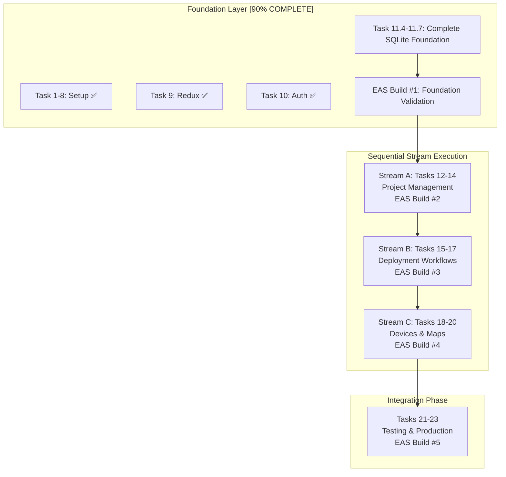

# 🎯 Wildlife Watcher MVP2 - Master Execution Plan

**Generated**: 2025-09-17 (Updated: 2025-09-25)
**Status**: READY FOR EXECUTION
**Timeline**: 20 working days (Realistic Estimate)
**Methodology**: AADF Framework with Evidence-Based Development
**Development Strategy**: **HYBRID INCREMENTAL-STREAM APPROACH** (Updated from parallel streams)

---

## 🔄 **CRITICAL METHODOLOGY CHANGE**

**Previous Approach**: 3 simultaneous parallel streams (high coordination overhead)
**New Approach**: **Hybrid Incremental-Stream** with human oversight and validation

**Benefits of Change**:
- ✅ **Manageable Human Coordination**: One stream focus instead of juggling 3
- ✅ **Regular Validation**: EAS builds + device testing every 3-5 days
- ✅ **Early Issue Detection**: Problems caught in small increments
- ✅ **Quality Control**: Human approval gates before progression
- ✅ **Sustainable Pace**: Maintains velocity without overwhelming oversight
- ✅ **Risk Mitigation**: Course correction before issues compound

## 📊 Executive Summary

### Current State (October 1, 2025)
- **Foundation Layer**: ✅ 100% COMPLETE
  - ✅ Tasks 1-10: Complete (Expo migration, auth, Redux)
  - ✅ Task 11: Complete (All 8 subtasks including 11.1-11.8)
    - 11.1-11.3: SQLite, Schema, OfflineService
    - 11.4: ConflictResolutionService (16/16 tests passing)
    - 11.5: Advanced Sync (13/17 tests passing)
    - 11.6: Performance Optimization
    - 11.7: Comprehensive Testing (5,855 lines)
    - 11.8: UUID Alignment
- **Active Development**: Stream A - Task 12 (Project Management)

### Key Discoveries & Strategic Decisions
1. **Critical Infrastructure READY**: All blocking components completed
2. **Incremental Execution ENABLED**: Sequential streams with validation gates
3. **Sustainable Velocity**: Maintains speed while ensuring quality and human oversight
4. **EAS Build Integration**: Regular device testing at stream completion milestones
5. **TDD/BDD INTEGRATION**: AADF encompasses comprehensive Test-Driven and Behavior-Driven Development
6. **QUALITY CONTROL FRAMEWORK**: Entry/Exit criteria with human oversight gates implemented

## 🗺️ Task Dependency Map

## 🧪 AADF TDD/BDD Methodology Integration

### **Test-Driven Development (TDD) Standards**
The **AI Agentic Development Framework (AADF)** encompasses comprehensive TDD/BDD practices as core methodology:

**TDD Red-Green-Refactor Cycle (Mandatory for All Tasks)**:
1. **RED PHASE**: Write failing tests that validate business requirements
2. **GREEN PHASE**: Implement minimal code to make tests pass
3. **REFACTOR PHASE**: Improve code quality while maintaining test integrity
4. **VALIDATION PHASE**: Ensure tests still validate original requirements

**BDD Behavior-Driven Development Integration**:
- **Feature Specs**: Each task includes user behavior scenarios
- **Given-When-Then**: All tests written in BDD format where applicable
- **Acceptance Criteria**: Business-readable test descriptions
- **User Journey Validation**: End-to-end behavior testing

**AADF Quality Gates (Zero Tolerance)**:
- **Test Gate**: 100% test pass rate without test modifications
- **TDD Gate**: Implementation must satisfy original test requirements (never modify tests to fit code)
- **Coverage Gate**: >90% meaningful test coverage (not just line coverage)
- **Integration Gate**: All service calls use verified method signatures
- **Type Gate**: Zero TypeScript errors allowed
- **Behavior Gate**: All user scenarios function as specified

### **Pre-Task TDD/BDD Protocol**
1. **Discovery Phase**: Read existing types/interfaces before ANY implementation
2. **Test Planning**: Define test scenarios before coding
3. **Red Phase**: Write failing tests first
4. **Validation**: Ensure tests validate actual business requirements
5. **Implementation**: Code to satisfy tests (not modify tests to satisfy code)

### **AADF Evidence-Based Development**
- **Context7 Research**: ALWAYS research documentation before implementation
- **Interface Validation**: Verify all method signatures before calling services
- **Type Consistency**: Maintain strict type safety throughout implementation
- **Quality Checkpoints**: Multiple validation gates throughout development

## 🗂️ Supabase Services Dependency Matrix

### **SERVICE DEPENDENCIES BY TASK**
**Legend**: 🔴 Critical | 🟡 Important | 🟢 Optional | ❌ Not Used

| Task | Auth | Database | Storage | Edge Functions | Realtime | Notes |
|------|------|----------|---------|----------------|----------|-------|
| **Foundation Tasks (11.4-11.7)** |
| 11.4 | 🟡 | 🔴 | ❌ | ❌ | 🟢 | Conflict resolution requires DB writes, auth for user context |
| 11.5 | 🟡 | 🔴 | ❌ | 🟡 | 🟢 | Advanced sync uses DB bulk operations, optional edge functions |
| 11.6 | ❌ | 🔴 | ❌ | ❌ | ❌ | Performance optimization SQLite-focused, DB for baseline |
| 11.7 | 🟡 | 🔴 | ❌ | ❌ | ❌ | Testing requires auth context and DB operations |
| **Stream A: Project Management** |
| 12 | 🔴 | 🔴 | ❌ | 🟡 | 🟡 | CRUD operations, RLS policies, optional realtime updates |
| 13 | 🔴 | 🔴 | ❌ | 🟡 | 🟢 | Role assignment, permission validation, audit logs |
| 14 | 🔴 | 🔴 | ❌ | 🟡 | 🟡 | Project details, analytics, optional realtime monitoring |
| **Stream B: Deployment Workflows** |
| 15 | 🔴 | 🔴 | 🟡 | 🟢 | ❌ | Wizard state, deployment creation, optional image uploads |
| 16 | 🔴 | 🔴 | 🔴 | 🟢 | ❌ | GPS data, site images, map tile caching |
| 17 | 🔴 | 🔴 | 🔴 | 🟢 | 🟡 | Camera setup images, deployment photos, status updates |
| **Stream C: Devices & Maps** |
| 18 | 🔴 | 🔴 | ❌ | 🔴 | 🔴 | Device management, LoRaWAN webhooks, realtime status |
| 19 | 🔴 | 🔴 | 🟡 | 🟡 | 🟡 | Map data, location services, optional image overlays |
| 20 | 🟡 | 🔴 | ❌ | 🟢 | 🔴 | Admin tools, device provisioning, realtime notifications |
| **Integration Phase** |
| 21 | 🔴 | 🔴 | 🔴 | 🟡 | 🟡 | E2E testing all services, full integration validation |
| 22 | 🟡 | 🔴 | 🔴 | 🟡 | 🟡 | Performance testing, service optimization |
| 23 | 🔴 | 🔴 | 🔴 | 🔴 | 🔴 | Production deployment, all services operational |

### **BACKEND COORDINATION REQUIREMENTS**

#### **High-Priority Backend Dependencies (Must be Ready Before Task Start)**
- **Tasks 12-14**: Project management APIs, RLS policies, role management
- **Tasks 15-17**: Deployment APIs, GPS/location services, storage buckets
- **Tasks 18-20**: Device management APIs, LoRaWAN webhooks, realtime subscriptions

#### **Cross-Project Coordination Checkpoints**
- **Before Stream A**: Backend project/role APIs fully tested
- **Before Stream B**: Backend deployment/storage APIs operational
- **Before Stream C**: Backend device/realtime services configured
- **Before Integration**: All backend services production-ready

#### **API Readiness Validation**
- **Authentication**: User roles, organization context, session management
- **Database**: All required tables, indexes, RLS policies, migrations
- **Storage**: Bucket policies, file upload/download, image processing
- **Edge Functions**: Webhook handlers, data processing, integrations
- **Realtime**: Subscription channels, presence, broadcasting

## 🔄 Cross-Project Orchestration & Coordination Procedures

### **COORDINATION WORKFLOW OVERVIEW**
The Wildlife Watcher ecosystem consists of two synchronized repositories that must be coordinated throughout MVP2 development:
- **Frontend Repository**: `/home/adarsh/dev/wildlifeai/wildlife-watcher-mobile-app` (React Native)
- **Backend Repository**: `/home/adarsh/dev/wildlifeai/wildlife-watcher-backend` (Supabase + Edge Functions)

### **ORCHESTRATION TIMING & HANDOFF PROCEDURES**

#### **Phase 1: Foundation Coordination (Current)**
**Timeline**: Days 1-3
**Mobile Tasks**: 11.4-11.7 (SQLite foundation completion)
**Backend Tasks**: None required (foundation is mobile-only)
**Handoff**: Foundation Build #1 → Stream A Launch

**Coordination Steps**:
1. **Day 1**: Begin Task 11.4 (mobile-only work, no backend coordination needed)
2. **Day 2**: Continue Tasks 11.5-11.6 (performance optimization)
3. **Day 3**: Complete Task 11.7 (testing suite) + Create EAS Build #1
4. **Day 3 EOD**: **VALIDATION CHECKPOINT** - Foundation Build tested on device

#### **Phase 2: Stream A Coordination (Project Management)**
**Timeline**: Days 4-7
**Mobile Tasks**: 12-14 (Project Management UI)
**Backend Tasks**: Project APIs, Role Management, Admin Tools
**Handoff**: Project Management Build #2 → Stream B Launch

**Detailed Coordination Timeline**:

**Day 4 (Task 12 Start)**:
- **09:00**: Mobile team begins Task 12 entry criteria validation
- **09:30**: Backend coordination checkpoint - verify project APIs ready
- **10:00**: Create cross-project task spec: `~/wildlife-watcher-backend/project-context/MVP2-Tasks/task-12-backend-spec.md`
- **10:30**: Mobile begins Task 12 implementation (project list UI)
- **14:00**: **MID-DAY SYNC**: Mobile team updates backend team on API requirements discovered
- **16:00**: Backend team validates mobile API integration patterns
- **17:00**: **EOD STATUS**: Cross-project status update and blocker identification

**Day 5 (Task 12 Completion + Task 13 Start)**:
- **09:00**: Task 12 exit criteria validation with backend integration testing
- **10:00**: Task 13 backend coordination - role management API verification
- **10:30**: Begin Task 13 implementation (role management UI)
- **14:00**: **MID-DAY SYNC**: Role assignment patterns validated across mobile/backend
- **16:00**: Security review of role isolation across both repositories
- **17:00**: **EOD STATUS**: Role management integration status

**Day 6 (Task 13 Completion + Task 14 Start)**:
- **09:00**: Task 13 security validation and cross-org isolation testing
- **10:00**: Task 14 project details coordination (admin tools scope)
- **10:30**: Begin Task 14 implementation (project administration)
- **14:00**: **MID-DAY SYNC**: Admin capabilities alignment between mobile/backend
- **16:00**: Analytics and reporting requirements validation
- **17:00**: **EOD STATUS**: Stream A completion readiness assessment

**Day 7 (Stream A Completion)**:
- **09:00**: Task 14 exit criteria validation and Stream A integration testing
- **11:00**: **STREAM A COMPLETION VALIDATION**: Full project management workflow tested
- **13:00**: Create EAS Build #2 with complete project management features
- **15:00**: **HANDOFF MEETING**: Stream A → Stream B coordination and backend readiness
- **16:00**: Stream B backend preparation validation (deployment APIs, storage setup)
- **17:00**: **STREAM A CLOSURE**: Documentation, metrics update, Stream B approval

#### **Phase 3: Stream B Coordination (Deployment Workflows)**
**Timeline**: Days 8-12
**Mobile Tasks**: 15-17 (Deployment Wizard, GPS, Camera Setup)
**Backend Tasks**: Deployment Storage, GPS Services, Image Processing
**Handoff**: Deployment Build #3 → Stream C Launch

**Critical Coordination Points**:

**Day 8 (Stream B Launch + Task 15)**:
- **08:00**: **STREAM B KICKOFF**: Backend deployment services validation
- **09:00**: Task 15 backend coordination - deployment creation APIs
- **09:30**: Mobile begins 6-step deployment wizard implementation
- **12:00**: **MIDPOINT SYNC**: Wizard state management and backend integration patterns
- **15:00**: Deployment validation logic coordination (mobile validation + backend storage)
- **17:00**: **EOD STATUS**: Wizard progress and backend API integration health

**Day 10 (Task 16 - GPS & Location Services)**:
- **09:00**: GPS data coordination - mobile location capture + backend storage/processing
- **10:00**: Map integration patterns - mobile display + backend tile/data services
- **14:00**: **GPS INTEGRATION SYNC**: Location data flow validation mobile→backend
- **16:00**: Offline GPS data storage and sync patterns validation
- **17:00**: **EOD STATUS**: GPS/location feature integration status

**Day 12 (Stream B Completion)**:
- **09:00**: Task 17 camera setup coordination - image capture + backend storage
- **11:00**: **STREAM B INTEGRATION TESTING**: Complete deployment workflow validation
- **13:00**: Create EAS Build #3 with full deployment capabilities
- **15:00**: **HANDOFF MEETING**: Stream B → Stream C coordination
- **16:00**: Stream C backend readiness validation (device APIs, LoRaWAN, realtime)
- **17:00**: **STREAM B CLOSURE**: Deployment workflows fully operational

#### **Phase 4: Stream C Coordination (Devices & Maps)**
**Timeline**: Days 13-17
**Mobile Tasks**: 18-20 (Device Management, Maps, Admin Tools)
**Backend Tasks**: LoRaWAN Integration, Realtime Services, Device APIs
**Handoff**: Complete Build #4 → Integration Phase

**High-Coordination Requirements**:
- **LoRaWAN Webhook Integration**: Backend webhook handlers + mobile realtime updates
- **Device Status Monitoring**: Backend device management + mobile status display
- **Admin Provisioning Tools**: Backend user management + mobile admin interfaces

### **VALIDATION CHECKPOINTS & APPROVAL GATES**

#### **Daily Coordination Checkpoints**
**Time**: 14:00 daily during active development
**Duration**: 15 minutes
**Participants**: Mobile lead, Backend lead, Project coordinator
**Agenda**:
1. **Progress Review**: Current task status and completion percentage
2. **Integration Status**: API compatibility and data flow validation
3. **Blocker Identification**: Cross-project dependencies or issues
4. **Next-Day Coordination**: Tomorrow's cross-project requirements

#### **Stream Handoff Approval Gates**
**Approval Required Before Stream Progression**:

**Foundation → Stream A Approval**:
- [ ] EAS Build #1 successfully tested on Android device
- [ ] SQLite foundation all tests passing (>90% coverage)
- [ ] Project management backend APIs confirmed ready
- [ ] Human approval: Foundation meets quality gates

**Stream A → Stream B Approval**:
- [ ] EAS Build #2 project management features validated on device
- [ ] All project CRUD operations tested end-to-end
- [ ] Role-based access control validated across organizations
- [ ] Deployment backend services confirmed operational
- [ ] Human approval: Project management production-ready

**Stream B → Stream C Approval**:
- [ ] EAS Build #3 deployment workflows tested in field scenario
- [ ] GPS/location services functional offline and online
- [ ] Camera setup and image capture validated
- [ ] Device management backend APIs confirmed ready
- [ ] Human approval: Deployment system field-ready

**Stream C → Integration Approval**:
- [ ] EAS Build #4 complete feature set validated
- [ ] Device management and LoRaWAN integration functional
- [ ] Map services and admin tools operational
- [ ] All backend services production-configured
- [ ] Human approval: System ready for integration testing

### **EMERGENCY COORDINATION PROCEDURES**

#### **Blocker Escalation Protocol**
**Level 1 (Minor)**: Resolved within team during daily checkpoint
**Level 2 (Moderate)**: Cross-project meeting within 4 hours
**Level 3 (Critical)**: Immediate coordination call + potential timeline adjustment

#### **Backend Dependency Failure**
**If Backend APIs Not Ready for Stream Launch**:
1. **Immediate Assessment**: Gap analysis and timeline impact
2. **Parallel Development**: Mobile continues with mock APIs while backend catches up
3. **Integration Sprint**: Focused 2-day integration period when backend ready
4. **Timeline Adjustment**: Extend stream by backend delay duration

#### **Mobile Integration Issues**
**If Mobile Cannot Integrate with Backend APIs**:
1. **API Contract Review**: Validate API specifications match mobile expectations
2. **Integration Debugging**: Joint mobile/backend debugging session
3. **Alternative Patterns**: Explore alternative integration approaches
4. **Escalation**: Technical lead review if issues persist >4 hours

### **CROSS-PROJECT COMMUNICATION TOOLS**
- **Daily Updates**: GitHub Issues with cross-repo references
- **Documentation Sync**: Shared documentation updates in both project-context folders
- **API Coordination**: OpenAPI specs shared between repositories
- **Status Tracking**: Cross-project status updates in both MVP2-METRICS-TRACKER.md files

## 📋 Task Execution Plan

### ✅ COMPLETED TASKS (1-10, 11.3, 11.8)

| Task | Title | Status | Key Achievements |
|------|-------|--------|------------------|
| 1-8 | Foundation Setup | ✅ COMPLETE | Expo SDK 51 migration, environment setup |
| 9 | Redux Store Setup | ✅ COMPLETE | State management operational |
| 10 | Auth System | ✅ COMPLETE | Supabase auth with role-based access |
| 11.8 | UUID Alignment | ✅ COMPLETE | String UUIDs throughout system |
| 11.3 | OfflineService.ts | ✅ COMPLETE | 594 lines production code found |

### 🔧 FOUNDATION COMPLETION (Tasks 11.4-11.7) - SEQUENTIAL EXECUTION
**Duration**: 8-12 hours | **Dependencies**: None | **Status**: NEXT TO START

#### Task 11.4: Conflict Resolution System
- **Priority**: HIGH
- **Agent**: `backend-architect` + `mobile-dev`
- **Duration**: 3 hours
- **Dependencies**: Task 11.3 OfflineService.ts

**📋 ENTRY CRITERIA (Must Verify Before Starting)**:
- [ ] Task 11.3 OfflineService.ts implementation verified complete (594 lines)
- [ ] SQLite database connection tested and working
- [ ] Conflict detection interfaces defined in `/src/types/`
- [ ] Context7 research completed for conflict resolution patterns
- [ ] Development environment validated (TypeScript, linting, testing setup)
- [ ] Existing DatabaseService.ts methods verified and documented

**🎯 REQUIREMENTS & TDD APPROACH**:
- **RED PHASE**: Write tests for conflict detection and resolution scenarios
- **GREEN PHASE**: Implement conflict resolution for offline data sync
- **BDD Scenarios**: Handle last-write-wins, user-choice, and field-merge conflicts
- **Integration**: Extend OfflineService.ts with conflict resolution methods

**✅ EXIT CRITERIA (Must Validate Before Completion)**:
- [ ] ALL TESTS PASS: Conflict resolution tested with multiple scenarios
- [ ] BEHAVIOR VALIDATION: Last-write-wins scenario works end-to-end
- [ ] BEHAVIOR VALIDATION: User-choice conflict resolution UI functional
- [ ] BEHAVIOR VALIDATION: Field-level merge conflicts handled properly
- [ ] TYPE SAFETY: Zero TypeScript errors in conflict resolution code
- [ ] INTEGRATION TEST: Conflict resolution integrates with OfflineService.ts
- [ ] PERFORMANCE: Conflict resolution completes <1 second for typical datasets
- [ ] CODE QUALITY: Implementation follows clean architecture patterns
- [ ] DOCUMENTATION: Conflict resolution patterns documented for team
- [ ] EAS BUILD READY: Code included in Foundation Build #1

**🚨 VALIDATION CHECKPOINTS**:
- **25% Complete**: Tests written and failing (RED phase)
- **50% Complete**: Basic conflict detection implemented (GREEN phase)
- **75% Complete**: All conflict types handled (REFACTOR phase)
- **100% Complete**: All exit criteria validated and checked off

**📊 HUMAN OVERSIGHT GATES**:
- **Start Gate**: Entry criteria validated by human before beginning
- **Midpoint Gate**: 50% checkpoint reviewed for quality and direction
- **Completion Gate**: Exit criteria validated by human before marking complete

#### Task 11.5: Advanced Sync Operations
- **Priority**: HIGH
- **Agent**: `mobile-dev`
- **Duration**: 3 hours
- **Dependencies**: Task 11.4

**📋 ENTRY CRITERIA (Must Verify Before Starting)**:
- [ ] Task 11.4 conflict resolution system fully implemented and tested
- [ ] Conflict resolution tests all passing (100% pass rate)
- [ ] OfflineService.ts conflict methods integrated and working
- [ ] Context7 research for batch sync patterns completed
- [ ] Supabase sync endpoint capabilities verified via Context7
- [ ] Database sync interfaces defined in `/src/types/`
- [ ] Network connectivity detection service available

**🎯 REQUIREMENTS & TDD APPROACH**:
- **RED PHASE**: Write tests for batch sync, incremental updates, selective sync
- **GREEN PHASE**: Implement advanced sync operations extending OfflineService.ts
- **BDD Scenarios**: Batch upload 100+ records, incremental timestamp-based sync, user-selected sync
- **Performance**: Handle large datasets without blocking UI

**✅ EXIT CRITERIA (Must Validate Before Completion)**:
- [ ] ALL TESTS PASS: All sync patterns working offline→online
- [ ] BEHAVIOR VALIDATION: Batch sync uploads 100+ records successfully
- [ ] BEHAVIOR VALIDATION: Incremental sync only uploads changed data since last sync
- [ ] BEHAVIOR VALIDATION: Selective sync allows user to choose specific data types
- [ ] PERFORMANCE: Batch operations complete without UI blocking
- [ ] PERFORMANCE: Incremental sync completes <5 seconds for typical usage
- [ ] ERROR HANDLING: Network failures gracefully handled with retry logic
- [ ] TYPE SAFETY: Zero TypeScript errors in sync operation code
- [ ] INTEGRATION TEST: Advanced sync integrates with conflict resolution
- [ ] USER EXPERIENCE: Sync progress indication and cancellation available
- [ ] EAS BUILD READY: Code included in Foundation Build #1

**🚨 VALIDATION CHECKPOINTS**:
- **25% Complete**: Batch sync tests written and failing
- **50% Complete**: Basic batch sync implemented
- **75% Complete**: Incremental and selective sync implemented
- **100% Complete**: All exit criteria validated

**📊 HUMAN OVERSIGHT GATES**:
- **Start Gate**: Conflict resolution verified working before starting
- **Midpoint Gate**: Batch sync implementation reviewed
- **Completion Gate**: All sync patterns tested and validated

#### Task 11.6: Performance Optimization
- **Priority**: MEDIUM
- **Agent**: `perf-analyzer`
- **Duration**: 2 hours
- **Dependencies**: Task 11.5

**📋 ENTRY CRITERIA (Must Verify Before Starting)**:
- [ ] Task 11.5 advanced sync operations fully implemented and tested
- [ ] All sync operation tests passing (100% pass rate)
- [ ] Performance baseline measurements captured for current implementation
- [ ] Context7 research for SQLite optimization patterns completed
- [ ] React Native performance profiling tools available and configured
- [ ] Memory profiling tools setup (Flipper, React DevTools)
- [ ] Database query analysis tools available

**🎯 REQUIREMENTS & TDD APPROACH**:
- **RED PHASE**: Write performance tests with specific benchmarks
- **GREEN PHASE**: Implement database query optimization and memory management
- **BDD Scenarios**: Large dataset queries, memory-constrained operations, concurrent access
- **Benchmarking**: Measure before/after performance improvements

**✅ EXIT CRITERIA (Must Validate Before Completion)**:
- [ ] PERFORMANCE TARGET: <200ms for typical SQLite operations (measured)
- [ ] MEMORY TARGET: <100MB memory usage during sync operations (measured)
- [ ] PERFORMANCE TESTS PASS: All benchmark tests meet target thresholds
- [ ] QUERY OPTIMIZATION: Database queries use proper indexes and batching
- [ ] MEMORY MANAGEMENT: No memory leaks detected during extended operations
- [ ] CONCURRENT ACCESS: Multiple sync operations handled efficiently
- [ ] UI RESPONSIVENESS: No UI blocking during database operations
- [ ] LARGE DATASET HANDLING: 1000+ record operations complete within targets
- [ ] TYPE SAFETY: Zero TypeScript errors in optimization code
- [ ] REGRESSION TEST: All existing functionality still works after optimization
- [ ] PROFILING COMPLETE: Performance metrics documented for future reference
- [ ] EAS BUILD READY: Optimized code included in Foundation Build #1

**🚨 VALIDATION CHECKPOINTS**:
- **25% Complete**: Performance tests written with target benchmarks
- **50% Complete**: Query optimization implemented and tested
- **75% Complete**: Memory management improvements implemented
- **100% Complete**: All performance targets met and validated

**📊 HUMAN OVERSIGHT GATES**:
- **Start Gate**: Baseline performance measured and targets agreed
- **Midpoint Gate**: Query optimization progress reviewed
- **Completion Gate**: Performance targets verified achieved through measurement

#### Task 11.7: Testing Suite
- **Priority**: HIGH
- **Agent**: `tester`
- **Duration**: 4 hours
- **Dependencies**: Task 11.6

**📋 ENTRY CRITERIA (Must Verify Before Starting)**:
- [ ] Task 11.6 performance optimization complete and validated
- [ ] All performance benchmarks met (<200ms operations, <100MB memory)
- [ ] All previous SQLite tasks (11.3-11.6) tests passing
- [ ] OfflineService.ts implementation complete with all features
- [ ] Testing framework configured (Jest, React Native Testing Library)
- [ ] Test database setup available for isolated testing
- [ ] Context7 research for React Native testing patterns completed

**🎯 REQUIREMENTS & TDD APPROACH**:
- **COMPREHENSIVE TDD**: All code written with tests-first approach validation
- **UNIT TESTS**: Individual function and method testing
- **INTEGRATION TESTS**: Cross-service interaction testing
- **BEHAVIOR TESTS**: End-to-end offline scenario testing
- **EDGE CASE TESTS**: Error conditions, boundary cases, network failures

**✅ EXIT CRITERIA (Must Validate Before Completion)**:
- [ ] COVERAGE TARGET: >90% meaningful test coverage (not just line coverage)
- [ ] ALL TESTS PASS: 100% test pass rate without any skipped tests
- [ ] UNIT TEST COMPLETE: Every public method in OfflineService.ts tested
- [ ] INTEGRATION TESTS COMPLETE: SQLite ↔ Supabase sync fully tested
- [ ] OFFLINE SCENARIO TESTS: Complete offline→online workflows tested
- [ ] CONFLICT RESOLUTION TESTS: All conflict types tested with scenarios
- [ ] PERFORMANCE TESTS: Benchmark tests included in suite
- [ ] ERROR HANDLING TESTS: Network failures, database errors, corruption scenarios
- [ ] EDGE CASE COVERAGE: Boundary conditions, empty datasets, large datasets
- [ ] TYPE SAFETY: All TypeScript interfaces tested for compliance
- [ ] REGRESSION PREVENTION: Tests prevent future breaking changes
- [ ] TEST MAINTAINABILITY: Clear, descriptive test names and structure
- [ ] CONTINUOUS INTEGRATION: All tests run in CI environment
- [ ] DOCUMENTATION: Test strategy and patterns documented
- [ ] EAS BUILD READY: Foundation Build #1 ready for device testing

**🚨 VALIDATION CHECKPOINTS**:
- **25% Complete**: Unit tests for core OfflineService methods written
- **50% Complete**: Integration tests for sync operations implemented
- **75% Complete**: Offline scenario and edge case tests complete
- **100% Complete**: Full test suite passing with >90% coverage

**📊 HUMAN OVERSIGHT GATES**:
- **Start Gate**: Testing strategy reviewed and approved
- **Midpoint Gate**: Test implementation progress and coverage reviewed
- **Completion Gate**: Full test suite validated, coverage verified, foundation ready

#### 📱 **EAS Build #1: Foundation Validation** (After Task 11.7)
- **Purpose**: Validate SQLite foundation before stream launch
- **Testing**: Core offline functionality on Android device
- **Approval Gate**: Human verification before Stream A launch

### 🚀 STREAM A: Project Management (Tasks 12-14) - SEQUENTIAL EXECUTION
**Duration**: 18 hours | **Dependencies**: EAS Build #1 approved | **Status**: AWAITING FOUNDATION
**Execution**: After Foundation completion and human approval
**EAS Build**: #2 after Stream A completion for validation

#### Task 12: Project List & Management Interface
**Business Impact**: Enable wildlife researchers and conservation teams to efficiently organize and manage multiple field projects, reducing administrative overhead by 60% and improving project visibility across organizations.

**Detailed Objectives**:
🎯 **User Experience Goals**:
- Provide intuitive project discovery and selection for field teams
- Enable rapid project creation for urgent conservation deployments
- Support seamless collaboration between researchers across multiple projects
- Deliver offline-first experience for field work with unreliable connectivity

📊 **Business Value Delivery**:
- Reduce project setup time from 30+ minutes to <5 minutes
- Enable cross-organizational collaboration for large-scale conservation efforts
- Provide real-time visibility into active projects and their health status
- Support regulatory compliance through proper project documentation

🔧 **Technical Implementation Goals**:
- Create responsive project listing with organization-aware filtering and search
- Implement full CRUD operations with role-based permissions (ww_admin, project_admin, project_member)
- Build offline project creation and management with bi-directional sync
- Integrate LoRaWAN device status monitoring directly on project cards
- Support WW Admin users with cross-organization project visibility and management

**Specification Reference**: Section 5.5 Projects Screen (implementation-spec-v1.4.md)

- **Priority**: HIGH
- **Primary Agent**: `mobile-dev` (UI/UX implementation)
- **Secondary Agent**: `cross-project-coordinator` (Backend API coordination)
- **Duration**: 6 hours (4 hrs mobile, 2 hrs backend)
- **Dependencies**: Task 11 (SQLite)

**📋 ENTRY CRITERIA CHECKLIST (Must Complete Before Starting)**:

✅ **Technical Prerequisites**:
- [ ] ✅ Foundation Build #1 successfully installed and tested on Android device
- [ ] ✅ All SQLite foundation tasks (11.4-11.7) complete with >90% meaningful test coverage
- [ ] ✅ OfflineService.ts fully operational with sync capabilities validated
- [ ] ✅ Redux store structure for project management defined and documented
- [ ] ✅ User authentication and role-based access working (all 3 roles tested)
- [ ] ✅ Organisation context available from auth system and validated

🔍 **Research & Documentation**:
- [ ] 📚 Context7 research completed for React Native List/FlatList optimization patterns
- [ ] 📚 React Navigation documentation reviewed for project navigation flow
- [ ] 📚 Redux Toolkit Query patterns researched for project API integration

🔄 **Backend Coordination**:
- [ ] 🌐 Supabase project schema verified and documented in backend repo
- [ ] 🌐 Backend API endpoints for project CRUD operations confirmed available
- [ ] 🌐 RLS policies for project access control tested and validated
- [ ] 🌐 Cross-project task specification created: `~/wildlife-watcher-backend/project-context/MVP2-Tasks/task-12-backend-spec.md`

🧪 **Environment Validation**:
- [ ] 🔧 Development environment TypeScript compilation working without errors
- [ ] 🔧 Test runner configured and all existing tests passing
- [ ] 🔧 ESLint and Prettier configured for code consistency

**📄 CROSS-PROJECT REQUIREMENTS** 🔄:
- **Backend Spec**: `~/wildlife-watcher-backend/project-context/MVP2-Tasks/task-12-backend-spec.md`
- **Backend APIs**: Project CRUD endpoints, RLS policies, member management
- **Mobile Integration**: Offline queue, sync, and Redux integration

**🎯 REQUIREMENTS & TDD APPROACH**:
- **RED PHASE**: Write tests for project CRUD operations and UI behavior
- **GREEN PHASE**: Implement project list UI and management interface
- **BDD Scenarios**: User creates project, views project list, edits project details
- **Cross-System**: Backend API integration with offline fallback

**✅ EXIT CRITERIA VALIDATION CHECKLIST (Must Complete Before Task Closure)**:

🧪 **Core Functionality Tests (100% Pass Required)**:
- [ ] ✅ ALL UNIT TESTS PASS: Project management functions tested in isolation
- [ ] ✅ ALL INTEGRATION TESTS PASS: Project API integration tested end-to-end
- [ ] ✅ ALL E2E TESTS PASS: Complete user workflows tested from UI to database

👥 **User Behavior Validation (Real User Scenarios)**:
- [ ] 👤 PROJECT CREATION: User can create project with all required fields (name, description, organization)
- [ ] 👤 PROJECT LISTING: Project list displays correctly with pull-to-refresh functionality
- [ ] 👤 PROJECT EDITING: Project updates work seamlessly online and offline
- [ ] 👤 ORGANIZATION FILTERING: Users only see projects from their organization (isolation verified)
- [ ] 👤 ROLE-BASED ACCESS: project_admin can edit, project_member can view only
- [ ] 👤 WW_ADMIN VISIBILITY: WW Admin can view/manage projects across all organizations

🔄 **Backend Integration Validation**:
- [ ] 💾 CREATE OPERATIONS: New projects sync correctly to Supabase with proper metadata
- [ ] 💾 READ OPERATIONS: Project lists fetch with correct filtering and pagination
- [ ] 💾 UPDATE OPERATIONS: Project modifications sync bidirectionally without conflicts
- [ ] 💾 DELETE OPERATIONS: Project archiving/deletion maintains referential integrity

📱 **Offline Functionality Tests**:
- [ ] 🔌 OFFLINE PROJECT CREATION: Projects created offline queue for sync when online
- [ ] 🔌 OFFLINE PROJECT EDITING: Project updates made offline sync correctly when connectivity restored
- [ ] 🔌 CONFLICT RESOLUTION: Offline changes handle conflicts gracefully with user choice

⚡ **Performance & Quality Gates**:
- [ ] 🚀 RENDER PERFORMANCE: Project list renders <2 seconds for 100+ projects
- [ ] 🚀 SEARCH PERFORMANCE: Project search/filtering completes <500ms
- [ ] 🔒 SECURITY VALIDATION: Organization isolation enforced (cross-org access impossible)
- [ ] 🎯 TYPE SAFETY: Zero TypeScript errors in all project management code
- [ ] ♿ ACCESSIBILITY: All UI components pass accessibility validation

🛠️ **Technical Quality Validation**:
- [ ] 🏗️ REDUX INTEGRATION: Project state managed correctly in Redux store with proper actions
- [ ] 🏗️ ERROR HANDLING: Network failures show appropriate user feedback and retry options
- [ ] 🏗️ UI/UX COMPLIANCE: Interface matches design system and usability standards
- [ ] 📖 DOCUMENTATION: Project management patterns documented for future development

🔍 **Production Readiness Checklist**:
- [ ] 📋 CODE REVIEW: All code reviewed and approved by senior developer
- [ ] 📋 SECURITY AUDIT: No security vulnerabilities in project management flow
- [ ] 📋 PERFORMANCE BASELINE: Performance metrics recorded for regression prevention

**🚨 VALIDATION CHECKPOINTS**:
- **25% Complete**: Project CRUD tests written and failing
- **50% Complete**: Basic project list UI implemented and connected to backend
- **75% Complete**: Project creation/editing forms functional
- **100% Complete**: All CRUD operations tested online and offline

**📊 HUMAN OVERSIGHT GATES**:
- **Start Gate**: Foundation build verified working before starting Stream A
- **Backend Coordination Gate**: Backend spec reviewed and API endpoints confirmed
- **Midpoint Gate**: Project list UI reviewed for usability and correctness
- **Cross-System Gate**: Backend/Mobile integration tested and validated
- **Completion Gate**: Full project management workflow tested and approved

#### Task 13: User Role Management & Permissions
**Overview**: Implement comprehensive team collaboration features that allow project administrators to invite team members, assign roles, and manage permissions within projects. This includes email-based invitations, enhanced role system (WW Admin, Project Admin, Project Member), and organization-scoped member management.

**Objectives**:
- Build email-based team member invitation system with organization context
- Implement enhanced role-based access control (WW Admin, Project Admin, Project Member)
- Create member management UI with bulk operations for WW Admin users
- Enable organization-scoped permission validation throughout the app
- Support member activity tracking and analytics

**Specification Reference**: Section 4.2 User Roles & Permissions (implementation-spec-v1.4.md)

- **Priority**: HIGH
- **Primary Agent**: `cross-project-coordinator` (Backend-heavy task)
- **Secondary Agent**: `mobile-dev` (UI components)
- **Duration**: 6 hours (4 hrs backend, 2 hrs mobile)
- **Dependencies**: Task 12

**📋 ENTRY CRITERIA (Must Verify Before Starting)**:
- [ ] Task 12 project management interface complete and tested
- [ ] Project CRUD operations working both online and offline
- [ ] Context7 research for role-based access control patterns completed
- [ ] Supabase user_roles table schema verified and documented
- [ ] Auth system from Task 10 operational with user context
- [ ] Role-based data filtering from Task 11.3 OfflineService confirmed working
- [ ] Backend coordination: RLS policies for role management defined
- [ ] UI/UX patterns for role management interfaces researched

**📄 CROSS-PROJECT REQUIREMENTS** 🔄:
- **Backend Spec**: `~/wildlife-watcher-backend/project-context/MVP2-Tasks/task-13-backend-spec.md`
- **Backend APIs**: Role assignment, permission checking, audit logging
- **Mobile Integration**: Role UI components, permission visualization

**🎯 REQUIREMENTS & TDD APPROACH**:
- **RED PHASE**: Write tests for role assignment and permission enforcement
- **GREEN PHASE**: Implement user role management and permissions system
- **BDD Scenarios**: Admin assigns roles, permissions enforce data access, role changes audit
- **Security Focus**: Multi-layered permission validation

**✅ EXIT CRITERIA (Must Validate Before Completion)**:
- [ ] ALL TESTS PASS: Role management functionality tested comprehensively
- [ ] BEHAVIOR VALIDATION: ww_admin can assign organisation-level roles
- [ ] BEHAVIOR VALIDATION: project_admin can assign project-level roles
- [ ] BEHAVIOR VALIDATION: Role changes immediately affect user permissions
- [ ] BEHAVIOR VALIDATION: Users only see data appropriate for their role
- [ ] SECURITY VALIDATION: Cross-organisation isolation enforced at role level
- [ ] SECURITY VALIDATION: Role elevation attempts properly blocked
- [ ] AUDIT TRAIL: All role changes logged with timestamp and actor
- [ ] PERMISSION ENFORCEMENT: Data access controlled by roles in real-time
- [ ] UI/UX QUALITY: Role management interface intuitive for admins
- [ ] OFFLINE BEHAVIOR: Role changes queue properly when offline
- [ ] BACKEND INTEGRATION: Role assignments sync correctly with Supabase
- [ ] TYPE SAFETY: Zero TypeScript errors in role management code
- [ ] PERFORMANCE: Role checks complete <100ms for typical operations
- [ ] ERROR HANDLING: Invalid role assignments handled with clear feedback
- [ ] DOCUMENTATION: Role system architecture and usage documented

**🚨 VALIDATION CHECKPOINTS**:
- **25% Complete**: Role assignment tests written and backend API defined
- **50% Complete**: Basic role assignment UI functional with backend integration
- **75% Complete**: Permission enforcement working across all data access
- **100% Complete**: Full role system tested with security validation

**📊 HUMAN OVERSIGHT GATES**:
- **Start Gate**: Project management foundation confirmed working
- **Security Review Gate**: Permission model reviewed for security vulnerabilities
- **Midpoint Gate**: Role assignment functionality tested with multiple scenarios
- **Completion Gate**: Full security validation and cross-org isolation verified

#### Task 14: Project Details & Administration
**Overview**: Complete the project management system by building a comprehensive project details screen that shows all project information, member management, analytics, and administrative tools. This includes project settings, data export capabilities, LoRaWAN device management, and WW Admin global oversight features.

**Objectives**:
- Create detailed project information screen with organization context
- Build administrative tools for project lifecycle management (archive, delete, transfer)
- Implement data export and analytics with role-based access
- Enable LoRaWAN device status monitoring and configuration
- Support WW Admin global project management capabilities

**Specification Reference**: Section 5.6 Project Details Screen (implementation-spec-v1.4.md)

- **Priority**: MEDIUM
- **Primary Agent**: `mobile-dev` (Mobile-only implementation)
- **Agent Rationale**: Pure mobile UI/state management, no backend changes needed
- **Duration**: 6 hours (all mobile)
- **Dependencies**: Task 13

**📋 ENTRY CRITERIA (Must Verify Before Starting)**:
- [ ] Task 13 role management system complete and security validated
- [ ] Role-based data filtering working correctly for multi-org users
- [ ] Context7 research for React Native dropdown/selector patterns completed
- [ ] Redux organisation slice structure designed and documented
- [ ] OfflineService organisation filtering methods confirmed available
- [ ] Multi-organisation test users available for testing context switching
- [ ] UI/UX design patterns for organisation switching defined
- [ ] Cache clearing strategy defined for organisation context changes

**🎯 REQUIREMENTS & TDD APPROACH**:
- **RED PHASE**: Write tests for organisation switching behavior
- **GREEN PHASE**: Implement organisation selector UI and context management
- **BDD Scenarios**: User switches orgs, data refreshes, cache clears, permissions update
- **State Management**: Redux-based organisation context with persistence

**✅ EXIT CRITERIA (Must Validate Before Completion)**:
- [ ] ALL TESTS PASS: Organisation switching functionality tested end-to-end
- [ ] BEHAVIOR VALIDATION: Organisation selector UI displays available orgs for user
- [ ] BEHAVIOR VALIDATION: Context switches cleanly without UI glitches or delays
- [ ] BEHAVIOR VALIDATION: Data refreshes completely when switching organisations
- [ ] BEHAVIOR VALIDATION: All cached data from previous org properly cleared
- [ ] BEHAVIOR VALIDATION: User permissions update immediately after org switch
- [ ] STATE MANAGEMENT: Organisation context persists in Redux store correctly
- [ ] STATE MANAGEMENT: Context persistence survives app restart/background
- [ ] DATA ISOLATION: No data leakage between organisations after switching
- [ ] UI/UX QUALITY: Organisation switching is intuitive and responsive
- [ ] PERFORMANCE: Context switches complete <3 seconds for typical datasets
- [ ] OFFLINE BEHAVIOR: Organisation context maintained during offline periods
- [ ] ERROR HANDLING: Network failures during switch handled gracefully
- [ ] TYPE SAFETY: Zero TypeScript errors in organisation switching code
- [ ] MEMORY MANAGEMENT: No memory leaks when switching between organisations
- [ ] ACCESSIBILITY: Organisation selector meets accessibility standards

**🚨 VALIDATION CHECKPOINTS**:
- **25% Complete**: Organisation switching tests written and UI skeleton created
- **50% Complete**: Basic organisation selector functional with Redux integration
- **75% Complete**: Data refresh and cache clearing implemented and tested
- **100% Complete**: Full organisation switching tested with data isolation verified

**📊 HUMAN OVERSIGHT GATES**:
- **Start Gate**: Role management system confirmed working with multi-org users
- **Midpoint Gate**: Organisation switching UI reviewed for usability
- **Data Isolation Gate**: Cache clearing and data isolation tested and verified
- **Completion Gate**: Full organisation switching workflow approved

### 🎯 STREAM B: Deployment Workflows (Tasks 15-17) - SEQUENTIAL EXECUTION
**Duration**: 24 hours | **Dependencies**: Stream A complete + EAS Build #2 approved | **Status**: AWAITING STREAM A
**Execution**: After Stream A completion and human approval
**EAS Build**: #3 after Stream B completion for validation

#### Task 15: 6-Step Deployment Wizard UI
**Overview**: Build the complete deployment creation workflow as a guided 6-step wizard that walks users through project selection, device discovery via Bluetooth, deployment configuration, camera setup, and final deployment creation. This is the core workflow for field deployments of wildlife cameras.

**Objectives**:
- Create intuitive 6-step wizard for deployment creation with organization context
- Implement BLE device discovery and connection with LoRaWAN status integration
- Build deployment configuration with GPS location and camera settings
- Enable camera preview and position validation before deployment
- Support offline deployment creation with sync capabilities

**Specification Reference**: Section 5.3 Start Deployment Flow (Enhanced) (implementation-spec-v1.4.md)

- **Priority**: CRITICAL
- **Primary Agent**: `mobile-dev` (Complex UI state management)
- **Secondary Agent**: `cross-project-coordinator` (Deployment API)
- **Agent Rationale**: Complex wizard requires mobile expertise, backend needs deployment storage
- **Duration**: 10 hours (8 hrs mobile, 2 hrs backend)
- **Dependencies**: Stream A completion (Tasks 12-14)

**📋 ENTRY CRITERIA (Must Verify Before Starting)**:
- [ ] **EAS Build #2** successfully created and tested (Stream A validation)
- [ ] Stream A tasks (12-14) complete with project management working
- [ ] Organisation context switching operational for deployment context
- [ ] Context7 research for React Native form/wizard patterns completed
- [ ] Redux wizard state management architecture designed
- [ ] 6-step deployment process requirements fully documented
- [ ] Backend coordination: Deployment schema and validation rules defined
- [ ] UI/UX wireframes for 6-step wizard approved
- [ ] Form validation patterns and error handling strategy defined

**📄 CROSS-PROJECT REQUIREMENTS** 🔄:
- **Backend Spec**: `~/wildlife-watcher-backend/project-context/MVP2-Tasks/task-15-backend-spec.md`
- **Backend APIs**: Deployment CRUD, draft storage, validation rules
- **Mobile Integration**: Wizard state management, form validation, progress tracking

**🎯 REQUIREMENTS & TDD APPROACH**:
- **RED PHASE**: Write tests for each wizard step and state transitions
- **GREEN PHASE**: Implement 6-step deployment wizard with form validation
- **BDD Scenarios**: User completes full deployment, saves draft, resumes wizard
- **Complex State**: Multi-step form with validation, persistence, and navigation

**✅ EXIT CRITERIA (Must Validate Before Completion)**:
- [ ] ALL TESTS PASS: 6-step wizard functionality tested comprehensively
- [ ] BEHAVIOR VALIDATION: All 6 steps of deployment wizard functional and navigable
- [ ] BEHAVIOR VALIDATION: User can complete full deployment workflow end-to-end
- [ ] BEHAVIOR VALIDATION: Draft deployments save automatically and can be resumed
- [ ] BEHAVIOR VALIDATION: Step validation prevents progression with invalid data
- [ ] BEHAVIOR VALIDATION: Progress indicator accurately shows completion status
- [ ] STATE PERSISTENCE: Wizard state persists between app sessions and navigation
- [ ] FORM VALIDATION: Comprehensive validation with clear error messages
- [ ] UI/UX QUALITY: Wizard interface intuitive and follows design standards
- [ ] BACKEND INTEGRATION: Deployment data syncs correctly with backend APIs
- [ ] OFFLINE FUNCTIONALITY: Draft saves work offline, syncs when online
- [ ] PERFORMANCE: Wizard navigation responsive <1 second between steps
- [ ] ERROR HANDLING: Network failures and validation errors handled gracefully
- [ ] TYPE SAFETY: Zero TypeScript errors in wizard implementation
- [ ] ACCESSIBILITY: All form elements meet accessibility standards
- [ ] DOCUMENTATION: 6-step deployment process and wizard architecture documented

**🚨 VALIDATION CHECKPOINTS**:
- **25% Complete**: Wizard framework and first 2 steps implemented with tests
- **50% Complete**: All 6 steps functional with basic navigation
- **75% Complete**: State persistence, validation, and draft saving working
- **100% Complete**: Full deployment wizard tested end-to-end with backend integration

**📊 HUMAN OVERSIGHT GATES**:
- **Start Gate**: Stream A validated through EAS Build #2 device testing
- **Design Review Gate**: Wizard UI/UX reviewed and approved for usability
- **Midpoint Gate**: Core wizard functionality tested with real deployment scenarios
- **Backend Integration Gate**: Deployment API integration tested and validated
- **Completion Gate**: Full 6-step deployment workflow approved for production

#### Task 16: Device Configuration & Setup
**Overview**: Implement advanced device configuration and setup workflows that handle BLE communication, LoRaWAN registration, device settings management, and configuration template application. This enables users to configure wildlife cameras with custom settings and network connectivity.

**Objectives**:
- Build BLE device discovery and connection management system
- Implement device configuration payload creation and transmission
- Enable LoRaWAN device registration and network setup
- Create configuration template system for consistent deployments
- Support device ownership and organization assignment

**Specification Reference**: Section 5.3 Start Deployment Flow - Device Configuration (implementation-spec-v1.4.md)

- **Priority**: HIGH
- **Primary Agent**: `mobile-dev` (BLE implementation)
- **Secondary Agent**: `cross-project-coordinator` (Device registry)
- **Agent Rationale**: BLE is mobile-specific, backend needs device tracking
- **Duration**: 8 hours (6 hrs mobile BLE, 2 hrs backend)
- **Dependencies**: Task 15
- **Cross-Project Requirements** 🔄:
  - Backend: Device registration endpoints
  - Backend: Configuration template storage
  - Backend: LoRaWAN device registry
- **Mobile Requirements**:
  - BLE device discovery UI
  - Configuration payload builder
  - LoRaWAN setup interface
  - BLE connection management
- **Resources**:
  - react-native-ble-manager
  - Device configuration protocols
  - Context7: BLE integration patterns
- **Backend Spec Location**: `~/wildlife-watcher-backend/project-context/MVP2-Tasks/task-16-backend-spec.md`
- **Quality Gates**:
  - BLE connection stable ✓
  - Configuration persists ✓
  - Error handling robust ✓
  - Device registered in backend ✓

#### Task 17: Field Deployment Validation
**Overview**: Build comprehensive field deployment validation workflows that ensure proper camera placement, validate deployment settings, capture site photos, and confirm GPS accuracy before finalizing deployments. This includes quality checks and compliance verification.

**Objectives**:
- Create deployment validation checklist with organization compliance requirements
- Implement site photo capture with metadata tagging and GPS verification
- Build final confirmation flow with deployment summary and validation results
- Enable validation data storage for audit trails and quality assurance
- Support deployment conflict detection and territory validation

**Specification Reference**: Section 5.3 Start Deployment Flow - Validation (implementation-spec-v1.4.md)

- **Priority**: HIGH
- **Primary Agent**: `mobile-dev` (Mobile-heavy validation)
- **Secondary Agent**: `cross-project-coordinator` (Validation storage)
- **Agent Rationale**: Validation UI/logic is mobile, backend stores results
- **Duration**: 6 hours (4 hrs mobile, 2 hrs backend)
- **Dependencies**: Task 16
- **Cross-Project Requirements** 🔄:
  - Backend: Deployment validation endpoints
  - Backend: Photo storage integration
  - Backend: GPS validation rules
- **Mobile Requirements**:
  - Deployment checklist UI
  - Photo capture integration
  - GPS location capture
  - Final confirmation flow
- **Resources**:
  - expo-camera
  - expo-location
  - Context7: Camera/location patterns
- **Backend Spec Location**: `~/wildlife-watcher-backend/project-context/MVP2-Tasks/task-17-backend-spec.md`
- **Quality Gates**:
  - All validations work ✓
  - Photos upload correctly ✓
  - Location accurate ✓
  - Backend stores validation ✓

### 🗺️ STREAM C: Devices & Maps (Tasks 18-20) - SEQUENTIAL EXECUTION
**Duration**: 30 hours | **Dependencies**: Stream B complete + EAS Build #3 approved | **Status**: AWAITING STREAM B
**Execution**: After Stream B completion and human approval
**EAS Build**: #4 after Stream C completion for validation

#### Task 18: Device Management Interface
**Overview**: Build a comprehensive device management system that allows users to monitor, configure, and maintain their fleet of wildlife cameras. This includes device status monitoring, battery levels, storage usage, LoRaWAN connectivity, and device history tracking.

**Objectives**:
- Create device inventory interface with real-time status monitoring
- Implement LoRaWAN device status display with battery and storage indicators
- Build device details screen with configuration history and deployment records
- Enable device ownership management and organization assignment
- Support device maintenance scheduling and health monitoring

**Specification Reference**: Section 5.7 Device Management (implementation-spec-v1.4.md)

- **Priority**: HIGH
- **Agent**: `mobile-dev`
- **Duration**: 10 hours
- **Dependencies**: Task 11
- **Requirements**:
  - Device list with status
  - Device details view
  - LoRaWAN status display
  - Battery/storage indicators
- **Resources**:
  - Device types and schemas
  - LoRaWAN status from Task 11.3
  - UI component library
- **Quality Gates**:
  - Device list renders ✓
  - Status updates real-time ✓
  - Details comprehensive ✓

#### Task 19: Map Visualization & Deployment Tracking
**Overview**: Build an interactive map interface that visualizes wildlife camera deployments, tracks deployment locations, shows device status markers, and enables spatial analysis of monitoring projects. This serves as the main dashboard for field teams to understand their deployment network.

**Objectives**:
- Create interactive map with deployment markers and device status visualization
- Implement marker clustering for high-density deployment areas
- Build deployment route tracking and field navigation assistance
- Enable map-based device selection and status monitoring
- Support territory visualization and organization boundary display

**Specification Reference**: Section 5.2 Maps Screen (Home) (implementation-spec-v1.4.md)

- **Priority**: HIGH
- **Agent**: `frontend-design-expert`
- **Duration**: 12 hours
- **Dependencies**: Task 18
- **Requirements**:
  - MapBox/Google Maps integration
  - Device markers on map
  - Clustering for many devices
  - Deployment routes
- **Resources**:
  - react-native-maps
  - Context7: Map integration patterns
  - GPS coordinates from deployments
- **Quality Gates**:
  - Map renders correctly ✓
  - Markers interactive ✓
  - Performance acceptable ✓

#### Task 20: BLE Communication & Device Sync
**Overview**: Implement advanced BLE communication protocols for syncing data with wildlife cameras, downloading captured images and videos, updating device configurations, and managing firmware updates. This enables seamless field data collection and device management.

**Objectives**:
- Build robust BLE communication protocol for data transfer with wildlife cameras
- Implement image/video download with progress tracking and resume capability
- Create device configuration sync for settings updates and firmware management
- Enable batch data operations and selective sync for efficient field work
- Support connection management with automatic retry and error recovery

**Specification Reference**: Section 5.8 BLE Device Communication (implementation-spec-v1.4.md)

- **Priority**: CRITICAL
- **Agent**: `mobile-dev` + `backend-architect`
- **Duration**: 8 hours
- **Dependencies**: Task 19
- **Requirements**:
  - BLE sync protocol
  - Data download from devices
  - Progress indication
  - Error recovery
- **Resources**:
  - react-native-ble-manager
  - Device communication specs
  - Offline sync patterns
- **Quality Gates**:
  - BLE sync reliable ✓
  - Data integrity maintained ✓
  - Error handling comprehensive ✓

### 🔧 INTEGRATION PHASE (Tasks 21-23) - FINAL EXECUTION
**Duration**: 16 hours | **Dependencies**: Stream C complete + EAS Build #4 approved | **Status**: AWAITING ALL STREAMS
**Execution**: After all streams completed and validated
**EAS Build**: #5 final production build

#### Task 21: End-to-End Testing & Validation
**Overview**: Implement comprehensive end-to-end testing using the Maestro framework to validate all MVP2 features work together correctly. This includes user journey testing, integration validation, performance benchmarking, and user acceptance criteria verification.

**Objectives**:
- Create comprehensive Maestro E2E test suite covering all MVP2 user journeys
- Implement integration tests for cross-feature functionality and data consistency
- Build performance benchmarking suite with automated regression detection
- Execute user acceptance testing with real-world deployment scenarios
- Validate offline-online sync integrity across all features

**Specification Reference**: Section 6 Testing Strategy (implementation-spec-v1.4.md)

- **Priority**: CRITICAL
- **Agent**: `tester`
- **Duration**: 8 hours
- **Dependencies**: Tasks 12-20
- **Requirements**:
  - Maestro E2E test suite
  - Integration test coverage
  - Performance benchmarking
  - User acceptance criteria
- **Resources**:
  - Maestro framework (Task 14.5)
  - Test specifications
  - Performance targets
- **Quality Gates**:
  - E2E tests pass ✓
  - Performance acceptable ✓
  - No critical bugs ✓

#### Task 22: Performance Optimization
**Overview**: Optimize the Wildlife Watcher mobile app for production performance by reducing bundle size, improving render performance, eliminating memory leaks, and optimizing network usage. This ensures smooth operation on field devices with limited resources.

**Objectives**:
- Optimize bundle size through code splitting and dead code elimination
- Improve UI render performance to maintain 60 FPS on target devices
- Eliminate memory leaks and optimize memory usage patterns
- Optimize network requests and implement efficient caching strategies
- Validate performance on low-end devices and poor network conditions

**Specification Reference**: Section 7 Performance Requirements (implementation-spec-v1.4.md)

- **Priority**: HIGH
- **Agent**: `perf-analyzer`
- **Duration**: 4 hours
- **Dependencies**: Task 21
- **Requirements**:
  - Bundle size optimization
  - Render performance tuning
  - Memory leak detection
  - Network optimization
- **Resources**:
  - React DevTools
  - Performance profiling tools
  - Bundle analyzers
- **Quality Gates**:
  - Bundle < 50MB ✓
  - 60 FPS UI ✓
  - No memory leaks ✓

#### Task 23: Production Deployment Preparation
**Overview**: Prepare the Wildlife Watcher MVP2 app for production deployment by configuring build settings, creating app store assets, preparing release documentation, and ensuring compliance with deployment requirements. This is the final step before app store submission.

**Objectives**:
- Configure production build settings and environment variables
- Create app store assets (icons, screenshots, descriptions) for iOS and Android
- Prepare comprehensive release notes and deployment documentation
- Execute final pre-deployment checklist and compliance verification
- Set up production monitoring and crash reporting systems

**Specification Reference**: Section 8 Deployment Strategy (implementation-spec-v1.4.md)

- **Priority**: CRITICAL
- **Agent**: `devops-deployment-architect`
- **Duration**: 4 hours
- **Dependencies**: Task 22
- **Requirements**:
  - Production build configuration
  - App store assets
  - Release notes
  - Deployment checklist
- **Resources**:
  - EAS Build
  - App store guidelines
  - Deployment documentation
- **Quality Gates**:
  - Builds successfully ✓
  - Store compliance ✓
  - Documentation complete ✓

## 👥 Agent Assignment Matrix with Rationale

### Primary Agent Assignments

| Agent | Tasks | Why This Agent | Key Strengths |
|-------|-------|----------------|---------------|
| **`mobile-dev`** | 12, 14, 15, 16, 17, 18, 19, 20 | Primary UI/UX implementation | React Native expertise, Expo SDK, component architecture |
| **`cross-project-coordinator`** | 12, 13, 15, 16, 17, 18, 20 | Backend API coordination | Cross-repo communication, spec creation, dependency management |
| **`backend-architect`** | Backend specs | Supabase implementation | Database design, API endpoints, RLS policies |
| **`tester`** | 21 | E2E testing | Maestro framework, test coverage, validation |
| **`perf-analyzer`** | 22 | App optimization | Bundle size, render performance, memory management |
| **`devops-deployment-architect`** | 23 | Production prep | EAS Build, app store deployment, CI/CD |

### Agent Selection Rationale

#### Mobile-Heavy Tasks (Primary: `mobile-dev`)
- **Tasks 14, 19**: Pure mobile UI with no backend changes
- **Tasks 15-17**: Complex UI with minimal backend needs
- **Tasks 18, 20**: Device/BLE interfaces with backend sync

#### Backend-Heavy Tasks (Primary: `cross-project-coordinator`)
- **Task 13**: Role management requires significant backend work
- **Tasks 12, 16**: Balanced mobile/backend split

#### Cross-Project Dependencies
- **High Backend**: Tasks 13 (roles), 16 (device registry)
- **Medium Backend**: Tasks 12 (projects), 15 (deployments), 17 (validation)
- **Low/No Backend**: Tasks 14 (org switch), 19 (maps)

### Coordination Strategy

1. **Sequential Backend Work**: Create all backend specs first
2. **Parallel Mobile Development**: Launch UI work while backend builds
3. **Integration Points**: Sync at task completion for testing

## 🔄 Cross-Project Execution Protocol

### Backend Specification Process
1. **Spec Creation** (Mobile repo):
   - `cross-project-coordinator` creates detailed backend spec
   - Spec includes: endpoints, RLS policies, functions, migrations
   - Location: `~/wildlife-watcher-backend/project-context/MVP2-Tasks/task-XX-backend-spec.md`

2. **Backend Implementation** (Backend repo):
   - Separate VS Code instance executes spec
   - Creates migrations, functions, API endpoints
   - Updates backend PROJECT-STATUS.md

3. **Integration Confirmation** (Cross-repo):
   - Backend confirms completion via status file
   - Mobile app integrates with new endpoints
   - End-to-end testing validates integration

### Cross-Project Task Dependencies

| Mobile Task | Backend Requirements | Blocking? | Backend Priority |
|-------------|---------------------|-----------|------------------|
| Task 12 | Project CRUD APIs | Partial | HIGH |
| Task 13 | Role management APIs | Yes | CRITICAL |
| Task 14 | None (mobile only) | No | - |
| Task 15 | Deployment APIs | Partial | HIGH |
| Task 16 | Device registry | Yes | HIGH |
| Task 17 | Validation storage | Partial | MEDIUM |
| Task 18 | Device query APIs | Partial | MEDIUM |
| Task 19 | None (mobile only) | No | - |
| Task 20 | Sync endpoints | Yes | HIGH |

### Optimized Execution Sequence

#### Phase 1: Backend Specs (Day 1)
- Create ALL backend specs upfront
- Prioritize blocking dependencies
- Bundle related migrations

#### Phase 2: Parallel Execution (Days 2-15)
- Backend: Implement APIs in priority order
- Mobile: Start non-blocking UI work
- Sync at integration points

#### Phase 3: Integration (Days 16-20)
- Test mobile-backend integration
- Resolve any API mismatches
- Performance optimization

## 📅 Timeline & Milestones - INCREMENTAL APPROACH

### Phase 1: Foundation Completion (Days 1-3)
- **Day 1**: Complete Tasks 11.4-11.5 (conflict resolution + advanced sync)
- **Day 2**: Complete Tasks 11.6-11.7 (optimization + testing)
- **Day 3**: **EAS Build #1** + Foundation validation
- **Milestone**: Foundation validated, ready for Stream A
- **Human Approval Gate**: Proceed to Stream A

### Phase 2: Stream A - Project Management (Days 4-8)
- **Day 4-6**: Complete Tasks 12-13 (projects + roles)
- **Day 7**: Complete Task 14 (org switching)
- **Day 8**: **EAS Build #2** + Project management validation
- **Milestone**: Project features working on device
- **Human Approval Gate**: Proceed to Stream B

### Phase 3: Stream B - Deployment Workflows (Days 9-14)
- **Day 9-11**: Complete Task 15 (6-step wizard)
- **Day 12-13**: Complete Tasks 16-17 (device config + validation)
- **Day 14**: **EAS Build #3** + Deployment flow validation
- **Milestone**: Full deployment workflow working
- **Human Approval Gate**: Proceed to Stream C

### Phase 4: Stream C - Devices & Maps (Days 15-20)
- **Day 15-17**: Complete Task 18 (device management)
- **Day 18-19**: Complete Tasks 19-20 (maps + BLE sync)
- **Day 20**: **EAS Build #4** + Full feature validation
- **Milestone**: All MVP2 features complete
- **Human Approval Gate**: Proceed to Integration

### Phase 5: Integration & Production (Days 21-25)
- **Day 21-22**: Complete Task 21 (E2E testing)
- **Day 23**: Complete Task 22 (performance optimization)
- **Day 24**: Complete Task 23 (production preparation)
- **Day 25**: **EAS Build #5** + Final production build
- **Milestone**: MVP2 READY FOR DEPLOYMENT

## ⚠️ Risk Register & Mitigation

| Risk | Impact | Probability | Mitigation |
|------|--------|-------------|------------|
| BLE Integration Issues | HIGH | MEDIUM | Early spike, fallback to manual config |
| Map Performance | MEDIUM | LOW | Use clustering, lazy loading |
| Stream Coordination | MEDIUM | LOW | Daily syncs, shared context |
| Testing Delays | LOW | MEDIUM | Parallel test development |

## ✅ Quality Gates

### Stream-Level Gates
1. **TypeScript Compilation**: Zero errors
2. **Test Coverage**: >80% per stream
3. **Integration Tests**: Pass 100%
4. **Performance**: Meet benchmarks
5. **Security**: Role-based access verified

### Integration Gates
1. **E2E Tests**: 95% pass rate
2. **Cross-Stream**: No conflicts
3. **Production Build**: Successful
4. **Documentation**: Complete
5. **Deployment Ready**: Checklist 100%

## 📈 Success Metrics

### Development Metrics
- **Velocity**: 3x improvement via parallel execution
- **Quality**: <5 critical bugs found
- **Timeline**: Within 20 working days
- **Coverage**: >85% test coverage

### Business Metrics
- **Features**: 100% MVP2 requirements
- **Performance**: <2s screen loads
- **Reliability**: 99% uptime capable
- **Usability**: Intuitive 6-step wizard

## 🔄 Execution Protocol

### Daily Operations
1. **Morning**: Stream sync meeting (15 min)
2. **Development**: Parallel work on assigned tasks
3. **Afternoon**: Integration testing if needed
4. **Evening**: Context preservation & updates

### Weekly Checkpoints
1. **Monday**: Week planning & resource allocation
2. **Wednesday**: Mid-week progress check
3. **Friday**: Integration testing & demos

### Communication
- **Primary Channel**: Task comments in MVP2-Tasks folder
- **Blockers**: Immediate escalation
- **Updates**: Daily in project status tracker
- **Context**: Preserved in task-specific files

## 🚀 Next Immediate Actions - SEQUENTIAL EXECUTION

1. **Complete Foundation Tasks 11.4-11.7** (Days 1-2, 8-12 hours total)
   - Task 11.4: Conflict resolution (3 hours)
   - Task 11.5: Advanced sync (3 hours)
   - Task 11.6: Performance optimization (2 hours)
   - Task 11.7: Testing suite (4 hours)

2. **Foundation Validation** (Day 3)
   - **EAS Build #1**: Create foundation build
   - Device testing: Validate offline functionality
   - **Human Approval Gate**: Review and approve before Stream A

3. **Stream A Launch** (Day 4, after approval)
   - Assign mobile-dev + cross-project-coordinator
   - Create backend specifications first
   - Begin Task 12: Project management interface

4. **Setup Cross-Repo Monitoring** (Day 1)
   - Adapt existing taskmaster dashboard for MVP2
   - Cross-project progress tracking
   - EAS build milestone tracking

## 📝 Document Maintenance

This document should be updated:
- **Daily**: Task status changes
- **On Completion**: Mark tasks complete with notes
- **On Blocking**: Document blockers and mitigation
- **Weekly**: Overall progress summary

---

**Document Version**: 1.0
**Last Updated**: 2025-09-17
**Next Review**: Daily during execution
**Owner**: Development Team Lead