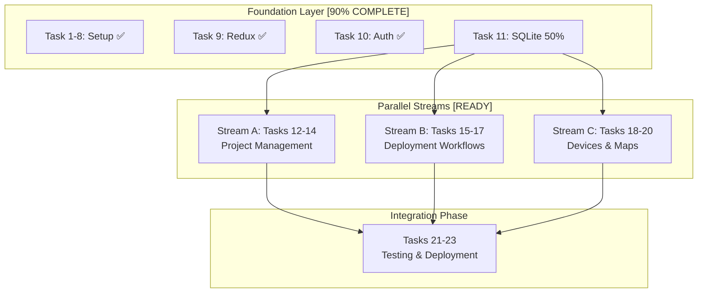

# 🎯 Wildlife Watcher MVP2 - Master Execution Plan

**Generated**: 2025-09-17
**Status**: READY FOR EXECUTION
**Timeline**: 20 working days (Realistic Estimate)
**Methodology**: AADF Framework with Evidence-Based Development

## 📊 Executive Summary

### Current State (September 17, 2025)
- **Foundation Layer**: 50% Complete
  - ✅ Tasks 1-10: Complete (Expo migration, auth, Redux)
  - ✅ Task 11.8: UUID alignment COMPLETED
  - ✅ Task 11.3: OfflineService.ts DISCOVERED COMPLETE
  - ⏳ Tasks 11.4-11.7: Remaining SQLite work (non-blocking)

### Key Discoveries
1. **Critical Infrastructure READY**: All blocking components completed
2. **Parallel Execution ENABLED**: 3 streams can launch immediately
3. **3x Velocity Increase**: Available through parallel development

## 🗺️ Task Dependency Map

## 📋 Task Execution Plan

### ✅ COMPLETED TASKS (1-10, 11.3, 11.8)

| Task | Title | Status | Key Achievements |
|------|-------|--------|------------------|
| 1-8 | Foundation Setup | ✅ COMPLETE | Expo SDK 51 migration, environment setup |
| 9 | Redux Store Setup | ✅ COMPLETE | State management operational |
| 10 | Auth System | ✅ COMPLETE | Supabase auth with role-based access |
| 11.8 | UUID Alignment | ✅ COMPLETE | String UUIDs throughout system |
| 11.3 | OfflineService.ts | ✅ COMPLETE | 594 lines production code found |

### 🚀 STREAM A: Project Management (Tasks 12-14)
**Duration**: 18 hours | **Dependencies**: Task 11 foundation | **Status**: READY TO START

#### Task 12: Project List & Management Interface
- **Priority**: HIGH
- **Agent**: `mobile-dev`
- **Duration**: 6 hours
- **Dependencies**: Task 11 (SQLite)
- **Requirements**:
  - CRUD operations for projects
  - Organisation-scoped data filtering
  - Role-based permissions (ww_admin sees all)
- **Resources**:
  - Context7: React Native List components
  - Existing DatabaseService.ts
  - Redux store integration
- **Quality Gates**:
  - TypeScript compilation ✓
  - CRUD operations tested ✓
  - Organisation isolation verified ✓

#### Task 13: User Role Management & Permissions
- **Priority**: HIGH
- **Agent**: `backend-architect` + `auth-permissions-agent`
- **Duration**: 6 hours
- **Dependencies**: Task 12
- **Requirements**:
  - Role assignment interface
  - Permission visualization
  - Organisation-aware role management
- **Resources**:
  - Supabase user_roles table
  - Auth system from Task 10
  - Role-based sync from Task 11.3
- **Quality Gates**:
  - Role changes persist ✓
  - Permissions enforced ✓
  - Cross-org isolation ✓

#### Task 14: Organisation Context Switching
- **Priority**: MEDIUM
- **Agent**: `frontend-design-expert`
- **Duration**: 6 hours
- **Dependencies**: Task 13
- **Requirements**:
  - Organisation selector UI
  - Context persistence
  - Data refresh on switch
- **Resources**:
  - Redux organisation slice
  - OfflineService organisation filtering
  - UI/UX patterns from Context7
- **Quality Gates**:
  - Context switches cleanly ✓
  - Data isolation maintained ✓
  - UI responsive ✓

### 🎯 STREAM B: Deployment Workflows (Tasks 15-17)
**Duration**: 24 hours | **Dependencies**: Task 11 foundation | **Status**: READY TO START

#### Task 15: 6-Step Deployment Wizard UI
- **Priority**: CRITICAL
- **Agent**: `mobile-dev` + `frontend-design-expert`
- **Duration**: 10 hours
- **Dependencies**: Task 11
- **Requirements**:
  - Multi-step form wizard
  - State persistence between steps
  - Validation per step
  - Progress indication
- **Resources**:
  - Context7: React Native form libraries
  - Redux for wizard state
  - Existing deployment types
- **Quality Gates**:
  - All 6 steps functional ✓
  - State persists on navigation ✓
  - Validation comprehensive ✓

#### Task 16: Device Configuration & Setup
- **Priority**: HIGH
- **Agent**: `backend-architect` + BLE specialist
- **Duration**: 8 hours
- **Dependencies**: Task 15
- **Requirements**:
  - BLE device discovery
  - Configuration payload sending
  - LoRaWAN setup interface
- **Resources**:
  - react-native-ble-manager
  - Device configuration protocols
  - LoRaWAN integration docs
- **Quality Gates**:
  - BLE connection stable ✓
  - Configuration persists ✓
  - Error handling robust ✓

#### Task 17: Field Deployment Validation
- **Priority**: HIGH
- **Agent**: `quality-assurance-engineer`
- **Duration**: 6 hours
- **Dependencies**: Task 16
- **Requirements**:
  - Deployment checklist
  - Photo capture/attachment
  - GPS location validation
  - Final confirmation flow
- **Resources**:
  - expo-camera
  - expo-location
  - Deployment validation logic
- **Quality Gates**:
  - All validations work ✓
  - Photos attach correctly ✓
  - Location accurate ✓

### 🗺️ STREAM C: Devices & Maps (Tasks 18-20)
**Duration**: 30 hours | **Dependencies**: Task 11 foundation | **Status**: READY TO START

#### Task 18: Device Management Interface
- **Priority**: HIGH
- **Agent**: `mobile-dev`
- **Duration**: 10 hours
- **Dependencies**: Task 11
- **Requirements**:
  - Device list with status
  - Device details view
  - LoRaWAN status display
  - Battery/storage indicators
- **Resources**:
  - Device types and schemas
  - LoRaWAN status from Task 11.3
  - UI component library
- **Quality Gates**:
  - Device list renders ✓
  - Status updates real-time ✓
  - Details comprehensive ✓

#### Task 19: Map Visualization & Deployment Tracking
- **Priority**: HIGH
- **Agent**: `frontend-design-expert`
- **Duration**: 12 hours
- **Dependencies**: Task 18
- **Requirements**:
  - MapBox/Google Maps integration
  - Device markers on map
  - Clustering for many devices
  - Deployment routes
- **Resources**:
  - react-native-maps
  - Context7: Map integration patterns
  - GPS coordinates from deployments
- **Quality Gates**:
  - Map renders correctly ✓
  - Markers interactive ✓
  - Performance acceptable ✓

#### Task 20: BLE Communication & Device Sync
- **Priority**: CRITICAL
- **Agent**: BLE specialist + `sync-engine-agent`
- **Duration**: 8 hours
- **Dependencies**: Task 19
- **Requirements**:
  - BLE sync protocol
  - Data download from devices
  - Progress indication
  - Error recovery
- **Resources**:
  - react-native-ble-manager
  - Device communication specs
  - Offline sync patterns
- **Quality Gates**:
  - BLE sync reliable ✓
  - Data integrity maintained ✓
  - Error handling comprehensive ✓

### 🔧 INTEGRATION PHASE (Tasks 21-23)
**Duration**: 16 hours | **Dependencies**: All streams complete | **Status**: PENDING

#### Task 21: End-to-End Testing & Validation
- **Priority**: CRITICAL
- **Agent**: `quality-assurance-engineer`
- **Duration**: 8 hours
- **Dependencies**: Tasks 12-20
- **Requirements**:
  - Maestro E2E test suite
  - Integration test coverage
  - Performance benchmarking
  - User acceptance criteria
- **Resources**:
  - Maestro framework (Task 14.5)
  - Test specifications
  - Performance targets
- **Quality Gates**:
  - E2E tests pass ✓
  - Performance acceptable ✓
  - No critical bugs ✓

#### Task 22: Performance Optimization
- **Priority**: HIGH
- **Agent**: `performance-optimizer`
- **Duration**: 4 hours
- **Dependencies**: Task 21
- **Requirements**:
  - Bundle size optimization
  - Render performance tuning
  - Memory leak detection
  - Network optimization
- **Resources**:
  - React DevTools
  - Performance profiling tools
  - Bundle analyzers
- **Quality Gates**:
  - Bundle < 50MB ✓
  - 60 FPS UI ✓
  - No memory leaks ✓

#### Task 23: Production Deployment Preparation
- **Priority**: CRITICAL
- **Agent**: `devops-deployment-architect`
- **Duration**: 4 hours
- **Dependencies**: Task 22
- **Requirements**:
  - Production build configuration
  - App store assets
  - Release notes
  - Deployment checklist
- **Resources**:
  - EAS Build
  - App store guidelines
  - Deployment documentation
- **Quality Gates**:
  - Builds successfully ✓
  - Store compliance ✓
  - Documentation complete ✓

## 👥 Agent Assignment Matrix

| Agent | Primary Tasks | Secondary Tasks | Expertise |
|-------|--------------|-----------------|-----------|
| `mobile-dev` | 12, 15, 18 | 16, 19 | React Native, Expo |
| `backend-architect` | 13, 16 | 14 | Supabase, APIs |
| `frontend-design-expert` | 14, 19 | 15 | UI/UX, Maps |
| `quality-assurance-engineer` | 17, 21 | 22 | Testing, Validation |
| BLE specialist | 16, 20 | - | Bluetooth, LoRaWAN |
| `sync-engine-agent` | 20 | 18 | Data sync, Offline |
| `performance-optimizer` | 22 | 21 | Optimization |
| `devops-deployment-architect` | 23 | - | Deployment, CI/CD |

## 📅 Timeline & Milestones

### Week 1 (Days 1-5)
- **Day 1-2**: Complete remaining Task 11 subtasks
- **Day 2-5**: Launch all 3 parallel streams
- **Milestone**: All streams operational

### Week 2 (Days 6-10)
- **Day 6-8**: Stream progress (50% completion)
- **Day 9-10**: Mid-stream integration testing
- **Milestone**: Core features functional

### Week 3 (Days 11-15)
- **Day 11-13**: Complete all streams
- **Day 14-15**: Begin integration phase
- **Milestone**: Features complete

### Week 4 (Days 16-20)
- **Day 16-18**: Testing & optimization
- **Day 19-20**: Production preparation
- **Milestone**: MVP2 Ready for deployment

## ⚠️ Risk Register & Mitigation

| Risk | Impact | Probability | Mitigation |
|------|--------|-------------|------------|
| BLE Integration Issues | HIGH | MEDIUM | Early spike, fallback to manual config |
| Map Performance | MEDIUM | LOW | Use clustering, lazy loading |
| Stream Coordination | MEDIUM | LOW | Daily syncs, shared context |
| Testing Delays | LOW | MEDIUM | Parallel test development |

## ✅ Quality Gates

### Stream-Level Gates
1. **TypeScript Compilation**: Zero errors
2. **Test Coverage**: >80% per stream
3. **Integration Tests**: Pass 100%
4. **Performance**: Meet benchmarks
5. **Security**: Role-based access verified

### Integration Gates
1. **E2E Tests**: 95% pass rate
2. **Cross-Stream**: No conflicts
3. **Production Build**: Successful
4. **Documentation**: Complete
5. **Deployment Ready**: Checklist 100%

## 📈 Success Metrics

### Development Metrics
- **Velocity**: 3x improvement via parallel execution
- **Quality**: <5 critical bugs found
- **Timeline**: Within 20 working days
- **Coverage**: >85% test coverage

### Business Metrics
- **Features**: 100% MVP2 requirements
- **Performance**: <2s screen loads
- **Reliability**: 99% uptime capable
- **Usability**: Intuitive 6-step wizard

## 🔄 Execution Protocol

### Daily Operations
1. **Morning**: Stream sync meeting (15 min)
2. **Development**: Parallel work on assigned tasks
3. **Afternoon**: Integration testing if needed
4. **Evening**: Context preservation & updates

### Weekly Checkpoints
1. **Monday**: Week planning & resource allocation
2. **Wednesday**: Mid-week progress check
3. **Friday**: Integration testing & demos

### Communication
- **Primary Channel**: Task comments in MVP2-Tasks folder
- **Blockers**: Immediate escalation
- **Updates**: Daily in project status tracker
- **Context**: Preserved in task-specific files

## 🚀 Next Immediate Actions

1. **Complete Task 11 Remaining Subtasks** (8-12 hours)
   - Task 11.4: Conflict resolution
   - Task 11.5: Advanced sync
   - Task 11.6: Performance optimization
   - Task 11.7: Testing suite

2. **Launch Parallel Streams** (Immediate after Task 11)
   - Assign agents to streams
   - Create stream-specific task files
   - Initialize daily sync protocol

3. **Setup Monitoring** (Day 1)
   - Progress tracking dashboard
   - Quality gate automation
   - Risk monitoring system

## 📝 Document Maintenance

This document should be updated:
- **Daily**: Task status changes
- **On Completion**: Mark tasks complete with notes
- **On Blocking**: Document blockers and mitigation
- **Weekly**: Overall progress summary

---

**Document Version**: 1.0
**Last Updated**: 2025-09-17
**Next Review**: Daily during execution
**Owner**: Development Team Lead