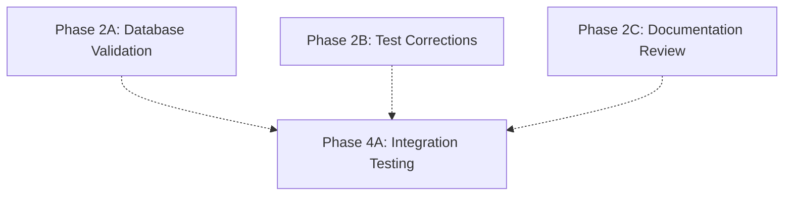
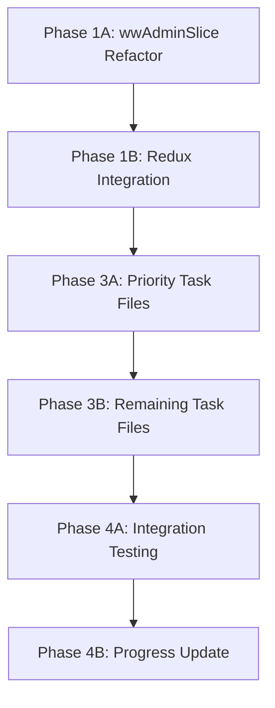

# WW Admin Corrections - Detailed Execution Plan

**Document ID**: WW-ADMIN-CORRECTIONS-EXECUTION-PLAN
**Created**: 2025-01-29
**Status**: 🚨 READY FOR EXECUTION
**Priority**: CRITICAL - BLOCKING TASK 11.X

---

## 📋 **EXECUTIVE SUMMARY**

This plan systematically corrects WW Admin implementations to align with the architectural decision that **WW Admin user management is web-portal exclusive**. The mobile app implementation currently contains user provisioning capabilities that contradict this decision.

**Key Architectural Reality**:
- ✅ **WW Admin Mobile Permissions**: Read-only project visibility + web portal navigation
- ❌ **Current Implementation**: Full user provisioning system in mobile app
- 🎯 **Target State**: Aligned codebase with corrected architecture

---

## 🔍 **CRITICAL ISSUES IDENTIFIED**

### **1. wwAdminSlice.ts - MAJOR VIOLATION**
- **Problem**: Contains comprehensive user management operations
- **Impact**: Contradicts architectural decision completely
- **Files Affected**: 1 critical Redux slice file
- **Complexity**: High - requires significant refactoring

### **2. Implementation vs Specification Mismatch**
- **Problem**: Code implements user management that should be web-only
- **Impact**: Technical debt and architectural confusion
- **Files Affected**: Multiple Redux, test, and documentation files
- **Complexity**: Medium - systematic corrections needed

---

## 🏗️ **PHASE-BASED EXECUTION STRATEGY**

### **PHASE 1: CRITICAL REDUX CORRECTIONS**
**Context Window**: FULL CLEAR - Start fresh
**Duration**: Single session (45-60 minutes)
**Parallel Capability**: ❌ None - Sequential required

#### **Phase 1A: wwAdminSlice.ts Refactoring** [CRITICAL PATH]
**Agent**: `mobile-dev` (React Native specialist)
**Dependencies**: None
**Blocking**: Everything else

**Tasks**:
1. **Remove User Provisioning Interfaces**:
   - Delete `UserProvisioning` interface
   - Delete `SystemConfiguration` interface
   - Delete `SystemMetrics` interface
   - Keep only `Organisation` interface (read-only)

2. **Refactor State Structure**:
   ```typescript
   // BEFORE: Complex user management state
   interface WWAdminState {
     users: UserProvisioning[];
     pendingInvitations: UserProvisioning[];
     systemConfig: SystemConfiguration;
     // ... complex management state
   }

   // AFTER: Simple read-only state
   interface WWAdminState {
     visibleProjects: Project[];  // Cross-org project visibility
     currentOrganisation?: Organisation;
     webPortalUrl: string;
     adminPermissions: {
       canViewAllProjects: boolean;
       canAccessWebPortal: boolean;
     };
   }
   ```

3. **Replace User Management Actions**:
   - Remove: `inviteUser`, `updateUserProvisioning`, `revokeUserAccess`
   - Remove: `createOrganisation`, `updateOrganisation`, `deleteOrganisation`
   - Add: `setVisibleProjects`, `navigateToWebPortal`

4. **Update Selectors**:
   - Replace user management selectors with project visibility selectors
   - Add web portal navigation selectors

#### **Phase 1B: Redux Store Integration Update** [SEQUENTIAL]
**Agent**: `mobile-dev` (continues from 1A)
**Dependencies**: Phase 1A complete
**Blocking**: Testing and documentation

**Tasks**:
1. **Update Store Configuration**:
   - Verify wwAdminSlice integration
   - Remove any user management middleware
   - Test Redux DevTools compatibility

2. **Update Type Exports**:
   - Export corrected interfaces
   - Update index files
   - Remove obsolete type exports

---

### **PHASE 2: VALIDATION & TESTING CORRECTIONS**
**Context Window**: CLEAR after Phase 1
**Duration**: Single session (30-45 minutes)
**Parallel Capability**: ✅ High - Multiple agents can work independently

#### **Phase 2A: Database Service Validation** [PARALLEL TRACK 1]
**Agent**: `mobile-dev` (database specialist)
**Dependencies**: None (independent review)
**Blocking**: None

**Tasks**:
1. **Review DatabaseService.ts**:
   - Confirm no WW Admin user creation methods
   - Verify read-only access patterns
   - Check organisation data isolation

2. **Validate SQLite Schema**:
   - Ensure no user management tables for WW Admin
   - Confirm read-only project access patterns
   - Verify organisation scoping

#### **Phase 2B: Test Suite Corrections** [PARALLEL TRACK 2]
**Agent**: `tester` (testing specialist)
**Dependencies**: None (independent review)
**Blocking**: None

**Tasks**:
1. **Identify Affected Tests**:
   - Search for wwAdmin test files
   - Find user management test scenarios
   - Locate Redux slice tests

2. **Update Test Scenarios**:
   - Replace user management tests with read-only tests
   - Add web portal navigation tests
   - Update mock data to reflect reality

3. **Test Coverage Validation**:
   - Ensure read-only access is properly tested
   - Verify no user creation test scenarios remain
   - Add architectural boundary tests

#### **Phase 2C: Documentation Review** [PARALLEL TRACK 3]
**Agent**: `docs-maintainer` (documentation specialist)
**Dependencies**: None (independent review)
**Blocking**: None

**Tasks**:
1. **Scan Documentation**:
   - Review API documentation
   - Check component documentation
   - Find user guide references

2. **Update References**:
   - Correct WW Admin capability descriptions
   - Update architectural diagrams
   - Fix code examples

---

### **PHASE 3: TASK FILE CORRECTIONS**
**Context Window**: CLEAR after Phase 2
**Duration**: Single session (45-60 minutes)
**Parallel Capability**: ⚠️ Limited - Sequential for consistency

#### **Phase 3A: Priority Task Files** [CRITICAL PATH]
**Agent**: `docs-maintainer`
**Dependencies**: Phase 1 complete (to understand corrections made)
**Blocking**: Progress tracking

**Files to Correct** (in order):
1. **task_011.txt** - Update WW Admin section 11.4
2. **task_012.txt** - Remove WW Admin operations
3. **task_013.txt** - Remove bulk invitation capabilities
4. **task_014.txt** - Update to read-only visibility
5. **task_015.txt** - Remove deployment operations for WW Admin

**Tasks per File**:
1. **Read Current Content**
2. **Identify WW Admin References**
3. **Apply Corrections per Plan**
4. **Validate Consistency**
5. **Update Status**

#### **Phase 3B: Remaining Task Files** [SEQUENTIAL]
**Agent**: `docs-maintainer` (continues)
**Dependencies**: Phase 3A complete
**Blocking**: Final validation

**Files to Correct**:
1. **task_016.txt** through **task_023.txt**
2. **tasks.json** - Global updates
3. **Related documentation files**

---

### **PHASE 4: VALIDATION & INTEGRATION**
**Context Window**: CLEAR after Phase 3
**Duration**: Single session (30 minutes)
**Parallel Capability**: ❌ Sequential validation required

#### **Phase 4A: Integration Testing** [CRITICAL PATH]
**Agent**: `tester`
**Dependencies**: All previous phases complete
**Blocking**: Final sign-off

**Tasks**:
1. **Run Updated Tests**:
   - Execute corrected test suites
   - Verify Redux store functionality
   - Test web portal navigation

2. **Manual Validation**:
   - Check Redux DevTools state
   - Verify no user management UI remains
   - Test read-only project visibility

#### **Phase 4B: Progress Tracking Update** [FINAL]
**Agent**: `docs-maintainer`
**Dependencies**: Phase 4A complete
**Blocking**: None

**Tasks**:
1. **Update Correction Plan**:
   - Mark all corrections complete
   - Update progress percentages
   - Document any issues found

2. **Final Documentation**:
   - Update architectural compliance
   - Record lessons learned
   - Prepare handoff notes

---

## 🔄 **DEPENDENCY ANALYSIS & PARALLEL EXECUTION**

### **True Independence (Can Run in Parallel)**:


### **Critical Path (Must Be Sequential)**:


### **Optimal Execution Schedule**:

**Session 1** (45-60 min):
- Phase 1A + 1B (Sequential, single agent)

**Session 2** (45 min):
- Phase 2A + 2B + 2C (Parallel, three agents)

**Session 3** (60 min):
- Phase 3A + 3B (Sequential, single agent)

**Session 4** (30 min):
- Phase 4A + 4B (Sequential, validation)

---

## ⚡ **EFFICIENCY OPTIMIZATIONS**

### **Context Window Management**:
1. **Full Clear Between Phases** - Prevents context pollution
2. **Single-Agent Phases** - Deep focus, no coordination overhead
3. **Parallel Phases** - Maximum throughput on independent work

### **Agent Specialization**:
- **`mobile-dev`**: Redux/TypeScript expertise for Phase 1
- **`tester`**: Testing framework knowledge for Phase 2B + 4A
- **`docs-maintainer`**: Documentation patterns for Phase 2C + 3

### **Risk Mitigation**:
- **Phase 1**: Critical path completed first
- **Phase 2**: Parallel execution reduces risk exposure
- **Phase 4**: Comprehensive validation before completion

---

## 🎯 **SUCCESS CRITERIA PER PHASE**

### **Phase 1 Success**:
- [ ] wwAdminSlice.ts contains no user management operations
- [ ] Redux store builds and runs without errors
- [ ] TypeScript compilation successful

### **Phase 2 Success**:
- [ ] Database service confirmed read-only for WW Admin
- [ ] Test suites updated and passing
- [ ] Documentation accurately reflects reality

### **Phase 3 Success**:
- [ ] All task files corrected for WW Admin scope
- [ ] Consistent architectural representation
- [ ] Progress tracking updated

### **Phase 4 Success**:
- [ ] Integration tests pass
- [ ] Manual validation confirms corrections
- [ ] All documentation updated and complete

---

## 📊 **COMPLETION TRACKING**

```
Phase 1: Redux Corrections     [✅] 100% - COMPLETED
Phase 2: Parallel Validation   [✅] 100% - COMPLETED
Phase 3: Task File Updates     [✅] 100% - COMPLETED
Phase 4: Final Validation      [✅] 100% - COMPLETED

Overall Progress: 100% Complete ✅
```

---

## 🚀 **READY FOR EXECUTION**

This plan is ready for immediate execution. Each phase is self-contained with clear inputs, outputs, and success criteria. The dependency analysis ensures maximum parallel execution while maintaining correctness.

**Next Action**: Begin Phase 1A with `mobile-dev` agent and fresh context window.