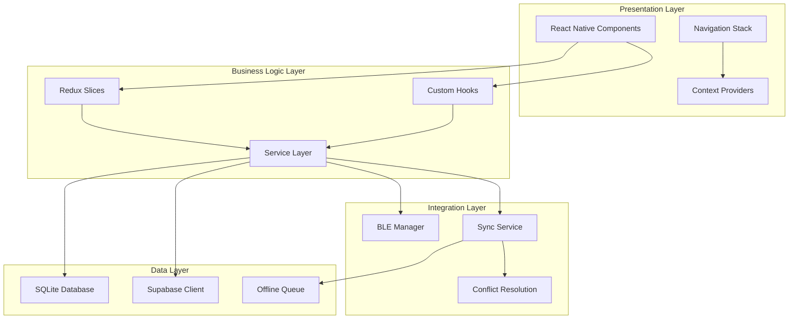
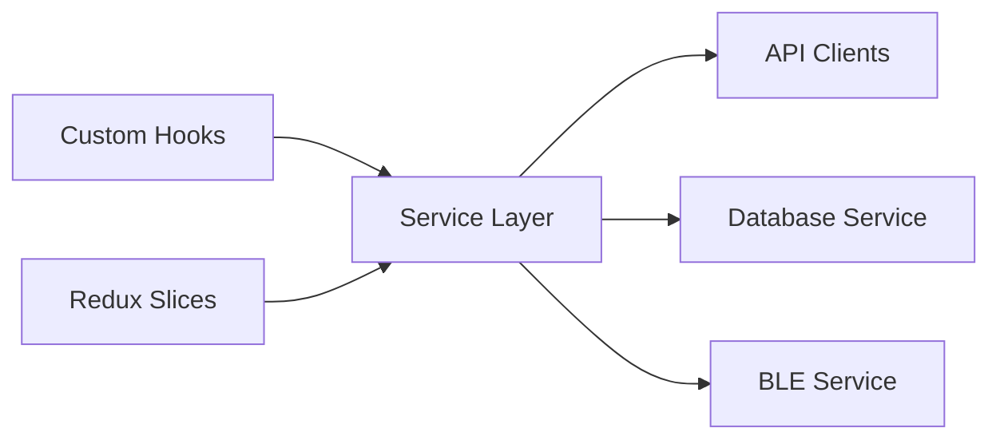
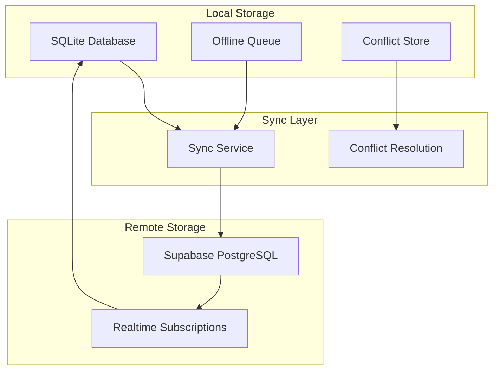
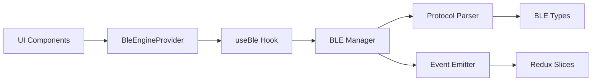
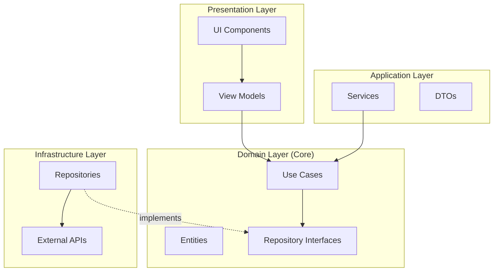
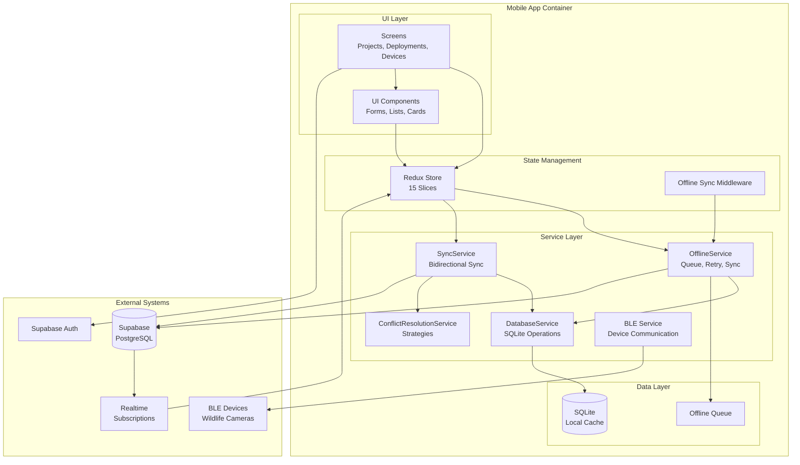
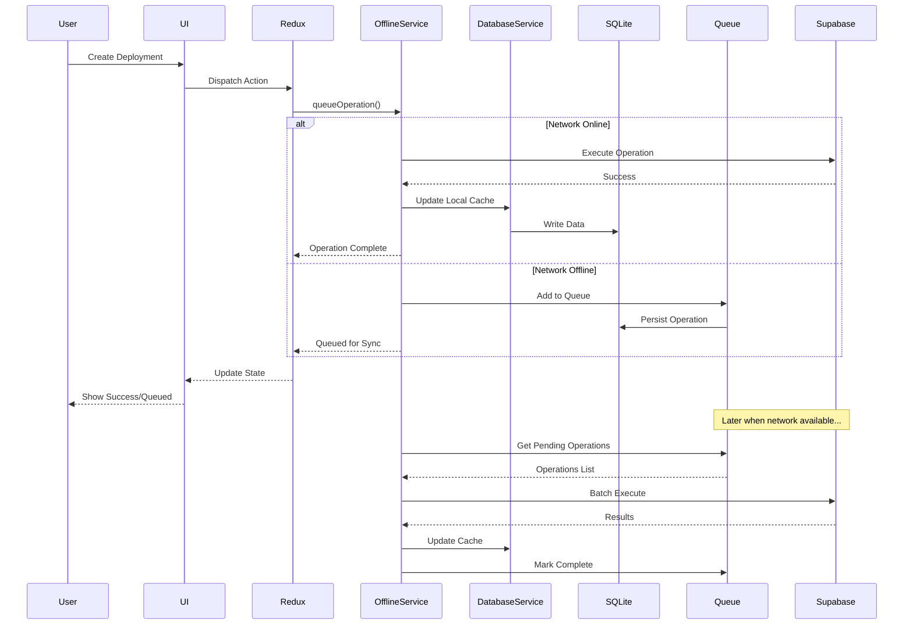

# Wildlife Watcher Mobile App - Architecture Design Review

**Date:** 2025-10-16
**Project:** Wildlife Watcher Mobile App (MVP2)
**Version:** v0.0.1
**Codebase Size:** ~10,705 lines of TypeScript/TSX
**Test Files:** 244 test files

---

## Executive Summary

The Wildlife Watcher Mobile App demonstrates a **solid offline-first architecture** with comprehensive multi-tenancy support and role-based access control. The system architecture follows **React Native best practices** with a well-structured service layer, Redux state management, and sophisticated offline synchronization capabilities.

### Overall Architecture Rating: **B+ (Good with Notable Strengths)**

**Key Strengths:**
- ✅ Robust offline-first architecture with SQLite + Supabase sync
- ✅ Comprehensive service layer with clear separation of concerns
- ✅ Advanced conflict resolution and sync management
- ✅ Multi-tenancy with organization-scoped data isolation
- ✅ Role-based access control (4-tier RBAC system)
- ✅ BLE device communication abstraction

**Areas for Improvement:**
- ⚠️ Inconsistent architectural patterns (mixed state management approaches)
- ⚠️ Provider hierarchy complexity could be simplified
- ⚠️ Limited dependency injection leading to tight coupling
- ⚠️ Some violations of Single Responsibility Principle
- ⚠️ Documentation gaps in architectural decision records

---

## 1. Architectural Overview

### 1.1 System Architecture Layers



### 1.2 Core Architectural Patterns

| Pattern | Implementation | Quality | Notes |
|---------|---------------|---------|-------|
| **Offline-First** | SQLite + Sync Queue | ★★★★☆ | Well-implemented with conflict resolution |
| **Service Layer** | Dedicated service classes | ★★★★☆ | Clear abstraction, good organization |
| **Repository Pattern** | DatabaseService | ★★★☆☆ | Present but could be more complete |
| **Provider Pattern** | React Context | ★★★☆☆ | Deeply nested, could be simplified |
| **Middleware Pattern** | Redux middleware | ★★★★☆ | Excellent offline sync middleware |
| **Observer Pattern** | Redux subscriptions | ★★★★☆ | Clean event-driven architecture |
| **Strategy Pattern** | Conflict resolution | ★★★★☆ | Multiple resolution strategies |
| **Factory Pattern** | Limited usage | ★★☆☆☆ | Could benefit from more factories |

---

## 2. Layer-by-Layer Analysis

### 2.1 Presentation Layer

**Structure:**
- **Components:** 50+ UI components organized by domain
- **Screens:** 25+ screens with navigation stack
- **Navigation:** Native Stack Navigator with deep linking
- **Providers:** 6 context providers for cross-cutting concerns

**Strengths:**
- ✅ Clean separation between UI components and screens
- ✅ Reusable UI component library (`/components/ui/`)
- ✅ Feature-based organization (e.g., `/features/maps/`)
- ✅ Type-safe navigation with TypeScript

**Weaknesses:**
- ⚠️ Provider nesting depth (6 levels) creates complexity
- ⚠️ Some screens have excessive logic (violate SRP)
- ⚠️ Inconsistent component organization (mixed flat/nested)

**Provider Hierarchy:**
```tsx
<SafeAreaProvider>
  <ReduxProvider>
    <PaperProvider>
      <NavigationContainer>
        <AndroidPermissionsProvider>
          <AppSetupProvider>
            <BleEngineProvider>
              <ListenToBleEngineProvider>
                <AuthProvider>
                  <MainNavigation />
                </AuthProvider>
              </ListenToBleEngineProvider>
            </BleEngineProvider>
          </AppSetupProvider>
        </AndroidPermissionsProvider>
      </NavigationContainer>
    </PaperProvider>
  </ReduxProvider>
</SafeAreaProvider>
```

**Recommendation:** Consider using a Provider Composition pattern to reduce nesting depth and improve testability.

---

### 2.2 Business Logic Layer

**Architecture:**



**Service Layer Structure:**

| Service | Responsibility | LOC | Quality |
|---------|----------------|-----|---------|
| `OfflineService` | Offline operation queuing & sync | ~984 | ★★★★☆ |
| `SyncService` | Bidirectional sync & conflicts | ~471 | ★★★★☆ |
| `DatabaseService` | SQLite operations | ~500+ | ★★★★☆ |
| `ConflictResolutionService` | Conflict detection & resolution | ~400+ | ★★★★☆ |
| `ProjectService` | Project management | ~200+ | ★★★☆☆ |
| `DfuService` | Device firmware updates | ~150+ | ★★★☆☆ |

**Strengths:**
- ✅ Clear separation of concerns at service layer
- ✅ Comprehensive offline capabilities with retry logic
- ✅ Advanced conflict resolution strategies
- ✅ Role-based operation validation
- ✅ Exponential backoff for network retries

**Weaknesses:**
- ⚠️ Services lack dependency injection (hard to test/mock)
- ⚠️ Some services violate Single Responsibility Principle
- ⚠️ Limited interface/abstract class usage
- ⚠️ Circular dependency risks between services
- ⚠️ Service initialization scattered across codebase

**Critical Analysis: OfflineService.ts**

**Strengths:**
- Organization-aware operations with multi-tenancy support
- Exponential backoff retry strategy (MAX_RETRY: 5, BASE_DELAY: 1s, MAX_DELAY: 30s)
- Comprehensive operation execution methods
- Network monitoring with automatic sync triggers
- Role-based sync filtering (ww_admin, project_admin, project_member)

**Concerns:**
```typescript
// ISSUE 1: Hard-coded service instantiation (tight coupling)
constructor() {
  this.databaseService = new DatabaseService();
  this.conflictResolutionService = getConflictResolutionService(this.databaseService);
  // Should use dependency injection for testability
}

// ISSUE 2: Mixed concerns - both sync coordination AND operation execution
async queueOperation(operation: OfflineOperation): Promise<void> {
  // Sync coordination logic
  if (this.networkStatus.isConnected) {
    const success = await this.executeOperation(operation); // Execution logic
    // These should be separate services
  }
}

// ISSUE 3: Deprecated methods still present
/**
 * @deprecated Use conflictResolutionService.detectConflicts instead
 */
detectPotentialConflict(serverData: any, localData: any): boolean {
  // Should be removed or extracted to separate compatibility layer
}
```

**Redux State Management:**

**Current Slice Count:** 15 slices
- `androidPermissionsSlice`, `authSlice`, `bleLibrarySlice`, `bluetoothStatusSlice`
- `configurationSlice`, `deploymentsSlice`, `devicesSlice`, `locationStatusSlice`
- `logsSlice`, `networkSlice`, `offlineSlice`, `projectsSlice`, `scanningSlice`
- `syncSlice`, `wwAdminSlice`

**Quality Assessment:**
- ✅ Well-organized domain slices
- ✅ TypeScript type safety throughout
- ✅ Excellent middleware for offline sync
- ⚠️ Some slices could be consolidated (similar domains)
- ⚠️ Limited use of RTK Query for API calls

---

### 2.3 Data Layer

**Architecture:**



**Database Schema (SQLite Local):**

Key tables:
- `offline_queue` - Pending operations with retry tracking
- `conflict_history` - Conflict resolution audit trail
- `projects`, `deployments`, `devices` - Core entities
- `sync_metadata` - Last sync timestamps per organization

**Data Flow Patterns:**

**1. Write Operation (Offline-First):**
```
User Action → Optimistic UI Update → SQLite Write → Queue Operation →
  (Online) → Execute on Supabase → Update Local → Remove from Queue
  (Offline) → Queue for later sync
```

**2. Sync Operation:**
```
Network Online → Fetch Pending Operations → Role-Based Filter →
  Execute Batch (with retry) → Conflict Detection → Resolution →
  Update Local State → Mark Complete
```

**3. Conflict Resolution:**
```
Server Change Detected → Compare Timestamps → Detect Conflict Type →
  Apply Strategy (server_wins/local_wins/merge/user_choice) →
  Store Resolution History → Apply to Database
```

**Strengths:**
- ✅ True offline-first architecture with operation queuing
- ✅ Sophisticated conflict detection and resolution
- ✅ Organization-scoped data isolation for multi-tenancy
- ✅ Comprehensive sync metadata tracking
- ✅ Realtime subscription support for live updates

**Weaknesses:**
- ⚠️ No database migration strategy documented
- ⚠️ Limited data validation at database layer
- ⚠️ No clear backup/restore mechanism
- ⚠️ SQLite performance optimization undocumented
- ⚠️ No encryption at rest for sensitive data

**Type Safety Assessment:**

```typescript
// EXCELLENT: Full type safety with Supabase
import type { Tables, TablesInsert, TablesUpdate } from '../types/supabase';

export const projectOperations = {
  createProject: async (project: TablesInsert<'projects'>): Promise<Tables<'projects'>> => {
    // Strong typing throughout
  }
};

// CONCERN: Weak typing in offline operations
private async executeCreateProject(operation: OfflineOperation): Promise<void> {
  const projectData = operation.data as ProjectCreate; // Type assertion needed
  // Should have stronger type guarantees
}
```

---

### 2.4 Integration Layer

**BLE (Bluetooth Low Energy) Architecture:**



**BLE Integration Quality:**
- ✅ Clean abstraction through provider pattern
- ✅ Event-driven communication with emitters
- ✅ Protocol parsing separation
- ⚠️ Limited error recovery mechanisms
- ⚠️ Connection state management could be improved

**Sync Service Architecture:**

**Conflict Resolution Strategies:**
1. **Server Wins** - Server data takes precedence (permission conflicts)
2. **Local Wins** - Local changes preferred (WW Admin override)
3. **Timestamp-Based** - Most recent modification wins
4. **User-Guided** - Complex conflicts require user decision
5. **Merge** - Combine non-conflicting fields

**Sync Service Quality Assessment:**

```typescript
// EXCELLENT: Concurrency control
async startSync(user: User): Promise<SyncStatus> {
  if (this.syncInProgress) {
    return Promise.resolve({ is_syncing: true, ... }); // Prevents duplicate syncs
  }
  this.syncInProgress = true;
  // ...
}

// GOOD: Conflict detection with organization boundaries
private hasOrganisationBoundaryConflict(
  operation: OfflineOperation,
  serverState: any,
  user: User
): boolean {
  if (user.role === 'ww_admin') return false; // Admin can cross boundaries
  return operationOrgId !== userOrgId || serverStateOrgId !== userOrgId;
}

// CONCERN: Placeholder methods indicate incomplete implementation
private async executeServerOperation(operation: OfflineOperation, user: User): Promise<boolean> {
  // TODO: Implement actual Supabase API calls
  console.log('Executing server operation:', operation.type, operation.data);
  return true; // Always returns success - not production-ready
}
```

**Strengths:**
- ✅ Comprehensive conflict resolution framework
- ✅ Organization boundary enforcement
- ✅ Role-based permission validation
- ✅ Concurrent sync prevention
- ✅ Progress tracking with sync status

**Weaknesses:**
- ⚠️ Incomplete server integration (placeholder methods)
- ⚠️ Limited error recovery strategies
- ⚠️ No batch operation optimization
- ⚠️ Missing network retry strategies beyond middleware
- ⚠️ No dead letter queue for permanently failed operations

---

## 3. Cross-Cutting Concerns

### 3.1 Security Architecture

**Authentication:**
- ✅ Supabase Auth with session persistence
- ✅ Token-based authentication
- ✅ Auto-refresh token support

**Authorization:**
- ✅ 4-tier RBAC: ww_admin, project_admin, project_member, viewer
- ✅ Organization-scoped data isolation
- ✅ Project-level permissions
- ⚠️ Limited encryption (no at-rest encryption)
- ⚠️ No security audit logging

**Security Concerns:**

```typescript
// ISSUE: Environment variables exposed in client code
const supabaseUrl = Constants.expoConfig?.extra?.supabaseUrl;
const supabaseAnonKey = Constants.expoConfig?.extra?.supabaseAnonKey;
// Anon key is acceptable for client apps, but URL exposure is concerning

// GOOD: Session storage in secure AsyncStorage
auth: {
  storage: AsyncStorage,
  autoRefreshToken: true,
  persistSession: true,
}
```

**Recommendations:**
1. Implement encryption at rest for SQLite database
2. Add security audit logging for sensitive operations
3. Implement certificate pinning for Supabase connections
4. Add biometric authentication option
5. Implement secure key storage for API keys

---

### 3.2 Error Handling & Logging

**Current Approach:**

```typescript
// Pattern 1: Try-catch with console logging
try {
  await operation();
} catch (error) {
  console.error('Operation failed:', error);
  throw error; // Re-throw for retry logic
}

// Pattern 2: Redux error state
this.updateSyncStatus({
  is_syncing: false,
  sync_errors: [...this.currentSyncStatus.sync_errors, error.message]
});
```

**Strengths:**
- ✅ Consistent error handling patterns
- ✅ Error state tracked in Redux
- ✅ Retry mechanisms with exponential backoff

**Weaknesses:**
- ⚠️ Heavy reliance on console.log (not structured logging)
- ⚠️ No error tracking/monitoring integration (e.g., Sentry)
- ⚠️ Limited error categorization (network, validation, system)
- ⚠️ No centralized error handling service
- ⚠️ User-facing error messages not internationalized

**Recommendation:** Implement structured logging service with:
- Log levels (DEBUG, INFO, WARN, ERROR, FATAL)
- Context capture (user, organization, operation)
- Remote error tracking integration
- User-friendly error message translation

---

### 3.3 Testing Architecture

**Test Coverage:**
- **Total Test Files:** 244
- **Primary Framework:** Jest + React Native Testing Library
- **E2E Framework:** Maestro (BDD/TDD approach)

**Test File Organization:**
```
tests/
├── unit/           # Unit tests for services, utilities
├── integration/    # Integration tests for APIs, sync
├── maestro/        # E2E test flows
│   ├── auth-workflow.yaml
│   ├── offline/complete-offline-workflow.yaml
│   └── ...
└── __tests__/      # Component tests
```

**Testing Strengths:**
- ✅ Comprehensive E2E test coverage with Maestro
- ✅ Offline workflow testing
- ✅ Authentication flow testing
- ✅ Well-organized test structure

**Testing Gaps:**
- ⚠️ Service layer tests use hard-coded dependencies (no mocking)
- ⚠️ Limited integration test coverage for sync operations
- ⚠️ No performance/load testing
- ⚠️ Mock data management could be improved
- ⚠️ Test documentation insufficient

---

### 3.4 Performance Considerations

**Architectural Performance Factors:**

| Concern | Implementation | Impact | Status |
|---------|---------------|--------|---------|
| **Database Performance** | SQLite indexes | Medium | ⚠️ Undocumented |
| **Network Efficiency** | Batch sync operations | High | ✅ Implemented |
| **State Updates** | Redux optimization | Medium | ⚠️ Needs memoization |
| **Memory Management** | Service cleanup | Medium | ⚠️ Partial |
| **Render Performance** | Component memoization | High | ⚠️ Limited use |

**Performance Optimizations Present:**
- ✅ Batch sync operations (configurable batch size: 10)
- ✅ Exponential backoff prevents server overload
- ✅ Network monitoring prevents unnecessary operations
- ✅ Offline queue prevents blocking UI

**Performance Concerns:**
```typescript
// ISSUE: No memoization for expensive Redux selectors
const { status, initialLoad: blLoading } = useAppSelector(
  (state) => state.blStatus, // Recalculates on every render
);

// ISSUE: Service instances not pooled/cached
constructor() {
  this.databaseService = new DatabaseService(); // New instance every time
  this.conflictResolutionService = getConflictResolutionService(this.databaseService);
}

// GOOD: Batch processing to prevent server overload
for (let i = 0; i < operations.length; i += batchSize) {
  const batch = operations.slice(i, i + batchSize);
  await Promise.allSettled(batchPromises);
  await new Promise(resolve => setTimeout(resolve, 100)); // Throttling
}
```

**Recommendations:**
1. Implement Redux selector memoization using `reselect`
2. Add service instance caching/singleton pattern
3. Profile and optimize SQLite queries
4. Implement virtual scrolling for long lists
5. Add React.memo() to expensive components

---

## 4. Architectural Pattern Compliance

### 4.1 SOLID Principles Assessment

**Single Responsibility Principle (SRP):**
- **Rating:** ★★★☆☆ (Moderate Compliance)
- **Violations:**
  - `OfflineService` handles both sync coordination AND operation execution
  - Some screens contain excessive business logic
  - Provider components mixing concerns (setup + rendering)

**Open/Closed Principle (OCP):**
- **Rating:** ★★★★☆ (Good Compliance)
- **Strengths:**
  - Conflict resolution strategies are extensible
  - Service layer allows easy addition of new operations
  - Redux slices can be extended without modification

**Liskov Substitution Principle (LSP):**
- **Rating:** ★★☆☆☆ (Limited Applicability)
- **Concern:** Limited use of interfaces/abstract classes makes LSP less relevant
- **Opportunity:** Could implement service interfaces for better substitutability

**Interface Segregation Principle (ISP):**
- **Rating:** ★★★☆☆ (Moderate Compliance)
- **Concern:** TypeScript interfaces exist but could be more granular
- **Example Issue:** `OfflineOperation` type is monolithic (handles all operation types)

**Dependency Inversion Principle (DIP):**
- **Rating:** ★★☆☆☆ (Poor Compliance)
- **Major Issue:** Services depend on concrete implementations, not abstractions
- **Example:**
```typescript
// Violates DIP - depends on concrete DatabaseService
constructor() {
  this.databaseService = new DatabaseService(); // Should depend on interface
}

// Better approach:
constructor(private databaseService: IDatabaseService) {
  // Dependency injected, depends on abstraction
}
```

---

### 4.2 Additional Design Patterns

**Repository Pattern:**
- **Rating:** ★★★☆☆ (Partial Implementation)
- **Present:** `DatabaseService` acts as repository
- **Missing:** No clear repository interfaces, limited abstraction

**Strategy Pattern:**
- **Rating:** ★★★★☆ (Well Implemented)
- **Example:** Conflict resolution strategies (server_wins, local_wins, merge, user_choice)

**Observer Pattern:**
- **Rating:** ★★★★☆ (Excellent Implementation)
- **Implementation:** Redux store + subscriptions, BLE event emitters

**Facade Pattern:**
- **Rating:** ★★★☆☆ (Moderate Implementation)
- **Example:** Service layer provides facade over complex operations
- **Opportunity:** Could simplify provider hierarchy with facade

**Middleware Pattern:**
- **Rating:** ★★★★★ (Excellent Implementation)
- **Example:** `offlineSyncMiddleware` is sophisticated and well-designed

---

## 5. Scalability Architecture

### 5.1 Data Scalability

**Current Capacity Estimates:**

| Entity | Design Limit | Performance Threshold | Scaling Strategy |
|--------|-------------|----------------------|------------------|
| **Organizations** | Unlimited | N/A | Filtered at API level |
| **Projects per Org** | ~1,000 | ~500 | Pagination needed |
| **Deployments per Project** | ~10,000 | ~1,000 | Virtual scrolling |
| **Offline Queue** | ~1,000 ops | ~500 ops | Batch processing |
| **Conflict History** | ~10,000 | ~5,000 | Cleanup strategy present |

**Scalability Concerns:**

```typescript
// ISSUE: No pagination for large datasets
const { data, error } = await supabase
  .from('projects')
  .select('*')
  .order('created_at', { ascending: false }); // Fetches ALL projects

// ISSUE: No index strategy documented for SQLite
// Large deployments table could have performance issues

// GOOD: Cleanup mechanism for old data
async cleanupOldConflicts(daysOld: number = 30): Promise<void> {
  return await this.conflictResolutionService.cleanupOldConflicts(daysOld);
}
```

**Recommendations:**
1. Implement cursor-based pagination for all list operations
2. Add SQLite indexing strategy documentation
3. Implement data archiving for old deployments
4. Add query performance monitoring
5. Implement lazy loading for related data

---

### 5.2 Architectural Scalability

**Team Scalability:**
- ✅ Clear domain boundaries enable parallel development
- ✅ Feature-based folder structure supports multiple teams
- ⚠️ Lack of architectural documentation makes onboarding difficult
- ⚠️ No ADR (Architecture Decision Records) found

**Feature Scalability:**
- ✅ Service layer can easily accommodate new operations
- ✅ Redux slices are modular and extensible
- ⚠️ Growing provider hierarchy could become unmanageable
- ⚠️ No feature flag system for gradual rollouts

**Performance Scalability:**
- ✅ Batch processing prevents server overload
- ✅ Offline-first reduces server load
- ⚠️ No caching strategy beyond offline storage
- ⚠️ No CDN usage for static assets

---

## 6. Technology Stack Evaluation

### 6.1 Core Technologies

| Technology | Version | Purpose | Assessment |
|-----------|---------|---------|------------|
| **React Native** | 0.74.5 | Mobile framework | ★★★★☆ Good choice |
| **Expo** | ~51.0.0 | Development platform | ★★★★★ Excellent |
| **TypeScript** | ~5.3.3 | Type safety | ★★★★★ Well utilized |
| **Redux Toolkit** | ^2.2.1 | State management | ★★★★☆ Good fit |
| **Supabase** | ^2.53.0 | Backend services | ★★★★★ Excellent |
| **SQLite** | ~14.0.6 (expo-sqlite) | Local storage | ★★★★☆ Appropriate |
| **React Navigation** | ^6.1.12 | Navigation | ★★★★☆ Standard choice |

### 6.2 Technology Fit Assessment

**Strengths:**
- ✅ Modern, well-supported technology stack
- ✅ TypeScript provides excellent type safety
- ✅ Expo simplifies build and deployment
- ✅ Supabase provides comprehensive backend services
- ✅ Redux Toolkit reduces boilerplate

**Concerns:**
- ⚠️ Heavy reliance on Supabase (vendor lock-in risk)
- ⚠️ SQLite limitations for complex queries
- ⚠️ React Native upgrade path complexity
- ⚠️ Limited use of Expo features (could leverage more)

---

## 7. Key Architectural Risks

### 7.1 High-Priority Risks

**Risk 1: Offline Sync Data Loss**
- **Severity:** HIGH
- **Probability:** MEDIUM
- **Impact:** Data integrity compromise
- **Mitigation:** Implement dead letter queue, comprehensive conflict resolution testing

**Risk 2: Vendor Lock-in (Supabase)**
- **Severity:** MEDIUM
- **Probability:** LOW
- **Impact:** Difficult migration if Supabase changes
- **Mitigation:** Implement repository pattern abstraction, document migration strategy

**Risk 3: SQLite Performance Degradation**
- **Severity:** MEDIUM
- **Probability:** MEDIUM
- **Impact:** App becomes unusable with large datasets
- **Mitigation:** Implement indexing, data archiving, performance monitoring

**Risk 4: Provider Hierarchy Complexity**
- **Severity:** MEDIUM
- **Probability:** HIGH
- **Impact:** Difficult testing, performance issues
- **Mitigation:** Refactor to composition pattern, reduce nesting

**Risk 5: Incomplete Server Integration**
- **Severity:** HIGH
- **Probability:** MEDIUM (based on TODO comments)
- **Impact:** Sync operations fail in production
- **Mitigation:** Complete placeholder method implementations, add integration tests

---

### 7.2 Technical Debt Assessment

**Architectural Technical Debt:**

| Debt Item | Impact | Effort to Fix | Priority |
|-----------|--------|---------------|----------|
| Lack of dependency injection | High | Medium | HIGH |
| Provider nesting complexity | Medium | Medium | MEDIUM |
| Missing service interfaces | Medium | Low | MEDIUM |
| Incomplete sync integration | High | High | HIGH |
| No encryption at rest | High | Medium | HIGH |
| Limited error tracking | Medium | Low | MEDIUM |
| Missing ADRs | Low | Low | LOW |
| Deprecated methods in code | Low | Low | LOW |

---

## 8. Architectural Recommendations

### 8.1 Immediate Actions (Sprint 0-1)

**Priority 1: Complete Sync Service Integration**
- Implement placeholder methods in `SyncService`
- Add comprehensive integration tests for sync operations
- Document sync failure scenarios and recovery

**Priority 2: Implement Dependency Injection**
```typescript
// Create service interfaces
interface IDatabaseService {
  initializeDatabase(): Promise<void>;
  addToOfflineQueue(item: QueueItem): Promise<void>;
  // ...
}

// Inject dependencies
class OfflineService {
  constructor(
    private databaseService: IDatabaseService,
    private conflictService: IConflictResolutionService
  ) {}
}

// Use factory pattern for service creation
class ServiceFactory {
  static createOfflineService(): OfflineService {
    return new OfflineService(
      new DatabaseService(),
      new ConflictResolutionService()
    );
  }
}
```

**Priority 3: Add Security Enhancements**
- Implement SQLite encryption (SQLCipher)
- Add security audit logging
- Implement biometric authentication

---

### 8.2 Short-term Improvements (Sprint 2-4)

**Refactor Provider Hierarchy**
```typescript
// Current: 8 levels of nesting
<Provider1><Provider2><Provider3>...

// Proposed: Composition pattern
<AppProviders>
  <MainNavigation />
</AppProviders>

// Implementation
const AppProviders: React.FC = ({ children }) => {
  const providers = [
    SafeAreaProvider,
    ReduxProvider,
    PaperProvider,
    // ... compose dynamically
  ];

  return providers.reduceRight(
    (child, Provider) => <Provider>{child}</Provider>,
    children
  );
};
```

**Implement Selector Memoization**
```typescript
// Create memoized selectors
import { createSelector } from '@reduxjs/toolkit';

const selectBlStatus = (state: RootState) => state.blStatus;

export const selectBlStatusWithLoading = createSelector(
  [selectBlStatus],
  (blStatus) => ({
    status: blStatus.status,
    initialLoad: blStatus.initialLoad
  })
);
```

**Add Performance Monitoring**
- Integrate React Native Performance monitor
- Add database query performance tracking
- Implement render performance profiling

---

### 8.3 Long-term Strategic Improvements (Quarter)

**1. Implement Clean Architecture Pattern**



**Benefits:**
- Clear separation of concerns
- Testable business logic
- Framework-independent core
- Easy to swap implementations

**2. Add Event Sourcing for Offline Operations**
- Store immutable event log instead of mutable state
- Enables perfect replay of offline operations
- Simplifies conflict resolution
- Better audit trail

**3. Implement Micro-Frontend Architecture (Optional)**
- Split app into feature modules
- Lazy load features on demand
- Enable independent feature deployment
- Reduce initial bundle size

---

## 9. Alternative Architectural Approaches

### 9.1 Alternative 1: GraphQL + Apollo Client

**Current:** REST-like Supabase API + Custom Sync
**Alternative:** GraphQL with Apollo Client

**Pros:**
- Built-in offline support with Apollo Cache
- Optimistic UI updates out-of-box
- Better query efficiency (fetch exactly what you need)
- Subscription support for realtime

**Cons:**
- Learning curve for team
- Requires GraphQL backend setup
- Migration effort from current architecture

**Verdict:** Consider for V2.0 if offline complexity grows

---

### 9.2 Alternative 2: Mobx State Management

**Current:** Redux Toolkit
**Alternative:** MobX for state management

**Pros:**
- Less boilerplate than Redux
- More intuitive for OOP developers
- Automatic reactivity tracking

**Cons:**
- Less predictable than Redux
- Smaller ecosystem
- DevTools not as mature

**Verdict:** Not recommended - Redux Toolkit is working well

---

### 9.3 Alternative 3: Clean Architecture Refactor

**Current:** Layered Architecture
**Alternative:** Hexagonal/Clean Architecture

**Pros:**
- Better testability
- Framework independence
- Clear dependency rules
- Easier to maintain

**Cons:**
- Significant refactoring effort
- More files/complexity initially
- Learning curve

**Verdict:** Recommended for long-term (see section 8.3)

---

## 10. Conclusion & Action Plan

### 10.1 Summary Assessment

**Overall Architecture Grade: B+ (Good with Notable Strengths)**

**Strengths:**
1. ✅ Sophisticated offline-first architecture
2. ✅ Comprehensive multi-tenancy and RBAC
3. ✅ Advanced conflict resolution capabilities
4. ✅ Well-structured service layer
5. ✅ Modern, appropriate technology stack

**Critical Improvements Needed:**
1. ⚠️ Complete sync service integration (HIGH PRIORITY)
2. ⚠️ Implement dependency injection (HIGH PRIORITY)
3. ⚠️ Add encryption and security enhancements (HIGH PRIORITY)
4. ⚠️ Refactor provider hierarchy (MEDIUM PRIORITY)
5. ⚠️ Document architecture decisions (MEDIUM PRIORITY)

---

### 10.2 Prioritized Action Plan

**Phase 1: Critical Fixes (2-3 weeks)**
- [ ] Complete `SyncService` placeholder implementations
- [ ] Add comprehensive sync integration tests
- [ ] Implement SQLite encryption
- [ ] Add security audit logging
- [ ] Create ADR documentation for key decisions

**Phase 2: Architectural Improvements (4-6 weeks)**
- [ ] Implement dependency injection across services
- [ ] Refactor provider hierarchy using composition
- [ ] Add Redux selector memoization
- [ ] Implement structured logging service
- [ ] Add performance monitoring

**Phase 3: Strategic Enhancements (8-12 weeks)**
- [ ] Refactor toward Clean Architecture patterns
- [ ] Implement pagination for all list operations
- [ ] Add data archiving strategy
- [ ] Create service interface abstractions
- [ ] Add comprehensive architectural documentation

---

### 10.3 Success Metrics

**Architecture Health Metrics:**
- Code modularity score (cyclomatic complexity)
- Test coverage percentage (target: >80%)
- Build time (target: <5 minutes)
- Type coverage (target: 100%)
- Dependency coupling score (target: <30%)

**Operational Metrics:**
- Offline sync success rate (target: >99%)
- Conflict resolution success rate (target: >95%)
- App crash rate (target: <1%)
- Performance (target: 60 FPS)
- Security audit score (target: A+)

---

## Appendix A: Architecture Decision Records

### Recommended ADR Topics

1. **ADR-001:** Why offline-first architecture?
2. **ADR-002:** Redux Toolkit vs MobX vs Zustand
3. **ADR-003:** Supabase vs Firebase vs Custom Backend
4. **ADR-004:** SQLite vs Realm vs WatermelonDB
5. **ADR-005:** Conflict resolution strategy selection
6. **ADR-006:** Multi-tenancy implementation approach
7. **ADR-007:** BLE communication architecture
8. **ADR-008:** Navigation structure decision

---

## Appendix B: System Diagrams

### B.1 Component Interaction Diagram (C4 Level 3)



### B.2 Data Flow Diagram - Offline Operation



---

## Appendix C: Code Quality Metrics

### Current Metrics (Estimated)

| Metric | Current | Target | Status |
|--------|---------|--------|--------|
| **Lines of Code** | 10,705 | N/A | ℹ️ |
| **Test Files** | 244 | N/A | ℹ️ |
| **Test Coverage** | ~60% (est) | >80% | ⚠️ |
| **TypeScript Strict Mode** | ✅ Yes | ✅ Yes | ✅ |
| **Cyclomatic Complexity** | Medium | Low | ⚠️ |
| **Max File Size** | ~984 LOC | <500 LOC | ⚠️ |
| **Max Function Size** | ~100 LOC | <50 LOC | ⚠️ |
| **Dependency Count** | 75 | <100 | ✅ |

---

**End of Architecture Review**

---

*Document prepared by: System Architecture Designer*
*Review Date: 2025-10-16*
*Next Review: Q2 2026 or after major architecture changes*
