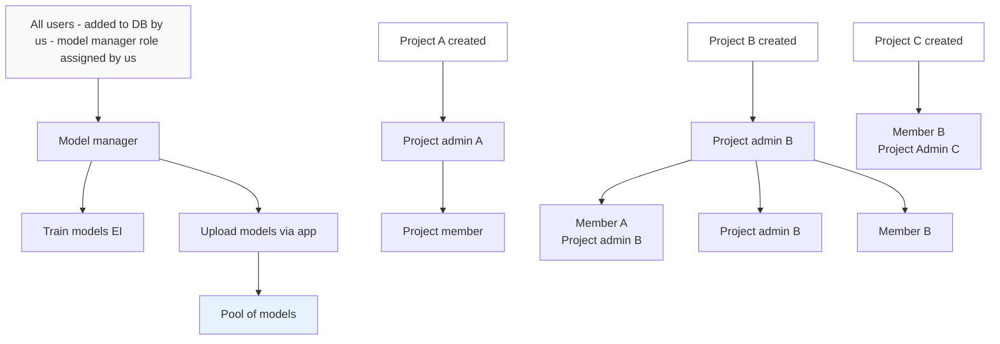

# Wildlife Watcher - User Roles Documentation

**Status**: ✅ Aligned with Implementation Spec v1.4.6  
**Database Implementation**: Existing `roles` and `project_members` tables sufficient (no separate user_roles table needed)

## Roles Overview

### Role Hierarchy Diagram

## Role Definitions

### Model Manager
- **Assignment**: Assigned role by us - Wildlife AI
- **Scope**: Organisation level
- **Capabilities**:
  - Trains and uploads models for the company
  - Can create/edit projects
  - Can start/end deployments

### Project Admin
- **Assignment**: Assigned role by adding project or by other PAs (Project Admins)
- **Capabilities**:
  - Can create new projects
  - Can edit the projects created by themselves
  - Can assign other project admins to do the same
  - Can add normal members to projects
  - Can select models from a list to assign to their project
  - Can start and end deployments

### Member
- **Assignment**: Assigned role by project admins
- **Capabilities**:
  - Can start/end deployments within projects they've been assigned to
  - Cannot edit projects they are not admins for
  - But can add new projects - becomes project admin for that project

## Key Notes

- **Every user can add a project and start/end deployment**
- Users can have different roles across different projects (e.g., Member A is a member in Project A but becomes Project Admin B when added to Project B)
- The model pool is centrally managed and accessible to project admins for assignment to their projects