# 🎨 Visual System Overview: Cross-Repository Coordination

This document provides visual representations of the coordination system to help understand its architecture and workflows.

---

## 📐 System Architecture

### High-Level Component View

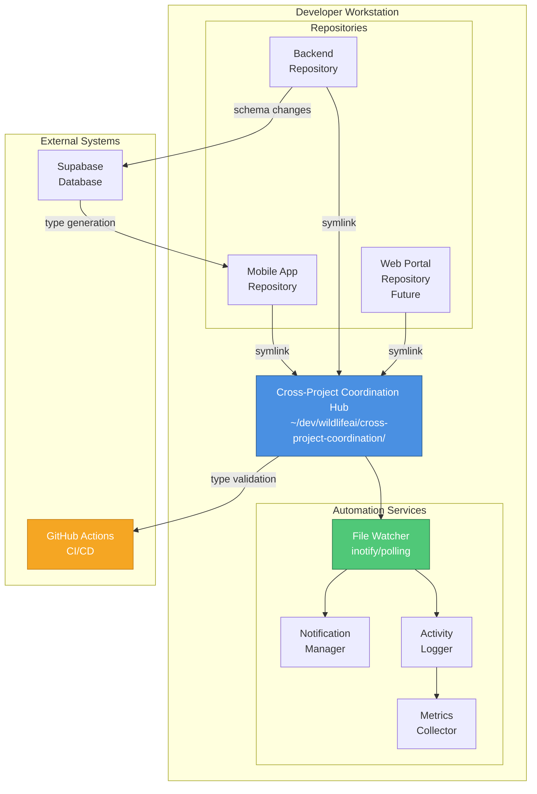

---

## 🔄 Message Flow Diagram

### Complete Message Lifecycle

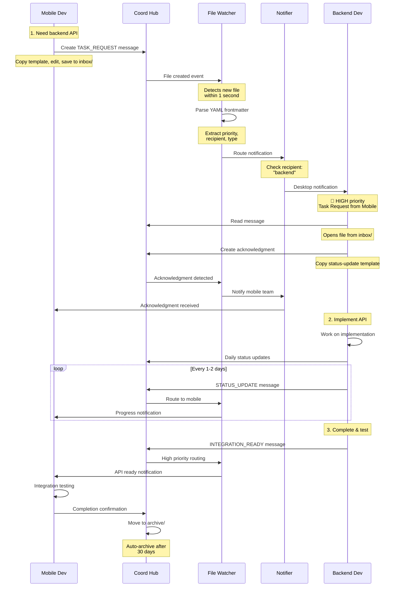

---

## 📊 Hub Directory Structure

### Detailed Folder Organization

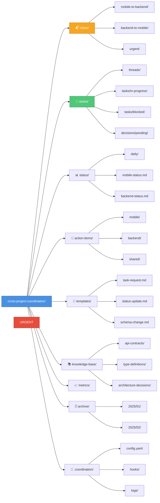

---

## ⚡ Priority Escalation Flow

### How Messages Escalate Based on Priority

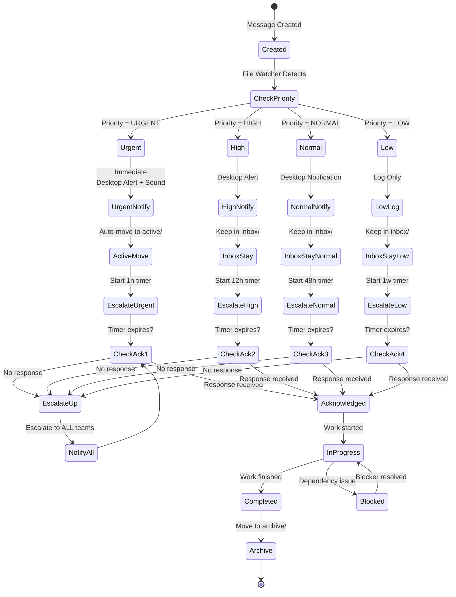

---

## 🔐 Type Synchronization Flow

### Backend Schema → Mobile Types

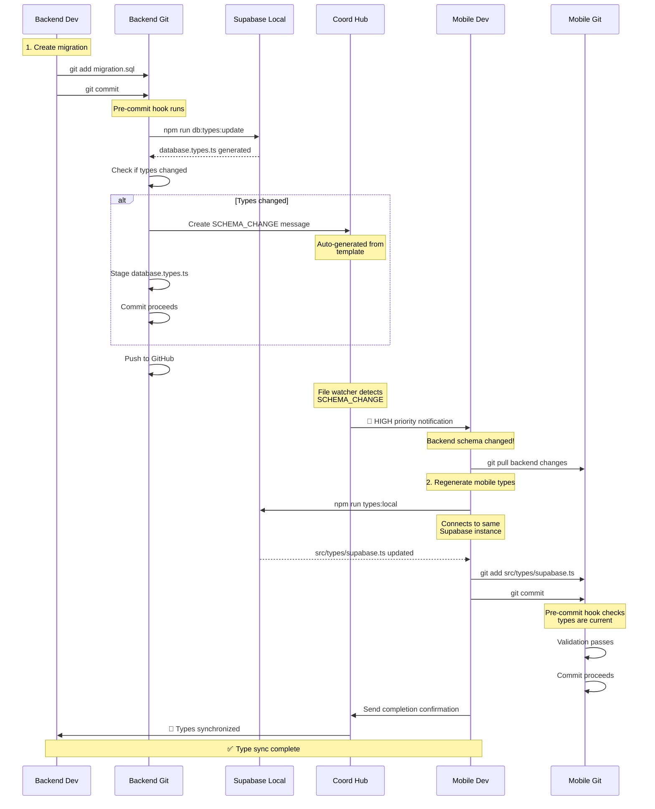

---

## 🎯 Workflow: Schema Change Coordination

### Step-by-Step Backend Schema Change Process

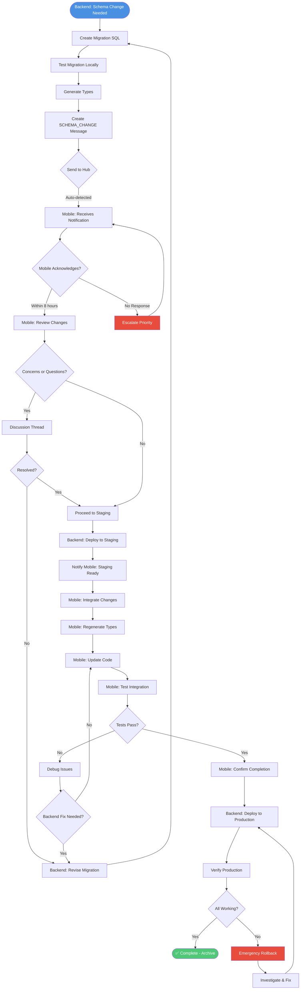

---

## 🚀 Quick Reference: Message Routing

### How the File Watcher Routes Messages

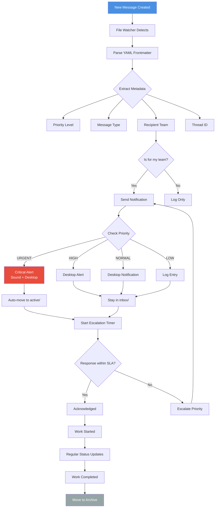

---

## 📱 Platform Support Matrix

### Cross-Platform Compatibility

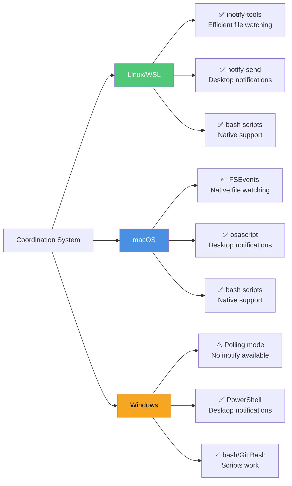

---

## 🔧 Automation Components

### System Services and Their Interactions

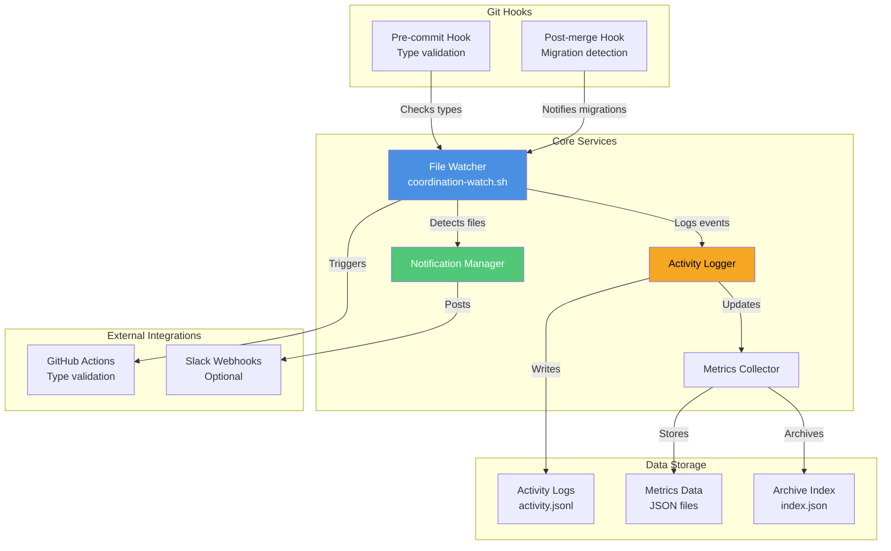

---

## 📊 Metrics Dashboard (Conceptual)

### Key Performance Indicators

```
┌─────────────────────────────────────────────────────────────┐
│           Coordination Health Dashboard                      │
├─────────────────────────────────────────────────────────────┤
│                                                               │
│  Response Times (Last 7 Days)                                │
│  ┌─────────────────────────────────────────────────────┐    │
│  │ URGENT:  ▓▓▓▓▓▓░░░░  1.2h avg (target: < 2h)  ✅  │    │
│  │ HIGH:    ▓▓▓▓▓▓▓░░░  6.8h avg (target: < 8h)  ✅  │    │
│  │ NORMAL:  ▓▓▓▓▓▓▓▓░░  18h avg (target: < 24h)  ✅  │    │
│  │ LOW:     ▓▓▓▓▓▓▓▓▓░  54h avg (target: < 72h)  ✅  │    │
│  └─────────────────────────────────────────────────────┘    │
│                                                               │
│  Message Volume                                              │
│  ┌─────────────────────────────────────────────────────┐    │
│  │ Today:      ████████████████  24 messages           │    │
│  │ This Week:  ████████████████████████████  156       │    │
│  │ This Month: ████████████████████████████████  628   │    │
│  └─────────────────────────────────────────────────────┘    │
│                                                               │
│  Active Items                                                │
│  ┌─────────────────────────────────────────────────────┐    │
│  │ In Progress: 12  │  Blocked: 2  │  Pending: 8      │    │
│  └─────────────────────────────────────────────────────┘    │
│                                                               │
│  Type Synchronization                                        │
│  ┌─────────────────────────────────────────────────────┐    │
│  │ Schema Changes: 8   │  Mobile Syncs: 8   │  ✅ 100% │    │
│  │ Last Sync: 2 hours ago   │  Status: IN SYNC       │    │
│  └─────────────────────────────────────────────────────┘    │
│                                                               │
│  Team Activity (Last 24h)                                    │
│  ┌─────────────────────────────────────────────────────┐    │
│  │ Mobile:  ▓▓▓▓▓▓▓▓▓▓▓▓▓▓░░░░░░  14 messages         │    │
│  │ Backend: ▓▓▓▓▓▓▓▓▓░░░░░░░░░░░  10 messages         │    │
│  │ Web:     ░░░░░░░░░░░░░░░░░░░░   0 messages         │    │
│  └─────────────────────────────────────────────────────┘    │
│                                                               │
└─────────────────────────────────────────────────────────────┘
```

---

## 🎯 Decision Tree: When to Use Each Message Type

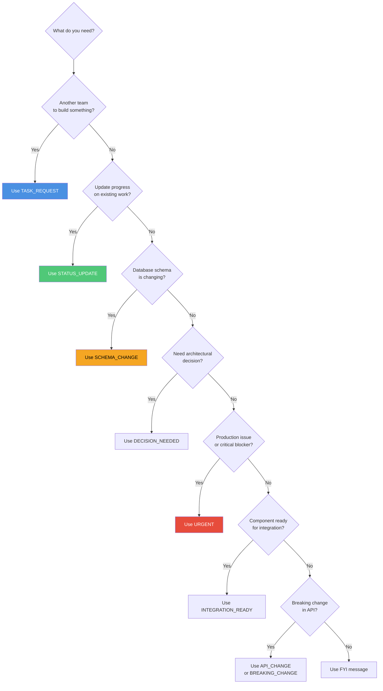

---

## 📋 Team Responsibility Matrix

### Who Does What in the Coordination System

| Activity | Mobile Team | Backend Team | DevOps | All Teams |
|----------|------------|--------------|--------|-----------|
| **Check inbox daily** | ✅ | ✅ | ✅ | ✅ |
| **Respond within SLA** | ✅ | ✅ | ✅ | ✅ |
| **Create task requests** | ✅ | ✅ | ✅ | ✅ |
| **Schema change notifications** | ❌ | ✅ | ❌ | ❌ |
| **Type regeneration** | ✅ | ✅ | ❌ | ❌ |
| **Monitor watcher service** | ❌ | ❌ | ✅ | ❌ |
| **Archive maintenance** | ❌ | ❌ | ✅ | ❌ |
| **Update team status** | ✅ | ✅ | ✅ | ✅ |
| **Integration testing** | ✅ | ✅ | ❌ | ❌ |
| **Deployment coordination** | ✅ | ✅ | ✅ | ❌ |

---

## 🎓 Learning Path

### Recommended Order for Understanding the System

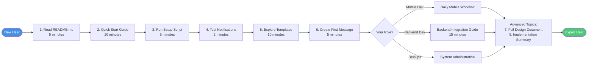

---

**This visual overview provides quick reference diagrams for understanding the cross-repository coordination system. Refer to the detailed documentation for complete information.**