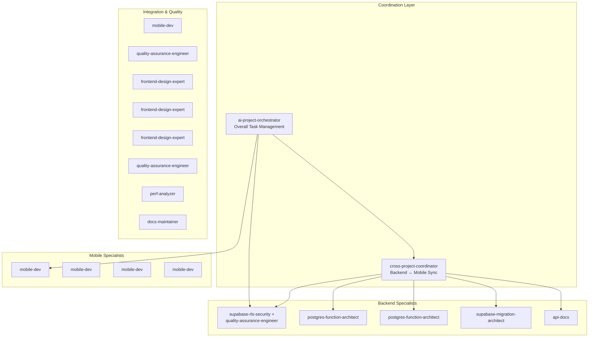

# Task 12: Projects CRUD Operations - Execution Plan

**Version**: 2.0
**Created**: 2025-10-04
**Updated**: 2025-10-04 (Added Supabase specialists + coordination layer)
**Execution Model**: Parallel Cross-Repo Development with AI Orchestration
**Estimated Total Time**: 4.5 hours (with parallelization)

---

## 🎯 Executive Summary

This execution plan maximizes development velocity through:
- **AI-orchestrated coordination** via `ai-project-orchestrator` for overall task management
- **Cross-repo synchronization** via `cross-project-coordinator` for backend/mobile alignment
- **Supabase specialist agents** for database, RLS, and migration expertise
- **Parallel execution** across mobile and backend repos
- **Clear dependency management** with critical path identification
- **Smart sequencing** to minimize blocking dependencies

**Key Insight**: Backend and mobile foundation work can happen **simultaneously**, with professional-grade orchestration ensuring seamless handoffs and 25% time savings.

**New in v2.0**:
- ✅ Supabase-specialized agents (postgres-function-architect, supabase-rls-security, supabase-migration-architect)
- ✅ Dual coordination layer (project orchestrator + cross-repo coordinator)
- ✅ Progressive agent spawning strategy
- ✅ Agent coordination workflow with context passing

---

## 📊 Dependency Graph

### Visual Dependency Map

```mermaid
graph TB
    subgraph "BACKEND REPO - Critical Path ⚡"
        B1[B1: Test Existing APIs<br/>TDD with real requests<br/>⏱️ 30 min]
        B2[B2: Gap Analysis<br/>Document missing APIs<br/>⏱️ 15 min]
        B3[B3: Implement Business Logic<br/>Org limits, member mgmt<br/>⏱️ 45 min]
        B4[B4: Deploy to Dev<br/>Migrate & verify<br/>⏱️ 15 min]
        B5[B5: API Documentation<br/>Endpoints & examples<br/>⏱️ 15 min]

        B1 --> B2
        B2 --> B3
        B3 --> B4
        B4 --> B5
    end

    subgraph "MOBILE REPO - Foundation (Parallel ⚡)"
        M1[M1: Type Definitions<br/>Project, Organisation types<br/>⏱️ 20 min]
        M2[M2: ProjectService Shell<br/>Mock implementation<br/>⏱️ 20 min]
        M3[M3: RTK Query Setup<br/>API endpoints with mocks<br/>⏱️ 20 min]
        M4[M4: Mock LoRaWAN Service<br/>Test data generation<br/>⏱️ 15 min]

        M1 --> M2
        M2 --> M3
        M2 --> M4
    end

    subgraph "MOBILE REPO - Integration (After Backend ⏸️)"
        I1[I1: Service Integration<br/>Replace mocks with real APIs<br/>⏱️ 30 min]
        I2[I2: Integration Tests<br/>TDD against live backend<br/>⏱️ 30 min]
        I3[I3: ProjectsScreen UI<br/>List, search, filter<br/>⏱️ 45 min]
        I4[I4: NewProjectScreen UI<br/>Form with validation<br/>⏱️ 30 min]
        I5[I5: Org Switcher UI<br/>Side menu (WW Admin)<br/>⏱️ 15 min]

        I1 --> I2
        I2 --> I3
        I3 --> I4
        I4 --> I5
    end

    subgraph "QUALITY & POLISH ✨"
        Q1[Q1: E2E Tests<br/>Critical user journeys<br/>⏱️ 30 min]
        Q2[Q2: Performance Optimization<br/>List rendering, caching<br/>⏱️ 20 min]
        Q3[Q3: Documentation<br/>Component usage, patterns<br/>⏱️ 10 min]

        Q1 --> Q2
        Q2 --> Q3
    end

    B5 --> I1
    M3 --> I1
    M4 --> I1
    I5 --> Q1

    style B1 fill:#ff6b6b
    style B4 fill:#ff6b6b
    style I1 fill:#4ecdc4
    style I2 fill:#4ecdc4
```

---

## 🤖 AI Agent Coordination Layer

### Orchestration Architecture



### Agent Responsibilities

#### **`ai-project-orchestrator`** (Continuous)
**Role**: Overall Task 12 project manager
**Duration**: Entire task lifecycle (~20 min overhead)

**Responsibilities**:
- Spawn and coordinate all sub-agents at correct times
- Monitor progress against 4.5-hour timeline
- Make go/no-go decisions at checkpoint gates
- Adjust resource allocation if delays occur
- Synthesize agent outputs into cohesive deliverables
- Report status to user at key milestones

**Active During**:
- Pre-execution planning
- Phase transitions (checkpoint gates)
- Blocker resolution
- Post-execution synthesis

---

#### **`cross-project-coordinator`** (Continuous)
**Role**: Backend ↔ Mobile synchronization specialist
**Duration**: Entire task lifecycle (~15 min overhead)

**Responsibilities**:
- Relay `task_012_backend_spec.md` to backend repo
- Monitor backend API implementation progress
- Validate backend deployment at 60-min checkpoint
- Confirm mobile foundation ready for integration
- Track cross-repo dependencies and blockers
- Update status in both PROJECT-STATUS.md files

**Active During**:
- Spec relay (pre-execution)
- Backend deployment validation (60-min checkpoint)
- Integration monitoring (Phase 2)
- Status synchronization (continuous)

---

### Agent Assignment Matrix

| Phase | Task | Primary Agent | Support Agent | Coordinator | Rationale |
|-------|------|---------------|---------------|-------------|-----------|
| **Setup** | Planning | `ai-project-orchestrator` | - | - | Overall orchestration |
| | Spec Relay | `cross-project-coordinator` | - | `ai-project-orchestrator` | Backend coordination |
| **Backend** | B1: Test APIs | `supabase-rls-security` | `quality-assurance-engineer` | `cross-project-coordinator` | RLS policy testing specialist |
| | B2: Gap Analysis | `postgres-function-architect` | - | `cross-project-coordinator` | Postgres function expert |
| | B3: Implement Logic | `postgres-function-architect` | - | `cross-project-coordinator` | PL/pgSQL specialist |
| | B4: Deploy | `supabase-migration-architect` | - | `cross-project-coordinator` | Migration specialist |
| | B5: Documentation | `api-docs` | - | `cross-project-coordinator` | API docs specialist |
| **Mobile** | M1: Types | `mobile-dev` | - | `ai-project-orchestrator` | TypeScript/RN expert |
| | M2: Service Shell | `mobile-dev` | - | `ai-project-orchestrator` | Service layer (continuous) |
| | M3: RTK Query | `mobile-dev` | - | `ai-project-orchestrator` | State management (continuous) |
| | M4: Mock LoRaWAN | `mobile-dev` | - | `ai-project-orchestrator` | Quick mock (continuous) |
| **Checkpoint** | Handoff (60min) | `cross-project-coordinator` | - | `ai-project-orchestrator` | Backend→Mobile validation |
| **Integration** | I1: Integration | `mobile-dev` | - | `cross-project-coordinator` | API integration |
| | I2: Tests | `quality-assurance-engineer` | - | `ai-project-orchestrator` | Integration testing |
| | I3: ProjectsScreen | `frontend-design-expert` | - | `ai-project-orchestrator` | UI/UX specialist |
| | I4: NewProjectScreen | `frontend-design-expert` | - | `ai-project-orchestrator` | Form UX (continuous) |
| | I5: Org Switcher | `frontend-design-expert` | - | `ai-project-orchestrator` | Navigation (continuous) |
| **Quality** | Q1: E2E Tests | `quality-assurance-engineer` | - | `ai-project-orchestrator` | E2E specialist |
| | Q2: Performance | `perf-analyzer` | - | `ai-project-orchestrator` | Performance optimization |
| | Q3: Documentation | `docs-maintainer` | - | `ai-project-orchestrator` | Project docs |
| **Completion** | Synthesis | `ai-project-orchestrator` | - | - | Final deliverable |

---

### Progressive Agent Spawning Strategy

**Why Progressive**: Better resource management, clearer context, lower overhead

#### **Pre-Execution** (Setup)
```bash
# Spawn orchestration layer
1. ai-project-orchestrator (overall management)
   └─ spawns: cross-project-coordinator (backend sync)
```

#### **Phase 1 Launch** (0 min mark)
```bash
# Backend track
cross-project-coordinator spawns:
  ├─ supabase-rls-security (B1: Test APIs)
  └─ quality-assurance-engineer (B1: Support)

# Mobile track
ai-project-orchestrator spawns:
  └─ mobile-dev (M1-M4: Foundation)
```

#### **Backend Sequential Spawning** (As needed)
```bash
# After B1 completes (30 min)
cross-project-coordinator spawns:
  └─ postgres-function-architect (B2: Gap analysis)

# After B2 completes (45 min)
# postgres-function-architect continues (B3: Implementation)

# After B3 completes (90 min)
cross-project-coordinator spawns:
  └─ supabase-migration-architect (B4: Deploy)

# After B4 completes (105 min)
cross-project-coordinator spawns:
  └─ api-docs (B5: Documentation)
```

#### **Checkpoint 1** (60 min mark)
```bash
cross-project-coordinator:
  ├─ Validates backend deployment
  ├─ Confirms mobile foundation ready
  └─ Approves Phase 2 launch

# If approved, ai-project-orchestrator triggers Phase 2
```

#### **Phase 2 Launch** (60 min mark)
```bash
# Mobile integration (mobile-dev continues from Phase 1)
ai-project-orchestrator:
  └─ mobile-dev continues (I1: Integration)

# After I1 completes (90 min)
ai-project-orchestrator spawns:
  └─ quality-assurance-engineer (I2: Integration tests)

# After I2 completes (120 min)
ai-project-orchestrator spawns:
  └─ frontend-design-expert (I3-I5: UI)
```

#### **Phase 3 Launch** (210 min mark)
```bash
ai-project-orchestrator spawns:
  ├─ quality-assurance-engineer (Q1: E2E)
  ├─ perf-analyzer (Q2: Performance)
  └─ docs-maintainer (Q3: Documentation)
```

#### **Completion** (270 min mark)
```bash
ai-project-orchestrator:
  ├─ Collects all agent outputs
  ├─ Synthesizes deliverables
  ├─ Updates metrics tracker
  └─ Generates completion report
```

---

### Agent Context Passing Protocol

**Context Inheritance Pattern**:
```
ai-project-orchestrator
  ├─ Has: Full task context from all 3 spec documents
  ├─ Passes to sub-agents: Relevant spec sections
  └─ Receives from sub-agents: Completion status + outputs

cross-project-coordinator
  ├─ Has: Backend spec, mobile requirements
  ├─ Passes to backend agents: API requirements, RLS needs
  └─ Receives from backend agents: Deployment status, API docs
```

**Sub-Agent Context Sources**:
1. **Orchestrator handoff** - Task requirements from orchestrator
2. **Spec documents** - Reference task_012_*.md files
3. **Previous agent outputs** - Build on predecessor work
4. **Live environment** - Backend dev instance, mobile codebase

**No Explicit Prompts Needed**: Agents infer context from comprehensive specs ✅

---

## ⚡ Parallel Execution Strategy

### Phase 1: Foundation (0-60 min) - **PARALLEL**

**Backend Track** (VS Code Instance 1):
```bash
cd ~/dev/wildlifeai/wildlife-watcher-backend

[0-30min] B1: Test Existing Project APIs (Agent: supabase-rls-security)
  ├─ Write integration tests for project CRUD
  ├─ Test RLS policies with different user roles
  ├─ Verify org isolation enforcement
  └─ Document API behavior and gaps

[30-45min] B2: Gap Analysis (Agent: postgres-function-architect)
  ├─ Identify missing business logic functions
  ├─ Document required member management APIs
  ├─ List needed computed fields
  └─ Create backend implementation spec

[45-90min] B3: Implement Business Logic (Agent: postgres-function-architect)
  ├─ Add org membership limit validation
  ├─ Create member management functions
  ├─ Add computed field queries
  └─ Write unit tests for new functions

[90-105min] B4: Deploy to Dev (Agent: supabase-migration-architect)
  ├─ Run migrations
  ├─ Verify deployment
  ├─ Test APIs in dev environment
  └─ Monitor logs for errors

[105-120min] B5: API Documentation (Agent: api-docs)
  ├─ Document all endpoints
  ├─ Provide request/response examples
  ├─ Create Postman collection
  └─ Update PROJECT-STATUS.md
```

**Mobile Track** (VS Code Instance 2 - **SIMULTANEOUS**):
```bash
cd ~/dev/wildlifeai/wildlife-watcher-mobile-app

[0-20min] M1: Type Definitions (Agent: react-native-expo-architect)
  ├─ Create Project interface
  ├─ Create Organisation interface
  ├─ Create ProjectMember interface
  ├─ Create LoRaWANDeviceStatus interface
  └─ Export from types/index.ts

[20-40min] M2: ProjectService Shell (Agent: mobile-dev)
  ├─ Create ProjectService class extending BaseService
  ├─ Implement CRUD methods with mock data
  ├─ Add offline queue integration points
  └─ Write service layer tests (with mocks)

[40-60min] M3: RTK Query Setup (Agent: mobile-dev)
  ├─ Create projectsApi.ts
  ├─ Define query and mutation endpoints
  ├─ Setup tag-based invalidation
  ├─ Configure optimistic updates
  └─ Use mock responses for now

[40-55min] M4: Mock LoRaWAN Service (Agent: mobile-dev - Parallel with M3)
  ├─ Create MockLoRaWANService class
  ├─ Generate realistic device status data
  ├─ Integrate with ProjectService
  └─ Add to service provider
```

**Coordination Point** (60 min mark):
```
Backend: Deployment complete ✅
Mobile: Foundation ready ✅
→ Ready for integration handoff
```

---

### Phase 2: Integration (60-150 min) - **SEQUENTIAL**

**Mobile Track** (Requires Backend Ready):
```bash
[60-90min] I1: Service Integration (Agent: mobile-dev)
  ├─ Replace mock API calls with real Supabase queries
  ├─ Update ProjectService to use deployed APIs
  ├─ Configure RTK Query base URLs
  ├─ Test connection to dev environment
  └─ Verify RLS policies working from mobile

[90-120min] I2: Integration Tests (Agent: quality-assurance-engineer)
  ├─ Write tests against live backend
  ├─ Test org isolation enforcement
  ├─ Test role-based access control
  ├─ Test offline queue and sync
  └─ Validate computed fields

[120-165min] I3: ProjectsScreen UI (Agent: frontend-design-expert)
  ├─ Build FlatList with project cards
  ├─ Add search and filter UI
  ├─ Implement pull-to-refresh
  ├─ Add LoRaWAN status indicators
  ├─ Handle loading and error states
  └─ Test with 100+ projects

[165-195min] I4: NewProjectScreen UI (Agent: frontend-design-expert)
  ├─ Create form with react-hook-form
  ├─ Add validation rules
  ├─ Implement offline creation
  ├─ Add success/error feedback
  └─ Test form submission flow

[195-210min] I5: Organisation Switcher UI (Agent: react-native-expo-architect)
  ├─ Add side menu option
  ├─ Show only for WW Admin with 2+ orgs
  ├─ Implement cache clearing on switch
  ├─ Add confirmation dialog
  └─ Test org context switching
```

**Backend Track** (Monitoring in Parallel):
```bash
[105-150min] Backend Monitoring (Agent: supabase-rls-security)
  ├─ Monitor API logs in dev environment
  ├─ Watch for errors or performance issues
  ├─ Adjust RLS policies if integration issues
  ├─ Add missing computed fields if requested
  └─ Document any API changes
```

---

### Phase 3: Quality & Polish (150-210 min) - **SEQUENTIAL**

**Mobile Track**:
```bash
[210-240min] Q1: E2E Tests (Agent: quality-assurance-engineer - if Maestro working)
  ├─ Test complete project creation flow
  ├─ Test org switching for WW Admin
  ├─ Test offline creation and sync
  ├─ Test role-based permissions
  └─ Document any Maestro issues for later

[240-260min] Q2: Performance Optimization (Agent: react-native-expo-architect)
  ├─ Optimize FlatList rendering (virtualization)
  ├─ Add proper memoization to components
  ├─ Implement caching strategies
  ├─ Test with large datasets
  └─ Profile memory usage

[260-270min] Q3: Documentation (Agent: docs-maintainer)
  ├─ Update component usage docs
  ├─ Document ProjectService API
  ├─ Add LoRaWAN integration notes
  ├─ Update MVP2-METRICS-TRACKER.md
  └─ Create handoff notes for Task 13
```

---

## 🔄 Cross-Repo Coordination Protocol

### Communication Channels

**Backend → Mobile Handoff Files:**
```bash
# Backend creates specification
~/wildlife-watcher-backend/project-context/MVP2-Tasks/
└── task-12-mobile-api-ready.md
    ├─ Endpoint documentation
    ├─ Example requests/responses
    ├─ RLS policy explanations
    └─ Known issues/limitations

# Backend updates status
~/wildlife-watcher-backend/project-context/PROJECT-STATUS.md
  - Section: "Task 12 Backend APIs - Ready for Mobile Integration"
  - Date/time of deployment
  - Dev environment URL
  - Test credentials
```

**Mobile → Backend Requirements:**
```bash
# Mobile creates requirements early
~/wildlife-watcher-mobile-app/project-context/development-context/MVP2/implementation/tasks/
└── task_012_backend_spec.md
    ├─ Required API endpoints
    ├─ Expected computed fields
    ├─ Business logic functions needed
    └─ Data format specifications

# Copy to backend repo
~/wildlife-watcher-backend/project-context/MVP2-Tasks/
└── task-12-mobile-requirements.md (symlink or copy)
```

---

### Handoff Checkpoints

#### **Checkpoint 1: Backend Ready** (60 min mark)

**Backend Deliverables:**
- ✅ All project CRUD APIs tested and working
- ✅ RLS policies verified for org isolation
- ✅ Business logic functions deployed (org limits, member mgmt)
- ✅ Computed fields functional (member_count, deployment_count)
- ✅ API documentation published
- ✅ Dev environment stable and accessible
- ✅ Test users created (ww_admin, project_admin, project_member)

**Verification Protocol:**
```bash
# Backend runs integration tests
cd ~/dev/wildlifeai/wildlife-watcher-backend
npm run test:integration -- --project-crud
# All tests must pass ✅

# Create handoff document
echo "Backend Task 12 APIs Ready" > project-context/MVP2-Tasks/task-12-ready.md
git add . && git commit -m "feat(task-12): backend APIs ready for mobile integration"

# Notify mobile team (update status)
# Mobile team proceeds with I1: Service Integration
```

**Mobile Action:**
- ⚡ Begin I1: Service Integration
- ⚡ Update API base URLs to dev environment
- ⚡ Run integration tests against live backend
- ⚡ Report any issues immediately

---

#### **Checkpoint 2: Mobile Integration Complete** (120 min mark)

**Mobile Deliverables:**
- ✅ ProjectService integrated with real APIs
- ✅ RTK Query endpoints connected
- ✅ Integration tests passing against live backend
- ✅ Org isolation verified from mobile side
- ✅ Role-based access working correctly

**Verification Protocol:**
```bash
# Mobile runs integration tests
cd ~/dev/wildlifeai/wildlife-watcher-mobile-app
npm run test:integration -- --project-service
# All tests must pass ✅

# Update metrics tracker
# Document any backend adjustments needed
```

**Backend Action:**
- 📊 Monitor API usage and performance
- 🔍 Check logs for errors
- 🛠️ Fix any discovered issues
- 📝 Document API behavior patterns

---

#### **Checkpoint 3: Feature Complete** (210 min mark)

**Both Repos Deliverables:**
- ✅ Full project CRUD working end-to-end
- ✅ All UI components functional
- ✅ Offline functionality tested
- ✅ WW Admin org switching working
- ✅ Performance targets met (<2s list, <500ms search)
- ✅ Tests passing (>80% coverage)
- ✅ Documentation updated

**Final Verification:**
```bash
# Backend final checks
cd ~/dev/wildlifeai/wildlife-watcher-backend
npm run test:all
git add . && git commit -m "feat(task-12): backend complete with mobile integration"

# Mobile final checks
cd ~/dev/wildlifeai/wildlife-watcher-mobile-app
npm run test:all
npm run typecheck
git add . && git commit -m "feat(task-12): projects CRUD complete with backend integration"
```

---

## 🚨 Blocking Conditions & Mitigation

### Critical Blockers

**1. Backend APIs Not Ready**

**Symptoms:**
- Mobile integration tests fail
- RLS policies blocking valid requests
- Missing computed fields
- Business logic errors

**Mitigation:**
```bash
# Mobile continues with mocks
- Keep working on UI with mock data
- Write integration tests (will pass once backend ready)
- Prepare handoff documentation
- Review backend requirements again

# Backend priority escalation
- Debug failing APIs immediately
- Simplify RLS policies if too restrictive
- Add logging for troubleshooting
- Deploy fixes ASAP
```

**2. RLS Policy Conflicts**

**Symptoms:**
- User can see cross-org data
- WW Admin blocked from their org data
- Role permissions not working

**Mitigation:**
```bash
# Test with real user scenarios
supabase db reset --linked
# Re-run seed data
# Test with psql directly
# Adjust policies incrementally
# Document policy logic clearly
```

**3. Offline Sync Issues**

**Symptoms:**
- Offline projects not syncing
- Conflicts not resolving
- Queue not processing

**Mitigation:**
```bash
# Isolate sync logic
- Test OfflineService independently
- Mock network conditions
- Add detailed logging
- Use ConflictResolutionService from Task 11
```

---

## ⏱️ Time Budget Breakdown

### Phase 1: Foundation (60 min) - Parallel
| Track | Task | Duration | Cumulative |
|-------|------|----------|------------|
| Backend | B1: Test APIs | 30 min | 30 min |
| Backend | B2: Gap Analysis | 15 min | 45 min |
| Backend | B3: Implement Logic | 45 min | 90 min |
| Backend | B4: Deploy | 15 min | 105 min |
| Backend | B5: Documentation | 15 min | **120 min** |
| | | | |
| Mobile | M1: Types | 20 min | 20 min |
| Mobile | M2: Service Shell | 20 min | 40 min |
| Mobile | M3: RTK Query | 20 min | 60 min |
| Mobile | M4: Mock LoRaWAN | 15 min | **55 min** |

**Parallel Savings**: 120 min sequential → **60 min parallel** = **60 min saved** ⚡

---

### Phase 2: Integration (90 min) - Sequential
| Task | Duration | Cumulative |
|------|----------|------------|
| I1: Service Integration | 30 min | 90 min |
| I2: Integration Tests | 30 min | 120 min |
| I3: ProjectsScreen UI | 45 min | 165 min |
| I4: NewProjectScreen UI | 30 min | 195 min |
| I5: Org Switcher UI | 15 min | **210 min** |

**Sequential (Required)**: Backend must be deployed before integration.

---

### Phase 3: Quality (60 min) - Sequential
| Task | Duration | Cumulative |
|------|----------|------------|
| Q1: E2E Tests | 30 min | 240 min |
| Q2: Performance | 20 min | 260 min |
| Q3: Documentation | 10 min | **270 min** |

**Total Time**: **4.5 hours** (270 minutes)

---

## 📋 Pre-Flight Checklist

### Before Starting Phase 1

**Backend Prerequisites:**
- [ ] Backend dev environment accessible
- [ ] Supabase CLI configured
- [ ] Test database can be reset
- [ ] Migration files reviewed
- [ ] VS Code open with backend repo

**Mobile Prerequisites:**
- [ ] Task 11 (Offline SQLite) complete and tested
- [ ] Generated Supabase types up to date
- [ ] Redux store operational
- [ ] OfflineService tested
- [ ] VS Code open with mobile repo

**Coordination:**
- [ ] Both repos on latest main branch
- [ ] Cross-project task folder accessible
- [ ] Communication channel established
- [ ] Time allocated for full 4.5 hours

---

## 🎯 Success Metrics

### Velocity Metrics
- [ ] Phase 1 completed in <60 min (parallel)
- [ ] Backend deployment successful first try
- [ ] Mobile integration <30 min after backend ready
- [ ] No blocking issues lasting >15 min

### Quality Metrics
- [ ] Zero TypeScript errors
- [ ] >80% test coverage achieved
- [ ] All integration tests passing
- [ ] Performance targets met

### Coordination Metrics
- [ ] <3 handoff delays between repos
- [ ] All handoff documents created
- [ ] Status updates regular (every 30 min)
- [ ] No duplicate work between teams

---

## 📝 Post-Task Retrospective

**To Complete After Task 12:**

1. **Update MVP2-METRICS-TRACKER.md**
   - Actual time spent per phase
   - Variance from estimates
   - Blockers encountered
   - Time saved through parallelization

2. **Update AADF Framework**
   - Cross-repo coordination patterns
   - Parallel execution learnings
   - Handoff protocol effectiveness
   - Testing strategy insights

3. **Create Handoff Notes for Task 13**
   - Reusable patterns from Task 12
   - Known issues to address
   - Optimization opportunities
   - Team collaboration lessons

---

**Document Status**: ✅ Ready for Execution
**Next Steps**: Review with team, then execute Phase 1 with parallel tracks
