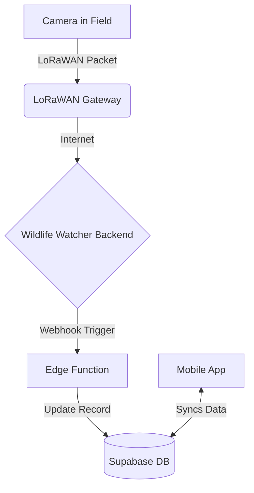

# BLE & LoRaWAN Communication Specification

**Version**: 1.0
**Date**: January 17, 2025
**Status**: For Implementation

---

## 1. Overview

This document specifies the technical back-and-forth communication protocol between the mobile app and the Wildlife Watcher camera for all major user workflows. It details the Bluetooth Low Energy (BLE) commands and the expected LoRaWAN behavior where applicable.

The general principle is that the mobile app acts as the central controller, sending commands to the camera, which then executes them and reports back its status or requested data.

---

## 2. Prepare Device Workflow Communications

This workflow, detailed in the [Device Preparation & Testing Workflow Spec](./device-preparation-workflow.md), covers device setup before it is deployed.

| Actor | Action | Protocol | Details |
| :--- | :--- | :--- | :--- |
| **App** | Scan & Connect | BLE | The app scans for nearby devices and establishes a BLE connection when a user selects a camera. |
| **App** | Send `GET_STATUS` command | BLE Write | The app requests a full status report from the camera to populate the "workbench" screen. |
| **Camera** | Respond with Full Status | BLE Notify | The camera sends a data packet containing its current state: Battery Level, SD Card Storage, Firmware Version, and currently loaded AI Model Name. |
| **App** | Send `TAKE_PHOTO` command | BLE Write | When the user taps "Check camera view", the app sends a command to take a test photo. |
| **Camera** | Transfer Photo | BLE Notify | The camera captures an image and transfers the data in chunks to the app for display. |
| **App** | Send `SET_MODEL <model_id>` | BLE Write | If a Project Admin changes the AI model, the app sends the new model ID to the camera. |
| **Camera** | Acknowledge Model Update | BLE Notify | The camera responds with an `ACK` or `NACK` to confirm if the model update was successful. |
| **App** | Initiate DFU | BLE | If a firmware update is required, the app initiates the DFU process. The detailed communication flow for this is specified in the Device Firmware Update Workflow. |

---

### 2.1. DFU Initiation

Putting the device into Device Firmware Update (DFU) mode is a multi-step process that involves changing the device's advertising state.

| Actor | Action | Protocol | Details |
| :--- | :--- | :--- | :--- |
| **App** | Connect to Device | BLE | Connect to the device in its normal operating mode (advertising as "WILD-MRGT"). |
| **App** | Send `dfu` command | BLE Write | The app sends the string "dfu" to the command characteristic to tell the device to prepare for DFU mode. |
| **App** | Send `dis` command | BLE Write | The app sends the string "dis" to command the device to disconnect and reboot. The user will see the red and blue LEDs turn on simultaneously. |
| **Camera** | Reboot into DFU Mode | BLE | The device reboots and begins advertising with a new name: **"WW500_DFU"**. |
| **App** | Scan & Reconnect | BLE | The app must scan for the "WW500_DFU" device and connect to the DFU service to begin the firmware transfer. |
| **App** | Transfer Firmware | BLE (DFU) | The app proceeds with the firmware update as specified in the Device Firmware Update Workflow. |

---

## 3. Start Deployment Workflow Communications

This workflow, detailed in the Start Deployment Workflow Spec, covers the process of deploying a camera in the field.

### 3.1. Device Selection & Pairing

This step establishes the initial communication link for the deployment.

| Actor | Action | Protocol | Details |
| :--- | :--- | :--- | :--- |
| **Camera** | Advertise | BLE | The camera advertises its specific service UUID, allowing the app to identify it as a Wildlife Watcher device. |
| **App** | Scan & Connect | BLE | The app scans for devices with the correct service UUID and initiates a connection request when the user selects a device. |
| **Camera** | Accept Connection | BLE | The camera accepts the connection request from a paired or trusted device. |
| **App** | Read Initial Status | BLE | Upon connection, the app reads basic characteristics like Device Name, Firmware Version, and Battery Level to populate the UI. |

---

### 3.2. Connectivity Setup

This step tests the camera's ability to communicate over the LoRaWAN network.

| Actor | Action | Protocol | Details |
| :--- | :--- | :--- | :--- |
| **App** | Send `TEST_LORAWAN` command | BLE Write | The app writes a specific byte command to the camera's command characteristic to initiate a LoRaWAN test. |
| **Camera** | Transmit Test Packet | LoRaWAN | The camera constructs and sends a small "hello" packet over the LoRaWAN network. This packet is configured to request a confirmation downlink from the network server. |
| **LoRaWAN Network** | Send Downlink | LoRaWAN | The network server receives the packet and sends a confirmation downlink back to the camera, which includes signal quality metrics (RSSI and SNR). |
| **Camera** | Receive & Report | BLE Notify | The camera receives the downlink, extracts the RSSI/SNR values, and sends them back to the app via a BLE notification on a specific data characteristic. |
| **App** | Display Results | - | The app receives the notification and displays the signal strength to the user. |

### 3.3. Camera View & Adjustment

This step allows the user to get a visual from the camera's perspective.

| Actor | Action | Protocol | Details |
| :--- | :--- | :--- | :--- |
| **App** | Send `TAKE_PREVIEW_PHOTO` command | BLE Write | The app writes a command to instruct the camera to capture a temporary, low-to-medium resolution image for preview purposes. |
| **Camera** | Capture & Prepare | - | The camera captures an image and stores it temporarily in RAM or a designated temporary file on the SD card. It does **not** save this as a permanent data record. |
| **Camera** | Start Image Transfer | BLE Notify | The camera begins sending the image data. The first notification packet contains metadata: `[image_size_bytes, total_chunks]`. Subsequent packets contain the raw image data chunks. |
| **App** | Receive & Reassemble | BLE | The app listens for these notifications, reassembles the image chunks in order, and displays the final image in the UI. A progress bar is shown during the transfer. |
| **App** | Send `DELETE_PREVIEW_PHOTO` command | BLE Write | After the user proceeds to the next step, the app sends a command to ensure the temporary photo is purged from the camera's memory/SD card to conserve space. |
| **Camera** | Purge Photo | - | The camera deletes the temporary image file and sends a simple `ACK` (acknowledgment) response over BLE. |

### 3.4. Confirmation & Submit (Final Configuration)

This is the final step where all deployment settings are written to the camera, and the deployment is officially started.

| Actor | Action | Protocol | Details |
| :--- | :--- | :--- | :--- |
| **App** | Write Deployment Config | BLE Write | The app sends a series of `WRITE` commands to specific characteristics to configure the camera. This includes: `SET_PROJECT_ID`, `SET_DEPLOYMENT_ID`, `SET_CAPTURE_METHOD`, `SET_TIMELAPSE_INTERVAL`, `SET_SENSITIVITY`, etc. |
| **Camera** | Store Config | - | The camera receives and stores each configuration value in its non-volatile memory, ready for the deployment. It sends an `ACK` after each successful write. |
| **App** | Send `START_DEPLOYMENT` command | BLE Write | After all configuration characteristics have been written successfully, the app sends the final activation command. |
| **Camera** | Verify & Activate | - | The camera performs a final check to ensure all necessary configuration is present. It then enters its active deployment state (e.g., enables motion sensor, starts timelapse timer). |
| **Camera** | Acknowledge & Disconnect | BLE | The camera sends a final `DEPLOYMENT_STARTED_ACK` notification and then automatically terminates the BLE connection to conserve battery for its long-term deployment. |
| **App** | Confirm Success | - | Upon receiving the final acknowledgment, the app displays the "Deployment Successful" screen. If the acknowledgment is not received within a timeout period (e.g., 5 seconds), it displays a failure message. |

---

## 4. End Deployment Workflow Communications

This workflow, detailed in the End Deployment Workflow Spec, covers the process of retrieving a camera from the field.

| Actor | Action | Protocol | Details |
| :--- | :--- | :--- | :--- |
| **App** | Scan & Connect | BLE | After being prompted, the user presses the button on the camera, making it discoverable. The app scans and connects to the device. |
| **App** | Send `GET_FINAL_STATUS` command | BLE Write | To populate the confirmation screen, the app requests the camera's final status. |
| **Camera** | Respond with Final Status | BLE Notify | The camera sends a data packet containing its final state: Battery Level and SD Card Storage usage. |
| **App** | Send `END_DEPLOYMENT` command | BLE Write | After the user confirms, the app sends a command to the camera to officially end its monitoring session. |
| **Camera** | Acknowledge & Power Down | BLE Notify | The camera acknowledges the command, stops its monitoring tasks, and may enter a low-power state. It sends a final `DEPLOYMENT_ENDED_ACK` before disconnecting. |

---

## 5. Bluetooth Characteristic Summary (Illustrative)

The following is an illustrative list of BLE characteristics the camera's service might expose. The final UUIDs are to be determined by the hardware team.

| Characteristic Name | Type | Description |
| :--- | :--- | :--- |
| `COMMAND_CHARACTERISTIC` | Write | For sending commands like `GET_STATUS`, `TAKE_PHOTO`, `TAKE_PREVIEW_PHOTO`, `TEST_LORAWAN`, `START_DEPLOYMENT`, `END_DEPLOYMENT`. |
| `DATA_NOTIFY_CHARACTERISTIC` | Notify | For receiving asynchronous data like status reports, LoRaWAN test results, or image data chunks. |
| `CONFIG_PROJECT_ID` | Write | To set the project UUID for the deployment. |
| `CONFIG_DEPLOYMENT_ID` | Write | To set the deployment UUID. |
| `CONFIG_CAPTURE_METHOD` | Write | To set 'motion' or 'timelapse' mode. |
| `CONFIG_TIMELAPSE_INTERVAL` | Write | To set the interval in seconds for timelapse mode. |
| `CONFIG_SENSITIVITY` | Write | To set the motion sensitivity level. |
| `CONFIG_AI_MODEL` | Write | To set the AI model ID. This is a separate command from `SET_MODEL` which is used in the prepare device workflow. |
| `STATUS_BATTERY_LEVEL` | Read/Notify | To get the current battery percentage. |
| `STATUS_FIRMWARE_VERSION` | Read | To get the installed firmware version string. |
| `STATUS_SD_CARD` | Read/Notify | To get the SD card storage status (e.g., free space). |

---

# Wildlife Watcher App: BLE & LoRaWAN Communication Guide

**Version**: 1.0
**Date**: January 17, 2025
**Status**: Active
**Purpose**: To provide a unified technical guide for mobile app developers on all device communication protocols, including Bluetooth Low Energy (BLE) and LoRaWAN. This document consolidates and clarifies information previously spread across multiple specifications.

---

## 1. Overview: A Dual-Processor System

The Wildlife Watcher camera hardware (WW500 series) contains two main processors:

1.  **BLE Processor (nRF52832)**: The "communications computer." It handles all Bluetooth connections with the mobile app. It runs two distinct modes:
    *   **Application Mode**: For normal day-to-day operations.
    *   **Bootloader Mode**: Exclusively for receiving firmware updates for itself.
2.  **AI Processor**: The "brains" of the camera. It controls the camera, runs AI models, and manages the SD card. It does **not** talk directly to the mobile app.

The two processors communicate internally over an I2C bus. Your mobile app only ever talks directly to the **BLE Processor**.

## 2. Bluetooth Low Energy (BLE) Services

The mobile app must handle two completely separate BLE services. Connecting to the wrong service will not work.

### 2.1. WWUS (Wildlife Watcher UART Service) - Normal Operations

This is the service used for **99% of interactions**, such as checking battery, taking photos, and configuring the device.

*   **When it's active**: During the camera's normal application mode.
*   **Purpose**: Sending text-based commands and receiving text-based responses.
*   **Service UUID**: `6e400001-b5a3-f393-e0a9-e50e24dcca9d`
*   **Characteristics**:
    *   **Write (TX)**: `6e400002-b5a3-f393-e0a9-e50e24dcca9d` (Send commands to camera)
    *   **Read (RX)**: `6e400003-b5a3-f393-e0a9-e50e24dcca9d` (Receive responses from camera)

**Command Example**:
To check the battery, the app sends the string `"battery\n"` to the Write characteristic. The camera responds with something like `"Battery = 85%\n"` on the Read characteristic.

### 2.2. DFU (Device Firmware Update) - BLE Processor Updates

This service is **only** used to update the firmware of the **BLE Processor (nRF52832)** itself. It cannot be used for anything else.

*   **When it's active**: Only after the camera has been put into DFU mode.
*   **Purpose**: Transferring a binary firmware file (`.zip`).
*   **Service UUID**: `00001530-1212-efde-1523-785feabcd123` (Nordic DFU Service)

**Workflow**:
1.  **In WWUS mode**, send the `"dfu"` command.
2.  The camera disconnects. This is expected.
3.  The camera reboots and starts advertising the DFU service.
4.  The app must scan again, find the DFU service, and connect to it.
5.  The app uses the `react-native-nordic-dfu` library to send the firmware file.
6.  The camera installs the update and reboots back into normal (WWUS) mode.

### 2.3. WWFT (Wildlife Watcher File Transfer) - Future-Proofing

To update the AI processor, transfer AI models, or download photos, a new service called **WWFT** is proposed. This service will run alongside WWUS in the normal application mode and is designed for transferring binary files.

*   **Status**: Proposed, not yet implemented in hardware.
*   **Purpose**:
    *   Update AI Processor firmware.
    *   Upload new AI models.
    *   Download photos from the SD card.
*   **Architecture**: The mobile app will send files to the BLE processor via the WWFT service, which will then forward the data to the AI processor over the internal I2C bus.

**Developer Note**: For MVP2, you only need to be concerned with **WWUS** and **DFU**. WWFT is for future planning.

## 3. LoRaWAN Integration - Long-Range Status Updates

LoRaWAN is a long-range, low-power radio system. It is completely separate from Bluetooth and is used by the camera to "phone home" with status updates when it's deployed in the field. The mobile app **does not** interact with LoRaWAN directly.

### How It Works

1.  A deployed camera periodically sends a small data packet via LoRaWAN (e.g., once per day).
2.  This packet is picked up by a LoRaWAN gateway in the area.
3.  The gateway forwards the data to the Wildlife Watcher backend server.
4.  A server-side **Edge Function** (webhook) parses the data.
5.  The backend database is updated with the new information.
6.  The mobile app receives these updates from the backend database the next time it syncs.

### Data Received via LoRaWAN

The backend is responsible for parsing the LoRaWAN payload. The mobile app will simply see updated fields in the `deployments` and `devices` tables.

*   **Battery Level**: `devices.battery_level` (integer percentage)
*   **SD Card Usage**: `devices.sd_card_usage` (integer percentage)
*   **Last Heard From**: `devices.last_seen` (timestamp)

### Mobile App Responsibilities

- **Display Data**: Show the battery level and SD card usage in the UI (e.g., on the Devices and Deployments screens).
- **Display "Last Seen"**: Show the `last_seen` timestamp to indicate when the camera last reported in.
- **Handle Stale Data**: If `last_seen` is old (e.g., > 48 hours), display a warning icon indicating the camera may be offline or having issues.
- **No Direct Communication**: The app never tries to communicate with the camera via LoRaWAN. All data comes from the synchronized backend.

## 4. Summary for App Implementation

### Device Preparation & Firmware Updates

The "Prepare and Test Nearby Devices" workflow involves connecting to a camera to check its status and update its firmware.

*   **Reference**: For a detailed breakdown of this user flow, see the `device-preparation-workflow.md` document.
*   **Communication**: This workflow uses **WWUS** for status checks and may trigger the **DFU** process for BLE processor firmware updates.

### Normal Operations

*   **Connect to**: WWUS service (`6e40...`).
*   **Send**: Text commands like `"battery\n"`.
*   **Receive**: Text responses like `"Battery = 85%\n"`.

### BLE Firmware Updates

*   **Trigger**: Send `"dfu"` command via WWUS.
*   **Reconnect**: Scan and connect to the DFU service (`00001530...`).
*   **Transfer**: Use the Nordic DFU library to send the `.zip` file.

### LoRaWAN Status

*   **Source**: Read `battery_level`, `sd_card_usage`, and `last_seen` fields from the `devices` table in the local synchronized database.
*   **Action**: Display this information in the UI. Do not attempt to get it directly from the device via BLE unless the user explicitly requests a real-time check (which would use a WWUS command).

---

## 5. Key Concepts

*   **UUID**: A unique "phone number" for a Bluetooth service. Your app uses these to find and connect to the right service (WWUS vs. DFU).
*   **Service**: A collection of features offered by a BLE device.
*   **Characteristic**: A specific data point or command channel within a service.
*   **I2C Bus**: The internal "wire" connecting the BLE and AI processors. The speed of this bus can be a bottleneck for large file transfers, which is why the WWFT protocol is being carefully designed.
*   **Bootloader**: A small, protected program on the BLE processor that runs on startup. Its only job is to decide whether to run the main application or enter DFU update mode.
