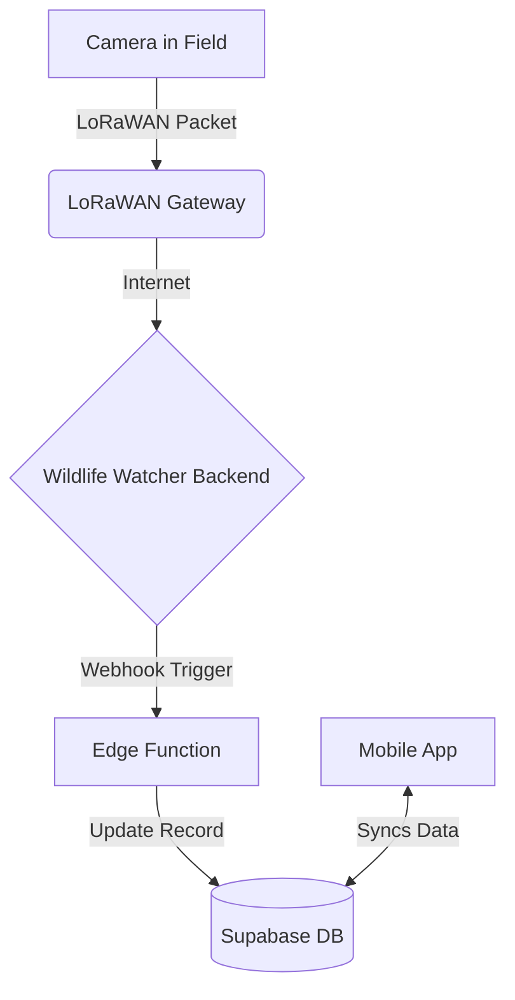

# Wildlife Watcher App: BLE & LoRaWAN Communication Guide

**Version**: 1.0
**Date**: October 18, 2025
**Status**: For Implementation
**Purpose**: To provide a unified technical guide for mobile app developers on all device communication protocols, including Bluetooth Low Energy (BLE) and LoRaWAN. 

---

## 1. Overview

The Wildlife Watcher camera hardware (WW500 series) contains two main processors:

1.  **BLE Processor (nRF52832)**: The "communications computer." It handles all Bluetooth connections with the mobile app. It runs two distinct modes:
    *   **Application Mode**: For normal day-to-day operations.
    *   **Bootloader Mode**: Exclusively for receiving firmware updates for itself.
2.  **AI Processor**: The "brains" of the camera. It controls the camera, runs AI models, and manages the SD card. It does **not** talk directly to the mobile app.

The two processors communicate internally over an I2C bus. The mobile app only ever talks directly to the **BLE Processor**.

---

## 2. Bluetooth Low Energy (BLE) Services

The mobile app must handle two completely separate BLE services.

### 2.1. WWUS (Wildlife Watcher UART Service) - Normal Operations

This is the service used for **99% of interactions**, such as checking battery, taking photos, and configuring the device.

*   **When it's active**: During the camera's normal application mode.
*   **Purpose**: Sending text-based commands and receiving text-based responses.
*   **Service UUID**: `6e400001-b5a3-f393-e0a9-e50e24dcca9d`
*   **Characteristics**:
    *   **Write (TX)**: `6e400002-b5a3-f393-e0a9-e50e24dcca9d` (Send commands to camera)
    *   **Read (RX)**: `6e400003-b5a3-f393-e0a9-e50e24dcca9d` (Receive responses from camera)

**Command Example**:
To check the battery, the app sends the string `"battery\n"` to the Write characteristic. The camera responds with something like `"Battery = 85%\n"` on the Read characteristic.

### 2.2. DFU (Device Firmware Update) - BLE Processor Updates

This service is **only** used to update the firmware of the **BLE Processor (nRF52832)** itself. It cannot be used for anything else.

*   **When it's active**: Only after the camera has been put into DFU mode.
*   **Purpose**: Transferring a binary firmware file (`.zip`).
*   **Service UUID**: `00001530-1212-efde-1523-785feabcd123` (Nordic DFU Service)

**Workflow**:
1.  **In WWUS mode**, send the `"dfu"` command.
2.  The camera disconnects. This is expected.
3.  The camera reboots and starts advertising the DFU service.
4.  The app must scan again, find the DFU service, and connect to it.
5.  The app uses the `react-native-nordic-dfu` library to send the firmware file.
6.  The camera installs the update and reboots back into normal (WWUS) mode.

### 2.3. WWFT (Wildlife Watcher File Transfer) - Future-Proofing

To update the AI processor, transfer AI models, or download photos, a new service called **WWFT** is proposed. This service will run alongside WWUS in the normal application mode and is designed for transferring binary files.

*   **Status**: Proposed, not yet implemented in hardware.
*   **Purpose**:
    *   Update AI Processor firmware.
    *   Upload new AI models.
    *   Download photos from the SD card.
*   **Architecture**: The mobile app will send files to the BLE processor via the WWFT service, which will then forward the data to the AI processor over the internal I2C bus.

**Developer Note**: For MVP2, you only need to be concerned with **WWUS** and **DFU**. WWFT is for future planning.

## 3. LoRaWAN Integration - Long-Range Status Updates

LoRaWAN is a long-range, low-power radio system. It is completely separate from Bluetooth and is used by the camera to "phone home" with status updates when it's deployed in the field. The mobile app **does not** interact with LoRaWAN directly.

### How It Works

1.  A deployed camera periodically sends a small data packet via LoRaWAN (e.g., once per day).
2.  This packet is picked up by a LoRaWAN gateway in the area.
3.  The gateway forwards the data to the Wildlife Watcher backend server.
4.  A server-side **Edge Function** (webhook) parses the data.
5.  The backend database is updated with the new information.
6.  The mobile app receives these updates from the backend database the next time it syncs.

### Data Received via LoRaWAN

The backend is responsible for parsing the LoRaWAN payload. The mobile app will simply see updated fields in the `deployments` and `devices` tables.

*   **Battery Level**: `devices.battery_level` (integer percentage)
*   **SD Card Usage**: `devices.sd_card_usage` (integer percentage)
*   **Last Heard From**: `devices.last_seen` (timestamp)

### Mobile App Responsibilities

- **Display Data**: Show the battery level and SD card usage in the UI (e.g., on the Devices and Deployments screens).
- **Display "Last Seen"**: Show the `last_seen` timestamp to indicate when the camera last reported in.
- **Handle Stale Data**: If `last_seen` is old (e.g., > 48 hours), display a warning icon indicating the camera may be offline or having issues.
- **No Direct Communication**: The app never tries to communicate with the camera via LoRaWAN. All data comes from the synchronized backend.

---

## 4. Summary for App Implementation

### 4.1. Device Preparation & Firmware Updates

The "Prepare and Test Nearby Devices" workflow involves connecting to a camera to check its status and update its firmware.

*   **Reference**: For a detailed breakdown of this user flow, see the `device-preparation-workflow.md` document.
*   **Communication**: This workflow uses **WWUS** for status checks and may trigger the **DFU** process for BLE processor firmware updates.

### 4.2. Normal Operations

*   **Connect to**: WWUS service (`6e40...`).
*   **Send**: Text commands like `"battery\n"`.
*   **Receive**: Text responses like `"Battery = 85%\n"`.

### 4.3. BLE Firmware Updates

*   **Trigger**: Send `"dfu"` command via WWUS.
*   **Reconnect**: Scan and connect to the DFU service (`00001530...`).
*   **Transfer**: Use the Nordic DFU library to send the `.zip` file.

### 4.4. LoRaWAN Status

*   **Source**: Read `battery_level`, `sd_card_usage`, and `last_seen` fields from the `devices` table in the local synchronized database.
*   **Action**: Display this information in the UI. Do not attempt to get it directly from the device via BLE unless the user explicitly requests a real-time check (which would use a WWUS command).

---

## 5. Key Concepts

*   **UUID**: A unique "phone number" for a Bluetooth service. Your app uses these to find and connect to the right service (WWUS vs. DFU).
*   **Service**: A collection of features offered by a BLE device.
*   **Characteristic**: A specific data point or command channel within a service.
*   **I2C Bus**: The internal "wire" connecting the BLE and AI processors. The speed of this bus can be a bottleneck for large file transfers, which is why the WWFT protocol is being carefully designed.
*   **Bootloader**: A small, protected program on the BLE processor that runs on startup. Its only job is to decide whether to run the main application or enter DFU update mode.
