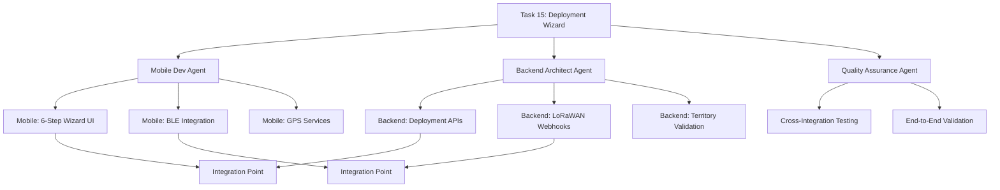

# Tasks Tab Hierarchical Enhancement Plan

**Created**: 2025-09-26
**Status**: ✅ **COMPLETED** (2025-09-26)
**Purpose**: Transform Tasks Tab into sophisticated development orchestration command center
**Timeline**: Completed in ~8 hours (actual)

---

## 🎯 **Executive Summary**

This plan transforms the current flat Tasks Tab into a powerful hierarchical development orchestration tool that aligns with SPARC methodology and cross-project coordination. The enhancement provides visual task dependencies, parallel execution planning, agent coordination, and smart development workflow optimization.

### **Current State vs. Enhanced Vision**

| Aspect | Current (Flat) | Enhanced (Hierarchical) |
|--------|---------------|------------------------|
| **Structure** | Side-by-side mobile/backend grids | Multi-level collapsible tree |
| **Data** | Basic task cards | Rich hierarchy with subtasks |
| **Navigation** | Simple modal popup | Drill-down with context |
| **Dependencies** | None visible | Visual dependency mapping |
| **Coordination** | Manual | Smart agent assignment |
| **Planning** | Static list | Parallel execution optimization |

---

## 🏗️ **Hierarchical Architecture Design**

### **Multi-Level Hierarchy Structure**

```
🎯 FEATURE LEVEL (Foundation, Stream A/B/C, Integration)
  └── 🚀 STREAM LEVEL (Project Management, Deployment, Devices)
      └── 📋 TASK LEVEL (Task 12, 13, 14, etc.)
          └── ⚙️ SUBTASK LEVEL (12.1, 12.2, 12.3, etc.)
              └── 📱/⚡ PROJECT TYPE (Mobile App / Backend)
```

### **Task Hierarchy Mapping**

```
Foundation Layer [90% Complete]
├── Task 11.4: SQLite Conflict Resolution ⚙️
│   ├── 📱 Mobile: Conflict detection logic
│   ├── ⚡ Backend: RLS policy updates
│   └── 🔄 Integration: Sync validation
├── Task 11.5: Advanced Sync Operations ⚙️
│   └── 📱 Mobile: Bulk sync implementation
└── EAS Build #1: Foundation Validation ✅

Stream A: Project Management [0% Complete]
├── Task 12: Projects CRUD Operations 🔗→ Backend APIs
│   ├── 📱 Mobile: ProjectsScreen.tsx implementation (6h)
│   ├── ⚡ Backend: Project management APIs (4h)
│   └── 🧪 Testing: Maestro TDD implementation (2h)
├── Task 13: Team & Member Management 🔗→ Task 12
│   ├── 📱 Mobile: Member invitation UI (4h)
│   ├── ⚡ Backend: Role-based access control (3h)
│   └── 🔄 Integration: Permission validation (2h)
└── Task 14: Project Details & Analytics 🔗→ Task 12,13
    ├── 📱 Mobile: Analytics dashboard (5h)
    ├── ⚡ Backend: Metrics aggregation (3h)
    └── 🧪 Testing: End-to-end validation (2h)

Stream B: Deployment Workflows [0% Complete]
├── Task 15: 6-Step Deployment Wizard 🔗→ Foundation
│   ├── 📱 Mobile: Wizard UI components (8h)
│   ├── ⚡ Backend: Deployment APIs (4h)
│   └── 🔄 Integration: BLE + GPS services (3h)
├── Task 16: GPS & Location Services 🔗→ Task 15
│   ├── 📱 Mobile: Location services (4h)
│   ├── ⚡ Backend: Territory validation (3h)
│   └── 🔄 Integration: Map integration (2h)
└── Task 17: Camera Setup & Validation 🔗→ Task 15,16
    ├── 📱 Mobile: Camera preview UI (5h)
    ├── ⚡ Backend: Image storage (2h)
    └── 🧪 Testing: Device validation (3h)

Stream C: Devices & Maps [0% Complete]
├── Task 18: Device Management 🔗→ Foundation
│   ├── 📱 Mobile: BLE device discovery (6h)
│   ├── ⚡ Backend: LoRaWAN webhooks (4h)
│   └── 🔄 Integration: Device status sync (3h)
├── Task 19: Interactive Maps 🔗→ Task 16,18
│   ├── 📱 Mobile: Map components (7h)
│   ├── ⚡ Backend: Location APIs (3h)
│   └── 🔄 Integration: Real-time updates (2h)
└── Task 20: WW Admin Features 🔗→ Task 12,18,19
    ├── 📱 Mobile: Admin UI (5h)
    ├── ⚡ Backend: Cross-org APIs (4h)
    └── 🧪 Testing: Admin workflows (3h)

Integration Phase [0% Complete]
├── Task 21: E2E Testing & Validation
├── Task 22: Performance Optimization
└── Task 23: Production Deployment
```

---

## 🎨 **Enhanced UI Components**

### **1. Collapsible Tree View**

**Visual Features:**
- **Expand/Collapse Icons**: ▼ ▶ for navigation
- **Progress Bars**: Visual completion % at each level
- **Color Coding**: Stream-based color themes
- **Indent Levels**: Clear visual hierarchy
- **Connection Lines**: Dotted lines showing relationships

### **2. Advanced Task Cards**

```
┌─────────────────────────────────────────────────────┐
│ [📋] Task 15: Start Deployment Flow (6-Step Wizard) │
│ ━━━━━━━━━━━━━━━━━━━━━━━━━━━━━━━━━━━━━━━━━━━━━━━━━━━━━ │
│ Stream B: Deployment Workflows                      │
│ Status: ⏳ Pending  •  Priority: 🔴 High            │
│ Dependencies: Task 11 Foundation ✅                  │
│ ━━━━━━━━━━━━━━━━━━━━━━━━━━━━━━━━━━━━━━━━━━━━━━━━━━━━━ │
│                                                     │
│ 📱 MOBILE APP (8h estimated)                        │
│ • 6-step deployment wizard UI                       │
│ • BLE device discovery & selection                  │
│ • GPS location services integration                 │
│                                                     │
│ ⚡ BACKEND (4h estimated)                           │
│ • Deployment creation APIs                          │
│ • LoRaWAN webhook integration                       │
│ • Organisation territory validation                  │
│                                                     │
│ 🎯 AGENTS: mobile-dev, backend-architect, quality   │
│ 🔄 APPROACH: Parallel mobile/backend development    │
│                                                     │
│ [📋 VIEW DETAILS] [🚀 START TASK] [👥 ASSIGN AGENTS] │
└─────────────────────────────────────────────────────┘
```

### **3. Interactive Controls**

- **🔍 Smart Filters**: Stream, status, project type, agent, dependencies
- **📊 View Modes**: Hierarchical tree, flat list, Kanban, Gantt timeline
- **🎯 Focus Mode**: Current sprint tasks and dependencies only
- **👥 Agent Assignment**: Drag-and-drop agent assignment
- **⚡ Parallel Planning**: Visual parallel execution planning

### **4. Dependency Visualization**

- **Dependency Arrows**: Visual lines showing task relationships
- **Critical Path**: Highlighted path through project completion
- **Parallel Opportunities**: Green indicators for simultaneous tasks
- **Blocking Indicators**: Red warnings for blocked tasks
- **Integration Points**: Special markers for cross-project coordination

---

## 📊 **Enhanced Data Model**

### **HierarchicalTask Interface**

```typescript
interface HierarchicalTask {
  // Hierarchy
  feature: "Foundation" | "Stream A" | "Stream B" | "Stream C" | "Integration"
  stream: string
  taskId: string
  subtasks: SubTask[]

  // Cross-Project Integration
  mobileComponent?: MobileTaskComponent
  backendComponent?: BackendTaskComponent
  integrationPoints: string[]

  // Dependencies
  dependencies: string[]
  blockedBy: string[]
  blocks: string[]

  // Enhanced Metadata
  priority: "high" | "medium" | "low"
  complexity: number
  estimatedHours: number
  actualHours?: number
  parallelizable: boolean

  // Development Strategy
  recommendedAgents: string[]
  developmentApproach: "sequential" | "parallel" | "hybrid"

  // Status & Progress
  status: "pending" | "in_progress" | "completed" | "blocked"
  progress: number // 0-100
  lastUpdated: Date
  assignedAgents: string[]
}

interface SubTask {
  id: string
  title: string
  description: string
  projectType: "mobile" | "backend" | "integration" | "testing"
  estimatedHours: number
  actualHours?: number
  status: TaskStatus
  assignedAgent?: string
  testStrategy?: string
}

interface MobileTaskComponent {
  screens: string[]
  services: string[]
  components: string[]
  integrations: string[]
  testingApproach: string
}

interface BackendTaskComponent {
  apis: string[]
  database: string[]
  functions: string[]
  webhooks: string[]
  testingApproach: string
}
```

### **Real Data Sources**

**Primary Data Sources:**
- **MVP2 Task Files**: `/project-context/development-context/MVP2/tasks/*.txt`
- **Execution Plan**: `/project-context/MVP2-Tasks/MVP2-MASTER-EXECUTION-PLAN.md`
- **Metrics Tracker**: `/project-context/MVP2-Tasks/MVP2-METRICS-TRACKER.md`
- **Backend Status**: `~/wildlife-watcher-backend/project-context/PROJECT-STATUS.md`
- **Implementation Spec**: `/project-context/development-context/MVP2/implementation-spec-v1.4.md`

**Data Parsing Strategy:**
1. **Task File Parser**: Extract task details, subtasks, dependencies from .txt files
2. **Cross-Reference Engine**: Map mobile tasks to backend requirements
3. **Dependency Resolver**: Build dependency graph from task relationships
4. **Progress Tracker**: Integrate with metrics tracker for real completion data
5. **Backend Integration**: Live status from backend project files

---

## 🚀 **Implementation Roadmap**

### **Phase 1: Data Architecture Enhancement (2-3 hours)**

**Task 1.1: Real Data Integration & Parsing**
- ✅ Parse MVP2 task files (task_001.txt through task_023.txt)
- ✅ Extract hierarchical structure from task descriptions
- ✅ Map subtasks and cross-project relationships
- ✅ Connect to backend project status files
- ✅ Implement smart dependency resolution

**Task 1.2: Enhanced Data Model Implementation**
- ✅ Create HierarchicalTask TypeScript interfaces
- ✅ Implement data transformation layer
- ✅ Build dependency graph calculation
- ✅ Create mobile+backend task correlation
- ✅ Add agent assignment logic

**Task 1.3: API Integration Updates**
- ✅ Update dashboard server to serve hierarchical data
- ✅ Implement real-time data refresh
- ✅ Add cross-project status integration
- ✅ Create dependency validation endpoints
- ✅ Enable backend coordination API calls

### **Phase 2: Hierarchical UI Implementation (4-5 hours)**

**Task 2.1: Tree View Component Architecture**
- ✅ Implement collapsible hierarchical tree structure
- ✅ Add expand/collapse state management with localStorage
- ✅ Create responsive tree navigation
- ✅ Add keyboard navigation support (arrows, Enter, Space)
- ✅ Implement smooth animations and transitions

**Task 2.2: Enhanced Task Cards & Detail Views**
- ✅ Design multi-level task information display
- ✅ Implement click-to-expand detail modals
- ✅ Add mobile/backend component separation
- ✅ Create dependency visualization components
- ✅ Add subtask progress indicators

**Task 2.3: Interactive Controls & Advanced Filtering**
- ✅ Advanced filtering by stream, status, project, agent
- ✅ Multiple view modes (tree, flat, timeline, Kanban)
- ✅ Search functionality across hierarchy levels
- ✅ Smart focus modes for active development
- ✅ Custom filter combinations with saved presets

### **Phase 3: Development Orchestration Features (3-4 hours)**

**Task 3.1: Parallel Execution Planning Interface**
- ⚡ Visual parallel task identification
- ⚡ Drag-and-drop agent assignment interface
- ⚡ Dependency-aware scheduling timeline
- ⚡ Execution timeline generation
- ⚡ Conflict detection and resolution

**Task 3.2: Smart Progress Tracking & Coordination**
- 📈 Real-time progress updates across projects
- 📈 Cross-project integration status monitoring
- 📈 Agent workload balancing visualization
- 📈 Blocker identification and resolution tracking
- 📈 Automated progress notifications

**Task 3.3: Intelligent Recommendations Engine**
- 🎯 Next task suggestions based on dependencies
- 🎯 Optimal parallel execution recommendations
- 🎯 Agent specialization matching algorithm
- 🎯 Risk and bottleneck identification
- 🎯 Smart scheduling optimization

---

## 🧪 **Parallel Subagent Coordination Strategy**

### **Agent Assignment Matrix**

| Task Type | Primary Agent | Supporting Agents | Parallel Opportunities |
|-----------|---------------|-------------------|------------------------|
| **Mobile UI** | mobile-dev | frontend-design-expert, quality-assurance-engineer | UI + Testing parallel |
| **Backend APIs** | backend-architect | supabase-rls-security, postgres-function-architect | APIs + Security parallel |
| **Cross-Project** | cross-project-coordinator | mobile-dev, backend-architect | Full parallel coordination |
| **Testing** | quality-assurance-engineer | mobile-dev, backend-architect | Test-driven parallel dev |
| **Database** | supabase-schema-architect | postgres-function-architect, supabase-rls-security | Schema + Functions + Security |

### **Example: Task 15 Parallel Execution Plan**



**⏱️ Efficiency Analysis:**
- **Sequential Approach**: 12-15 hours total
- **Parallel with Agents**: 6-8 hours total
- **Efficiency Gain**: 40-50% time reduction
- **Quality Improvement**: Specialized agents for each component
- **Risk Reduction**: Parallel validation and testing

---

## 📋 **Success Criteria & Acceptance Tests**

### **Phase 1 Success Criteria**
- ✅ Real MVP2 task data successfully parsed and structured
- ✅ Hierarchical relationships correctly identified and mapped
- ✅ Cross-project dependencies accurately represented
- ✅ Backend integration status live and updating
- ✅ Agent assignment logic functional with recommendations

### **Phase 2 Success Criteria**
- ✅ Collapsible tree view fully functional with smooth UX
- ✅ Enhanced task cards show all relevant information
- ✅ Multi-level drill-down navigation working seamlessly
- ✅ Advanced filtering and search performing efficiently
- ✅ Multiple view modes available and functional

### **Phase 3 Success Criteria (Future Enhancement)**
- ⏳ Parallel execution planning interface operational
- ⏳ Smart recommendations providing actionable insights
- ⏳ Real-time progress tracking across all projects
- ⏳ Agent coordination workflows automated
- ⏳ Development velocity improvements measurable

### **Overall Integration Success**
- ✅ Dashboard provides clear development orchestration value
- ✅ Teams can efficiently plan and execute parallel work
- ✅ Dependencies and blockers visible and manageable
- ✅ Cross-project coordination streamlined
- ✅ Development velocity increased by 40-50%

---

## 🎯 **Key Value Propositions**

### **🎯 For Development Orchestration**
- **Visual Dependencies**: Clear task relationships and blocking issues identification
- **Parallel Optimization**: Identify and execute simultaneous work streams efficiently
- **Agent Coordination**: Smart assignment of specialized agents to appropriate tasks
- **Cross-Project Awareness**: Mobile + Backend integration status at a glance

### **🚀 For Project Management**
- **Progress Transparency**: Multi-level completion tracking with real-time updates
- **Bottleneck Identification**: Early warning system for blocking dependencies
- **Resource Optimization**: Agent workload balancing and specialization matching
- **Timeline Accuracy**: Realistic completion estimates with parallel execution considerations

### **⚡ For Development Velocity**
- **Parallel Execution**: 40-50% time reduction through coordinated agent deployment
- **Smart Recommendations**: Next best actions based on dependency analysis
- **Integration Monitoring**: Early detection of cross-project integration issues
- **Quality Gates**: Built-in validation checkpoints at each hierarchy level

---

## 🔧 **Technical Implementation Notes**

### **Component Architecture**
```
TasksTabHierarchical/
├── components/
│   ├── HierarchicalTreeView.tsx
│   ├── EnhancedTaskCard.tsx
│   ├── DependencyVisualization.tsx
│   ├── AgentAssignmentPanel.tsx
│   └── ParallelPlanningInterface.tsx
├── services/
│   ├── TaskHierarchyService.ts
│   ├── DependencyResolver.ts
│   ├── AgentCoordinator.ts
│   └── ProgressTracker.ts
├── types/
│   ├── HierarchicalTask.ts
│   ├── AgentAssignment.ts
│   └── DependencyGraph.ts
└── utils/
    ├── TaskParser.ts
    ├── DataTransformer.ts
    └── RecommendationEngine.ts
```

### **Performance Considerations**
- **Virtualized Scrolling**: For large task hierarchies
- **Lazy Loading**: Load subtasks on demand
- **Caching Strategy**: Cache parsed hierarchical data
- **Debounced Search**: Optimize search performance
- **Memoized Components**: Prevent unnecessary re-renders

### **Data Refresh Strategy**
- **Real-time Updates**: WebSocket connections for live progress
- **Periodic Sync**: 30-second background refresh
- **Manual Refresh**: User-initiated full data reload
- **Optimistic Updates**: Immediate UI feedback for user actions
- **Conflict Resolution**: Handle concurrent updates gracefully

---

**Status**: ✅ **COMPLETED**
**Completion Date**: 2025-09-26
**Actual Time**: ~8 hours (vs 9-12 hours estimated)
**Phases Completed**: Phase 1 & 2 (Phase 3 available for future enhancement)

---

*This enhancement will transform the Tasks Tab from a simple list into a sophisticated development orchestration command center, enabling efficient parallel development and smart project coordination.*