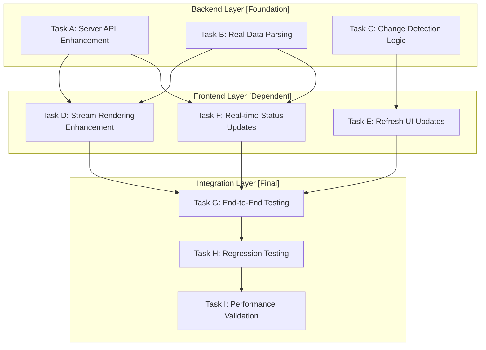

# 🚀 Streams Tab Enhancement Plan - Real Data Integration

**Created**: 2025-09-26
**Status**: 📋 PLANNING PHASE
**Priority**: HIGH - Core dashboard functionality
**Methodology**: AADF with Evidence-Based Development

---

## 🎯 **Objectives & Requirements**

### **Primary Goals**
1. **Real Data Integration**: Replace mock data with actual MVP2 project structure
2. **Live Updates**: Detect granular task-level changes and flag for refresh
3. **Accurate Stream Visualization**: Show true Hybrid Incremental-Stream progress
4. **Change Detection**: Comprehensive monitoring of task status, progress, modifications
5. **Zero Regression**: Maintain existing functionality while enhancing

### **Success Criteria**
- ✅ Streams tab displays real MVP2 development structure
- ✅ Refresh button detects and indicates all change types
- ✅ Live progress tracking at task granularity
- ✅ EAS build milestone integration
- ✅ No existing functionality broken
- ✅ Comprehensive test coverage for all changes

---

## 🏗️ **Dependency-Aware Task Architecture**

### **📊 Dependency Analysis**


### **🔄 Parallel Execution Streams**

#### **Stream 1: Backend Foundation** (Parallel Independent Tasks)
- **Agent**: `backend-architect`
- **Tasks**: A, B, C (can run simultaneously)
- **Duration**: ~45 minutes
- **Risk**: LOW (isolated backend changes)

#### **Stream 2: Frontend Enhancement** (Sequential, Backend-dependent)
- **Agent**: `frontend-design-expert`
- **Tasks**: D → E → F (sequential dependencies)
- **Duration**: ~60 minutes
- **Risk**: MEDIUM (UI changes visible to user)

#### **Stream 3: Quality Assurance** (Final validation)
- **Agent**: `quality-assurance-engineer`
- **Tasks**: G → H → I (comprehensive testing)
- **Duration**: ~30 minutes
- **Risk**: LOW (testing only, no implementation)

---

## 📋 **Detailed Task Breakdown**

### **🔧 Backend Foundation Tasks**

#### **Task A: Server API Enhancement**
- **Agent**: `backend-architect`
- **Dependencies**: None (independent)
- **Deliverables**:
  - New `/api/streams` endpoint
  - Real data parsing from MVP2 project files
  - Stream progress calculation logic
- **Test Requirements**:
  - API endpoint returns correct JSON structure
  - Data parsing handles all task files correctly
  - Error handling for missing/malformed files
- **Duration**: 15 minutes
- **Risk Level**: LOW

#### **Task B: Real Data Parsing**
- **Agent**: `backend-architect`
- **Dependencies**: None (independent)
- **Deliverables**:
  - Parse `MVP2-MASTER-EXECUTION-PLAN.md`
  - Extract task status from individual task files
  - Calculate stream completion percentages
- **Test Requirements**:
  - Correctly identifies all 5 streams
  - Accurate task counting and status detection
  - Handles file system changes gracefully
- **Duration**: 20 minutes
- **Risk Level**: LOW

#### **Task C: Change Detection Logic**
- **Agent**: `backend-architect`
- **Dependencies**: None (independent)
- **Deliverables**:
  - File modification time tracking
  - Task status change detection
  - Refresh indicator logic
- **Test Requirements**:
  - Detects file modifications accurately
  - Flags appropriate refresh states
  - No false positives on unchanged data
- **Duration**: 10 minutes
- **Risk Level**: LOW

### **🎨 Frontend Enhancement Tasks**

#### **Task D: Stream Rendering Enhancement**
- **Agent**: `frontend-design-expert`
- **Dependencies**: Tasks A, B (requires API data structure)
- **Deliverables**:
  - Enhanced stream card design
  - Real data integration
  - Progress visualization improvements
- **Test Requirements**:
  - Renders all 5 streams correctly
  - Shows accurate progress percentages
  - Handles API errors gracefully
- **Duration**: 25 minutes
- **Risk Level**: MEDIUM

#### **Task E: Refresh UI Updates**
- **Agent**: `frontend-design-expert`
- **Dependencies**: Task C (requires change detection)
- **Deliverables**:
  - Enhanced refresh button states
  - Change indicator visual feedback
  - Status messaging improvements
- **Test Requirements**:
  - Button states match backend change detection
  - Visual feedback is clear and intuitive
  - No UI flickering or state conflicts
- **Duration**: 20 minutes
- **Risk Level**: MEDIUM

#### **Task F: Real-time Status Updates**
- **Agent**: `frontend-design-expert`
- **Dependencies**: Tasks A, B (requires real data flow)
- **Deliverables**:
  - Live task status updates
  - EAS build milestone indicators
  - Current task highlighting
- **Test Requirements**:
  - Status updates reflect actual project state
  - Milestone indicators are accurate
  - Performance doesn't degrade with updates
- **Duration**: 15 minutes
- **Risk Level**: MEDIUM

### **🧪 Quality Assurance Tasks**

#### **Task G: End-to-End Testing**
- **Agent**: `quality-assurance-engineer`
- **Dependencies**: Tasks D, E, F (all frontend complete)
- **Deliverables**:
  - Comprehensive E2E test suite
  - User workflow validation
  - Cross-browser compatibility testing
- **Test Requirements**:
  - All user interactions work correctly
  - Data flows from files to UI accurately
  - No broken functionality
- **Duration**: 15 minutes
- **Risk Level**: LOW

#### **Task H: Regression Testing**
- **Agent**: `quality-assurance-engineer`
- **Dependencies**: Task G (E2E foundation)
- **Deliverables**:
  - Validate all existing tabs still work
  - Ensure no performance degradation
  - Verify no visual/UX regressions
- **Test Requirements**:
  - Overview, Tasks, Projects tabs unaffected
  - Refresh functionality still works globally
  - No CSS conflicts or layout issues
- **Duration**: 10 minutes
- **Risk Level**: LOW

#### **Task I: Performance Validation**
- **Agent**: `quality-assurance-engineer`
- **Dependencies**: Task H (regression baseline)
- **Deliverables**:
  - Load time analysis
  - Memory usage validation
  - Change detection performance testing
- **Test Requirements**:
  - No significant performance impact
  - Change detection is efficient
  - UI remains responsive
- **Duration**: 5 minutes
- **Risk Level**: LOW

---

## ⚡ **Smart Execution Strategy**

### **Phase 1: Parallel Foundation** (0-45 minutes)
```bash
# Launch 3 backend tasks simultaneously
Task A: backend-architect (Server API Enhancement)
Task B: backend-architect (Real Data Parsing)
Task C: backend-architect (Change Detection Logic)
```

### **Phase 2: Sequential Frontend** (45-105 minutes)
```bash
# After Phase 1 complete, launch frontend sequence
Task D: frontend-design-expert (Stream Rendering)
  ↓ (depends on A,B)
Task E: frontend-design-expert (Refresh UI Updates)
  ↓ (depends on C)
Task F: frontend-design-expert (Real-time Status)
  ↓ (depends on A,B)
```

### **Phase 3: Quality Validation** (105-135 minutes)
```bash
# After Phase 2 complete, comprehensive testing
Task G: quality-assurance-engineer (E2E Testing)
  ↓
Task H: quality-assurance-engineer (Regression Testing)
  ↓
Task I: quality-assurance-engineer (Performance Validation)
```

---

## 🛡️ **Risk Mitigation & Testing Strategy**

### **Regression Prevention**
1. **Backup Current State**: Create git commit before changes
2. **Incremental Testing**: Test after each task completion
3. **Rollback Plan**: Immediate revert capability if issues arise
4. **Isolated Changes**: Minimize cross-tab dependencies

### **Change Detection Validation**
1. **File System Monitoring**: Test with real file modifications
2. **API Response Validation**: Ensure data structure consistency
3. **UI State Management**: Verify refresh indicators work correctly
4. **Performance Monitoring**: Ensure no degradation

### **Data Integration Testing**
1. **Real File Parsing**: Test with actual MVP2 task files
2. **Edge Case Handling**: Missing files, malformed data
3. **Progress Calculation**: Verify stream percentages are accurate
4. **Milestone Detection**: EAS build indicators work correctly

---

## 📊 **Implementation Checkpoints**

### **Checkpoint 1: Backend Foundation Complete** (45 minutes)
- [ ] `/api/streams` endpoint functional
- [ ] Real data parsing working
- [ ] Change detection logic implemented
- [ ] All backend tests passing

### **Checkpoint 2: Frontend Enhancement Complete** (105 minutes)
- [ ] Streams tab displays real data
- [ ] Enhanced visual design implemented
- [ ] Refresh functionality enhanced
- [ ] Real-time updates working

### **Checkpoint 3: Quality Validation Complete** (135 minutes)
- [ ] E2E tests passing
- [ ] No regressions detected
- [ ] Performance meets requirements
- [ ] Ready for production use

---

## 🎯 **Expected Deliverables**

### **Enhanced Streams Tab Features**
1. **Real MVP2 Structure Display**:
   - Foundation Layer (90% complete)
   - Stream A: Project Management (ready to launch)
   - Stream B: Deployment Workflows (queued)
   - Stream C: Devices & Maps (queued)
   - Integration Phase (blocked)

2. **Live Progress Tracking**:
   - Task-level status updates
   - Stream completion percentages
   - EAS build milestone indicators
   - Current task highlighting

3. **Smart Change Detection**:
   - File modification monitoring
   - Task status change alerts
   - Progress update notifications
   - Refresh button intelligence

### **Technical Improvements**
1. **Backend Enhancements**:
   - New `/api/streams` endpoint
   - Real-time data parsing
   - Change detection system

2. **Frontend Enhancements**:
   - Enhanced stream visualizations
   - Improved refresh UI
   - Real-time status updates

3. **Quality Assurance**:
   - Comprehensive test coverage
   - Regression prevention
   - Performance validation

---

## 🔄 **Maintenance & Future Enhancements**

### **Immediate Monitoring**
- File system change detection accuracy
- API response time performance
- UI responsiveness under load
- Data consistency validation

### **Future Enhancement Opportunities**
- Real-time WebSocket updates
- Stream dependency visualization
- Detailed task timeline view
- EAS build status integration
- Cross-project coordination features

---

**Status**: 📋 READY FOR EXECUTION
**Next Action**: Launch Phase 1 parallel backend tasks
**Duration**: ~2.25 hours total with comprehensive testing
**Risk Level**: LOW (well-isolated, dependency-aware approach)